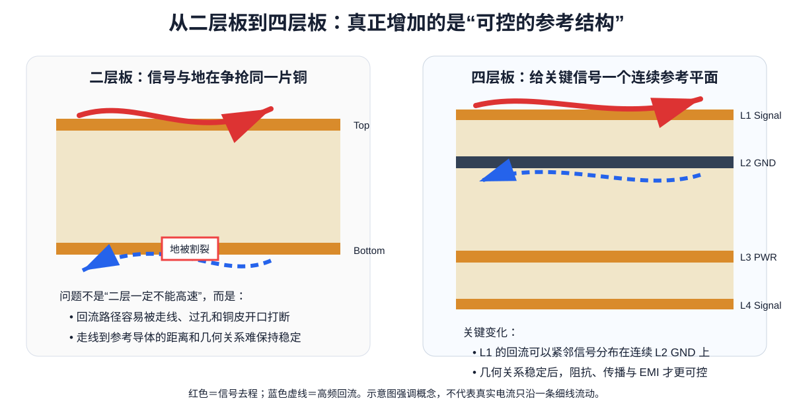

# Part 0：从二层板到多层板——先完成认知升级

> 🚀 整套课程的闯关入口见：[START_HERE](../START_HERE.md)。完成本 Part 的通过标准后，下一步是 STM32F407 V1，而不是继续随机阅读。

> 这一 Part 不重新教你“电阻是什么”。默认你已经会画二层板、会基本布局布线、会跑 ERC/DRC，也知道怎么导出 Gerber。我们的任务是把你从“能把线连起来”升级到“知道电流和电磁场为什么允许你这样连”。

---

## 为什么必须有这个 Part？

很多人第一次画四层板时，只做了一件事：

- 多了两个铜层；
- 把 GND 放到内层；
- 把 VCC 放到另一内层；
- 然后继续用画二层板时的思维布线。

这会得到一块“形式上是四层，思维上还是二层”的 PCB。

真正的多层板设计，核心变化不是“线更多了”，而是你第一次可以稳定地控制：

1. **信号的参考平面（Reference Plane）**；
2. **高频回流路径（Return Path）**；
3. **走线与参考平面的几何关系**；
4. **阻抗与传播延迟**；
5. **电源分配网络（PDN）**；
6. **EMI 回路面积**。

这些概念也是后面 SI、PI、EMC 的共同地基。

---

## 本 Part 的 6 个任务

### 任务 1：停止把 PCB 走线想成“理想导线”

低频电路分析里，我们经常把一根线当成“两个点直接相连”。在 PCB 上，当边沿足够快、线路足够长时，这种模型会失效。

你要开始接受：

> 一根 PCB 走线同时具有电阻、电感、对参考平面的电容，并且电磁能量沿结构传播。

### 任务 2：建立“每个信号都有回路”的习惯

以后看到任何信号线，都要自动问第二句话：

> **它的回流从哪里回？**

不是只有 GND 网络才叫“回流”；任何电流都必须形成闭合路径。

### 任务 3：用边沿速度判断问题，而不是只看时钟频率

一个 1 MHz 方波也可能有很快的边沿。如果驱动器上升时间只有几百皮秒，它包含的高频成分远高于 1 MHz。

所以后面判断是否需要传输线思维时，我们会优先看：

- rise time / fall time；
- 传播延迟；
- 走线长度；
- 驱动强度；
- 接收阈值与噪声裕量。

### 任务 4：学会把 Datasheet 变成 PCB 规则

真正的工程规则往往不是来自“网上口诀”，而是来自：

- 芯片 Datasheet；
- Hardware Design Guide；
- Application Note；
- 接口标准；
- 板厂工艺能力；
- 实际叠层。

本课程主线 MCU 使用 **STM32F407VGT6（LQFP100）**。它既足够复杂，可以学习 USB、CAN、SDIO、Ethernet 等接口，又没有 BGA 扇出带来的额外学习负担。

### 任务 5：把 KiCad 从“画图工具”升级成“工程约束工具”

后面你会逐步使用：

- Board Setup / Physical Stackup；
- Net Classes；
- Custom Rules；
- Differential Pairs；
- Length Tuning；
- DRC Severity；
- 3D Viewer；
- Gerber Viewer。

但顺序永远是：**先知道为什么要这个规则，再去软件里配置它。**

### 任务 6：用“同原理图、不同布局”的实测把规则钉牢

最后不再只靠示意图。我们用一组真实测试板观察：

- 细长共享地线为什么会让多个支路互相耦合；
- 连续 GND plane 为什么比“板上有地铜”更重要；
- GND via 的有效长度为什么受 stackup 直接影响；
- 相邻电感器和电流回路为什么可能像变压器一样耦合；
- 为什么同样的顶层布局，邻近 L2 GND 的四层板能明显改善高频表现；
- 为什么布局优化后，真实器件 Q 又会成为仿真/实测差异的一部分。

这一关的目标是把“规则”升级成**可测量、可解释的因果链**。

---

## 本 Part 学完，你应该能回答

拿到一张陌生的四层板截图，你至少应该能：

- 指出每个信号层的参考平面；
- 画出一条高速信号的大致回流路径；
- 判断某条线换层后参考关系是否发生变化；
- 解释为什么“完整 GND 平面”比“到处铺一点 GND 铜”更重要；
- 解释为什么高速不能只看 MHz；
- 从芯片手册中找出电源、去耦、时钟、复位和调试相关的硬件要求；
- 看到关键 GND pad 时，能继续解释 pad → via → reference plane 的高频路径，并识别共享回流与磁耦合风险。

如果这些还做不到，不进入 Part 1。

---

## 学习顺序

1. [为什么二层板经验到了多层板会失效](01_为什么二层经验会失效.md)
2. [电流回路、参考平面与回流路径](02_电流回路与参考平面.md)
3. [边沿速度、传播延迟与“高速”的定义](03_边沿速度与传播延迟.md)
4. [如何读 Datasheet / Hardware Design Guide](04_从手册提取PCB规则.md)
5. [KiCad 10 多层板必备复习](05_KiCad10多层必备复习.md)
6. [实测案例：接地、过孔寄生与耦合](06_实测案例_接地过孔与耦合.md)
7. [PCB 走线工程基础：几何、电流、阻抗与时延](07_PCB走线工程基础_几何电流阻抗与时延.md)

---

## 参考资料

- KiCad 10.0 PCB Editor 官方文档：https://docs.kicad.org/10.0/zh/pcbnew/pcbnew.html
- ST AN4488, *Getting started with STM32F4xxxx MCU hardware development*：https://www.st.com/resource/en/application_note/an4488-getting-started-with-stm32f4xxxx-mcu-hardware-development-stmicroelectronics.pdf
- STM32F407VG 产品页：https://www.st.com/en/microcontrollers-microprocessors/stm32f407vg.html

> **本课程约定**：任何精确数值如果来自器件、接口或板厂要求，都尽量就近注明来源；工程经验会明确写出适用条件，不再把经验值包装成“宇宙铁律”。

## 新增统一走线实验

- [Trace Engineering Lab](../interactive/trace-engineering-lab.html)：同一根 trace 同时从 DC drop、thermal、loop inductance 与 td/tr 四个视角观察，避免把“线宽规则”误学成单一数字。
