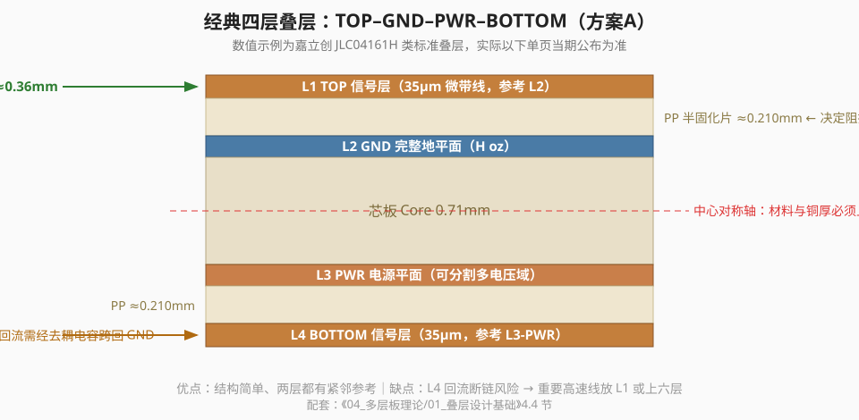

# 01｜为什么二层板经验到了多层板会失效？

> 🎯 **本章目标**：把“PCB 是很多理想导线”这个模型升级成“PCB 是由导体、介质和参考结构组成的电磁互连系统”。

---

## 1. 先看一个很常见的错误升级

你已经会画二层板了，于是第一次画四层板时这样做：

- Top：器件 + 大多数信号；
- Inner 1：GND；
- Inner 2：3V3；
- Bottom：剩余信号；
- 线宽继续按以前经验；
- 哪里过不去就打过孔；
- DRC 没报错就准备下单。

从 CAD 角度看，这可能是一块完全合法的 PCB。

但是工程问题不只问“有没有连通”，还会问：

- 这个信号变化时，电流的闭合路径在哪里？
- 走线换层以后，它的参考导体是否也改变了？
- 这个过孔给信号引入了怎样的电感和几何突变？
- 这根线和参考平面的距离是否稳定？
- 相邻两根线之间会不会耦合？
- 这个电源引脚在几百皮秒到几纳秒的时间尺度上从哪里获得电流？

这些问题，DRC 大多数不会替你回答。

---

## 2. 二层板时代，你可能在“无意中”做对了很多事

举个例子：一块低速 MCU 二层板，Bottom 大面积铺 GND。

即使你没有学过 Return Path，只要：

- 信号不长；
- 边沿不特别快；
- 地铜没有被大量切碎；
- 接口速率不高；
- EMC 要求不严；

板子往往也能工作。

这会产生一个危险错觉：

> “我以前一直这样画都能用，所以这就是正确规则。”

实际上，你只是处在一个**容错率很高**的区域。

当 MCU I/O 边沿更快、接口更多、板子更密、连接器更多时，原来被忽略的寄生参数会逐渐变成设计的一部分。

---

## 3. 第一处模型升级：走线不是零阻抗连接

一段真实走线具有分布参数：

- 单位长度电阻 `R'`；
- 单位长度电感 `L'`；
- 对周围导体的单位长度电容 `C'`；
- 介质损耗对应的 `G'`。

当互连足够短、信号变化足够慢时，可以把这些效应合并成一个简单的 lumped（集中参数）模型。

当传播时间相对边沿时间不可忽略时，就必须用 transmission line（传输线）模型思考。

注意这里没有出现“超过 50 MHz 就是高速”之类的定义。

**高速不是元件标签，而是信号与互连尺寸之间的关系。**

---

## 4. 第二处模型升级：信号不是“只有一根线”

当你画出：

```text
MCU GPIO ─────────────> 外设输入
```

电路还没有完整。

电流必须形成闭合回路：

```text
       去程电流
MCU ───────────────> Load
 ↑                    │
 └────────────────────┘
        回流路径
```

低频时我们经常把整个 GND 网络抽象成同一个节点，于是看不见“回来的路”。

PCB 设计中，这条路的几何形状非常重要，因为回路面积会影响：

- 回路电感；
- 磁场耦合；
- EMI；
- 串扰；
- 换层后的连续性。

下一章专门把这件事拆开。

---

## 5. 第三处模型升级：能量主要存在于场中

初学时我们很容易产生这种画面：

> “电子沿着铜线跑，铜线把信号送到终点。”

对 PCB 高速互连，更有用的工程图景是：

- 导体决定边界条件；
- 信号导体和参考导体共同建立电场与磁场；
- 能量沿两者形成的结构传播；
- 线宽、介质厚度、介电常数、铜厚等几何/材料参数共同决定传播与阻抗。

这就是为什么 **50 Ω 不是某根铜线自己的属性**。

同样宽的一根铜线：

- 离 GND 平面 0.1 mm；
- 离 GND 平面 0.3 mm；

其特性阻抗会不同。

所以以后看到“USB 线宽 0.2 mm”这种孤立规则，第一反应应该是：

> **在什么叠层、什么铜厚、什么介质、什么间距条件下？**

---

## 6. 四层板真正给了你什么？

四层板最宝贵的资源通常不是“多两层用来塞线”，而是：

### 6.1 连续参考平面

例如：

```text
L1  Signal / Components
L2  Solid GND
L3  Power / low-priority plane
L4  Signal / Components
```

L1 走线可以稳定地参考 L2。

### 6.2 更稳定的几何结构

走线与参考平面的距离由 stackup 决定，而不是由你画地铜时留下多少空隙决定。

### 6.3 更小、更可控的回路

当信号靠近连续参考平面时，高频回流更容易在信号投影附近闭合，环路电感和辐射更容易控制。

### 6.4 更清晰的功能分工

布局时可以明确：

- 哪层主要走高速；
- 哪层必须保持完整；
- 哪层可以承担电源分配；
- 哪些信号不允许跨越参考平面开口。

---

## 6.5 实测证据：四层板的价值不是“多两层铜”，而是把回路压小

EEVblog #1176 做过一个很适合入门者看的对比：同一类电路在 2-layer 与 4-layer 结构上做 EMC 测试，四层版本明显更安静。

这里不要把结论学成：

> “四层天然比二层好。”

真正应该学的是：

~~~text
2L：signal 与 return 往往隔得很远
→ loop area 大
→ 场更容易扩散
→ cable / board edge 更容易被激励

4L：signal 紧邻 solid plane
→ return 紧贴 signal
→ loop area 变小
→ 辐射和串扰更容易控制
~~~

也就是说，**层数只是手段，reference geometry 才是原因。**



### 课堂反问

如果你做了一块四层板，但：

- L1 高速线下面的 L2 被切碎；
- Bottom 高速线参考一个被多电源岛切开的 L3；
- 换层没有 return via；

那么它在电磁意义上完全可能比一块认真设计的二层板更糟。

### 视频来源

- EEVblog #1176 — *2 Layer vs 4 Layer PCB EMC TESTED!*  
  https://www.youtube.com/watch?v=crs_QLuUTyQ

> 本课程吸收的是实测支持的趋势：**近参考面 + 小回路**。视频里的具体测试结果只属于其样板和测试环境。


## 7. ❌ 故障板：形式上四层，实际上更糟

假设：

```text
L1: USB D+/D-
L2: GND，但中间为了“分模拟地”挖了一条长缝
L3: 3V3 / 5V 分割
L4: 普通信号
```

USB 差分对正好从 L2 的开槽上方经过。

KiCad 可能不会报任何连接错误。

但从电磁结构看：

- 走线下方参考导体突然消失；
- 回流/场分布必须重新寻找路径；
- 局部阻抗不连续；
- 环路和共模转换风险增加。

所以我们建立第一条课程级原则：

> **先保证参考结构，再谈走线是否“好看”。**

这不是一句 DRC 规则，而是一种设计顺序。

---

## 8. 🛠️ 现在打开 KiCad：做一次“投影检查”

拿你以前画过的一块二层板：

1. 打开 PCB Editor；
2. 只显示 Top Copper 上的一条时钟/SPI/USB 等较快信号；
3. 再看 Bottom 的 GND 铜；
4. 想象把信号垂直投影到底层；
5. 沿着整条线检查：下方是否一直有连续的参考铜？
6. 遇到过孔、焊盘、地铜缺口时，标出来。

不要急着改。

本练习只训练一个能力：

> **看到 signal path 的同时，开始主动寻找 return structure。**

---

## 9. 本章 Design Review

看到一块 PCB 时，先问：

- [ ] 关键信号的参考导体是谁？
- [ ] 参考结构是否连续？
- [ ] 有无为了“分地”而让高速信号跨槽？
- [ ] 信号换层后参考关系是否变化？
- [ ] 设计规则来自哪里：手册、接口标准、板厂，还是不明来源的经验？

---

## 10. 自检

1. 为什么“DRC 通过”不能证明高速互连健康？
2. 为什么 50 Ω 不能只用线宽定义？
3. 四层板最关键的新增资源为什么通常是参考平面，而不是布线层数量？
4. 什么条件变化会让一块以前“随便画也能工作”的板突然开始出现 EMI 或波形问题？

能用自己的话解释，再进入下一章。