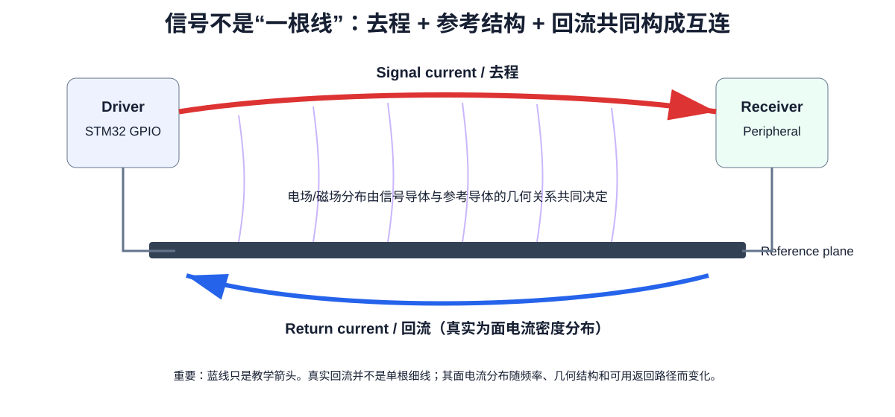

# 06｜实测案例：接地、过孔寄生与耦合——为什么“都叫 GND”却不是同一回事

> 🎯 **本章目标**：用一块可测量的射频滤波器测试板，把前面“完整参考平面、回流路径、过孔电感、回路耦合”的抽象概念变成看得见的性能差异。
>
> 本章不是要求你照抄一个 RF 滤波器布局，而是训练一种能力：**看到 GND 符号时，继续追问高频电流究竟经过哪段铜、哪个过孔、哪个平面，以及它和旁边回路怎样耦合。**

---

## 1. 为什么选一个滤波器做“接地实验”？

视频使用的是一只 **9 阶椭圆滤波器（elliptic filter）**：

- 系统阻抗：50 Ω；
- 带宽量级：约 30 MHz；
- 两端使用 SMA；
- 信号链中有 4 个并联谐振器；
- 另有 5 个对地电容参与整体低通/陷波响应。

并联谐振器在各自谐振点附近会呈现很高阻抗，因此理想响应中会出现 4 个很深的衰减凹口（notch）。

这类电路很适合作为 PCB 布局教学工具，因为：

> 原理图完全相同，只改变接地方式、过孔、器件朝向和层叠，测得的频响就会明显改变。

也就是说，它把“PCB 寄生参数”从背景误差变成了实验主角。

~~~mermaid
flowchart LR
    A[SMA IN / 50 Ω] --> R1[并联谐振器 #1]
    R1 --> R2[并联谐振器 #2]
    R2 --> R3[并联谐振器 #3]
    R3 --> R4[并联谐振器 #4]
    R4 --> B[SMA OUT / 50 Ω]

    C1[对地电容] --- R1
    C2[对地电容] --- R2
    C3[对地电容] --- R3
    C4[对地电容] --- R4
    C5[对地电容] --- B
~~~

> 上图只表达“实验关注点”，不是原视频电路的逐节点复刻。

---

## 2. 第一块故障板：逻辑上接地，电磁上却很差

最差版本同时犯了几个典型错误。

### 2.1 用细长走线把多个 GND 串起来

从原理图看，它们都连接到同一个 GND net。

但高频下每一段铜都有阻抗。多个支路共用一段细长地线时：

~~~text
C1 GND ─┐
C2 GND ─┼─── thin shared GND trace ─── GND
C3 GND ─┤
C4 GND ─┘
~~~

前级地电流会流过后级也在使用的铜段，于是产生：

- shared impedance；
- ground voltage modulation；
- 各支路之间的耦合；
- 额外回路电感。

所以问题并不是“线太细所以直流电阻太大”这么简单，而是：

> **多个本应局部闭合的高频回路，被迫共享了一段有寄生电感的回流路径。**

### 2.2 底层明明有铜，却没有真正利用成参考平面

一块板上“存在大面积 GND 铜”不等于信号和支路已经拥有低电感回流。

如果器件 GND pad 仍然通过长线才到达平面，那么这块平面离关键电流回路仍然很远。

这再次说明：

> **参考平面只有被低电感地接入当前回路，才真的参与工作。**

### 2.3 相邻电感器发生磁耦合

视频中的相邻电感朝向让磁通互相穿过，相当于无意中构造了两个耦合电感。

因此，即使原理图里两只电感没有连在一起，它们也可能通过磁场“说话”。

这是一个很重要的认知升级：

> 串扰不只发生在两根并行走线之间，也会发生在器件本体和完整电流回路之间。

---

## 3. 第一轮改进：完整地平面 + 每个接地点自己的过孔

第二版仍然是二层板，但做了两件关键修改：

1. 底层真正作为连续 GND plane；
2. 每个重要对地连接使用自己的 GND via。

~~~mermaid
flowchart LR
    P1[器件 GND pad #1] --> V1[local via]
    P2[器件 GND pad #2] --> V2[local via]
    P3[器件 GND pad #3] --> V3[local via]
    V1 --> G[连续 GND plane]
    V2 --> G
    V3 --> G
~~~

这比“多个器件先在顶层汇总，再打一颗公共地孔”好得多，因为每个支路的高频电流更早进入低阻抗参考结构。

这里应把规则理解成：

> **对于承担高频/瞬态电流的关键接地支路，优先让它在 pad 附近独立、低电感地进入参考平面。**

而不是把“每个 GND pad 都必须机械地一孔一个”当成不分场景的制造铁律。

---

## 4. 为什么过孔长度会直接改变“接地质量”？

过孔不是理想 0 Ω。

最基本的工程模型至少要记住：

- via barrel 有寄生电感；
- pad / anti-pad 有寄生电容；
- 过孔越长，通常串联电感越大；
- 返回平面离表层越近，pad 到参考平面的有效电流路径越短。

视频用二层和四层板做了直观比较。

### 二层板

典型 1.6 mm 厚二层板：

~~~text
L1  signal/components
│
│ 约 1.6 mm
│
L2  GND
~~~

器件从顶层进入底层 GND，需要穿过接近整板厚度的 via 路径。

### 四层板

若 L2 就是 GND，而且 L1-L2 介质很薄：

~~~text
L1  signal/components
│
│ 约 0.1~0.2 mm（取决于真实 stackup）
│
L2  solid GND
│
...
~~~

器件从顶层进入参考平面的有效路径会短很多。

---

## 5. 视频中的 via 实测：同一颗“地孔”，高频效果可以差很多

视频另做了一块专门的 via impedance 测试板：

~~~text
SMA IN ─────────●───────── SMA OUT
                │
              GND via
                │
             GND plane
~~~

理想情况下，中点若被理想短路到 GND，传输应被极强抑制。

但真实 via 有电感，所以频率越高，它越不像“理想短路”。

按视频测试板与读数：

| 项目 | 二层测试板 | 四层测试板 |
|---|---:|---:|
| 顶层到主要 GND 的路径 | 接近整板厚度 | 只到邻近 L2 |
| 作者模型中的 via 电感量级 | 约 500 pH | 约 12 pH |
| 800 MHz 附近的抑制度 | 约 22 dB | 约 58 dB |

两者在 800 MHz 附近相差约 **34 dB**。视频进一步指出，这个差异与其 via 电感模型给出的数量级变化相当接近。

> **重要**：这些是该视频特定板厚、孔径、stackup 和测试结构下的实验读数，不是“所有二层/四层 PCB 都必须得到同样数字”的通用规格。

你真正应该带走的是：

> **via 的高频性能属于 stackup 问题，而不是“这个孔在网表里叫 GND”就自动解决的问题。**

---

## 6. 第二轮改进：解决电感器与回路之间的磁耦合

在“连续地平面 + 独立地孔”之后，测量已经明显改善，但仍没有贴合理想仿真。

视频继续处理两类耦合。

### 6.1 电感器互相耦合

改进方法：

- 相邻电感尽量拉开；
- 或把它们旋转约 90°，降低互感。

这不是“所有电感必须交错 90°”的固定排版规则。

真正目标是：

> **让一个器件的主要磁通尽量少穿过另一个器件的有效回路面积。**

### 6.2 两个电流环路也可能像变压器一样耦合

视频还观察到另一种现象：两个对地支路形成的电流环路可能互相感应。

作者通过移动其中一个电容并增加局部过孔后，实测更接近理想响应，因此推测这里存在明显的 inductive loop coupling。

这一点在该视频中属于**基于实验修改得到的工程判断**，作者也明确表示会在后续视频继续用测量验证。

这正好给我们一个很好的工程习惯：

> **区分“已测得的结果”和“对机理的推断”。不要把合理解释自动写成已经证明的事实。**

---

## 7. 为什么把回路转 90° / 拉开距离会有效？

两个小回路可以粗略理解为两只互感线圈。

耦合强弱与：

- 回路面积；
- 两回路距离；
- 相对方向；
- 电流变化速度；
- 周围参考结构

都有关系。

因此视频把相邻回路改成更接近正交并增加间距后，频响继续改善，尤其在 **400 MHz 以上**的高频区域更明显。

这也是为什么以后做布局时，不能只看：

> “两根 net 有没有连错？”

还要看：

> “两个电流回路的场是不是正在互相穿透？”

---

## 8. 最终版本：顶层布局几乎不变，只把 GND 拉近

最终版本的顶层器件布局与上一版很接近，真正改变的是 **stackup**：

- 从二层变为四层；
- L2 是连续 GND；
- 顶层到 GND 的距离从接近 1.6 mm 缩短到约 0.19 mm（视频测试板）。

于是：

- GND via 的有效串联电感大幅下降；
- 局部回路面积进一步缩小；
- 信号/回流的场更受约束；
- 测得频响在很宽频段内更接近理想仿真。

~~~mermaid
flowchart LR
    A[细地线 / 共用回流] --> B[连续 GND plane]
    B --> C[每个关键 GND 局部 via]
    C --> D[降低电感/回路互耦]
    D --> E[四层：L2 GND 靠近表层]
    E --> F[实测更接近理想响应]
~~~

---

## 9. 为什么最后仍然不能与理想仿真完全重合？

即使 PCB 布局已经很好，真实元件仍然不是 ideal component。

视频指出最终曲线与理想模型的剩余差异，主要来自：

- 真实电感/电容有限 Q；
- 高频寄生；
- 元件损耗。

因此一个很重要的仿真纪律是：

> **当布局问题已经被压低以后，模型精度和器件 Q 会开始成为新的误差来源。**

不能看到“仿真和实测不同”就自动归罪 PCB；也不能因为 PCB 连接正确就自动假设元件理想。

---

## 10. 把视频的“三条规则”改写成课程可迁移版本

视频最后总结了三条非常强的规则。放进本课程后，我们增加适用条件，避免把经验口诀绝对化。

### 规则 1：优先使用连续、无不必要开槽的参考平面

不是“铺了 GND 铜就算完成”，而是：

- 关键回流路径下方连续；
- 不被 split / slot / antipad chain 随意切断；
- 参考结构能实际参与当前高频回路。

### 规则 2：关键高频接地点就近、低电感进入参考平面

典型对象：

- 去耦电容 GND；
- RF / filter shunt component；
- 高频旁路；
- 接口保护器件的回流；
- 需要承担快速瞬态电流的局部 GND。

优先：

- via 靠近 pad；
- 避免多支路共用长而细的地颈；
- 让各自回路尽可能局部闭合。

### 规则 3：当性能、EMI 和可预测性重要时，四层板常常是很高性价比的结构升级

四层真正买到的不是“两层额外布线空间”，而是：

- 邻近参考平面；
- 更短的表层→GND 路径；
- 更小的回路；
- 更稳定的几何；
- 更容易控制的串扰/EMI。

但这不等于：

> “所有二层板都是错误设计。”

成本极敏感、速度低、尺寸小的设计仍然可以做二层。只是你必须更主动地管理回流、地铜连续性和器件布局。

---

## 11. 🛠️ KiCad 实操：把这条视频变成一次自己的 Design Review

找一块你以前的二层板，完成下面的检查。

### Step 1：找 5 个关键 GND 支路

优先看：

- decoupling；
- oscillator load capacitor；
- switching regulator；
- USB/CAN protection；
- 高速接口旁路。

### Step 2：检查 pad 到 plane 的真实路径

对每个支路问：

~~~text
GND pad
→ 顶层走多远？
→ 经过几个 neck？
→ 过孔在哪里？
→ 到哪一层 GND？
~~~

### Step 3：找“共享地线”

如果两个高频支路先共用一段细长铜再进入 plane，标记为 shared-impedance candidate。

### Step 4：找磁耦合对象

检查：

- 相邻电感；
- 变压器/共模电感；
- 大电流 hot loop；
- 晶体环路；
- 两个并排的高速回路。

### Step 5：做一次二层→四层思想实验

假设增加 L2 solid GND，并让 L1-L2 介质变薄：

- 哪些 GND via 立刻受益？
- 哪些 return loop 会缩小？
- 哪些问题仍然不会自动解决？

最后一个问题很重要：**四层板不会自动修复糟糕的器件布局和互感耦合。**

---

## 12. 本章 Design Review

- [ ] 重要 GND connection 不是通过长细线“最后才接地”
- [ ] 关键支路没有不必要地共享长回流 neck
- [ ] 参考平面连续，没有被随意开槽
- [ ] 能解释每颗关键 GND via 服务哪股高频电流
- [ ] 知道 via inductance 与有效长度/stackup 有关
- [ ] 相邻电感器的朝向与距离被检查
- [ ] 相邻大电流/高频回路的互感被检查
- [ ] 不把“旋转 90°”当无条件铁律，而是看磁通与回路
- [ ] 仿真与实测不一致时，同时考虑 PCB 寄生和真实器件 Q
- [ ] 设计结束后使用 checklist 再走一遍，而不是只依赖记忆和 DRC

---

## 13. 来源与延伸

本章基于 Hans Rosenberg 的实测演示重新组织，并结合本课程前后章节改写，没有按视频顺序逐句翻译，也没有复制视频截图。

- 原视频：Hans Rosenberg, [Flawless PCB design: 3 simple rules - Part 2](https://www.youtube.com/watch?v=xhuHAhIKWoM)
- 下一步：回到 [02｜电流回路与参考平面](02_电流回路与参考平面.md)
- 后续深入：[Part 2｜回流路径与换层](../12_Part2_信号完整性/04_回流路径与换层.md)
- 后续深入：[Part 2｜串扰与几何隔离](../12_Part2_信号完整性/05_串扰与几何隔离.md)
- 项目落地：[Part 1｜四层 Stackup](../11_Part1_STM32F407四层板/03_四层Stackup与KiCad设置.md)

> **学习标准**：学完这章，不是背下“3 条规则”，而是拿到一个 GND pad 时，能画出它的高频闭合回路，并解释为什么这个过孔、平面和周围器件的位置是合理的。
