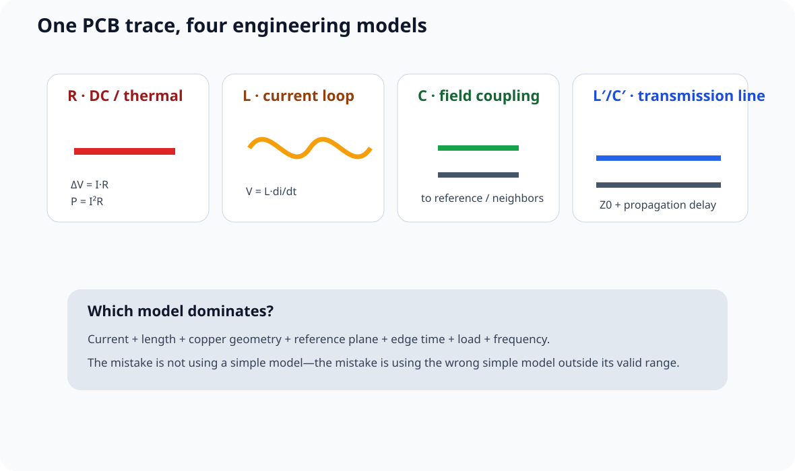
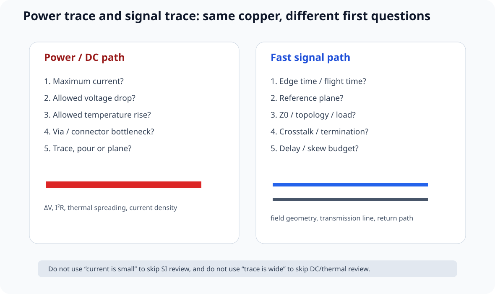

# 07｜PCB 走线工程基础：几何、电流、阻抗与时延

> 本章吸收 Phil's Lab #112 *PCB Traces 101*。
>
> 公开视频明确覆盖：trace basics、geometry/material、R/L/C、power delivery、IPC calculator、PDN inductance、power planes、differential pairs、controlled impedance、critical length、propagation delay / delay matching 与 practical guidelines。
>
> 课程把这些内容组织成一个统一问题：
>
> **一根 PCB trace 到底同时扮演哪些电气角色？**

---

## 7.1 一根 Trace 不是“铜线而已”

低频时你可能只关心：

\[
R=\rho\frac{\ell}{A}
\]

但 PCB trace 同时包含：

- **R**：DC drop / I²R heating；
- **L**：current change 时的 L·di/dt；
- **C**：对 reference / nearby copper 的电场耦合；
- **distributed L' / C'**：边沿足够快时形成 transmission line；
- **thermal path**：铜、介质、邻近 plane 与空气共同散热；
- **manufacturing geometry**：width、copper thickness、clearance、etch tolerance。

所以“线宽多少”没有一个脱离上下文的答案。

---

## 7.2 Geometry：W、T、H、S 分别控制什么

定义：

- W：trace width；
- T：copper thickness；
- H：signal 到 reference plane 的距离；
- S：到相邻 trace / copper 的距离；
- L：总长度。

### W / T 增大

通常：

- DC resistance 降低；
- current density 降低；
- thermal margin 改善；
- 在给定 H 下 characteristic impedance 往往降低。

### H 增大

通常：

- signal-reference coupling 变弱；
- field spread 变宽；
- return current 分布更宽；
- 同一 W 下 Z0 往往升高；
- crosstalk risk 可能增加。

### S 减小

通常：

- coupling 增强；
- differential pair odd-mode impedance 改变；
- unrelated signals 的 crosstalk risk 增大。

因此：

> **几何变量不是独立旋钮。**

---

## 7.3 Copper Weight 与 Cost：厚铜也不是免费升级

常见 copper thickness 会用 oz/ft² 表达。

课程不把“1 oz = 某个绝对 µm 数字”作为所有板厂的制造承诺，因为：

- base copper；
- plating；
- finished copper；
- etch tolerance；

会让最终结果不同。

设计时应记录：

~~~text
Base copper:
Finished copper:
Layer:
Fab stackup:
Tolerance:
~~~

更厚铜可能带来：

- 更高 current capability；
- 更低 DC drop；
- 但更难做细线/细间距；
- etch compensation 增大；
- 成本提高。

---

## 7.4 Power Trace：先做 ΔV 与 Temperature Budget

电源走线最基础的两个问题：

\[
\Delta V = I R
\]

\[
P = I^2R
\]

但这还不够。

真正 sizing 还要绑定：

- copper thickness；
- external / internal layer；
- trace length；
- allowed temperature rise；
- adjacent copper / planes；
- ambient / airflow；
- via / connector bottleneck。

视频链接了 IPC-2221 calculator 作为入门工具，但课程这里做一个来源升级：

> **IPC-2221 的老经验公式适合做粗筛，不应成为现代 conductor thermal sizing 的唯一依据。**

本课程正式项目优先使用：

- IPC-2152 思路；
- 板厂/EDA thermal calculator；
- 实际 prototype measurement。

---

## 7.5 Trace Inductance：最危险的误解是“只看这一根线”

很多 online calculator 会输入 length、width、thickness，然后输出 self-inductance。

这个数字可以用于建立量级直觉，但 high-speed / PDN 里真正有意义的是：

> **完整 current loop 的 partial / loop inductance。**

因为 current 不会只从 source 出去不回来。

例如：

~~~text
Signal trace
──────────────
      H
===============
Reference plane
~~~

当 H 很小，outgoing/return current 靠得更近，magnetic field 更集中，loop inductance 通常更低。

所以：

> “把 trace 加宽”未必比“把 reference plane 拉近”更有效。

---

## 7.6 Power Plane 什么时候有意义

视频把 power planes 放进 trace discussion，这是很合理的，因为 rail distribution 不只有“细线 vs 粗线”两个选项。

可选结构包括：

- trace；
- local pour；
- wide trunk；
- full plane；
- stitched multi-layer copper。

决策因素：

- total current；
- DC drop；
- spreading resistance；
- thermal；
- routing density；
- reference-plane role；
- PDN / plane-pair behavior；
- manufacturing cost。

课程不写：

> “超过 X A 必须整层 power plane。”

而是：

> **先算 DC/thermal，再审 reference / PI / routing trade-off。**

---

## 7.7 Signal Trace：关键不是“电流小”，而是边沿快不快

数字输入本身可能只吸收极小 DC current，但 driver 在 edge 上仍会向 interconnect capacitance 充放电。

所以信号线设计要问：

- edge time；
- length / flight time；
- reference plane；
- Z0；
- load / topology；
- crosstalk；
- termination。

这就是为什么“GPIO 只有几 mA”不能用来证明：

> trace 不需要 SI review。

---

## 7.8 Controlled Impedance：不是“把线画成 0.2 mm”

Characteristic impedance 来自 per-unit-length：

\[
Z_0\approx\sqrt{\frac{L'}{C'}}
\]

实际由：

- W；
- T；
- H；
- dielectric Dk；
- solder mask；
- nearby copper；
- differential coupling；

共同决定。

因此 workflow 是：

~~~text
Interface target
→ actual fab stackup
→ field solver
→ W / gap
→ KiCad rule
→ fab impedance coupon / process
~~~

不是：

> “别人 0.18 mm 是 50 Ω，我也复制。”

---

## 7.9 Critical Length：不要把 calculator 变成自然定律

视频提供 critical-length calculator 作为判断 transmission-line relevance 的工具。

课程继续统一使用：

\[
\rho=\frac{t_d}{t_r}
\]

其中：

\[
t_d=\frac{\ell}{v_p}
\]

比“超过 50 mm 就高速”更可迁移。

calculator 给出的 tr/6、tr/10 等边界都只能视作 screening heuristic。

最终还取决于：

- discontinuity；
- source impedance；
- receiver threshold；
- topology；
- allowed ringing。

---

## 7.10 Propagation Delay：外层和内层不会天然一样

传播速度近似：

\[
v_p\approx\frac{c}{\sqrt{\epsilon_{eff}}}
\]

microstrip 的 field 一部分在 air、一部分在 dielectric；stripline 的场主要在 dielectric。

因此：

> **相同物理长度，outer-layer 与 inner-layer trace 的 delay 可能不同。**

这件事在下一条 EXT-015 的 delay-matching 视频里会进一步成为核心。

---

## 7.11 Differential Pair：两根线的几何必须整体设计

差分对不能拆成两根互不相关的 single-ended trace。

需要一起控制：

- W；
- pair gap；
- H；
- reference；
- intra-pair skew；
- common-mode discontinuity；
- breakout / via transition。

而且：

> 100 Ω differential 不等于“两个独立 50 Ω 自动相加”。

完整内容见 Part 2。

---

## 7.12 Practical Guidelines：哪些是“工程”，哪些只是“美学”

### 45° vs 90°

现代普通数字 PCB 上，一个正常尺度的 90° bend 通常不应被描述成“必然 EMI 灾难”。

更应该审：

- local impedance discontinuity；
- reference；
- edge rate；
- density；
- manufacturability。

### 尽量减少无意义换层

不是因为 via “一定很坏”，而是每次 transition 都会增加：

- delay；
- discontinuity；
- return-transition requirement；
- routing complexity。

### 不要盲目用最小线宽

板厂“能做”只是 manufacturing minimum。

engineering width 还要考虑：

- yield；
- DC drop；
- impedance；
- rework；
- cost；
- current；
- routing density。

---

## 7.13 Trace Engineering Lab

打开：

**interactive/trace-engineering-lab.html**

调整：

- W；
- copper thickness；
- length；
- H；
- current；
- edge time；
- layer type；
- target frequency。

页面同时给出教学趋势：

- DC resistance / drop；
- thermal pressure；
- inductive-loop pressure；
- transmission-line relevance；
- impedance direction。

它不会输出“允许过几安培”的认证数字。

---

## 7.14 一张设计决策表

| Trace type | 第一问题 | 第二问题 | 第三问题 |
|---|---|---|---|
| low-current slow control | manufacturability | routing density | noise / ESD |
| high-current rail | DC drop | thermal | bottleneck / vias |
| fast single-ended | reference | Z0 / topology | termination / crosstalk |
| differential | Zdiff + pair symmetry | reference | skew / common mode |
| clock | edge + flight time | return continuity | jitter / termination |
| sense / analog | shared impedance | noise coupling | leakage / guarding |

---

## 7.15 Design Review

- [ ] 这根线的角色是 power、slow control、fast signal 还是 sense？
- [ ] W/T/H/S 不是从别人的板子复制
- [ ] power trace 有 DC drop + thermal evidence
- [ ] 没把 IPC-2221 calculator 当最终 thermal sign-off
- [ ] inductance 分析包含 return path
- [ ] controlled impedance 绑定实际 stackup
- [ ] critical length 用 edge time / flight time，而非 MHz
- [ ] layer transition 有 reference-transition review
- [ ] delay matching 前先确认不同 layer 的 ps/mm
- [ ] manufacturing minimum 与 engineering rule 分开

---

## 7.16 本章任务

从 V1/V2 任选 6 根 trace：

1. MCU 3V3 branch；
2. VCAP；
3. SWCLK；
4. UART；
5. USB pair；
6. 一个普通 GPIO。

为每根填写：

~~~text
Role:
W / T / H:
Length:
Reference:
Current or edge source:
DC / PI / SI concern:
Why this geometry:
~~~

能解释完，才算真正从“routing”进入“interconnect engineering”。

---

## 参考资料

- Phil's Lab #112, *PCB Traces 101*: https://youtu.be/xEVntmYLARw?si=LeMbcrWbwdbYbn4K
- 本课程 Part 2：Transmission Lines / Controlled Impedance
- 本课程 Part 3：DC Power Integrity / PDN
- IPC conductor-sizing / board-fabrication资料以项目实际版本与板厂能力为准

> 来源纪律：本章的视频主题来自公开描述与章节索引。由于当前没有完整逐字稿，具体公式、现代 IPC-2152 分级与课程 Review 结构属于课程补强，不冒充视频逐字内容。
