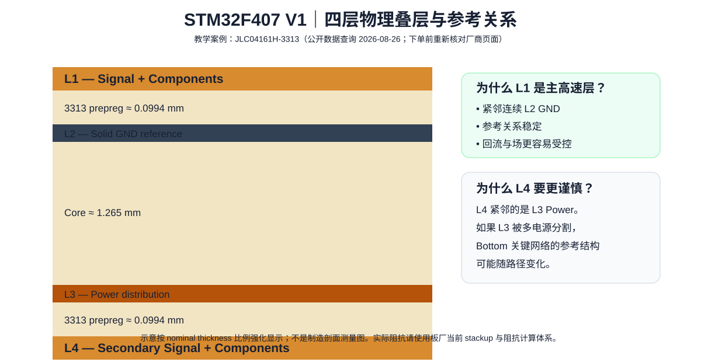
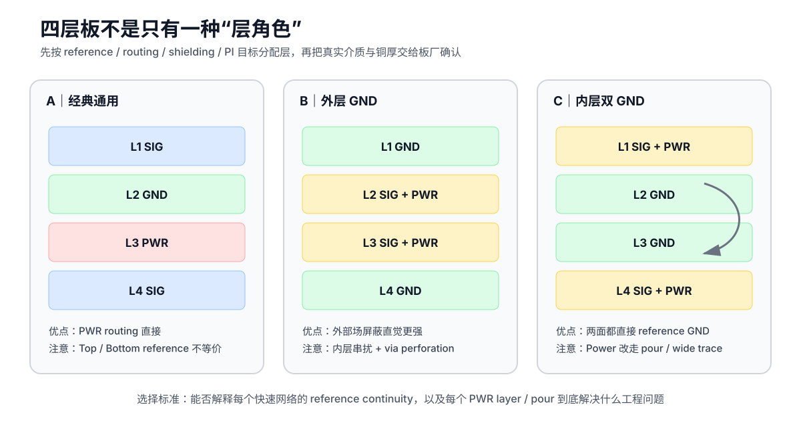
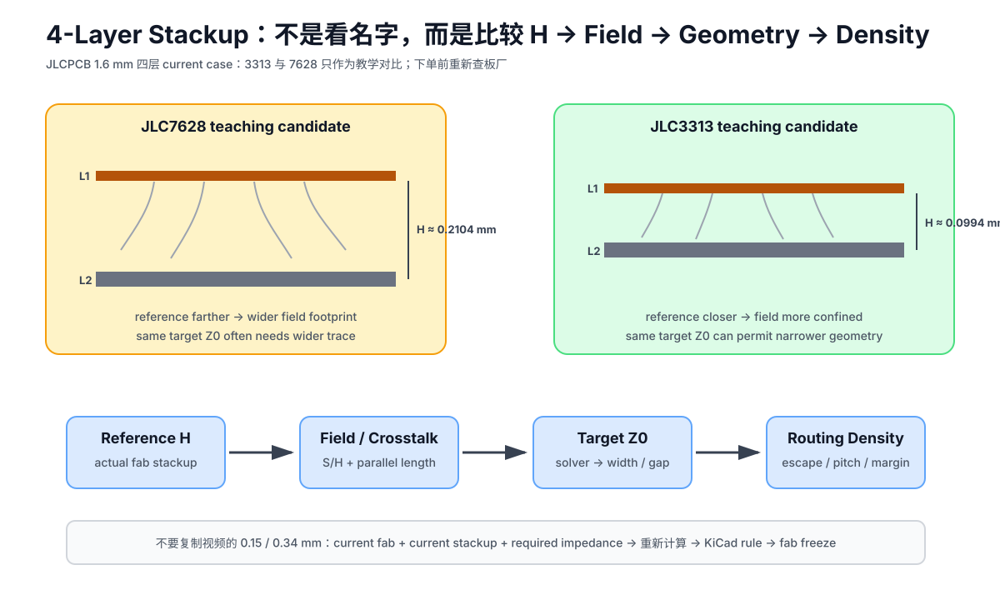

# 03｜四层 Stackup：从真实板厂数据开始，而不是从“经典层序”开始

> 🎯 **本章任务**：选定 V1 的四层物理结构，把真实铜厚/介质厚度录入 KiCad，并理解为什么同样是 `SIG-GND-PWR-SIG`，不同 stackup 的电磁表现也会不同。



---

## 1. 层序 ≠ Stackup

写：

```text
L1 Signal
L2 GND
L3 Power
L4 Signal
```

只说明了每层用途。

真正 Stackup 还包括：

- 外层铜厚；
- 内层铜厚；
- L1↔L2 介质厚度；
- L2↔L3 core 厚度；
- L3↔L4 介质厚度；
- dielectric material / Dk；
- solder mask；
- finished board thickness。

这些参数决定 impedance、propagation、field confinement、plane coupling 和 via vertical length。

---

## 2. V1 真实案例：JLCPCB 1.6 mm 四层受控阻抗叠层

查询日期：**2026-08-26**。

JLCPCB 当前 Controlled Impedance 页面公开多种四层叠层。本课程选 `JLC04161H-3313` 作为**教学案例**，不是对厂商的唯一推荐。

页面：https://jlcpcb.com/impedance

当前公开的主要几何数据包括：

| Structure | Material / Copper | Nominal thickness |
|---|---|---:|
| L1 | outer copper | 0.035 mm |
| L1→L2 | 3313 prepreg | 0.09940 mm |
| L2 | inner copper | 0.0152 mm |
| L2→L3 | core | 1.265 mm |
| L3 | inner copper | 0.0152 mm |
| L3→L4 | 3313 prepreg | 0.09940 mm |
| L4 | outer copper | 0.035 mm |

板厂页面同时给出介质参数用于其阻抗体系，并提供官方 impedance calculator。

> **重要**：下单前必须重新核对板厂页面和订单系统。厂商可能调整材料、叠层名称、工艺或计算模型。

---

## 3. 为什么这个案例适合教学？

### L1 离 L2 很近

约 0.1 mm 的 outer dielectric 让 L1 信号对 L2 GND 有较强几何耦合。

这意味着：

- L1 很适合作为主高速信号层；
- 回流更容易集中在相邻 GND 平面；
- 微带阻抗由清晰的走线—平面几何关系决定。

### 3.1 L1-L2 距离还会改变“表层器件接地过孔”的有效电感

这里常被忽略的一点是：L2 GND 靠近 L1，不只帮助 microstrip 的阻抗与回流。

对于顶层去耦电容、旁路器件、接口保护等元件，GND pad 通过 through via 接入 L2 时，真正串在“pad → GND plane”高频路径上的主要 barrel 长度，只需要到达 L2。

这与二层板上“顶层 → 底层 GND”接近整板厚度的情况完全不同。

Part 0 的 [实测接地案例](../10_Part0_从二层到多层/06_实测案例_接地过孔与耦合.md) 中，作者测试板把约 1.6 mm 的二层接地路径与邻近 L2 的四层接地路径做了对比，在 800 MHz 附近测得非常明显的抑制度差异。

不要照抄那个测试板的 pH/dB 数字做本项目规格；应该带走的是设计变量：

> **stackup 决定 signal-reference geometry，也决定很多局部 GND connection 的有效高频路径长度。**


### L2 与 L3 相距很远

中间 core 约 1.265 mm。

所以不能幻想 L2 GND 与 L3 Power 像“非常靠近的平板电容”一样提供很强的高频 interplane decoupling。

这反而能让 Part 3 的 PI 教学更清楚：离散去耦电容与安装电感仍然非常重要。

### L4 紧邻 L3，而 L3 是 Power

因此 V1 设定：

> **关键快速信号优先 L1 / reference L2 GND；L4 用作次要、低风险信号与必要 escape，不把 Top/Bottom 当完全对称的高速层。**

原因不是“Bottom 天生差”，而是本 stackup 的 reference relationship 不同。


### 3.2 四层板的“层角色”不是固定模板：三种工程拓扑

Zach Peterson 在 Altium Academy 的 *Alternative 4-layer Boards for High Speed PCBs* 里强调了一个很适合放进本课程的判断：

> **板厂给你的四层物理结构，不等于板厂替你决定了每层必须是 Signal / GND / Power。层角色仍然是设计变量。**

<p align="center"></p>

本课程把视频中的结构整理成下面这张工程对比表。它不是“谁绝对最好”，而是提醒你先写清楚目标。

| 拓扑 | 主要优点 | 主要风险 / 代价 | 更适合什么 |
|---|---|---|---|
| `SIG / GND / PWR / SIG` | 电源分配直接；常见板厂结构；顶层容易形成清晰的 SIG↔GND 几何 | Top/Bottom 的 reference 条件不同；若从 GND-reference 换到 PWR-reference，必须解释 return transition | 单面承载主要快速器件、rail 较多或确实需要专用 PWR layer 的通用 MCU 板 |
| `GND / SIG+PWR / SIG+PWR / GND` | 外层 GND 对外部场有更强屏蔽直觉；表面可形成直接 GND/ESD 回路 | 内层两层同时承载 signal/power，需防 broadside crosstalk；器件很多时，大量过孔/anti-pad 可能把外层 GND 打成“筛子” | 外部噪声隔离优先、器件密度中等、能认真规划内层 routing 的板 |
| `SIG+PWR / GND / GND / SIG+PWR` | 两个表面信号层都紧邻 GND；Top↔Bottom 换层时可用 nearby GND stitching via 做 same-net reference transition；表层直接进器件，不必为每个信号穿过外层 GND | 电源要用 surface pour / wide trace；对外部场的表面屏蔽不如外层 GND；没有大面积 PWR↔GND plane pair 时，不能指望很强的 plane capacitance | 两面都要放快速器件/走线、供电电流和 rail 数量仍可用 trace/pour 管理的 MCU / 中等 FPGA |

#### 拓扑 A：为什么“经典四层”不是错，而是要限制使用方式

对 V1 的 `SIG-GND-PWR-SIG`，本章前面已经采用了一个保守策略：

- 最敏感快速线优先 L1 / reference L2 GND；
- Bottom 不是禁区，但不能默认与 Top 等价；
- L1→L4 的 signal via 不能只画“去程”，还要画 reference transition；
- 若新 reference 是 PWR，需要 nearby GND↔PWR 高频 coupling / decoupling path。

所以视频中真正应该吸收的不是：

> “四层板永远不能有 Power Plane。”

而是：

> **Power Plane 的存在本身不是错误；错误是把不同 reference 条件当成完全等价，然后随意换层。**

#### 拓扑 B：外层 GND 的隐藏代价——via perforation

外层整面 GND 看起来很“干净”，但如果器件密度很高，内层 signal/power 必须频繁通过 via 到达表面 pad。

每个 through via 都会在 GND copper 上留下 anti-pad / clearance。数量一多，可能出现：

~~~text
solid GND
→ many via clearances
→ local narrow neck
→ anti-pad chain
→ return structure 被切窄甚至近似形成 slot
~~~

所以不能只看“这一层名叫 GND”，还要审查：

> **它在真实钻孔/anti-pad 几何下还剩多少连续铜。**

这与 Part 2 的 via anti-pad / return-path review 是同一个问题。

#### 拓扑 C：双内层 GND 为什么适合两面都走快速线

当 L2 / L3 都是 GND：

~~~text
L1 SIG+PWR  → reference L2 GND
L2 GND
L3 GND
L4 SIG+PWR  → reference L3 GND
~~~

如果信号从 L1 换到 L4，可以让 signal via 旁边有一条局部 GND stitching via，把 L2 与 L3 的 reference transition 做得很紧凑。

这比：

~~~text
old reference = GND
new reference = PWR
→ 依赖 GND↔PWR capacitor path
~~~

更直接。

但代价也很明确：Power 不再拥有整层资源。

因此你必须先完成：

- rail current / voltage-drop 预算；
- via / connector bottleneck 检查；
- surface pour / wide trace 规划；
- 去耦安装电感设计；
- 需要时的 PI 仿真 / 测量。

#### Plane capacitance：不要把“没有 PWR plane”理解成免费升级

视频还提醒：把 PWR plane 让给 GND 后，可能失去原本可利用的 PWR↔GND plane-pair capacitance。

这个提醒是对的，但不能反过来写成：

> “有 PWR plane 就一定有很强的高频去耦。”

是否有用取决于：

- plane separation；
- overlap area；
- dielectric；
- cavity / resonance；
- current injection geometry。

本课程 V1 的 L2↔L3 core 很厚，因此本来就不应把 plane capacitance 当成主要高频去耦手段。

更完整的 PI 讨论见 Part 3：[电源层真的必要吗：双 GND、Reference Transition 与 Plane Cavity](../13_Part3_电源完整性/12_电源层真的必要吗_双地平面与PlaneCavity.md)。

#### 四层拓扑选择时，至少回答 5 个问题

1. 快速器件是否必须同时放在 Top / Bottom？
2. 最大 rail 是否真的需要整层 PWR，还是 wide trace / pour 已足够？
3. 你更怕外部场耦合，还是更怕内部 signal-layer crosstalk / reference transition？
4. 器件与过孔密度会不会把“整面 GND”打成 perforated plane？
5. PI 是否依赖 plane pair，还是主要依靠 local decoupling + low-inductance mounting？

> **制造纪律仍然不变**：无论选哪种层角色，物理介质/铜厚/机械对称性必须与板厂确认；视频中的“对称 stackup”是设计原则，不替代 fabricator 的正式 stackup approval。

**来源纪律：**

- 原始视频：Zach Peterson / Altium Academy, *Alternative 4-layer Boards for High Speed PCBs*: https://www.youtube.com/watch?v=b4ncs8qfAiA
- 同作者配套文章：*Two 4 Layer PCB Stackups With 50 Ohms Impedance*: https://resources.altium.com/p/two-alternative-4-layer-pcb-stackups-50-ohms-impedance
- 视频中把“外层 GND / 内层 SIG+PWR”方案归因于 Rick Hartley；本课程仅记录为**视频中的转述归因**，没有把它冒充成本次独立核验过的 Rick Hartley 原文。


### 3.3 当板厂给你很多四层 Stackup：不要先问“哪个最好”，先做候选评分

Robert Feranec 在这期视频里用 JLCPCB 的四层标准叠层说明了一个很实用的入门问题：

> **同样都是四层板，介质厚度不同，会同时改变 field confinement、crosstalk、受控阻抗所需线宽和 routing density。**

<p align="center"></p>

以 JLCPCB 当前公开的 1.6 mm 四层案例为例，外层到相邻内层的 nominal prepreg 厚度大致是：

| Candidate | L1→L2 prepreg | Teaching interpretation |
|---|---:|---|
| JLC3313 | 0.0994 mm | reference 较近；更容易形成紧凑 signal-reference field |
| JLC7628 | 0.2104 mm | reference 较远；同样 routing pitch 下需更认真检查 field spread / crosstalk |

来源：

- https://jlcpcb.com/impedance
- https://cart.jlcpcb.com/client/template/placeOrder/impedance.html

这些数值是**当前板厂案例**，不是跨厂商固定结构。

#### 候选 Stackup 评分顺序

不要只看材料名字，也不要只看“总板厚一样”。

建议按下面顺序评分：

~~~text
1. mechanical / board thickness / copper requirement
2. critical signal layer 的 reference 是否连续
3. signal ↔ reference distance H
4. target impedance 对应的 width / gap
5. routing density / BGA escape
6. crosstalk / field confinement
7. layer-transition / return path
8. PI / plane role
9. material loss requirement
10. cost / lead time / standard-process availability
~~~

这样就能把：

> “3313 看起来更高级吗？”

改成：

> **哪一个 stackup 更匹配这块板的约束？**

#### H 更小，为什么可能同时改善 Crosstalk 和 Routing Density？

对外层 microstrip，在其他条件相近时：

~~~text
H ↓
→ signal-reference coupling ↑
→ field 更局部
→ 邻线进入 fringe field 的比例通常下降
~~~

与此同时，如果 target impedance 固定：

~~~text
H ↓
→ 需要的 trace width 通常也可以变小
→ routing pitch 压力下降
~~~

视频用其当时的 JLCPCB calculator 示例展示了：

- 较厚 7628 外层 dielectric 时，50 Ω 单端线宽约为 0.34 mm；
- 较薄 3313 外层 dielectric 时，示例线宽约为 0.15 mm。

这两个线宽只保留为**视频中的计算器快照 / 教学例子**。

当前项目签核必须重新执行：

~~~text
current fab
→ current stackup
→ target impedance
→ current calculator / field solver
→ project width / gap
~~~

不能从视频截图复制 0.15 mm 或 0.34 mm。

#### “数字线通常做 50 Ω”也要加适用条件

视频用 50 Ω 来演示 stackup 对线宽的影响，这是合理的教学例子。

但课程继续坚持：

> **先有 interface / device / system impedance requirement，再决定是不是 50 Ω。**

普通短 GPIO 不会因为它是“digital”就自动变成必须受控 50 Ω。

#### “2.5 GHz 以下材料不关键”不能作为课程分界线

视频把标准 FR-4 在约 2.5 GHz 以下作为一个入门简化。

课程不采用这个 GHz 门槛。

材料损耗是否重要取决于：

- channel length；
- insertion-loss budget；
- edge / harmonic content；
- Dk / Df；
- glass weave / resin system；
- copper roughness；
- protocol margin；
- temperature / tolerance。

因此：

> **先用损耗预算判断是否需要特殊材料，不用一个固定频率把 FR-4 切成“安全 / 不安全”两类。**

更完整的 loss / S-parameter 内容见 Part 2：[09｜损耗、S 参数与高速通道](../12_Part2_信号完整性/09_损耗_S参数与高速通道.md)。

#### 层数增加不是为了“获得更多能走线的铜层”

视频对初学者最重要的提醒之一是：

> **从 2 层升级到 4 层，不应该只是为了多两层 signal routing。**

增加的层首先可以购买：

- continuous reference；
- smaller return loop；
- better field confinement；
- predictable impedance；
- cleaner layer transition architecture。

所以：

~~~text
L1 signal
L2 solid reference
L3 solid reference / planned power role
L4 signal
~~~

并不是“浪费两层”。

这是用层数换**更受控的电磁结构**。

---

**本资源来源：**

- Robert Feranec, 4-layer PCB stackup / JLCPCB 3313 vs 7628 teaching video: https://www.youtube.com/watch?v=Lqc1jmbSxnE


---


### 3.4 工程师争议现场：四层板真的需要专用 Power Plane 吗？

这是论坛里最值得拿来训练判断力的一类争论。你会同时看到两种都很有经验的声音：

> A：`SIG / GND / PWR / SIG` 是经典四层结构，电源分配直接、易于布板。  
> B：在廉价 1.6 mm 四层板上，专用 PWR layer 经常“看起来像 plane，电气上却没赚到多少”，不如改成 `SIG+PWR / GND / GND / SIG+PWR`。

这两句话并不真正矛盾。决定答案的是**几何、负载、换层方式和电源架构**。

| 论坛里的说法 | 什么时候很有道理 | 什么时候会误导 |
|---|---|---|
| “Power plane 是浪费” | L2–L3 相距很远；多 rail 把 PWR 切成很多岛；BGA anti-pad 把平面打成筛子；DC 电流用宽线/局部 pour 已足够 | 单一大电流 rail、热扩散、BGA power escape 或 routing density 明显受益于整层电源 |
| “PWR 也能当高速 reference” | plane 连续、低 ripple、附近有良好的 PWR↔GND 高频耦合，数字信号 margin 充足 | analog/RF、跨 power split、换层时没有局部 reference transition path |
| “双 GND 更干净” | Top↔Bottom 频繁换层，需要 same-net stitching via；两面都承载快边沿网络 | 电源分配因此被迫走很长的细 neck，反而让 DC/PI/热设计恶化 |

#### 为什么廉价 1.6 mm 四层尤其容易让人误判？

以本章的 JLC04161H-3313 为例：

~~~text
L1
  0.0994 mm
L2
  1.265 mm   ← 很厚的 core
L3
  0.0994 mm
L4
~~~

L2–L3 相距约 1.265 mm。于是：

- L1↔L2、L4↔L3 是强耦合的 signal-reference pair；
- L2↔L3 的 distributed plane capacitance 不应被想象成“免费高频去耦”；
- 如果 L3 又被多个 rail 切碎，它更像**大面积宽导体网络**，而不是一个理想“电源平面”。

这就是论坛里“4 层 power plane 常被浪费”的真实背景，而不是说 **Power Plane 这个概念本身错误**。

#### 🎮 30 秒判断题：你会选哪一个？

**Board A**

- STM32 + USB 2.0 + CAN；
- 3V3 主 rail，其他 rail 电流都小；
- Top/Bottom 都要走线；
- 多次 L1↔L4 换层；
- 1.6 mm 标准四层，L2–L3 很远。

候选：

~~~text
A1: SIG / GND / PWR / SIG
A2: SIG+PWR / GND / GND / SIG+PWR
~~~

**推荐先评估 A2**。理由不是“论坛说双地最好”，而是：
same-net reference transition 简单，而且这块板的 power routing 可能不值得占整层。

**Board B**

- 一个 FPGA 大面积 BGA；
- 单一核心 rail 电流高；
- escape / power-via density 高；
- 需要低 DC drop 和较好的 thermal spreading。

这时不能机械套 A2。专用 power copper / plane 可能重新变得有价值。

#### 🧭 一个真正可复用的四层决策流

~~~mermaid
flowchart TD
    A[先算最大 rail 的 DC/热需求] --> B{宽线/局部 pour 足够吗?}
    B -- 否 --> C[保留 PWR plane 候选]
    B -- 是 --> D[评估第二个 GND plane 的价值]
    C --> E{PWR 是否会被多 rail / anti-pad 严重切碎?}
    D --> F{Top↔Bottom 是否有快边沿换层?}
    E -- 是 --> D
    E -- 否 --> G[比较 PI/热/escape 收益]
    F -- 是 --> H[双 GND 候选加分]
    F -- 否 --> G
    G --> I[用真实 fab stackup + impedance + routing density 冻结]
    H --> I
~~~

#### 工程实践来源（论坛讨论，不是规范）

- Electronics StackExchange, *The best stack-up possible with a four-layer PCB?*  
  https://electronics.stackexchange.com/questions/41470/the-best-stack-up-possible-with-a-four-layer-pcb
- EEVblog, *First 4 Layer PCB: Traces on each layer a good idea?*  
  https://www.eevblog.com/forum/beginners/first-4-layer-pcb-traces-on-each-layer-a-good-idea/
- Electronics StackExchange, *2 ground planes vs ground and power plane for 4-layer pcb with many power rails*  
  https://electronics.stackexchange.com/questions/495706/2-ground-planes-vs-ground-and-power-plane-for-4-layer-pcb-with-many-power-rails

> 这些帖子用于展示工程实践中的**争议与条件边界**。真正冻结仍以本项目电流、stackup、板厂、接口和测量/仿真证据为准。


## 4. 为什么不直接给你一条“50 Ω = 0.18 mm”？

因为受控阻抗取决于 stackup、copper thickness、Dk model、solder mask、etching compensation、finished geometry，以及差分时的 gap。

课程流程是：

1. 选 board house stackup；
2. 用板厂 impedance calculator / field solver 得到目标几何；
3. 把几何写入 KiCad Net Class / rule；
4. 下单时选择对应 controlled-impedance stackup；
5. fabrication note 明确 impedance target/net list。

**不要从另一篇博客复制线宽。**

---

## 5. KiCad 10：Physical Stackup 实操

KiCad 官方手册：https://docs.kicad.org/9.0/zh/pcbnew/pcbnew.html

进入：

```text
PCB Editor
→ Board Setup
→ Board Stackup
→ Physical Stackup
```

### Step 1：Copper layers = 4

### Step 2：按本次制造案例填写铜厚

### Step 3：填写 L1-L2 / core / L3-L4 介质厚度

### Step 4：材料与 Dk

如果 KiCad 对某些计算功能需要材料参数，使用与板厂当前模型一致的值并注明来源。不要用“FR4 = 4.4”作为所有频率、所有树脂含量、所有玻纤结构的永恒常数。

### Step 5：检查总厚度

KiCad Physical Stackup 应与订单 nominal finished thickness 相符。

---

## 6. Layer Naming

推荐在工程说明中统一：

```text
L1 / F.Cu   = SIG_TOP
L2 / In1.Cu = GND_REF
L3 / In2.Cu = PWR
L4 / B.Cu   = SIG_BOT
```

### L2 纪律

Part 1：不走普通信号、不为了方便切地、不随意画 split；允许必要 antipad/through-hole clearance，但要检查形成的铜颈和回流影响。

### L3 纪律

3V3 主区域；可根据实际需要包含其他低风险供电区域；任何在 L4 上的重要信号都必须知道自己参考的是哪块铜。

---

## 7. ❌ 故障板：把 L3 切得像拼图，然后 Bottom 到处走高速

假设 L3 有：

```text
3V3 | 5V | VDDA | AUX
```

四块分割区域。

Bottom 上一条 SWCLK 从 3V3 区跨到 5V 区，再跨到空隙。

如果只看 B.Cu：走线非常漂亮。

但参考结构不停改变。

正确策略：

- V1 关键时钟/调试快边沿优先放 L1；
- 如果必须 Bottom，先规划 L3 reference continuity；
- 后续 SI 章节再讲 reference transition 的具体处理。

---

## 8. Stackup Design Review

- [ ] 层序来自项目需求，不是复制模板；
- [ ] physical thickness 来自真实板厂；
- [ ] 查询日期已记录；
- [ ] L1 的 reference plane 明确；
- [ ] L4 的 reference plane 明确；
- [ ] L2 是否保持连续；
- [ ] 顶层关键 GND 支路到 L2 的 via 路径是否短而直接；
- [ ] L3 split 是否会影响 Bottom 关键网络；
- [ ] 受控阻抗宽度没有凭空猜；
- [ ] fabrication output 与订单 stackup 一致。

---

## 9. 本章任务

在 KiCad V1 工程中：

1. 设置四层；
2. 输入本章 stackup（或你自己板厂的真实 stackup）；
3. 给层写语义；
4. 画一张自己的 stackup 截图/表格放进 `design-decisions.md`；
5. 写下：

```text
Fast signals default layer: L1
Primary reference: L2 GND
Bottom critical-signal policy: review L3 reference before routing
```

下一章开始 placement。