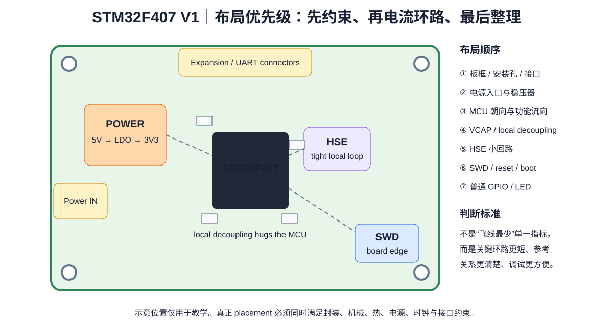

# 04｜布局：先摆电流环路，再摆“好看”

> 🎯 **本章任务**：完成 V1 第一版 placement。优先级不是“看起来整齐”，而是机械约束 → 功能分区 → 关键电流环路 → 时钟/调试 → 普通器件。



---

## 1. PCB 布局不是俄罗斯方块

一个常见的新手流程：

1. MCU 放正中间；
2. 电容围一圈；
3. 接口沿板边排整齐；
4. 哪里空就塞电阻；
5. 最后看飞线想办法连。

这可能很漂亮，但它没有体现电气优先级。

更合理的顺序是：

```text
机械锚点
→ 连接器
→ 电源入口与稳压
→ MCU
→ VCAP / local decoupling
→ HSE
→ SWD / reset / boot
→ 关键接口
→ 普通 GPIO / LED / button
→ 最后才是视觉整理
```

---

## 2. Step 1：先锁机械锚点

先放：

- board outline；
- M3 mounting holes；
- power connector；
- SWD header；
- UART header；
- expansion connector。

为什么先放？

因为这些器件的位置受外壳、线缆、手指、螺丝刀、调试器影响，**不是纯电气自由变量**。

### 工程检查

- 插线后会不会挡住 reset button？
- ST-LINK 排线有没有空间？
- 安装孔周围是否留出 washer / screw head 空间？
- connector orientation 是否会镜像？

---

## 3. Step 2：电源入口是一条能量路径

V1：

```text
5V connector → input cap → LDO → output cap → 3V3 distribution
```

LDO 的 CIN/COUT 不是“附近有就行”。

根据 AP2112 datasheet 的典型应用，它们是 regulator 稳定/瞬态响应的一部分。

布局时把：

```text
VIN pin — CIN — GND
VOUT pin — COUT — GND
```

当成两个局部电流环路看。

原则：

- capacitor 紧邻对应 pin；
- GND 端快速进入 L2；
- 不让大电流输入路径绕 MCU 时钟区；
- 预留足够铜帮助 LDO 散热，但不把“散热铜”误当成电气去耦。

---

## 4. Step 3：MCU 位置由接口流向决定

V1 不追求最小尺寸，因此 MCU 可放在板中央偏上，使：

- SWD 靠一侧；
- UART/扩展头走向自然；
- power entry 与 MCU 有明确路径；
- HSE 区域有安静空间。

不要为了让丝印正向而牺牲关键网络路径。

**旋转 90° 有时能减少 30 条交叉飞线，比“强行正放”更专业。**

---

## 5. Step 4：VCAP 是第一优先级局部电容

把 VCAP capacitor 作为 MCU footprint 的一部分思考。

布局目标：

```text
VCAP pin ─ very short ─ capacitor
                      │
                    GND via(s)
                      │
                     L2
```

不要：

- 借道长线；
- 和其他 rail 共用长 neck；
- 为了器件排齐把它移远。

这里我们暂时不规定“必须 X mm”，而是比较两个布局的 loop inductance 几何趋势。

---

## 6. Step 5：每个 100 nF 都要有“服务对象”

放一个 local decoupling capacitor 时，脑中要能说：

> “C10x 服务这一组 VDD/VSS pin。”

优先考虑：

- 电容与 power pin 的距离；
- capacitor GND pad 到 L2 的路径；
- VDD feed 从 L3/3V3 到 capacitor/pin 的路径；
- via 是否迫使电流绕过焊盘。

### 一种常用几何

```text
[MCU VDD pad]—[C 100nF]
                  │
               GND via
```

但实际最佳几何取决于封装与可布空间，不把图当唯一答案。

---

### 6.1 GND via 不是“接地装饰”，它属于去耦回路本身

Part 0 的实测案例展示了一个很实用的反例：多个关键 GND 支路先共用一段细长顶层地线，再通过远处过孔进入 plane，会把本来独立的局部回路绑在一起。

因此在 V1 放置 local capacitor 时，不只看：

> capacitor 离 VDD pin 近不近？

还要同时看：

~~~text
VDD pin → capacitor → GND pad → GND via → L2
~~~

对于 VCAP、local 100 nF 等快速支路，优先做到：

- GND via 靠近 capacitor GND pad；
- 不为了“少打一颗孔”让多个关键电容共用长 GND neck；
- pad → via 的顶层连接尽量短、宽、直接；
- via 接入的是连续 L2 GND，而不是被 clearance/slot 切碎的窄铜岛。

这里的目标不是机械执行“一 pad 一 via”，而是：

> **让每个关键瞬态回路在进入参考平面之前，不先和别的回路共享一大段寄生电感。**


## 7. Step 6：HSE 是一个小而敏感的局部系统

晶体与 load capacitors：

- 靠近 OSC_IN / OSC_OUT；
- 回路小；
- 不让 SWCLK / LED 大电流 / regulator 路径穿过；
- 下方参考区域连续；
- 不挂不必要测试 stub。

如果必须测试时钟，优先使用 MCU clock output / 软件可配置路径，而不是直接在晶体节点拉一根很长 test trace。

---

## 8. Step 7：SWD 布局要考虑“调试当天的你”

SWD header：

- 靠板边；
- pin 1 清楚；
- GND 与 VTREF 明确；
- NRST 可访问；
- SWCLK 路径短；
- 不从 reference-plane slot 上经过。

硬件调试失败时，最痛苦的不是 5 mm 多走线，而是：

> “header 被挡住、pinout 反了、没有 reset、没有测试点。”

所以可调试性是设计功能，不是附加福利。

---

## 9. ❌ 故障板对比

### Bad

- MCU 正中央；
- 所有 100 nF 在右侧排一排；
- HSE 在 25 mm 外；
- SWD 在板内侧；
- LDO 输入线从时钟区域穿过；
- reset button 被 connector 挡住。

### Better

- 接口先锁；
- MCU 按飞线流向旋转；
- VCAP/local caps 直接围绕对应 pin；
- HSE 紧凑；
- power block 成块；
- SWD 可直接插接。

布局优化不是“器件更整齐”，而是**关键路径更短、更清晰、更可解释**。

---

## 10. KiCad 实操流程

### 10.1 用 Ratsnest 观察拓扑

不要一根飞线一根飞线消灭。

先观察哪些器件形成簇：

- power cluster；
- MCU local caps；
- oscillator cluster；
- debug cluster。

### 10.2 锁定机械器件

关键 connector/mounting hole 设置锁定，防止后期误拖。

### 10.3 暂时关闭非相关层

布局阶段重点看：

- F.Cu footprint；
- courtyard；
- Edge.Cuts；
- ratsnest。

### 10.4 做 3D check

第一次 placement 完成就打开 3D Viewer，早发现 connector orientation / component height / board-edge 问题。

---

## 11. Placement Review

### Mechanical

- [ ] connector 可插拔；
- [ ] mounting hole clear；
- [ ] pin 1 / polarity 可见；
- [ ] reset/button 可按。

### Power

- [ ] LDO CIN/COUT 在正确 pin 附近；
- [ ] VCAP 极短；
- [ ] local 100 nF 有明确服务对象；
- [ ] 关键 local capacitor 的 GND pad → via → L2 路径短而直接；
- [ ] 没有为了省 via 让多个关键去耦支路共享长 GND neck；
- [ ] bulk cap 位置合理。

### Clock

- [ ] HSE loop 紧凑；
- [ ] 远离 switching current；
- [ ] 无不必要 stub。

### Debug

- [ ] SWD 可接；
- [ ] SWCLK 短；
- [ ] NRST/VTREF/GND 完整。

---

## 12. 本章任务

不要开始自动/手工布线，先导出一张 placement 截图，并在 `design-decisions.md` 写：

```text
Why MCU is here:
Why regulator is here:
Why HSE is here:
Why SWD is here:
Where each VCAP/local decoupling capacitor belongs:
```

如果你说不出“为什么”，说明这个 placement 还没完成。