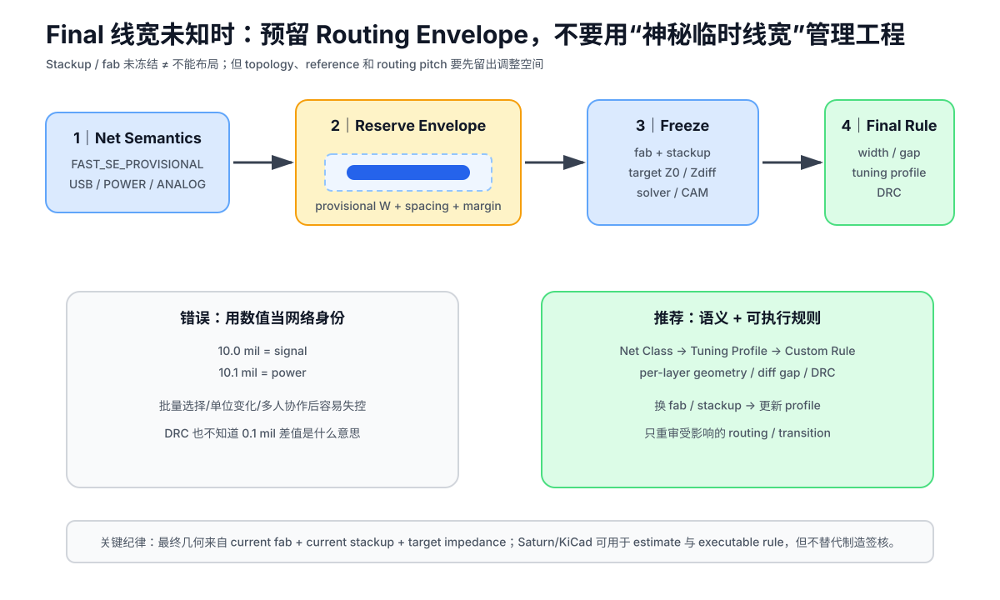

# 05｜布线与规则设置：先保护参考平面，再追求“全连通”

> 🎯 **本章任务**：为 STM32F407 V1 建立有来源的 KiCad 规则，并按电气优先级完成布线。V1 不追求极限密度，而是训练“每根关键线都知道参考谁”。

---

## 1. 先建立 Rule Table，而不是直接按 X 开始拉线

本项目的规则分四类：

1. **板厂制造下限**：能不能做出来；
2. **课程保守几何**：为了易制造/易检查主动留余量；
3. **电气规则**：电流、阻抗、时序、噪声决定；
4. **人工 Review 规则**：DRC 很难自动表达的参考平面/回流要求。

不要把这四类混成一张“祖传参数表”。

---

## 2. V1 初始几何（教学值，不是宇宙规则）

V1 没有 USB data / Ethernet / SDRAM，因此暂时没有必须做受控阻抗的高速总线。

为了标准四层样板易制造、易观察，可从以下**课程几何**起步：

```text
DEFAULT trace: 0.20 mm
DEFAULT clearance: 0.20 mm
General via: 0.60 / 0.30 mm (pad / drill)
Light power branch: 0.50 mm 起步，再按电流/温升分析
```

这些数值的含义是：

- 远离常见板厂的极限能力；
- 方便教学与返修；
- **不代表 0.50 mm 电源线自动能承受任何指定电流**；
- 换板厂/铜厚/电流/工艺后要重新检查。

真实制造能力仍以订单板厂当前 capability 为准。

---

## 2.1 线宽规则先按“角色”分类，而不是一张表打天下

一根 trace 的工程问题取决于它是谁：

| Role | 优先检查 |
|---|---|
| power | DC drop / thermal / via bottleneck |
| clock / fast digital | edge / reference / Z0 / topology |
| differential | Zdiff / pair geometry / skew |
| slow control | manufacturability / routing density |
| analog sense | shared impedance / leakage / noise |

因此 V1 的 0.20 mm / 0.50 mm 只能是课程起点，不是跨网络通用规则。

完整框架见：[Part 0｜07 PCB 走线工程基础](../10_Part0_从二层到多层/07_PCB走线工程基础_几何电流阻抗与时延.md)。


## 2.2 Stackup 还没 Freeze，能不能先开始走线？可以，但要预留“几何包络”

Robert Feranec 在视频 *How to know what track width to use for signals on your PCB* 里给了一个很实用的工程技巧：

> 如果最终 50 Ω 线宽还没从板厂确认，可以先用比预期更宽的走线开始布局；等 stackup / fab geometry 确认后，再把这类线收窄。

这个技巧真正有价值的地方不是“10 mil”这个数字，而是：

> **在未知 final geometry 时，先为 critical nets 预留足够 routing pitch 和连续 reference，不要等最终线宽出来后才发现已经没有空间。**

<p align="center"></p>

### 推荐流程

~~~text
1. 先确认网络角色
2. 估算 target impedance / likely geometry range
3. 用保守 provisional width + clearance 预留空间
4. 完成 topology / layer / reference / via strategy
5. stackup freeze
6. field solver / fab calculator 得 final width/gap
7. 更新 KiCad rule / tuning profile
8. DRC + 局部 reroute / SI review
~~~

这里的“保守”不是：

> 越宽越安全。

而是：

> **让 provisional geometry 不会把未来 final geometry 挤死。**

如果你预期最终线宽大约会在 0.15–0.20 mm 之间，那么早期用更宽的 routing envelope 可能有利于保留空间；但 exact provisional value 应由项目 density、via escape、制造下限和预估 stackup 决定。

### 不要用“10.1 mil”这种哨兵线宽表达网络语义

视频里为了避免批量选择 10 mil signal 时误改 power，作者举了：

~~~text
signal = 10.0 mil
power  = 10.1 mil
~~~

这种个人工作流技巧。

课程不采用它作为正式方法，因为：

- 几何值不应该承担“网络是谁”的身份；
- 后续换单位、导入规则、脚本或多人协作时很容易失效；
- DRC 无法理解“10.1 mil 表示 power”。

正式工程应使用：

~~~text
Net Class / Custom Rule / Tuning Profile
~~~

表达语义。

例如：

~~~text
DEFAULT
FAST_SE_PROVISIONAL
USB_FS
POWER
ANALOG_SENSITIVE
~~~

然后让几何由规则控制，而不是靠“0.01 mil 的暗号”。

### Power 仍然必须单独计算

视频特别提醒 power 不要跟 signal 一起批量缩窄，这个方向完全正确。

Power trace 要按：

- current；
- copper thickness；
- length；
- voltage drop；
- allowed temperature rise；
- via bottleneck；
- plane / pour geometry

单独设计。

Saturn PCB Toolkit 当前仍提供基于 IPC-2152 的 conductor-current / temperature-rise 计算，可用于前期估算；最终仍要结合真实 stackup、铜厚、环境和板厂能力。

### Analog 也不能写成“线宽更宽 = 阻抗更低 = 更好”

视频作者明确说 analog 不是其主要领域，并分享了自己常用更宽线的习惯。

课程不把这条升级成模拟设计规则。

Analog trace width 可能由：

- source impedance；
- input leakage / bias current；
- current；
- Johnson / coupled noise；
- RC pole；
- capacitance；
- guard / shielding；
- Kelvin sense；
- settling time；
- board contamination

共同决定。

有些 high-impedance analog node 反而更怕大铜面积带来的 parasitic capacitance / leakage。

因此：

> **Analog line width 也必须从电路功能和误差预算出发，而不是统一追求“更宽”。**

**本资源来源：**

- Robert Feranec, *How to know what track width to use for signals on your PCB*: https://www.youtube.com/watch?v=VGY1qFE-kC0
- Saturn PCB Toolkit: https://saturnpcb.com/saturn-pcb-toolkit/

---

## 3. KiCad Net Classes

建议：

```text
DEFAULT
POWER
CLOCK_DEBUG
ANALOG_SENSITIVE
```

V2 再增加：

```text
USB_FS
CAN
SDIO
```

### 为什么 V1 不提前配一堆“高速参数”？

因为没有网络需求就没有必要伪造精确规则。

好的规则表允许存在：

```text
USB differential width/gap = N/A in V1
```

而不是为了显得专业随便写一组数。

---

## 4. 布线顺序

### Priority 0：保持 L2 完整

先立规矩：

> **L2 不用来救火走普通信号。**

如果 Top/Bottom 走不通，优先重新布局/换路径，而不是把完整参考平面切碎。

### Priority 1：VCAP / decoupling local connection

这些属于局部供电环路，不是“最后补电源”。

重点检查：

- VDD pad ↔ capacitor；
- capacitor GND ↔ L2；
- VCAP ↔ capacitor ↔ GND；
- via 不让电流拐大圈。

### Priority 2：HSE

OSC_IN/OUT 局部完成，不与普通 GPIO 一起“自动优化”。

### Priority 3：SWCLK / SWDIO / NRST

保持简单、短、参考连续。

### Priority 4：UART / ordinary control

再处理普通数字网络。

### Priority 5：Power distribution / plane zones

根据 L3 power plan 与 Top local connection 完成供电，不把电源层切成难以解释的碎片。

---

## 5. Top / Bottom 怎么分工？

基于 V1 选定 stackup：

```text
L1 ↔ L2 GND：紧邻
L4 ↔ L3 Power：紧邻
```

所以：

### L1

优先：

- HSE（局部）；
- SWCLK；
- 未来需要较好参考结构的关键数字线；
- MCU 主要 escape。

### L4

优先：

- 普通 GPIO；
- LED/button；
- 低风险控制；
- 必要 cross routing。

如果 Bottom 某网络变快，先检查 L3 在它整个投影下是否为连续且合适的 reference。

---

## 6. 换层：每个 via 都要问两个问题

1. signal path 怎么走？
2. return/reference transition 怎么走？

V1 的快速网络尽量减少不必要换层。

如果从 L1 换到 L4：

- 记录换层前 reference；
- 记录换层后 reference；
- 分析附近 reference connection；
- 不机械套用“旁边一定 X mm 一个地孔”。

Part 2 会用 SI 模型深入这个问题。

---

## 7. 不要迷信 45°，也不要迷信“不能 90°”

现代 PCB 教学中很容易把角度变成玄学。

V1 使用 45°/圆滑几何主要因为：

- 可读性；
- 编辑方便；
- 避免不必要几何突变；

但不要把“一个 90° 弯就一定产生灾难性 EMI”当结论。

真正要看：

- 边沿；
- 线宽；
- 局部阻抗变化；
- reference；
- 整体互连长度。

课程以后会尽量把“美学规则”和“电磁规则”分开。

---

## 8. 电源走线：线宽不是唯一变量

对于电源：

- current；
- copper thickness；
- allowed temperature rise；
- length；
- via count；
- plane geometry

共同决定性能。

V1 `0.50 mm` 只是轻载教学起点。

如果某 rail 进入数百 mA/更高：

> 做实际 voltage-drop / thermal analysis，而不是继续凭“够粗了”判断。

后续 DFM/Power chapters 会引入 IPC 相关设计思路和计算工具。

---

## 9. Ground Via / Stitching Via

V1 会在需要处使用 GND vias：

- local decoupling；
- connector ground；
- board-edge/区域连接；
- reference transition 辅助；
- top/bottom ground pour connection。

但不采用：

> “板边每 10 mm 必须一个孔”

这种无上下文固定规则。

stitching pitch 必须和：

- 目标最高频率；
- 结构尺寸；
- EMI/屏蔽目标；
- 板边/connector 结构

联系起来。

Part 4 EMC 再定量讨论。

---

## 10. Ground Pour ≠ Ground Plane

Top/Bottom 可以铺 GND pour 来：

- 提供局部回流/屏蔽辅助；
- 增加铜；
- 提供 stitching connection。

但它们不自动等价于 L2 solid plane。

如果 Top pour 被器件、走线切成孤岛，它不能因为 net name 是 GND 就 magically 具有完整 reference plane 的效果。

---

## 11. ❌ 故障板：为了少一个过孔，切穿 L2

场景：

> 某普通 GPIO 在 Top 走不过去，于是设计者在 L2 拉 15 mm 信号线。

短期收益：

- 少一个 via；
- 飞线消失。

长期代价：

- solid GND plane 被破坏；
- 多条 Top signal 的 return structure 同时受影响；
- 一个局部布线问题变成全局参考问题。

这是一笔很差的交换。

---

## 12. Routing Review

### Automated

- [ ] clearance；
- [ ] track width；
- [ ] via drill；
- [ ] unconnected；
- [ ] copper-to-edge；
- [ ] courtyard / keepout（按项目规则）。

### Manual electromagnetic review

- [ ] L2 是否仍连续；
- [ ] 关键 L1 网络是否全程参考 L2；
- [ ] Bottom 关键网络是否跨 L3 split；
- [ ] 换层前后 reference 是否明确；
- [ ] HSE 是否有长 stub；
- [ ] local power loops 是否被过孔/绕线拉大。

---

## 13. 本章任务

布完 V1 后不要立刻倒 Gerber。

先生成一份：

```text
critical-net-review.md
```

逐条记录：

```text
Net:
Layer(s):
Reference plane(s):
Via transitions:
Plane split crossing:
Reason for chosen route:
```

如果一个关键网络的 route 无法解释，它还没有设计完成。