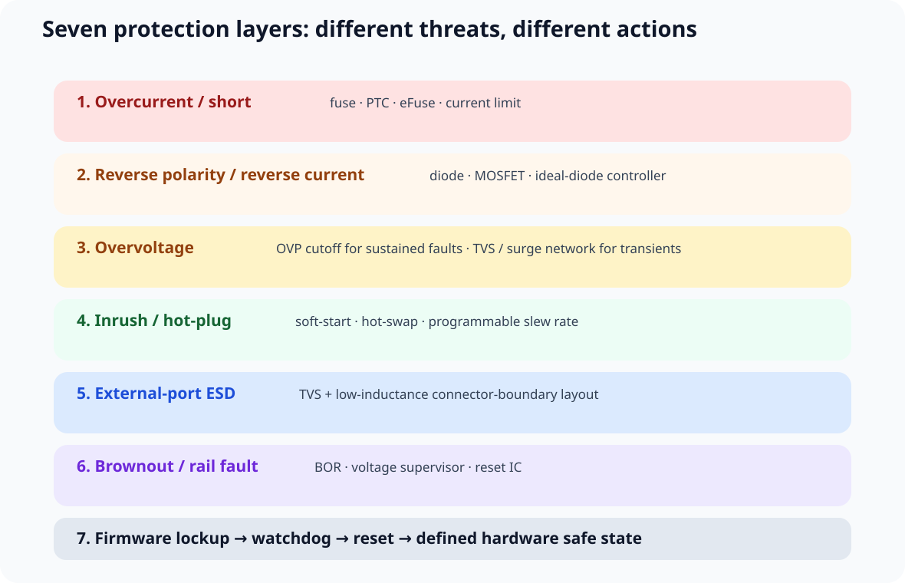
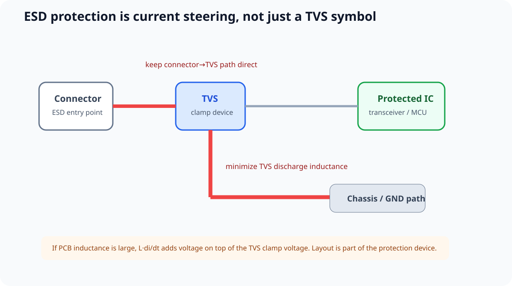
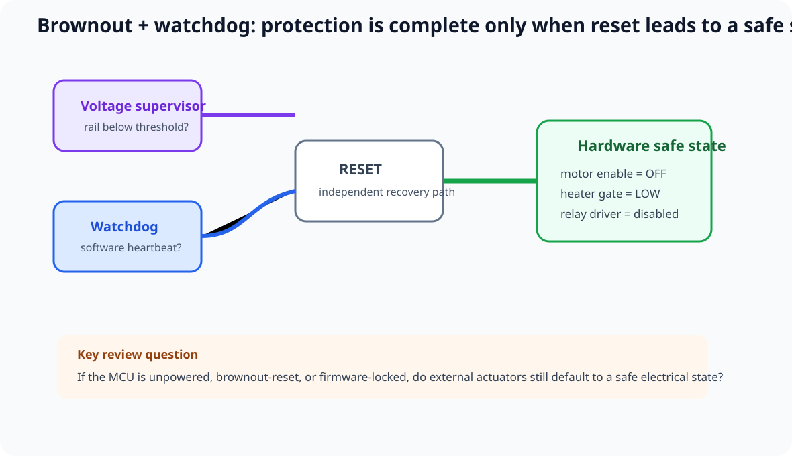
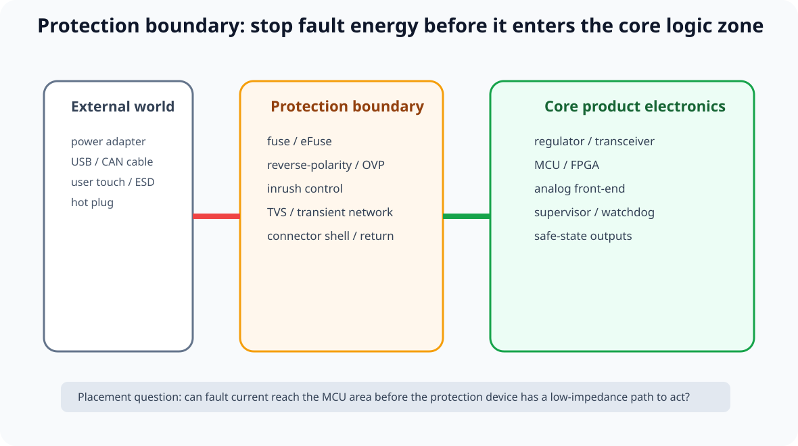

# 09｜产品级保护电路：从外部端口到 MCU Safe State

> 本章由用户提供的 John Teel / Predictable Designs 视频 *7 Protection Circuits You Should NEVER Ship a Product Without* 触发。
>
> 当前公开视频索引能确认这是一条“产品级保护电路”主题视频，并能确认其中提到了 watchdog；John Teel 公开的 Design Review checklist 还明确把 reverse polarity / overvoltage、inrush、ESD/TVS、fuse/PTC 列入产品级保护审查。
>
> **由于当前没有可用的完整逐字稿，本章下面的“七层保护框架”是课程综合框架，不宣称与视频中的 7 项逐字一一对应。**

---

## 9.1 为什么“样板能跑”不等于“产品能出货”

实验室里的 MCU 板常年只经历正确极性的台式电源、干净的 USB 线和温和的负载。真实产品却可能遇到：

~~~text
wrong adapter / reversed supply
hot plug / inrush
short circuit
ESD / EFT / surge
rail droop / brownout
firmware lockup
connector/cable transient energy
~~~

保护设计因此不是“出问题后再加一颗 TVS”，而是：

> **在架构阶段定义 threat → entry path → protection action → safe state → validation。**

---

## 9.2 课程采用的七层保护框架

| Layer | 主要威胁 | 典型手段 | 设计问题 |
|---|---|---|---|
| 1 | 过流 / 短路 | fuse / PTC / eFuse / current limit | 能量如何被切断？ |
| 2 | 输入反接 / 反向电流 | diode / MOSFET / ideal-diode controller | 正常压降与容错如何权衡？ |
| 3 | 持续过压 / 瞬态过压 | OVP cutoff / TVS / surge network | 是“切断”还是“钳位”？ |
| 4 | 热插拔 / 大电容浪涌 | soft-start / hot-swap / eFuse | 谁限制 inrush？ |
| 5 | 外露接口 ESD | TVS / protection array + low-L layout | ESD 电流从哪里泄放？ |
| 6 | 欠压 / brownout | MCU BOR / supervisor / reset IC | 电压不够时系统是否进入确定状态？ |
| 7 | MCU / firmware 卡死 | watchdog + safe-state logic | 控制器失联后谁把系统拉回来？ |

不是每个产品都要机械装满七层。真正流程是：

~~~text
Threat model
→ source energy
→ exposed ports
→ failure consequence
→ protection requirement
→ device / topology
→ PCB current path
→ fault-injection test
~~~

---

# Layer 1｜过流 / 短路：保护的是故障能量

## 9.3 Fuse、PTC、eFuse 的角色不同

### 一次性 Fuse

不能只看正常电流。还要看：

- steady current；
- startup / inrush；
- time-current curve；
- interrupt rating；
- ambient-temperature derating；
- downstream trace / connector / wire 的 fault-energy 能力。

### Resettable PTC

PTC 会因自热进入高阻态，故障去除并冷却后可以恢复。它不是“可自动恢复的理想保险丝”，其 hold/trip current 和环境温度高度相关。

### eFuse / Hot-swap

现代 eFuse 可能集成 current limit、short-circuit protection、OVP、programmable output slew rate、thermal shutdown 和 reverse-current blocking。优势是把 fault response 变成可控的 power-path 行为，但仍必须检查 SOA、热、fault timer、retry / latch-off mode。

## 9.4 Fuse / eFuse 应靠近能量入口

通常优先：

~~~text
Power source
→ protection
→ board distribution
~~~

而不是让 fault current 先穿过一长段 PCB copper，再遇到保护器件。

---

# Layer 2｜Reverse Polarity：先定义错接场景

## 9.5 Series Diode 简单，但会持续损耗

~~~text
VIN → diode → protected rail
~~~

优点是简单，代价是 forward drop 与 I × VF 功耗。低压、大电流产品往往更在意这部分 headroom 和热损耗。

## 9.6 MOSFET / Ideal-Diode Controller

MOSFET 方案可以降低正常导通损耗，但必须检查 body diode direction、gate stress、startup、reverse-input event 和 abs max。

TI 的资料特别区分：

> **Reverse polarity protection 与 reverse current blocking 不是同一个功能。**

不能看到“ideal diode”字样就默认两者都具备。

---

# Layer 3｜Overvoltage：持续过压与瞬态过压要分开

## 9.7 Wrong Adapter 不等于 ESD / Surge

### 持续过压

例如错接更高电压 adapter、upstream regulator fault。更适合 OVP comparator、eFuse cutoff、load disconnect。

### 瞬态过压

例如 ESD、EFT、surge、感性负载瞬态。更适合 TVS、MOV / GDT（取决于能量等级）、series impedance 和 coordinated protection。

所以：

> **有 TVS 不代表 24 V 错插到 5 V 板也一定安全。**

TVS 的职责通常是指定瞬态条件下钳位，不是无限时间吸收错误电源能量。

## 9.8 Clamp 与 Cutoff 是不同动作

~~~text
Clamp:  spike → TVS conducts → transient energy diverted
Cutoff: VIN > threshold → switch opens → load disconnected
~~~

产品电源入口经常需要同时考虑 transient clamp、sustained-fault cutoff 和 downstream current limit。

---

# Layer 4｜Inrush：正常上电也可能是一种应力

## 9.9 大电容为什么造成浪涌

基本关系：

~~~text
I = C × dV/dt
~~~

大输入电容遇到低阻抗 source / cable / switch 时，hot-plug 可能造成 connector spark、source collapse、fuse nuisance trip 或 MOSFET SOA 压力。

因此“加大输入电容”不能只看 ripple。

## 9.10 Soft-start / Slew-rate Control

常见手段：regulator internal soft-start、load switch、hot-swap controller、eFuse programmable dV/dt。

设计动作：

1. 统计 downstream capacitance；
2. 定义允许 startup time；
3. 定义 source current capability；
4. 估算 inrush；
5. 实测 worst-case hot-plug。

---

# Layer 5｜ESD：Protection Device 与 Layout 必须一起设计

## 9.11 TVS 不是“放上去就有保护”

ESD 路径应该画成：

~~~text
external contact
→ connector
→ TVS
→ low-inductance discharge reference
→ environment return
~~~

受保护 IC 应位于 protection boundary 的下游。

TI 的 ESD layout guide 明确强调 PCB parasitic inductance 会抬高系统实际钳位电压，因此 TVS 到 ground / chassis 的路径必须低电感，并且应尽可能靠近 ESD entry point。

完整布局方法继续见 Part 4：[ESD 与 TVS](../14_Part4_EMI_EMC/04_ESD与TVS布局.md)。

---

# Layer 6｜Brownout：电压不够时必须“明确失败”

## 9.12 最危险的是“还能跑一点，但已经不可靠”

真实 rail 可能因为 startup、battery depletion、load step、cable drop 或 regulator transient 跌入 MCU 无法保证正常工作的区域。

所以设计要定义：

> **电压不足时，系统是否被强制保持在确定 reset / safe state。**

## 9.13 Internal BOR vs External Supervisor

### MCU Internal BOR

很多普通 MCU 产品已经足够，但仍要核对 threshold、hysteresis、reset release 和 firmware configuration。

### External Supervisor / Reset IC

适合 threshold 更严格、多 rail、reset timing 更严格、需要独立硬件监控的系统。

TI 对 voltage supervisor 的典型用途就是监视 supply rail，在 rail 低于阈值时保持 processor reset，从而避免 brownout 区域运行。

---

# Layer 7｜Watchdog：软件卡死时不能靠卡死的软件自救

## 9.14 Internal 与 External Watchdog

Internal watchdog 已经非常有价值，但要检查 clock independence、startup enable、timeout 和错误 firmware 是否可能持续“喂狗”。

更高可靠性要求下，external watchdog 可以提供 independent clock、independent reset path 或 window-watchdog behavior。

真正重要的是：

> **watchdog 的输入应尽量代表系统核心任务真的健康，而不是固定周期无脑 toggle。**

## 9.15 Reset 之后的 Safe State

~~~text
watchdog timeout / brownout
→ RESET
→ outputs default state
→ motor / heater / relay / power switch
→ safe or unsafe?
~~~

例如 actuator enable 要有硬件默认态，不能依赖 MCU reset 后“很快执行一段代码”才能关闭危险负载。

---

## 9.16 三条保护路径不要混

### Power-path protection

~~~text
POWER CONNECTOR
→ fuse / eFuse
→ reverse-polarity / OVP
→ inrush control
→ regulator
→ rail
~~~

### Signal-port protection

~~~text
EXTERNAL CONNECTOR
→ TVS / transient protection
→ filter / termination
→ transceiver / MCU
~~~

### Control-health protection

~~~text
rail supervisor + watchdog
→ reset / enable / safe-state
~~~

它们解决三类不同故障。

---

## 9.17 PCB Placement：先画 Protection Boundary

建议先画：

~~~text
[ EXTERNAL WORLD ]
      |
[ CONNECTOR ]
      |
[ PROTECTION BOUNDARY ]
      |
[ POWER / TRANSCEIVER ]
      |
[ CORE MCU / FPGA ]
~~~

这样 placement 自然变成：

- fuse / reverse polarity / OVP / surge：靠 power entry；
- ESD TVS：靠 external connector；
- supervisor：靠 monitored rail / reset architecture；
- watchdog：位于 reset/control domain；
- fault current 不穿 core logic 区。

---

## 9.18 保护器件越多不等于越安全

每加一个保护器件都会引入 side effect：

- series resistance；
- leakage；
- capacitance；
- voltage drop；
- thermal；
- board area；
- failure mode；
- sourcing risk。

例如高电容 TVS 可能伤害高速接口；PTC 在高温下可能提前限流；eFuse retry 模式可能让 fault load 周期性发热；supervisor threshold 选错会 false reset。

所以目标是：

> **对每个威胁选择最少但足够的 protection layers。**

---

## 9.19 Protection Requirement Table

| ID | Threat | Entry / failure path | Protection | Safe state | Validation |
|---|---|---|---|---|---|
| P-01 | input reverse polarity | power connector | TBD | no damage | controlled reverse-input test |
| P-02 | input short / overload | power input | TBD | disconnected / limited | electronic-load short test |
| P-03 | inrush | hot plug | TBD | no source collapse | current probe / scope |
| P-04 | USB ESD | USB connector | TVS topology | no permanent damage | pre-compliance ESD |
| P-05 | brownout | 3V3 rail | BOR / supervisor | safe reset | rail-ramp test |
| P-06 | firmware lockup | MCU | watchdog | safe outputs + reboot | forced software hang |

把 Protection 写成 TBD 也比“随手放一颗器件”专业，因为 TBD 会强迫 Review 把问题关闭。

---

## 9.20 Fault Injection：保护必须故意触发一次

Bring-up 后增加 protection test：

- reverse input（安全、可控、低能量 bench 条件）；
- current-limit / short test；
- hot-plug / startup；
- rail droop / brownout；
- ESD pre-compliance；
- forced firmware hang；
- repeated watchdog recovery。

记录：

~~~text
Trigger
→ Detection
→ Protection action
→ Safe state
→ Recovery
→ Logging
~~~

---

## 9.21 Interactive Protection Architecture Lab

打开：

**interactive/protection-architecture-lab.html**

选择 power source、user-accessible connector、large input capacitance、external cable、high-consequence output 和 MCU reliability requirement。

页面生成教学级 threat inventory、recommended protection layers、placement boundary 和 validation checklist。

它不是安全认证工具，也不会自动决定 fuse rating / TVS part number。

---

## 9.22 Design Review Checklist

### Power Input

- [ ] fault source energy 已定义
- [ ] overcurrent protection 的 trip / SOA 有依据
- [ ] reverse polarity / reverse current requirement 已区分
- [ ] sustained overvoltage 与 transient surge 已分开
- [ ] inrush / hot-plug 已计算或测量
- [ ] protection 位于能量进入 board 的边界

### External Interface

- [ ] 所有 user-accessible / cable ports 有 ESD threat review
- [ ] TVS 在 connector boundary
- [ ] TVS discharge return 低电感
- [ ] 高速接口已审 protection capacitance

### MCU / Control

- [ ] BOR / reset threshold 有依据
- [ ] brownout safe state 已定义
- [ ] watchdog 真正监控系统健康
- [ ] reset 时 actuator outputs 有硬件默认态
- [ ] watchdog / brownout fault injection 已进入测试计划

---

## 9.23 本章任务

1. 给 STM32F407 V2 画一张 Protection Boundary Map；
2. 列出 power connector、USB、CAN、expansion header；
3. 给每个端口写 threat / protection / return / validation；
4. 给 MCU 写 BOR strategy、watchdog strategy、reset-safe GPIO state；
5. 打开 Protection Architecture Lab；
6. 把结果加入 Design Review。

---

## 参考资料

- John Teel / Predictable Designs, *7 Protection Circuits You Should NEVER Ship a Product Without*: https://youtu.be/TZdKkc8Xju8?si=KKCOVX8DDyuvb0mb
- Predictable Designs, Design Reviews: https://predictabledesigns.com/design-reviews/
- Texas Instruments, ESD Protection Layout Guide
- Texas Instruments, Reverse Polarity Protection vs Reverse Current Blocking
- Texas Instruments, eFuse / Hot-Swap documentation
- Texas Instruments, Voltage Supervisors / Reset & Watchdog ICs

> 来源纪律：本章的“七层保护框架”是课程综合结构。当前没有这条新视频的完整 transcript，因此除了公开视频能确认的主题，不把任何具体电路、排名或数值假装成视频原话。
