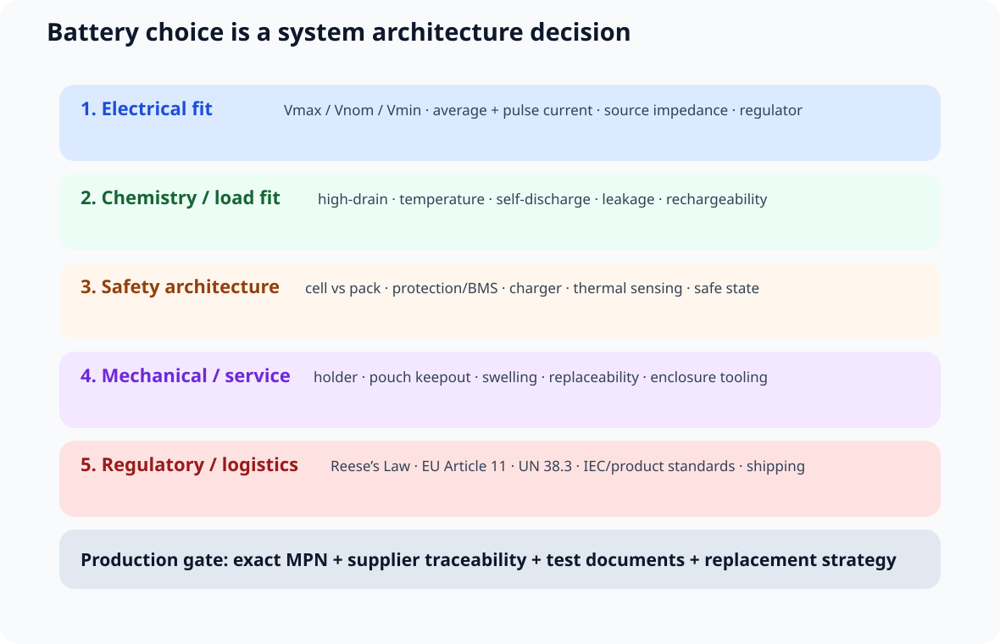
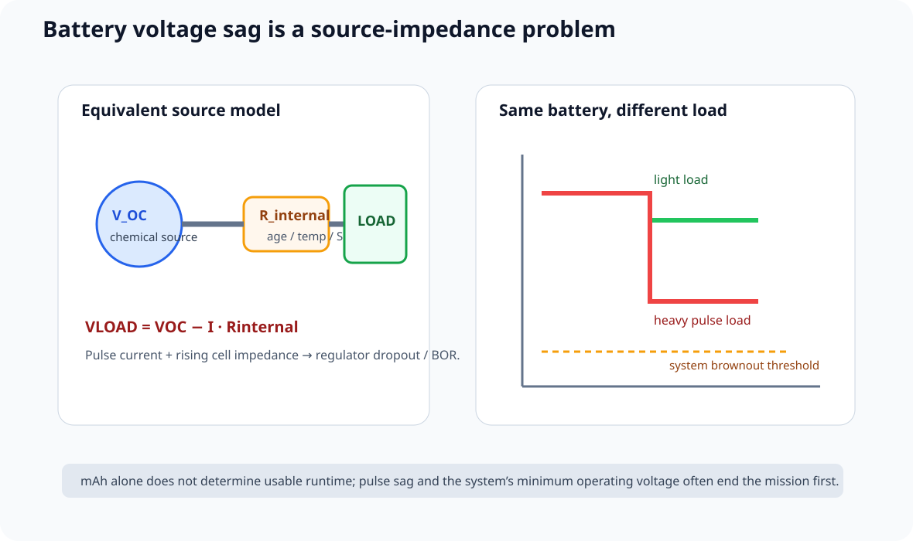
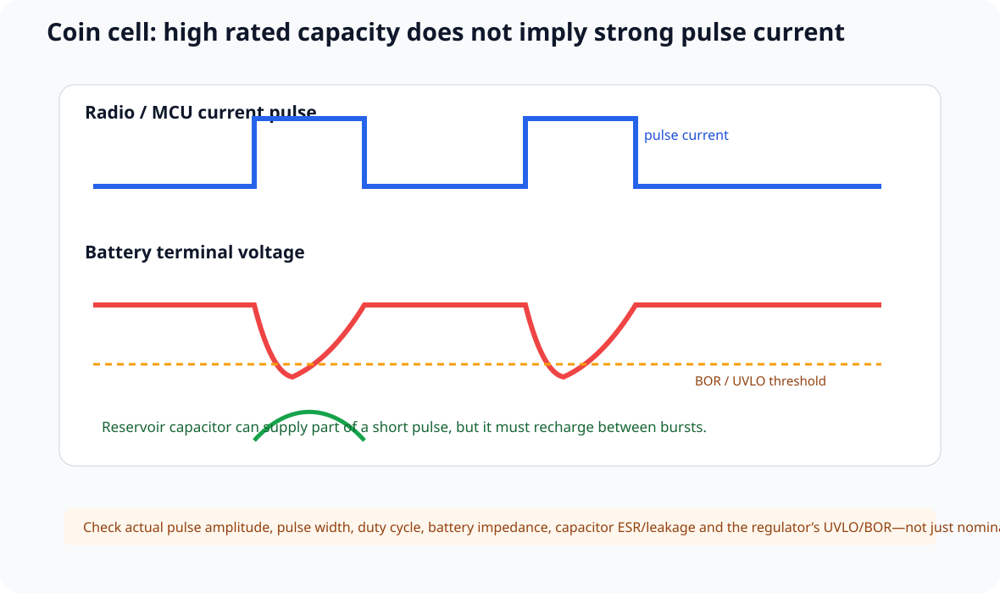
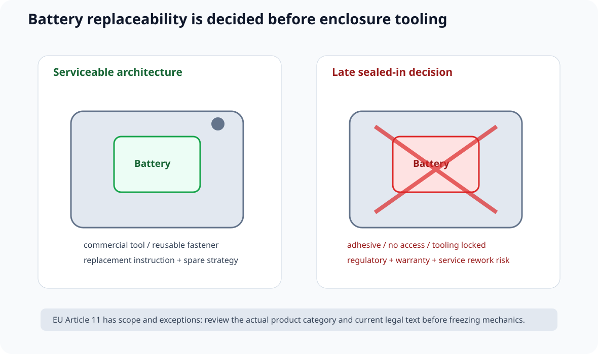
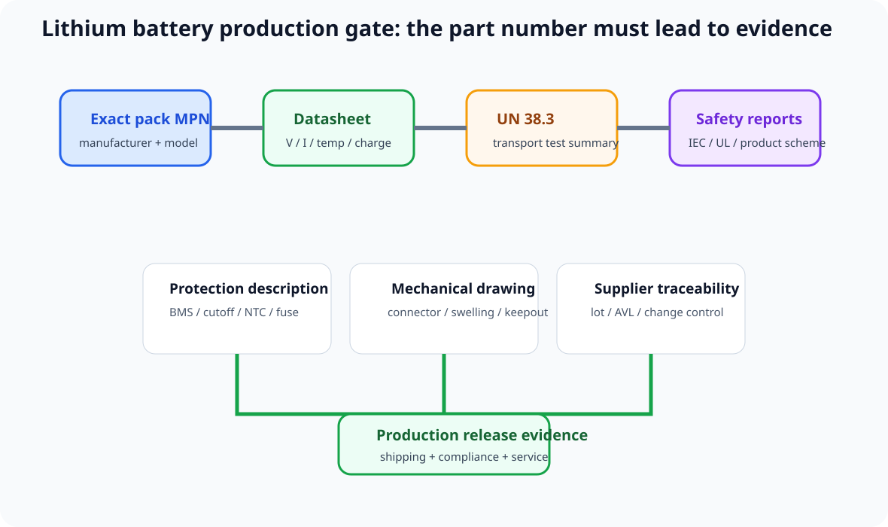

# 10｜电池供电产品：从化学体系、脉冲负载到认证与可维修性

> 本章吸收 John Teel / Predictable Designs 的 *7 Batteries You Should NEVER Use in a Product*。
>
> 原视频用“7 种不要直接带进量产产品的电池选择”建立产品化直觉：
>
> 1. 9V alkaline；
> 2. high-drain 场景中的 alkaline；
> 3. 超出 tiny-load 场景的 coin cell；
> 4. sealed-in battery；
> 5. unprotected 18650；
> 6. bare LiPo pouch；
> 7. uncertified lithium pack。
>
> 课程不把标题里的 **NEVER** 当作绝对禁令，而把它改写为：
>
> **这些方案如果没有完整的 load、mechanical、safety、regulatory、logistics 与 serviceability 证据，就不应该直接从 prototype 带进 production。**

---

## 10.1 电池不是“一个电压源”

原理图上常见：

~~~text
BATTERY
  |
 VOUT
~~~

但真实产品里的 battery 同时定义：

- nominal / min / max voltage；
- source impedance；
- pulse-current capability；
- energy density；
- cold-temperature behavior；
- self-discharge；
- cycle life；
- charging method；
- protection；
- enclosure volume；
- replaceability；
- shipping classification；
- certification evidence；
- field-service strategy。

所以电池选型必须在：

> **Concept / Requirement / Mechanical Architecture**

阶段完成，而不是等 PCB 快画完才问“放什么电池”。

---

# 10.2 Battery #7：9V Alkaline——原型方便，不代表系统匹配

9V alkaline 的优点非常明显：

- 连接简单；
- 开发板容易接；
- prototype 上随手可得。

但它经常和现代 1.8/3.3/5 V electronics 的电压需求不匹配。

如果直接用 linear regulator：

~~~text
9 V
 ↓
LDO
 ↓
3.3 V
~~~

效率上限近似：

\[
\eta_{LDO}\approx\frac{V_{OUT}}{V_{IN}}
\]

所以 9 V → 3.3 V 时，理论上大部分输入能量会在 regulator 上变成热。

视频因此建议重新审视：

- 2×AA / 3×AA；
- rechargeable pack；
- 或更匹配的 chemistry + regulator。

但课程不写“9V alkaline 永远不能用于产品”。

对于极低平均电流、很低 duty cycle、维修方便、体积允许的产品，它仍可能有合理场景。

真正的 Design Review 问题是：

> **为什么系统需要 9 V source，而不是更接近 load voltage 的 battery architecture？**

---

# 10.3 Battery #6：Alkaline + High Drain——先看 source impedance

真实 battery 可以先近似成：

~~~text
V_OC
 |
R_internal
 |
LOAD
~~~

那么 load voltage 近似：

\[
V_{LOAD}=V_{OC}-I\cdot R_{internal}
\]

当 load current 增大、battery 放电加深、temperature 下降时，可用 terminal voltage 都可能显著下降。

这意味着“还剩很多化学容量”并不等于：

> MCU 还能稳定工作。

如果 radio / motor / LED driver 突然拉大电流，可能出现：

~~~text
battery sag
→ regulator dropout
→ 3V3 droop
→ BOR/reset
~~~

因此 high-drain battery selection 至少要用厂家 discharge curves 检查：

- current；
- pulse duration；
- duty cycle；
- cutoff voltage；
- temperature。

不能只看包装上的“AA / 1.5 V”。

对于更高 drain 或低温，NiMH、Li-FeS2 或 rechargeable lithium architecture 可能更合理，但仍需按真实负载重新验证。

---

# 10.4 Battery #5：Coin Cell——225 mAh 不代表能随时给你 225 mA

coin cell 特别容易制造一个错误直觉：

~~~text
Capacity = 225 mAh
↓
那应该能提供很大的瞬态电流
~~~

错误。

Capacity 是在指定 discharge condition 下测出来的。

coin cell 的关键限制往往是：

> **source impedance + pulse droop**

如果无线发送瞬间：

\[
I_{pulse}\uparrow
\]

则：

\[
\Delta V\approx I_{pulse}\cdot R_{battery}
\]

可能直接触发：

- MCU BOR；
- radio brownout；
- flash write failure；
- sensor reset。

### Bulk capacitor 能不能救？

可以帮助，但不是魔法。

近似：

\[
\Delta V_C\approx\frac{I\Delta t}{C}
\]

因此 reservoir capacitor 可以承担一部分 short pulse。

但必须同时检查：

- battery recharge time；
- pulse interval；
- ESR；
- leakage；
- regulator UVLO；
- capacitor volume。

所以设计不能写：

> “CR2032 + 470 µF = 一定能带 BLE”。

要用实际 radio current waveform 做 worst-case 验证。

---

# 10.5 Coin Cell 还带来机械与法规问题

如果 consumer product 使用 button / coin cell，美国市场不能只做电气设计。

Reese’s Law 相关 CPSC 要求涉及：

- battery compartment / enclosure security；
- warning / labeling；
- battery packaging requirements。

因此 coin cell choice 会直接影响：

- enclosure；
- fastener；
- labeling；
- manual；
- compliance test。

也就是说：

> **battery footprint 是机械与合规输入，不只是 BOM 输入。**

---

# 10.6 Battery #4：Sealed-In Battery——2027 EU Rule 会影响产品架构

EU Regulation (EU) 2023/1542 Article 11 从：

**2027-02-18**

起适用 removable / replaceable requirements。

对 portable battery，官方文本的默认方向是：

> battery 在产品寿命内应能由 end user readily remove and replace。

“readily removable” 的判断明确涉及：

- commercially available tools；
- 不依赖 proprietary tools；
- 不依赖 thermal energy；
- 不依赖 solvents。

同时 Article 11 也存在 safety / waterproof-related、medical、continuity-of-power / data-integrity 等 derogation / exception 条件。

所以课程禁止写：

> “欧盟 2027 后任何产品都绝对不能封死电池。”

正确做法：

~~~text
target market?
↓
battery category?
↓
Article 11 scope?
↓
exception / delegated act?
↓
mechanical architecture
↓
compliance review
~~~

而且 Article 11 还要求相应 spare battery 在最后一台该型号设备投放市场后至少 **5 years** 可获得。

这意味着：

> battery choice 会锁定 enclosure、fastener、service manual、spare-parts strategy 与 lifecycle。

---

# 10.7 Battery #3：Bare 18650——cell 不是 pack

18650 是一个 form factor，不是完整 product battery architecture。

bare Li-ion cell 本身通常不替你完成：

- overcharge cutoff；
- over-discharge cutoff；
- short-circuit protection；
- reverse installation protection；
- cell temperature supervision；
- pack balancing（多串时）。

所以不能写：

~~~text
18650
→ directly to product
~~~

然后假设“battery 自己会保护”。

更成熟的结构：

~~~text
qualified cells
→ cell holder / weld / interconnect
→ protection / BMS
→ charge control
→ thermal monitoring
→ pack connector
→ product
~~~

### Protected cell 与 BMS 也不能混成一个词

单节 protected cell 可能集成基本 over/under-voltage 与 short protection。

多节 pack 则还可能需要：

- series-cell balancing；
- current sensing；
- pack temperature；
- charger coordination；
- pack authentication / fuel gauge；
- fault logging。

所以 review 必须问：

> **保护功能在哪里实现？cell、pack PCB、charger IC、还是 product main board？**

---

# 10.8 一个重要修正：Protection action 本身也要做 Hazard Review

原视频提醒，在某些高功率 critical load 里，如果 cell / pack protection 突然完全断电，可能制造新的系统级风险。

这个观点应该保留成：

> **Protection action 本身也属于 system hazard analysis。**

例如：

~~~text
overcurrent detected
→ pack suddenly opens
→ flight controller loses all power
~~~

可能比受控限流 / graceful derating 更危险。

这不是在说“critical load 应取消 battery protection”。

而是：

> **保护策略必须与系统 safe state 协调。**

---

# 10.9 Battery #2：Bare LiPo Pouch——电气 + 机械保护缺一不可

LiPo pouch 的优势：

- 薄；
- 轻；
- 能量密度高；
- 可做非圆柱空间。

但 soft pouch 对机械结构特别敏感。

必须审：

- sharp edge；
- screw boss；
- compression；
- pinch；
- drop；
- swelling allowance；
- adhesive；
- thermal path。

所以 pouch cell 的 mechanical keepout 应像重要的 PCB keepout 一样正式。

### Charger 也不能只看“4.2 V”

典型 single-cell Li-ion/LiPo 常使用 CC/CV charge，但实际 max charge voltage、charge current、termination current、recharge threshold 与 temperature window 必须来自 **exact cell + charger datasheet**。

课程禁止写：

> “所有 LiPo 都固定 4.2 V。”

因为存在不同 chemistry / max-voltage cell。

---

# 10.10 Battery #1：Uncertified / Untraceable Lithium Pack

产品进入运输、认证和量产后，电池不能只是一行：

~~~text
LiPo 2000mAh
~~~

它必须具有可追溯身份。

至少记录：

- exact manufacturer；
- exact cell / pack MPN；
- chemistry；
- nominal / max / min voltage；
- capacity；
- max continuous / pulse current；
- charge profile；
- protection topology；
- temperature range；
- drawing；
- connector；
- lot / date code；
- safety reports；
- transport documents。

---

# 10.11 UN 38.3：运输不是“快递公司愿不愿意”的口头问题

UN Manual of Tests and Criteria Part III, subsection 38.3 是 lithium cell / battery transport requirement 的核心基础。

对 product team，一个非常实际的采购 Gate 是：

> **供应商能不能给出对应型号的 UN 38.3 Test Summary？**

不能只收一句：

> “UN38.3 compliant”。

要能追到：

- manufacturer；
- model；
- test lab；
- report / summary；
- revision / date。

Panasonic 等正规电池厂会提供可查询的 UN 38.3 Test Summary，这本身就是很好的供应链示范。

---

# 10.12 IEC 62133-2：不要把它和 UN 38.3 混成同一个证书

IEC 62133-2 面向 portable sealed secondary lithium cells / batteries 的安全要求与测试。

UN 38.3 和 IEC 62133-2 的目标不同：

| 项目 | 核心关注 |
|---|---|
| UN 38.3 | dangerous-goods transport qualification |
| IEC 62133-2 | portable rechargeable lithium safety requirements/tests |

产品真正要满足什么，还取决于：

- target country；
- product category；
- certification scheme；
- transport mode；
- cell / pack architecture。

所以教材不会写：

> “有 UN38.3 = 电池全部认证结束。”

---

# 10.13 9V / AA / Coin Cell / Li-ion：不要按“容量”一列比较

Battery Comparison Table 应该至少包含：

| Parameter | Why it matters |
|---|---|
| usable energy | runtime |
| source impedance | pulse sag |
| min/max voltage | regulator architecture |
| max current | radio/motor/load |
| temperature | outdoor behavior |
| self-discharge | shelf / standby |
| leakage risk | field reliability |
| rechargeability | service model |
| cycle life | warranty |
| safety circuit | fault behavior |
| mechanical envelope | enclosure |
| replaceability | service/regulatory |
| shipping | logistics |
| exact MPN traceability | quality / certification |

这样学生不会再做：

> “这个 225 mAh，所以比那个 200 mAh 更好。”

---

# 10.14 Battery 直接决定 Regulator Architecture

Battery voltage range 必须映射到 rail：

~~~text
Battery Vmax
Battery Vnom
Battery Vmin
       ↓
Regulator topology
       ↓
3V3 / 1V8 / motor rail
~~~

例如：

- battery 始终高于 rail → buck / LDO 候选；
- battery 会跨过 rail → buck-boost；
- battery 始终低于 rail → boost；
- coin cell + tiny load → 可能 direct supply。

关键是用：

> **完整 discharge range**

而不是只拿 nominal voltage 做 schematic。

---

# 10.15 Battery 直接决定 Brownout Strategy

电池放电时 terminal voltage 会持续变化。

所以：

~~~text
battery discharge curve
+
pulse sag
+
regulator dropout / UVLO
+
MCU BOR
=
usable battery capacity
~~~

这解释为什么有些产品：

> 电池看起来还有电，但系统已经不停 reset。

真正 runtime 终点不是 cell 彻底没有化学能量，而是：

> **最差负载脉冲时仍能满足系统最低 rail requirement。**

---

# 10.16 Battery 也进入 PCB Layout

即使 cell 不焊在 PCB 上，battery system 仍影响 PCB：

- connector current rating；
- reverse-polarity keying；
- fuse / eFuse placement；
- charger hot loop；
- battery FET；
- NTC routing；
- fuel-gauge Kelvin sense；
- pack ground current；
- ESD / hot-plug path。

高电流 pack 更不能用：

> “一个 JST 插座 + 任意细线”

来结束设计。

---

# 10.17 Battery 还进入 Mechanical Design

对 removable / pouch / holder battery，要记录：

- insertion / removal force；
- polarity prevention；
- contact wipe；
- spring fatigue；
- vibration；
- swelling；
- screw / tool access；
- child-access requirement；
- vent / thermal behavior；
- adhesive / foam compatibility。

特别是：

> **不能等 enclosure tooling 完成后再决定电池是否可更换。**

那时任何修改都可能变成昂贵机械返工。

---

# 10.18 Battery Documentation Package

进入 Part 9 前，battery-powered product 至少建立：

~~~text
battery/
├── cell-pack-datasheet.pdf
├── mechanical-drawing.pdf
├── protection-description.md
├── charger-requirements.md
├── UN38.3-test-summary.pdf
├── safety-certificates/
├── supplier-traceability.md
├── transport-notes.md
├── replaceability-review.md
└── validation-plan.md
~~~

课程不要求所有项目都有同样文件名，但要求信息必须可追溯。

---

# 10.19 Battery Selection Lab

打开：

**interactive/battery-selection-lab.html**

可以调整：

- average current；
- pulse current；
- pulse duration；
- duty cycle；
- temperature class；
- removable / sealed；
- rechargeable / primary；
- target market；
- high-consequence load。

页面会给出：

- source-impedance risk；
- regulator mismatch risk；
- mechanical / replaceability risk；
- lithium documentation gate；
- suggested next evidence。

它是架构教学工具，不会自动替你批准某颗 battery MPN。

---

# 10.20 Battery Decision Review

### Electrical

- [ ] Battery Vmax / Vnom / Vmin 已记录
- [ ] average + pulse load 已分开
- [ ] pulse sag 有 source-impedance / discharge-curve 证据
- [ ] regulator dropout / UVLO / BOR 与 battery range 联合审查
- [ ] high-drain 场景没有只看 mAh

### Lithium Safety

- [ ] cell ≠ pack，保护边界明确
- [ ] charge profile 来自 exact battery datasheet
- [ ] bare cylindrical / pouch cell 不直接当“成品电池”
- [ ] temperature sensing / mechanical protection 已评估
- [ ] protection action 与 system safe state 协调

### Regulatory / Logistics

- [ ] target markets 已定义
- [ ] coin/button cell 已做 CPSC / product-specific review
- [ ] EU 2027 replaceability 已做 scope / exception review
- [ ] UN 38.3 Test Summary 可追溯
- [ ] applicable IEC/UL/product standard 已确认

### Supply Chain / Service

- [ ] exact battery MPN 固定
- [ ] supplier / manufacturer 可追溯
- [ ] counterfeit / rewrap 风险已考虑
- [ ] spare/replacement strategy 明确
- [ ] mechanical replacement 不依赖最后一分钟改壳

---

# 10.21 本章任务

假设把 V2 改成 portable battery-powered product：

1. 选择一个实际使用场景：BLE sensor、handheld controller、portable logger 或 motorized device；
2. 列出 average / pulse current；
3. 对比 9V alkaline、AA alkaline、CR2032、protected Li-ion/LiPo pack；
4. 建立 Battery Decision Matrix；
5. 画 Battery → Protection → Charger/Regulator → Rail；
6. 完成 UN 38.3 evidence check、replaceability review、battery mechanical keepout；
7. 用 Battery Selection Lab 做一次 A/B。

---

## 参考资料

- John Teel / Predictable Designs, *7 Batteries You Should NEVER Use in a Product*: https://youtu.be/GsrYG5iv5KY?si=PSP_OTPk4O-gMsxx
- Predictable Designs article version: https://predictabledesigns.com/batteries-never-use/
- Regulation (EU) 2023/1542, Article 11
- U.S. CPSC, Reese’s Law / Button Cell and Coin Battery guidance
- UNECE Manual of Tests and Criteria, Part III, subsection 38.3
- IEC 62133-2
- Energizer battery product datasheets
- Panasonic Energy lithium-ion safety / UN 38.3 resources

> 来源纪律：视频里的具体容量、价格倍数、内阻、最大电流等都可能随 exact cell、load、temperature、age 与 supplier 改变。课程保留作者的 product-design direction，但任何具体数字必须回到 exact MPN datasheet / official regulation / test report。
