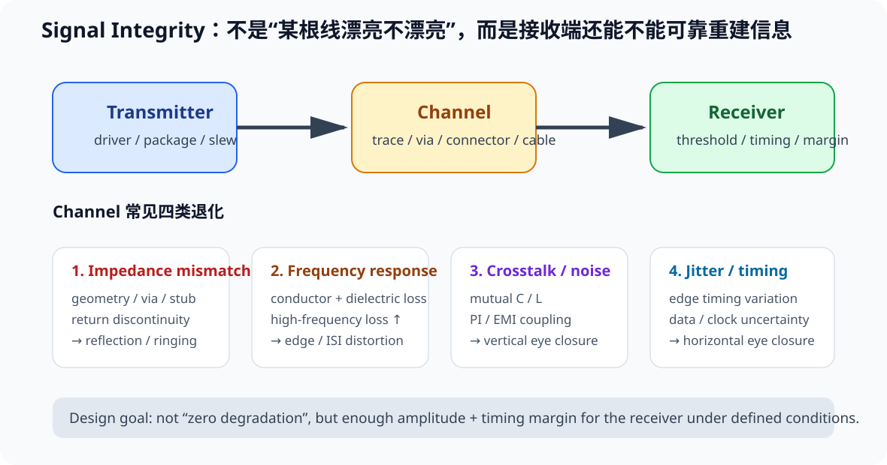
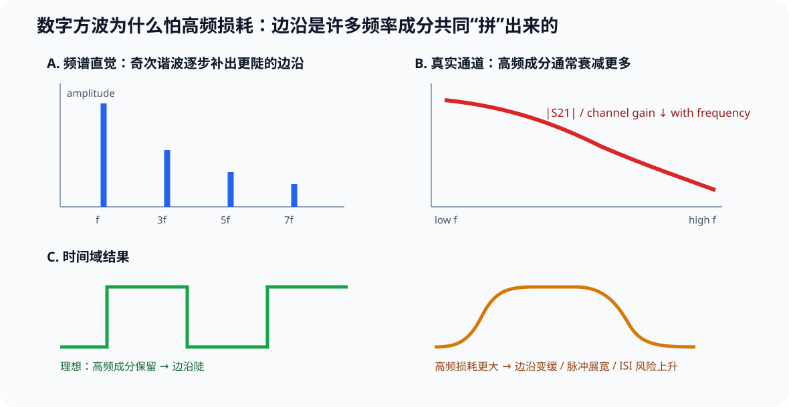

# Part 2 导读：Signal Integrity 不是“高速玄学”

> 这一 Part 的目标不是把你训练成 SI 仿真工程师，而是让你在画板时能判断：**这根线为什么需要受控、哪里会反射、回流从哪走、换层为什么会出问题、两根线为什么会互相干扰、差分到底要控制什么。**

---

## 先建立一张总图：SI 关心的是“接收端还能不能可靠重建信息”

数字系统最终处理的是 0 / 1，但 PCB 上真实存在的仍然是连续变化的**模拟电压和电流**。

一个最小 signal chain 可以写成：

~~~text
Transmitter / Driver
        ↓
Channel / Interconnect
        ↓
Receiver
~~~

其中 channel 不只是一段 PCB trace，也可以继续包含：

- package；
- via；
- connector；
- cable；
- backplane；
- board-to-board transition。

因此本课程采用一个更实用的 SI 定义：

> **Signal Integrity = 在给定噪声、损耗、时序和通道条件下，接收端仍能以足够 margin 恢复发送信息的能力。**

这比“波形越方越好”更准确。真实系统允许一定：

- attenuation；
- delay；
- overshoot / ringing；
- jitter；
- noise；

只要它们没有把接收端的 amplitude / timing margin 吃光。

### 四类最常见的 channel degradation

这套 Part 2 可以压缩成四类问题：

| 类别 | 物理来源 | 常见症状 | 主要章节 |
|---|---|---|---|
| Impedance mismatch | geometry / via / stub / termination / return discontinuity | reflection、ringing、overshoot | 02 / 03 / 04 |
| Frequency response | conductor / dielectric / roughness / skin effect | edge 变慢、pulse spreading、ISI | 09 |
| Crosstalk / noise | mutual C/L、shared return、PI/EMI coupling | vertical margin 下降、误触发 | 04 / 05 / Part 3 / Part 4 |
| Timing / jitter | edge timing variation、ISI、clock/data uncertainty | horizontal margin 下降 | 07 |

这四类并不是互相独立。例如：

~~~text
via discontinuity
→ reflection
→ edge crossing time 改变
→ deterministic jitter
→ eye width 下降
~~~

真实 Design Review 要追因果链，而不是看到一个症状就只贴一个标签。

---

## 方波为什么把“高频”带进数字设计

数字方波可以理解成多个频率成分共同组成。理想方波的傅里叶展开包含基波以及一系列奇次谐波；参与的高频成分越丰富，边沿越陡。

因此，真正决定互连难度的不是只有 bit rate / clock frequency，还包括：

- rise / fall time；
- channel 对不同频率的 attenuation；
- channel 对不同频率的 phase / delay；
- receiver 的 timing / voltage margin。

如果通道对所有频率成分只施加完全相同的增益和延迟，波形形状仍可保持。

真正造成 distortion 的核心是：

> **不同频率成分被不同比例衰减，或经历不同的相位 / 群延迟。**

这正是为什么“我的 clock 才 10 MHz”不能自动推出“这根线是低速”。

---

## 一个互动入口：把四类退化同时拖一遍

打开：

interactive/si-degradation-lab.html

可以分别调节：

- impedance mismatch / reflection；
- high-frequency loss；
- crosstalk / noise；
- jitter。

它输出的是**教学波形趋势**，不是 IBIS / SPICE / channel solver 结果。

练习时不要只说“波形变差了”，而要回答：

1. 当前主要吃掉的是 vertical margin 还是 horizontal margin？
2. 这更像 source / channel / receiver 哪一段的问题？
3. 下一步应该用 layout review、simulation、scope 还是 VNA 去验证？

---

## 你现在已经有什么

Part 0/1 里，我们已经完成一块 STM32F407 四层 V1 的设计方法：

- L1 / L2 / L3 / L4 的角色已经明确；
- 重要快速信号优先在 L1、紧邻完整 L2 GND；
- 原理图和 PCB 不再靠“经验距离”硬背规则；
- 已经会在 KiCad 里配置 Stackup、Net Class、DRC，并做人工 Review。

现在问题来了：

> 如果一根 GPIO 只有 8 MHz，它到底是不是“高速”？
>
> 为什么同一块板上，有的线随便走也没事，有的线拐个弯、换个层就开始振铃？
>
> 为什么 USB 是 12/480 Mbit/s，却要谈 90 Ω 差分阻抗？
>
> 为什么 DRC 全绿，板子仍可能有 SI 问题？

这些就是 Part 2 要解决的。

---

## 学习路线

1. [01_波在PCB上怎么传播.md](01_波在PCB上怎么传播.md)  
   先把“导线”升级成“传播路径”。
2. [02_传输线与特性阻抗.md](02_传输线与特性阻抗.md)  
   理解 Z0，不再把 50 Ω 当咒语。
3. [03_反射与终端匹配.md](03_反射与终端匹配.md)  
   看懂过冲、下冲、振铃和串联终端。
4. [04_回流路径与换层.md](04_回流路径与换层.md)  
   每一根信号都必须有完整回路。
5. [05_串扰与几何隔离.md](05_串扰与几何隔离.md)  
   不背 3W；学会看平行长度、参考高度、边沿速度。
6. [06_差分对与USB实战.md](06_差分对与USB实战.md)  
   把 STM32F407 的 USB FS 做成第一个受控差分案例。
7. [07_TDR眼图与示波器判读.md](07_TDR眼图与示波器判读.md)  
   学会从波形反推 PCB 问题。
8. [08_KiCad中的SI落地与Review.md](08_KiCad中的SI落地与Review.md)  
   把前面全部变成 KiCad 可执行规则和人工审查流程。

---

## 本 Part 的两条主线

### 主线 A：STM32F407 V1 → V2

V2 不追求“接口更多”，先追求**信号路径更可解释**：

- USB FS D+/D−；
- SPI / SDIO 中的快速时钟；
- HSE 时钟；
- 外部连接器附近的快速边沿；
- 预留源端串联终端位置；
- 所有关键换层点做回流审查。

### 主线 B：Fault Lab

我们会故意制造以下错误：

- 一根 2 ns 边沿的时钟走 120 mm；
- 50 Ω 线中间突然变宽；
- 开路末端产生全反射；
- 高速线跨参考平面缝；
- 换层后参考从 GND 变成 PWR；
- 两根线长距离贴着跑；
- 差分对等长但环境不对称；
- 为了“等长”塞一大坨密集蛇形线。

你要学会的不是“看答案”，而是**先预测它会怎么坏**。

---

## 本 Part 的学习标准

学完后，给你一张陌生 PCB 截图，你至少应该能完成：

1. 找出 source、load、signal path；
2. 指出 reference plane；
3. 判断互连是否需要按 transmission line 思考；
4. 识别明显 impedance discontinuity；
5. 画出 return path；
6. 解释层切换时回流如何过渡；
7. 判断 crosstalk 风险来自哪里；
8. 判断差分对是“几何上像一对”还是“电气上真的是一对”；
9. 给出可执行的 KiCad 修改方案；
10. 说明这个修改是在解决反射、串扰、回流还是时序问题。

---

## 本 Part 不会做什么

- 不用“超过某个 MHz 就算高速”做统一判断；
- 不把 3W / 5W / 3H / 1 mm 当跨场景铁律；
- 不把“差分等长”当作差分设计的全部；
- 不把“50 Ω”套到所有数字信号；
- 不拿未经验证的公式替代板厂阻抗场求解；
- 不把一个示波器截图就武断归因于 PCB。

---

## 推荐同时打开的资源

- `interactive/edge-rate-lab.html`：回顾边沿时间与传播延迟；
- `interactive/reflection-lab.html`：本 Part 新增，观察负载失配；
- `interactive/return-path-lab.html`：观察参考面完整性与共享回流；
- `interactive/crosstalk-lab.html`：观察 S/H、Lc/tr、NEXT/FEXT、microstrip/stripline 与 termination 对串扰波形的影响；
- `interactive/si-degradation-lab.html`：把 reflection / loss / noise / jitter 放到同一条信号链里比较；
- `projects/stm32f407-mainline/v2/si-upgrade-plan.md`：V2 SI 改造任务；
- `projects/stm32f407-mainline/fault-lab/part2-si-faults.md`：故障实验清单。

---

## 主要资料来源

本 Part 优先采用以下一手/厂商工程资料，并在各章就近说明：

- KiCad 10 PCB Editor documentation: https://docs.kicad.org/9.0/en/pcbnew/pcbnew.html
- ST AN4879, USB hardware and PCB guidelines using STM32 MCUs: https://www.st.com/resource/en/application_note/an4879-usb-hardware-design-guidelines-for-stm32-microcontrollers-stmicroelectronics.pdf
- Texas Instruments, *Terminating Transmission Lines*: https://www.ti.com/lit/an/slyt413/slyt413.pdf
- Texas Instruments, *Solutions to High-Speed Design Issues*: https://www.ti.com/lit/pdf/spraav0
- Analog Devices, *Interfacing High-Speed Signals*: https://www.analog.com/en/resources/technical-articles/interfacing-highspeed-signals.html
- Rohde & Schwarz, *Understanding Signal Integrity*: https://www.youtube.com/watch?v=anX8QZMhVjI

> 旧版 `04_多层板理论` 中 SI 相关章节仍保留在分支历史里作为迁移来源；新主线以本 Part 为准。

## 进阶补充

9. [损耗、S 参数与高速通道](09_损耗_S参数与高速通道.md)
10. [IBIS 与板级 SI 仿真入门](10_IBIS与板级SI仿真入门.md)

这两章是 Part 8 GTP / SerDes 的前置桥梁：把“阻抗与波形”扩展到完整 channel、S 参数和模型验证。
