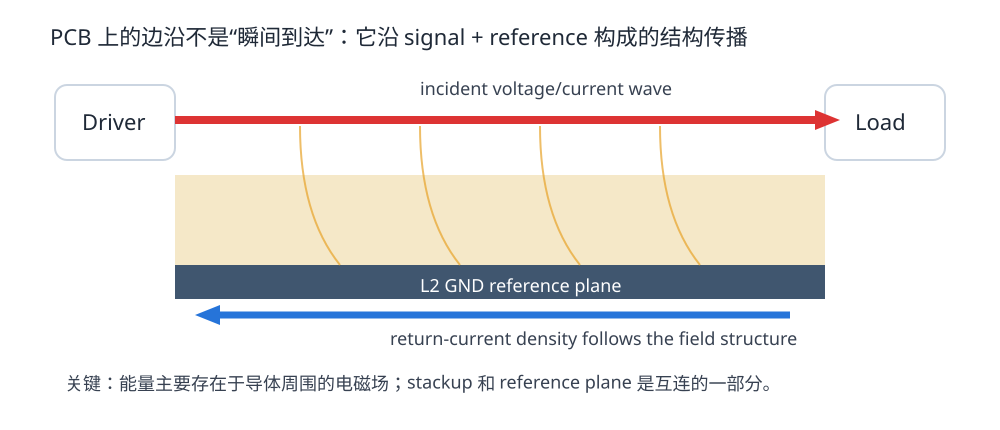

# 01. 波在 PCB 上怎么传播：你画的不是“线”，而是一条能量通道

> **这一章为什么现在要学？**  
> 因为你已经会把网络从 A 点连到 B 点，但 SI 的第一道门槛是接受一个事实：**A 点翻转，并不代表 B 点同时知道。** 信号需要时间沿互连传播。

<p align="center"></p>

---

## 1.1 从一个最容易犯错的问题开始

假设 STM32 某 GPIO 在 `t=0` 从 0 V 切到 3.3 V，走线长 100 mm。

错误直觉：

> 100 mm 铜线电阻很小，所以远端马上也是 3.3 V。

更好的直觉：

> 驱动器改变了局部电场与磁场；这个变化沿“信号导体 + 参考导体 + 介质”构成的结构向前传播。远端要等传播波到达后才变化。

PCB 上真正运输能量的不是“铜原子从 MCU 一路跑到负载”，而是导体与介质周围建立并传播的电磁场。铜为场提供边界，参考平面为回流和场约束提供另一半结构。

---

## 1.2 传播速度不是光速 c

理想真空中：

\[
v=c
\]

PCB 中，场有一部分或大部分分布在介质中，所以传播速度降低。简化估算：

\[
v\approx\frac{c}{\sqrt{\varepsilon_{eff}}}
\]

其中 `εeff` 是有效介电常数。

### 一个数量级例子

若有效 `εeff ≈ 3.5`：

\[
v \approx 1.6\times10^8 m/s
\]

也就是约：

- 160 mm/ns；
- 6.3 ps/mm。

100 mm 走线单程飞行时间大约 0.63 ns。

> 注意：这是课堂估算。真实传播延迟取决于 stackup、走线结构、材料频散等。设计到严格时序时，以场求解/板厂参数/仿真结果为准。

---

## 1.3 为什么边沿时间比“时钟频率”更重要

一个 10 MHz 时钟周期是 100 ns，但它的输出缓冲器可能用 1 ns 完成上升沿。

这意味着：

- 逻辑重复频率：10 MHz；
- 互连需要传输的最快变化：约 1 ns 量级。

所以 PCB 不会因为你把时钟设成 10 MHz 就自动变“低速”。

### 教材判断法：比较传播时间与边沿时间

定义：

- `td`：互连单程传播延迟；
- `tr`：驱动器在实际负载条件下的边沿时间。

观察比值：

\[
\rho=\frac{t_d}{t_r}
\]

这不是某个国际标准的“高速开关”，而是一个非常实用的思考尺子：

- `ρ << 1`：整条互连在边沿过程中更接近集中参数；
- `ρ` 开始不可忽略：传播、反射、位置相关电压开始值得关注；
- `ρ` 越大：越应该用 transmission-line 模型和仿真/测量验证。

不同公司、教材会使用 `tr/6`、`tr/4`、`tr/2` 等不同经验阈值。**它们是风险筛选规则，不是自然界的相变点。**

---

## 1.4 旧版教材里一个需要修正的数量级错误

旧章节曾写：

> 1 ns × 15 cm/ns = 1.5 cm

这是算术错误。正确结果是：

\[
1ns\times15cm/ns=15cm
\]

这件事非常值得保留为教学案例：**高速设计最怕“概念对、数量级错”。**

工程上，任何阻抗/延迟/热计算都应该做一次数量级检查。

---

## 1.5 为什么一根线需要“另一半”

如果你只在 PCB 上画一根信号线，却不讨论参考平面，就只画出了一半互连。

一个典型 L1 microstrip：

```text
L1   -------- signal -------->
       dielectric
L2   ========================  GND reference
      <------ return ---------
```

传播的场主要存在于 signal 与 reference 之间。几何关系决定：

- 每单位长度电容 C′；
- 每单位长度电感 L′；
- 传播速度；
- 特性阻抗；
- 回流分布；
- 与邻线的耦合。

所以：

> **Stackup 不是制造文档的背景信息，它是电路的一部分。**

---

## 1.6 从“电压波”再向前一步：传播的是 V 和 I 的组合

在一个近似无损的传输线上：

\[
Z_0=\frac{V^+}{I^+}\approx\sqrt{\frac{L'}{C'}}
\]

`V+` 是向前传播的电压波，`I+` 是与它对应的电流波。

这解释了为什么：

- 线还没到负载时，驱动器也已经需要输出电流；
- “末端是什么”会在反射返回以后再影响源端；
- 特性阻抗的单位虽然是 Ω，但它不是一颗烧功率的普通电阻。

下一章会把这件事彻底拆开。

---

## 1.7 STM32F407 V2：先挑出哪些线值得 SI 管理

打开你的网络表，把网络分成四类，而不是只按“频率”分：

### A. 快边沿 + 较长点对点

例如：

- 外接 SPI CLK；
- SDIO CLK；
- 到板边连接器的 GPIO；
- 外部存储器时钟。

先看 source → load 距离和驱动边沿。

### B. 协议明确要求受控阻抗

例如 USB、Ethernet、HDMI 等。即使板上路径很短，也应该遵守协议/器件的通道要求。

### C. 本地敏感时钟

例如 HSE 晶体回路。它不一定是典型 50 Ω 传输线问题，但对寄生、电磁耦合、布局非常敏感。

### D. 真正慢的控制网络

按键、LED、低速 enable 等。如果没有快速驱动/长线/连接器等特殊条件，不要为了“看起来专业”给它们强行做阻抗控制。

---

## 1.8 KiCad 实操：先记录“约束来源”，不要急着填数字

在 `projects/stm32f407-mainline/v2/si-net-inventory.md` 里，为每个关键网络记录：

| Net | Source | Load | Approx length | Edge/source info | Protocol constraint | Reference layer | Action |
|---|---|---|---:|---|---|---|---|
| USB_DP/DM | STM32 | USB conn | TBD | AN4879 | USB | L2 GND | diff pair |
| SDIO_CK | STM32 | SD card | TBD | GPIO slew/config | device guide | L2 GND | review |
| SPI_SCK | STM32 | connector | TBD | GPIO output | none | L2 GND | possible series R |

这一步的价值是：

> **把“高速规则”从网络名，转成 source / load / geometry / spec 四个维度。**

---

## 1.9 Fault Lab：同频率，不同风险

做两个 10 MHz 时钟：

- Clock A：`tr = 10 ns`，长度 20 mm；
- Clock B：`tr = 1 ns`，长度 120 mm。

它们频率完全相同，但 Clock B 的互连传播时间已经足以与边沿时间竞争。

在 `interactive/edge-rate-lab.html` 中输入对应参数，观察 `td/tr`。

### 你应该得到的结论

“10 MHz”本身不足以决定 PCB 走线方法。

---

## 1.10 本章 Design Review

- [ ] 对关键网络记录了 source 和 load
- [ ] 没有仅凭 clock/data rate 判断是否高速
- [ ] 能估算走线 flight time 的数量级
- [ ] 知道 reference plane 是互连的一部分
- [ ] 对协议接口优先查官方 electrical/layout guide
- [ ] 没把经验阈值写成绝对物理定律

---

## 1.11 本章任务

1. 在 V1 网络中选 10 根你认为最快的网络；
2. 为它们建立 `SI Net Inventory`；
3. 至少找出一根“频率不高但因为边沿/长度值得关注”的线；
4. 至少找出一根“频率看着高但板内极短、风险较低”的线；
5. 用一句话解释为什么两者不同。

---

## 参考资料

- Analog Devices, *Interfacing High-Speed Signals*: https://www.analog.com/en/resources/technical-articles/interfacing-highspeed-signals.html
- Analog Devices, *Introduction to Common Printed Circuit Transmission Lines*: https://www.analog.com/en/resources/technical-articles/introduction-to-common-printed-circuit-transmission-lines.html
- KiCad 9 PCB Editor documentation: https://docs.kicad.org/9.0/en/pcbnew/pcbnew.html
