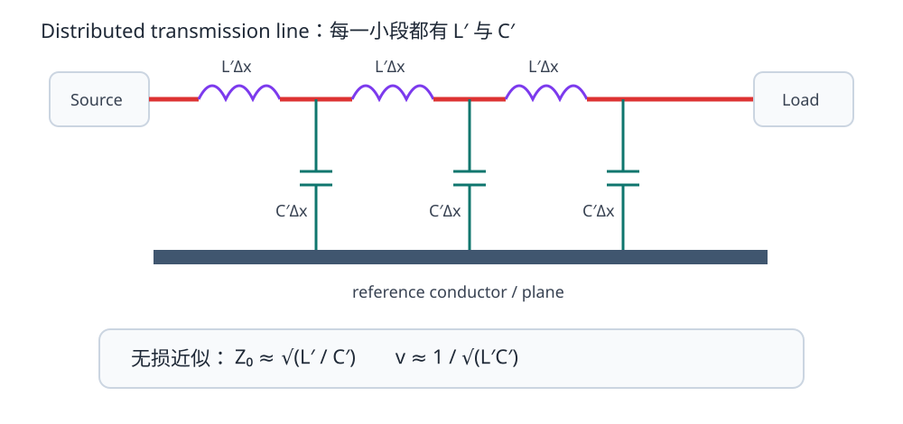
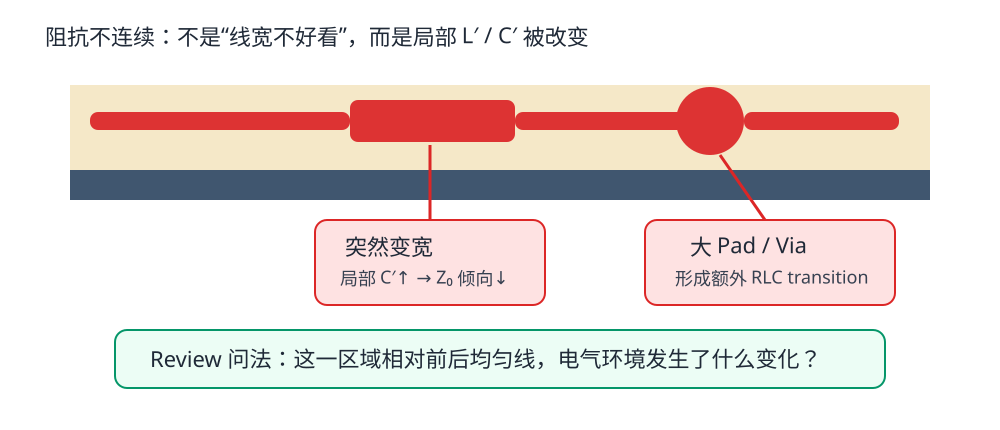
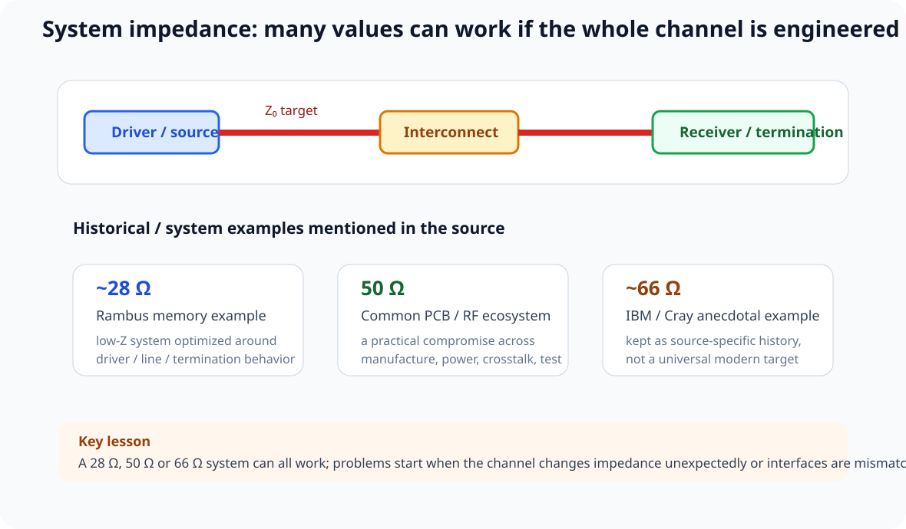
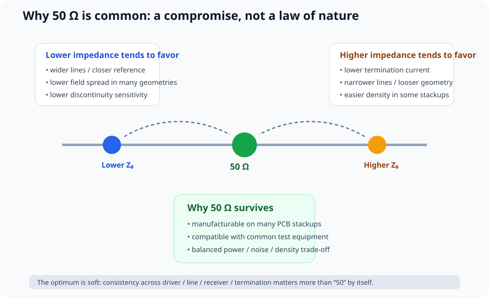

# 02. 传输线与特性阻抗：50 Ω 到底是什么

> **这一章为什么现在要学？**  
> 因为一旦互连的传播时间不可忽略，走线就不能只用“电阻很小”描述。你需要一个新的模型：**每单位长度的电感和电容共同构成传输线。**

<p align="center"></p>

---

## 2.1 从集中参数模型升级

低速、短互连时，你常把一根 PCB 走线近似成：

```text
A ---------------- B
```

再加一点总电阻、总电容就够了。

但更真实的高速模型是：

```text
     L'Δx       L'Δx       L'Δx
---oooo----+---oooo----+---oooo----
           |           |           |
          C'Δx        C'Δx        C'Δx
           |           |           |
======================================= reference
```

每一小段都同时具有：

- 串联电感；
- 对参考导体的电容；
- 更完整模型里还有导体损耗 R′ 和介质损耗 G′。

这就是 distributed model（分布参数模型）。

---

## 2.2 特性阻抗不是“走线电阻”

近似无损情况下：

\[
Z_0\approx\sqrt{\frac{L'}{C'}}
\]

这里：

- `L′`：每单位长度电感；
- `C′`：每单位长度电容。

### 三个必须先纠正的误解

**误解 1：50 Ω 走线就是万用表量到 50 Ω。**  
错。直流测量一条短铜线可能只有毫欧到几十毫欧。

**误解 2：线越长 Z0 越大。**  
错。均匀传输线的 Z0 是单位结构属性；长度影响总延迟和损耗，不直接把 50 Ω 变成 100 Ω。

**误解 3：50 Ω 是为了把 3.3 V / 50 Ω = 66 mA 一直烧掉。**  
错。行波建立时确实有 `V/I = Z0` 的关系，但理想无损线把能量储存在分布电场/磁场并传向负载，不等同于一个 50 Ω 发热电阻。

---

## 2.3 为什么几何决定阻抗

以 L1 microstrip 为例：

```text
        <--- w --->
L1      =========         copper trace
             ↑
             h             dielectric
             ↓
L2  ====================  reference plane
```

阻抗主要受这些参数影响：

- 线宽 `w`；
- 铜厚 `t`；
- 到参考面的介质厚度 `h`；
- 介质的有效 `Dk/εr`；
- 阻焊；
- 相邻铜结构；
- 对差分线，还包括 pair gap 与周围环境。

趋势直觉：

- 线变宽 → 对参考面的电容通常增大 → Z0 倾向下降；
- 参考面更近 → 场约束更紧、单位长度电容增大 → Z0 倾向下降；
- Dk 增大 → 电容效应增强 → Z0 倾向下降。

> 这些趋势可以用来理解和排错；**正式下单尺寸应使用板厂 stackup + field solver/阻抗工具反算**，而不是只靠手算近似式。

---

## 2.4 为什么 4 层 Stackup 一变，阻抗规则就必须重算

Part 1 用真实板厂 stackup 做过案例。现在看它的 SI 含义：

如果外层到 L2 的 dielectric height 从 0.10 mm 改成 0.20 mm，而线宽不变，走线对参考面的几何关系已经完全不同。

所以以下做法是错的：

> “上一块板 0.20 mm 线宽是 50 Ω，这块板继续用 0.20 mm。”

正确流程：

1. 选板厂与目标板厚；
2. 选具体 stackup；
3. 确定目标阻抗；
4. 用板厂阻抗工具/场求解反算几何；
5. 把结果写进 KiCad；
6. 下单时让板厂按 impedance-controlled 工艺复核。

---

## 2.5 “阻抗不连续”长什么样

传输线最怕的不是某个固定线宽，而是**沿途电气环境突然变化**。

典型 discontinuity：

- 线宽突然变窄/变宽；
- reference plane 出现 slot/void；
- 过孔和 anti-pad；
- connector / package transition；
- test pad / stub；
- 走线突然贴近大铜皮；
- 差分 pair gap 突然变化；
- 从 microstrip 切到另一层后参考环境改变。

<p align="center"></p>

任何 discontinuity 都可以问：

> 这里的局部 L′/C′ 发生了什么变化？

如果变化够大、边沿够快，就会出现反射。

---

### 2.5.1 阻抗是“沿路径逐点发生”的，不是只在起点贴一个 50 Ω 标签

从 driver 到 receiver，任意局部几何发生变化，都可能改变当前位置的等效 L′ / C′，因此形成局部 impedance discontinuity。

做 Review 时不要只问：

> “这根网是不是 50 Ω？”

要沿完整 channel 逐段问：

| 位置 | 常见变化 | 为什么要看 |
|---|---|---|
| driver/package | pin / package parasitic | 线路一开始就可能不是理想均匀结构 |
| trace | width / spacing / bend / neck-down | 局部 L′/C′ 改变 |
| branch / tee | topology 改变 | 波会看到新的分流条件 |
| via | barrel / pad / antipad / stub | 同时引入 L/C 与层间参考变化 |
| device pad | 大 pad / escape geometry | 常出现局部 capacitive discontinuity |
| material / stackup | dielectric / thickness / local environment | propagation / impedance 条件改变 |
| connector/cable | cross-section 改变 | reference 与场分布重新建立 |
| return path | slot / plane change / reference transition | signal-reference 结构一起改变 |
| termination/load | ZL 与输入寄生 | 决定反射与最终 settling |

因此所谓“constant impedance”真正要求的是：

> **在关心的频率 / 边沿范围内，让整个 signal + reference channel 的电气环境尽量连续，并对不可避免的 discontinuity 做预算。**


## 2.6 50 Ω 为什么常见，但绝不是“默认答案”

50 Ω 在 RF、测试系统和大量单端高速互连里非常常见，但 PCB 目标阻抗由**接口规范和器件要求**决定。

举例：

| 场景 | 你应该做什么 |
|---|---|
| RF feed | 通常看器件要求，常见 50 Ω single-ended |
| USB D+/D− | 查 USB / 芯片官方 layout guide 的 differential target |
| Ethernet MDI | 查 PHY datasheet/layout guide |
| DDR | 查 memory controller / DRAM design guide，可能涉及多种 impedance/ODT |
| 普通短 GPIO | 可能根本不需要 fabrication controlled impedance |

> **先有接口约束，再有阻抗数字。** 不是先决定“我要 50 Ω”，再把所有线往里塞。

---

## 2.6.1 先回答最核心的问题：一定要 50 Ω 吗？

**不一定。**

真正重要的不是“50”这个数字本身，而是：

> **driver、interconnect、receiver / termination 在边沿看到的阻抗环境是否被系统性设计，并且沿通道足够一致。**

<p align="center"></p>

Robert Feranec 与 Eric Bogatin 的访谈给了两个历史例子：

- Rambus memory system 使用过约 **28 Ω** 的目标环境；
- Eric 口述提到更早的 IBM / Cray 高速系统曾使用约 **66 Ω** 的环境。

前者可以从 Rambus 相关公开资料中找到 28 Ω 的实现证据；后者在本课程只保留为**视频中的历史口述例子**，不把它升级成现代接口规范。

它们共同说明：

> **28 Ω、50 Ω、66 Ω 都可能做成可靠系统；真正危险的是通道在不该变化的地方突然从一个阻抗跳到另一个阻抗。**

---

## 2.6.2 那为什么行业里偏偏到处都是 50 Ω？

<p align="center"></p>

如果一个系统完全从零开始设计，target impedance 本质上是一个多目标优化问题。

至少会牵涉：

1. driver technology / output capability；
2. termination current 与 power；
3. PCB line width / dielectric height；
4. routing density；
5. fabrication tolerance；
6. crosstalk；
7. connector / cable / fixture compatibility；
8. lab test ecosystem。

50 Ω 的价值不是“物理上最完美”，而是：

> **它经常落在这些目标之间一个很宽的软折中区，而且产业链已经围绕它形成成熟生态。**

Eric Bogatin 的教材也把这个 optimum 描述成 **soft optimum**：精确值本身通常没有“50.0 Ω 才行”的神秘性，关键是系统一致性与接口 requirement。

---

## 2.6.3 阻抗越低，功耗一定越高吗？先限定 termination 类型

视频说“低阻抗通常意味着更大电流、更高 power”，这个方向对**阻性并联终端 / 电阻性负载**尤其直观：

\[
I\approx\frac{V}{Z}
\]

\[
P\approx\frac{V^2}{Z}
\]

例如同样 1 V：

- 25 Ω 阻性终端 → 40 mA；
- 50 Ω → 20 mA；
- 100 Ω → 10 mA。

所以对需要持续 resistive termination 的系统：

> **更高 Z 往往有利于降低 termination power。**

但不能把这句话直接套到所有 source-series terminated CMOS 网络。

source-series termination 的功耗、波形和平均电流与：

- switching activity；
- driver Rout；
- load capacitance；
- voltage；
- topology；

共同相关。

因此课程把“高 Z 省电”写成：

> **阻性终端场景中的重要 trade-off，而不是所有数字互连的统一功耗定律。**

---

## 2.6.4 “高阻抗更容易串扰”也不能脱离几何说

视频给出的工程方向是：

> 高阻抗环境常常更容易受到 crosstalk 约束。

这个结论在很多实际 stackup trade-off 中成立，但**不是因为 Z0 这个数字本身会神奇地产生串扰**。

要看你是怎样把 Z0 做高的。

例如 microstrip / stripline 中，为得到更高 Z0，常见手段包括：

- 线变窄；
- reference plane 变远；
- 改变 dielectric。

其中最危险的往往是：

> **为了提高 Z0 把 H 做大。**

因为 H 变大以后：

- signal-reference coupling 减弱；
- return distribution 变宽；
- fringe field 更容易延伸到邻线；
- 同 routing pitch 下 crosstalk 往往上升。

反过来，低 Z0 常需要：

- 更宽 trace；
- 更近 reference；

这可能有利于 field confinement，却会占更多 routing width。

所以正确表述是：

> **Z0、crosstalk 和 density 的 trade-off 必须通过 W/H/S 的实际几何来分析，不能只看一个“Ω”数字。**

---

## 2.6.5 低阻抗为什么也可能让制造和布线变难

低 Z0 往往需要：

- trace 更宽；
- plane 更近；
- 或更高 Dk。

其中“更宽”会直接消耗 routing pitch。

对于：

- BGA escape；
- 高密度 memory bus；
- 多层并行总线；

过低 Z0 可能让走线根本塞不进 pin field。

这正是为什么选择 impedance 不能只说：

> “低一点串扰小，那就全部做 25 Ω。”

系统还必须能：

- route；
- fab；
- terminate；
- probe；
- connect。

---

## 2.6.6 50 Ω 还有一个很现实的优势：测试生态

实验室里大量 RF / SI 设备天然围绕 50 Ω：

- VNA；
- signal generator；
- coax；
- attenuator；
- terminator；
- connector / cable；
- calibration standards。

这意味着 50 Ω PCB structure 往往更容易直接接入成熟 measurement chain。

当然，非 50 Ω line 一样可以测。

例如 28 Ω Rambus 类 structure 会使用专门 matching fixture / probe；只是测试复杂度和 fixture requirement 会提高。

因此：

> **测试便利不是“必须 50 Ω”的物理理由，却是非常现实的系统工程理由。**

---

## 2.6.7 100 Ω differential 为什么经常和“两根 50 Ω”一起出现？

弱耦合极限下，如果两根线各自的 odd-mode impedance 接近 50 Ω：

\[
Z_{diff}=2Z_{odd}\approx100\,\Omega
\]

这解释了为什么 50 Ω 单端生态和 100 Ω differential 经常一起出现。

但必须强调：

> **真实 differential pair 不是简单把两根独立 50 Ω 线并排放。**

pair coupling 会改变 odd-mode impedance。

所以设计流程仍然是：

~~~text
target Zdiff
→ actual stackup
→ W / gap / H
→ field solver
~~~

而不是：

~~~text
50 Ω + 50 Ω = 自动 100 Ω
~~~

---

## 2.6.8 一个更成熟的 Impedance Target 决策树

~~~text
协议 / 器件已经规定 target impedance？
        │
    yes │→ 服从 requirement
        │
        no
        ↓
系统是否真需要 controlled impedance？
        │
        no → 不要为了“专业感”强行做 50 Ω
        │
       yes
        ↓
评估：
driver capability
termination power
routing density
W/H manufacturability
crosstalk
connector/cable
measurement ecosystem
        ↓
选择 target
        ↓
整个 source → line → load / termination 保持一致
~~~

默认工程起点可以是 50 Ω，但必须知道：

> **它是默认起点，不是默认真理。**

---

## 2.6.9 Impedance Trade-off Lab

打开：

`interactive/impedance-tradeoff-lab.html`

可以调整：

- target Z0；
- voltage；
- routing density pressure；
- reference height H；
- minimum practical trace width。

页面用归一化趋势比较：

- resistive termination current / power；
- geometry / manufacturing pressure；
- crosstalk tendency。

它不会给真实 trace width，因为那必须由实际 stackup field solver 决定。

### 本节一句话

> **阻抗值是系统架构参数；50 Ω 之所以常见，是因为它“够好、好做、好测、生态成熟”，不是因为其他阻抗不能工作。**


## 2.7 差分阻抗：不要把它简化成“两根 45 Ω”

两根靠近的传输线会发生电磁耦合，因此差分模式下的阻抗取决于：

- 每根线本身与参考面的关系；
- 两线之间的耦合；
- gap；
- 线宽；
- 铜厚；
- 参考面距离；
- 是否有阻焊、邻近铜。

常用关系：

\[
Z_{diff}=2Z_{odd}
\]

但 `Zodd` 不是“单独一根线在完全相同环境中的单端 Z0”。

因此，下面的思路才正确：

> 目标 `Zdiff` → 给定 stackup → field solver 同时求出 width + gap。

而不是：

> 先做两根 45 Ω，然后假设自动得到 90 Ω。

---

## 2.8 一个重要修正：不是“耦合越紧越好”

旧版教材把差分 pair gap 写成接近线宽并强调“越紧抗扰越好”，这过度简化。

真实设计中要权衡：

- 目标 differential impedance；
- fabrication capability；
- pair 内耦合；
- pair 到 reference plane 的耦合；
- routing density；
- connector/pad breakout；
- common-mode conversion；
- 协议/芯片厂商 layout guide。

例如很多高速 serial link 会给出明确 pair geometry、pair-to-pair spacing、via transition 要求。**优先服从接口与器件 guide，而不是统一追求“紧耦合”。**

---

## 2.9 KiCad 实操：阻抗数字如何落到规则里

KiCad 本身不会因为你写了 `50ohm` 就自动做完整 2D 场求解。

正确协作方式：

1. 从板厂/场求解器得到 `track width`、`diff pair width/gap`；
2. 在 `Board Setup → Design Rules → Net Classes` 写入：
   - track width；
   - diff pair width；
   - diff pair gap；
   - clearance；
3. 必要时用 Custom Rules 限制特定网络/区域；
4. DRC 检查几何是否遵守规则；
5. fabrication 阶段仍由板厂按 stackup 做阻抗控制。

KiCad 10 的 differential-pair router 会依据 design rules 使用 pair gap；它能帮助维持几何，但**不能替代你对 stackup 和目标 impedance 的选择**。

---

## 2.10 Fault Lab：三段线

做一条总长 100 mm 的点对点线：

- 前 40 mm：按目标 50 Ω 几何；
- 中间 20 mm：线宽突然增加 2 倍；
- 后 40 mm：恢复原几何。

预测：

1. 中间宽线局部 Z0 往哪个方向变化？
2. 第一个 transition 的 Γ 正还是负？
3. 第二个 transition 呢？
4. 如果边沿变慢，波形问题会如何变化？

不要先看仿真。先把答案写下来。

---

## 2.11 Design Review

- [ ] 目标阻抗来自 interface/device requirement 或明确系统 trade-off，而不是习惯
- [ ] 如果自定义 Z0，已同时评估 termination power、routing density、W/H 制造性、crosstalk 与 measurement ecosystem
- [ ] Stackup 已锁定后才确定阻抗几何
- [ ] KiCad width/gap 与板厂计算结果一致
- [ ] 关键路径没有无意义的 neck-down/stub/test pad
- [ ] reference plane 连续
- [ ] 过孔 transition 被视为电气结构，而不是一个“洞”
- [ ] 差分几何由 differential target 反算，不用两倍单端的偷懒法

---

## 2.12 本章任务

1. 从 V2 中找出至少 3 种不同“阻抗环境变化”；
2. 标出每一处 discontinuity；
3. 对 USB pair 写下 target 来源；
4. 用实际四层 stackup 在板厂计算器中反算一组 pair width/gap；
5. 把几何值记录到 `v2/si-routing-constraints.md`，同时记录查询日期和 stackup 名称。

---

## 参考资料

- Analog Devices, *Interfacing High-Speed Signals*: https://www.analog.com/en/resources/technical-articles/interfacing-highspeed-signals.html
- Analog Devices, *Introduction to Common Printed Circuit Transmission Lines*: https://www.analog.com/en/resources/technical-articles/introduction-to-common-printed-circuit-transmission-lines.html
- Texas Instruments, *Solutions to High-Speed Design Issues*: https://www.ti.com/lit/pdf/spraav0
- KiCad 10 PCB Editor: https://docs.kicad.org/9.0/en/pcbnew/pcbnew.html

- Robert Feranec / Eric Bogatin, 50 Ω PCB impedance Q&A: https://www.youtube.com/watch?v=4OBO760u7jg&list=PLXvLToQzgzdd_kFWyVnI07-LWk6Q6mfPD
