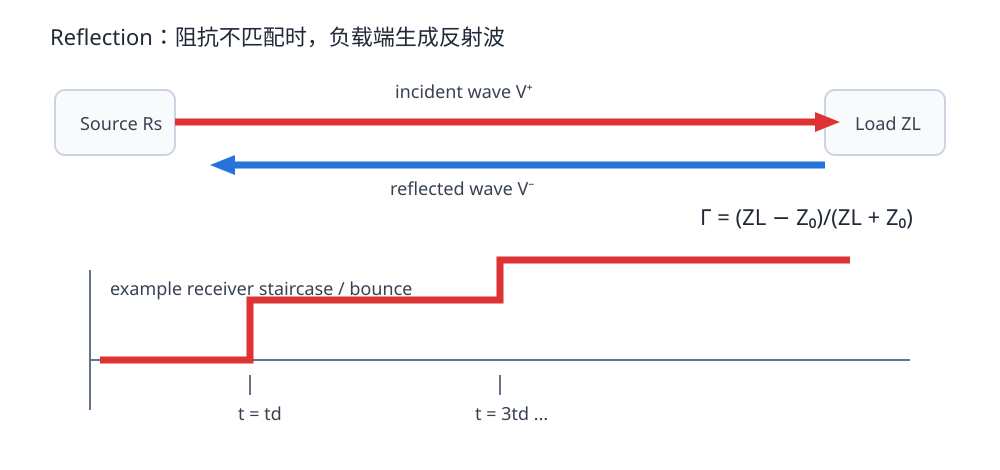
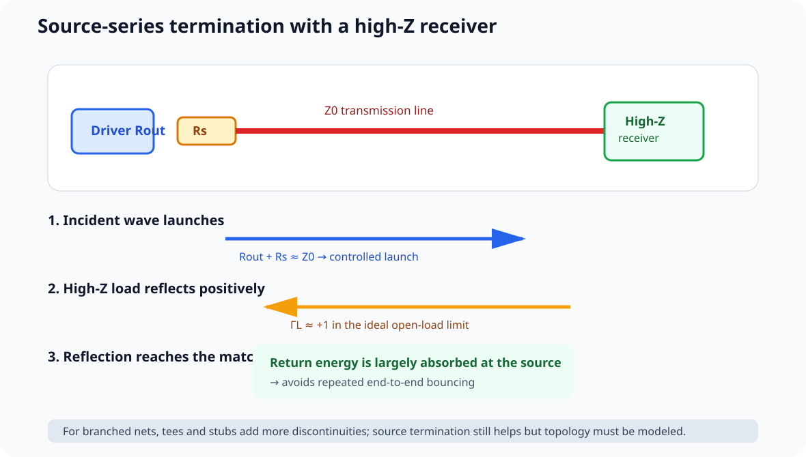

# 03. 反射与终端匹配：信号为什么会“弹回来”

> **这一章为什么现在要学？**  
> 因为高速线上最常见的波形问题——过冲、下冲、台阶、振铃、重复跨阈值——很多都来自阻抗不连续造成的反射。

<p align="center"></p>

---

## 3.1 最小模型：Source → Line → Load

```text
source Rs ---- Z0 transmission line ---- ZL load
```

三个阻抗决定了最基础的反射行为：

- `Rs`：驱动器等效源阻抗；
- `Z0`：传输线特性阻抗；
- `ZL`：负载端在边沿时间尺度上呈现的阻抗。

注意：数字输入并不是“无限大电阻”这么简单。高速边沿看到的还包括输入电容、封装寄生、ESD 结构等。

---

## 3.2 反射系数 Γ

负载端反射系数：

\[
\Gamma_L=\frac{Z_L-Z_0}{Z_L+Z_0}
\]

几个极端情况：

| ZL | ΓL | 直觉 |
|---|---:|---|
| `Z0` | 0 | 匹配，无理想反射 |
| 开路 `∞` | +1 | 同相全反射 |
| 短路 `0` | −1 | 反相全反射 |
| `2Z0` | +1/3 | 部分正反射 |
| `Z0/2` | −1/3 | 部分负反射 |

这不是需要死背的表。只要记住：

> **波到达一个不同于当前 Z0 的环境，就必须重新满足新的 V/I 关系，多出来或缺少的那部分通过反射波完成。**

---

## 3.3 开路为什么会“翻倍”

假设一条 50 Ω 线，源端发出幅度 `Vi` 的 incident wave，末端开路。

开路处不能有净电流：

\[
I_{total}=I^++I^-=0
\]

所以反射电流必须抵消入射电流，而反射电压与入射电压同相：

\[
V^-=V^+
\]

于是末端瞬间：

\[
V_{load}=V^++V^-=2V^+
\]

这就是 TDR 里 open 看起来“向上跳”的根本原因。

---

## 3.4 为什么源端也会参与反射

反射波回来以后会遇到 source impedance。源端也有：

\[
\Gamma_S=\frac{R_S-Z_0}{R_S+Z_0}
\]

如果 `Rs ≈ Z0`：

- 返回波被源端近似吸收；
- 不再来回 bounce。

如果 `Rs` 与 `Z0` 相差很大：

- 反射再次被反射；
- source ↔ load 之间来回往返；
- 观察到 ringing / staircase。

---

## 3.5 Source Termination：为什么串联电阻常常有效

对于典型 CMOS 点对点输出，常用思路是：

\[
R_{driver}+R_{series}\approx Z_0
\]

串联电阻放在**源端附近**。

### 发生了什么

1. 刚发射时，源端总阻抗接近 Z0；
2. 线上先发出一个较小 incident step；
3. 到达高阻输入端发生正反射；
4. 末端得到目标电压；
5. 反射返回源端后被近似匹配源阻抗吸收。

### 为什么不能写成“永远 22–33 Ω”

因为 `Rdriver` 会随：

- MCU 型号；
- IO voltage；
- drive strength / slew setting；
- 工艺角；
- 温度；
- 输出电流

变化。

所以 `22 Ω / 33 Ω` 是常见起始值，不是宇宙常数。正确做法：

- 查 IBIS / datasheet / vendor guide；
- 预留 resistor footprint；
- 仿真或示波器验证；
- 根据波形和 EMI 需求选值。

---

## 3.5.1 为什么 high-Z receiver 不妨碍 source termination

<p align="center"></p>

很多 MCU/logic receiver 在边沿时间尺度上并不是 50 Ω 负载，而更接近 high-Z + input capacitance。

source-series termination 仍然可以工作：

1. driver + series R 让 source side 接近 Z0；
2. incident wave 到 high-Z load 后产生主要正反射；
3. load 电压完成到目标逻辑电平的跃迁；
4. reflection 回到 source；
5. source side 若近似 matched，返回波被吸收，不再反复 bounce。

所以“至少匹配一端”不能泛化成所有 topology 的规则；更准确的是：

> **对典型 high-Z point-to-point CMOS line，source match 能让主要 load reflection 在返回 source 后终止。**

若网络带 tee / stubs / multiple loads，必须把 branch topology 一起建模。

完整 A/B 案例见：[11｜仿真案例：支路、源端串联终端与 Stackup](11_仿真案例_支路终端与Stackup.md)。


## 3.6 Termination 不是越多越专业

### Source series

适合：

- 点对点；
- 单源；
- 远端高阻输入；
- CMOS 时钟/数据常见。

### Parallel termination

末端接近 `Z0` 的电阻性负载，可有效吸收波，但有 DC 功耗和驱动能力要求。

### Thevenin / AC / ODT

用于不同总线和接口场景。这里先建立概念，DDR 会在进阶专题里专门展开。

> **终端方案由 topology、driver、receiver、协议共同决定。不要因为“看到振铃”就随手在末端加 50 Ω。**

---

## 3.7 一个非常实用的判断：反射来得及伤害逻辑吗

反射是否严重，不只看 Γ，还看时间：

- 单程延迟 `td`；
- round-trip `2td`；
- receiver threshold；
- edge time；
- setup/hold window。

如果反射在逻辑判决窗口内造成多次跨阈值，就可能导致：

- double clock；
- false trigger；
- timing uncertainty。

如果振铃发生在远离 threshold 的区域，功能可能仍正常，但 overshoot/EMI/可靠性仍需评估。

---

## 3.8 Fault Lab：开路、短路、匹配负载

打开：

`interactive/reflection-lab.html`

分别设置：

- `Z0 = 50 Ω, ZL = 50 Ω`
- `ZL = 100 Ω`
- `ZL = 25 Ω`
- `ZL = open`
- `ZL = short`

观察：

- Γ 的符号；
- 负载第一次到达时的电压变化；
- 反射方向；
- 源端是否再次 bounce。

### 先回答再拖滑块

如果 `ZL > Z0`，反射电压应该同相还是反相？为什么？

---

## 3.9 STM32F407 V2：哪些位置值得预留源端串阻

不是所有 GPIO 都装电阻，而是对**可能需要控制 edge/reflection 的网络**做设计余量。

建议在原理图评审时考虑预留：

- SDIO_CK；
- 外接高速 SPI_SCK；
- 向板外连接器输出的快速 clock/data；
- 某些长点对点 GPIO。

布局时 resistor 应靠近 source，避免：

```text
MCU -------- 80mm trace -------- Rseries --- load
```

这种“电阻虽然在网表里，但位置上没有完成 source termination”的假设计。

---

## 3.10 示波器测振铃：探头本身也可能制造振铃

看到 ringing 时先别急着怪 PCB。

普通长地线探头形成额外电感，会让快边沿测量变差。

检查：

- 使用 ground spring / 极短地连接；
- 在 receiver pin 附近测；
- 比较 source 与 load 波形；
- 确认带宽限制设置；
- 确认探头输入电容和连接方式。

测量系统是通道的一部分。

---

## 3.11 Design Review

- [ ] 关键点对点线已判断是否需要 termination
- [ ] 串联终端 footprint 靠近 source
- [ ] 没有把 22/33 Ω 当固定答案
- [ ] 对 open stub / test pad 有意识
- [ ] 波形问题会结合 flight time 和 threshold 分析
- [ ] 示波器探测方法不会明显破坏被测节点

---

## 3.12 本章任务

1. 用 Reflection Lab 记录 5 种负载的 Γ；
2. 为 V2 选 3 根可能需要 source resistor 的网络；
3. 对每根写出 source / length / load / 为什么预留；
4. 在 Fault Lab 中画一个“电阻放错位置”的 before/after；
5. 用一句话解释：**source termination 为什么必须靠近 source。**

---

## 参考资料

- Texas Instruments, *Terminating Transmission Lines*: https://www.ti.com/lit/an/slyt413/slyt413.pdf
- Texas Instruments, *CDCx706/x906 Termination and Signal Integrity Guidelines*: https://www.ti.com/lit/an/scaa080a/scaa080a.pdf
- Analog Devices, *Interfacing High-Speed Signals*: https://www.analog.com/en/resources/technical-articles/interfacing-highspeed-signals.html
