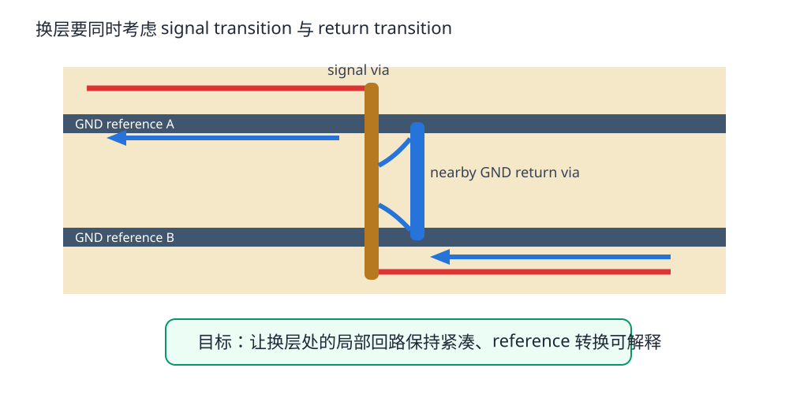
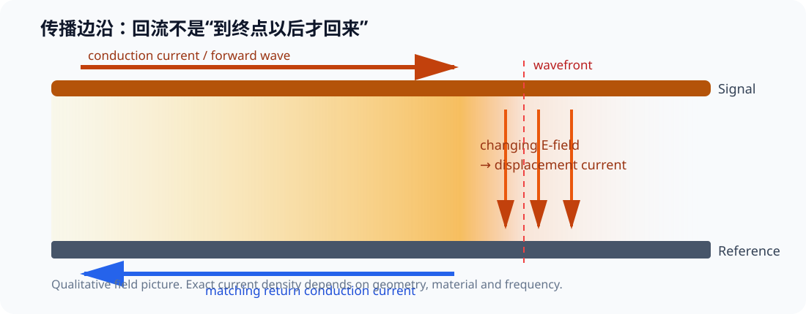
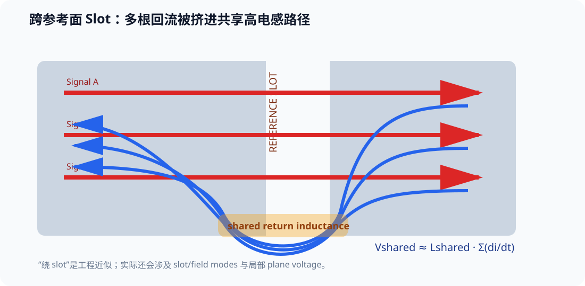

# 04. 回流路径与换层：每一根信号都必须“回家”

> **这一章为什么现在要学？**  
> 因为你在 PCB 编辑器里通常只看见“去程线”，但真实电流永远是闭合回路。很多看似神秘的 EMI、串扰和波形问题，本质上是**回路几何被破坏了**。

<p align="center"></p>

---

## 4.1 先纠正一个常见说法：回流不是“自动走最短路”

更准确的说法是：

> 电流分布由整个网络的阻抗决定。

在低频/直流占主导时，导体电阻对分布的影响较大；随着频率上升，电感、电容和场耦合变得重要，回流会越来越集中在能让**总回路阻抗较低、场能较小**的区域。

对于紧邻完整参考平面的快速单端走线，回流电流密度通常集中在信号投影附近，而不是在整块地平面上平均摊开。

因此，不要再背：

> “低于 10 kHz 走最小电阻，高于 100 kHz 走最小电感。”

自然界没有这样硬切换的两个频率门槛。

---

## 4.2 为什么完整参考面如此重要

一条 L1 trace 紧邻 L2 GND：

```text
signal current --->
L1  ------------------------
      field confined here
L2  ======================== GND
     <--- return current density
```

这种结构的好处：

- loop area 小；
- L′/C′ 比较稳定；
- Z0 更可预测；
- 对邻近网络耦合较小；
- 辐射更容易控制。

参考面不是“给信号提供一个逻辑 0 V 的名字”，而是互连电磁结构的一部分。

---

### 4.2.1 回流为什么会集中在信号附近？先看场，再看“路线”

<p align="center"></p>

对快速变化的信号，回流不是先跑到负载以后才“返回”。随着边沿传播，signal 与 reference 之间变化的电场对应位移电流；reference conductor 上的 conduction current 也随传播过程建立。

因此更好的问题不是：

> “电流到底选了哪一条唯一的路？”

而是：

> **在当前几何和频谱下，电流密度如何分布？**

完整、靠近的 reference plane 会让 signal-reference 的场更集中，回流密度也更集中在走线投影附近。

当 plane 离 signal 更远时：

- 特性阻抗通常会上升（其他几何不变时）；
- return-current distribution 会横向铺得更宽；
- fringe field 范围增大；
- 与邻近 conductor 发生耦合的机会增加。

所以“把 reference plane 拉近”同时是 impedance、return path 和 crosstalk 的共同设计旋钮。

---

## 4.3 跨 slot：为什么是经典错误

如果 L2 参考面中间有 slot：

```text
L1  ---------- signal ---------->
L2  ========      GAP      ========
```

回流无法继续贴着 trace 的投影穿过空气缝隙，只能绕过 slot 的端部或通过其他寄生/结构完成闭合。

结果可能包括：

- loop area 增大；
- 局部阻抗改变；
- 共模能量增加；
- 与邻线耦合增强；
- EMI 增大。

### 最好的解决方式

不是“在 slot 边上多打几个孔”，而是：

> **首先避免让重要快速信号跨参考面 discontinuity。**

---

### 4.3.1 “绕过 slot”是好用的工程近似，但不是全部物理图像

<p align="center"></p>

把回流画成绕 slot 端点走一圈，是非常好用的工程直觉，因为它能立即告诉你：

- path 变长；
- current crowding 更严重；
- return-path inductance 增大；
- signal-reference 结构出现 impedance discontinuity。

更严格地说，平面开槽还能支持或激发与 slot 相关的场模式。此时 gap 两侧会出现瞬态电压差，不能把它理解成“铜上有一根肉眼可见的蓝色电流线绕过去”这么简单。

工程上可以把这类局部问题先近似成额外的 return inductance：

\[
V_{noise}\approx L_{return}\frac{di}{dt}
\]

这个近似足够帮助你判断修改方向：**不要让快速信号跨 reference discontinuity。**

### 4.3.2 多根信号被迫共享同一段坏回流：ground bounce 的一种常见来源

如果一条 slot、连接器 pin、窄地颈或其他结构，把多根网络的回流都挤到同一段高电感路径：

~~~text
Aggressor A return ─┐
Aggressor B return ─┼── shared Lreturn ── reference
Aggressor C return ─┘
Victim return     ──┘
~~~

那么 shared path 上的噪声近似由所有同时变化的电流共同贡献：

\[
V_{shared}\approx L_{shared}\sum_k\frac{di_k}{dt}
\]

Victim 即使自己没有切换，也会把这段共享参考电压变化“带进”自己的信号。

这就是 **shared-return-path crosstalk**。很多工程师把这一类现象称为 ground bounce。

> **术语边界**：ground bounce 还可以由封装引脚、过孔、电源回路等共享电感造成。这里讨论的是其中一个非常典型的 PCB 几何机制，不把术语限制为唯一来源。

修复顺序非常直接：

1. 首先恢复连续、低电感的 return structure；
2. 其次避免让多个敏感或高速网络共享被挤窄的回流路径；
3. 最后才考虑用额外器件或“经验补丁”掩盖症状。

---

## 4.4 换层不是“只加一个 signal via”

假设信号从 L1 切到 L4。

你必须同时问两个问题：

1. signal conductor 从哪里过渡？
2. return current 的 reference structure 如何过渡？

### 情况 A：前后都参考 GND

例如六层板中，前后相邻参考面都属于 GND。

可以通过靠近 signal transition 的 GND stitching via，给回流提供低电感的层间连接。

这里“靠近”没有一个适用于所有板子的固定 1 mm 数字。更好的目标是：

> **让 signal via 与 return transition 形成尽量紧凑的局部回路，并结合信号速度、via geometry、stackup 和厂商/接口 guide。**

对高端 serial link，芯片厂商可能明确给出 return via 距离；那时应优先服从对应 guide。

### 情况 B：参考从 GND 变成 PWR

这就更复杂。

如果 L1 参考 GND，换到另一层后主要参考某 PWR plane，那么高频回流需要通过 GND↔PWR 之间的局部高频连接完成参考转换，通常涉及 nearby decoupling capacitance / plane capacitance。

所以在 `SIG-GND-PWR-SIG` 四层结构上：

> 底层不是“不能走任何高速线”，但你必须明确它的 reference，以及换层/跨电源分区时回流如何闭合。

对于教学 V1/V2，我们仍优先把最敏感快速线放在 L1/L2-GND 环境，减少不必要的问题。

---

## 4.5 去耦电容为什么也可能成为“回流桥”

当一个信号从 GND-referenced layer 切换到 PWR-referenced layer，return path 可能需要通过：

```text
GND plane --- capacitor --- PWR plane
```

完成高频参考转换。

这说明了两件事：

1. decoupling 不只是“给芯片供电”的孤立元件；
2. plane/reference transition 与 PDN 是耦合问题。

Part 3 会从 PI 角度继续深入。

---

## 4.6 Via transition 还有哪些 SI 元素

一个 via 不是理想 0 Ω 连接：

- via barrel 有电感；
- pad/anti-pad 有电容；
- 未使用的 via stub 可能产生谐振；
- reference plane anti-pad 会改变回流几何；
- 多个 via 靠得太近时 plane void 可能连成更大的缺口。

在 STM32F4 这种速度等级，你通常不需要立刻做复杂 via 3D EM 优化，但必须先形成正确意识：

> **via transition 是一个电气结构，而不是布线工具图标。**

---

## 4.7 连接器是“回流边界条件变化”的地方

信号离开 PCB 进入 cable 后，return path 结构也发生变化。

例如 USB：

- 数据是差分传输；
- cable 有自己的 geometry / shield / return environment；
- connector transition 会引入 discontinuity；
- ESD 器件、共模器件、test pad 都可能破坏通道。

因此接口布局的一条核心原则是：

> 从 MCU/PHY 到 connector 的路径应该短、连续、对称，保护器件应按厂商推荐放置，避免额外 stub。

---

## 4.8 Fault Lab：四种回流错误

在 `projects/stm32f407-mainline/fault-lab/part2-si-faults.md` 中做：

### Fault A — 跨 plane slot

预测回流如何绕路。

### Fault B — 换层只有 signal via

前后都参考 GND，但附近没有 local return transition。

### Fault C — GND → PWR reference change

要求画出回流需要通过哪里完成转换。

### Fault D — via anti-pad 把参考面切成窄颈

不是 plane split，但一排过孔 clearance 连起来形成高阻回流区域。

---

## 4.9 Return Path Lab

打开：

`interactive/return-path-lab.html`

模式：

- 单端线 + 连续 reference；
- 调整 reference height，观察回流分布和边缘场的趋势；
- slot under trace；
- 多根网络共享受限回流，观察 simultaneous switching 风险；
- differential pair + nearby/far reference；
- layer transition + nearby/distant return transition。

这个互动页面只用于建立几何直觉，不做定量 EM 求解，也不会输出真实 dB、Ω 或场强。

---

## 4.10 KiCad 人工审查法

DRC 很难替你理解 return path，所以增加一轮 **Reference-Plane Review**：

### Step 1

按关键网络逐条高亮。

### Step 2

确认所在 signal layer 的主要 reference plane。

### Step 3

把 reference layer 单独显示，沿 signal path 投影检查：

- slot；
- void；
- plane edge；
- power split；
- via anti-pad cluster。

### Step 4

每个 signal layer transition 都问：

> 回流怎么换层？

### Step 5

把解释写进 Review，而不是只打勾。

---

## 4.11 Design Review

- [ ] 每条关键高速线都能指出 reference plane
- [ ] 没有快速线跨 plane slot/split
- [ ] 每个 layer transition 都分析 return transition
- [ ] 不机械套用“地孔必须 ≤1 mm”
- [ ] connector 区域的 return structure 被审查
- [ ] via anti-pad 没把参考面切成窄颈
- [ ] Bottom/PWR-reference 走线不是默认等价于 Top/GND-reference
- [ ] 没有多根快速网络被迫共享同一段窄回流路径
- [ ] 能用 L·di/dt 解释 reference discontinuity 为什么产生瞬态电压
- [ ] 能区分“绕路”工程近似与 slot/场模式的更完整物理图像

---

## 4.12 本章任务

1. 对 V2 的 USB、SDIO_CK、SPI_SCK 分别画完整 return path；
2. 找出所有关键 signal via；
3. 给每个 via 标记“reference before / reference after”；
4. 对不能清楚解释 return transition 的位置修改布局；
5. 保存一张 before/after 截图进入 Fault Lab；
6. 打开 interactive/return-path-lab.html，分别比较 near/far reference、slot、3~4 根同时切换网络与 differential pair 模式，并写下每种几何改变了哪一段 return structure。

---

## 参考资料

- Texas Instruments, *Solutions to High-Speed Design Issues*: https://www.ti.com/lit/pdf/spraav0
- Texas Instruments, *PCB Layout Guidelines for High-Performance Isolators*: https://www.ti.com/lit/an/slyt335/slyt335.pdf
- Analog Devices, *Successful PCB Grounding with Mixed-Signal Chips*: https://www.analog.com/en/resources/technical-articles/successful-pcb-grounding-with-mixedsignal-chips--follow-the-path-of-least-impedance.html
- Analog Devices, *Basic Guidelines for Layout Design of Mixed-Signal PCBs*: https://www.analog.com/en/resources/analog-dialogue/articles/what-are-the-basic-guidelines-for-layout-design-of-mixed-signal-pcbs.html
- Robert Feranec / Eric Bogatin, return-current discussion: https://www.youtube.com/watch?v=icRzEZF3eZo
