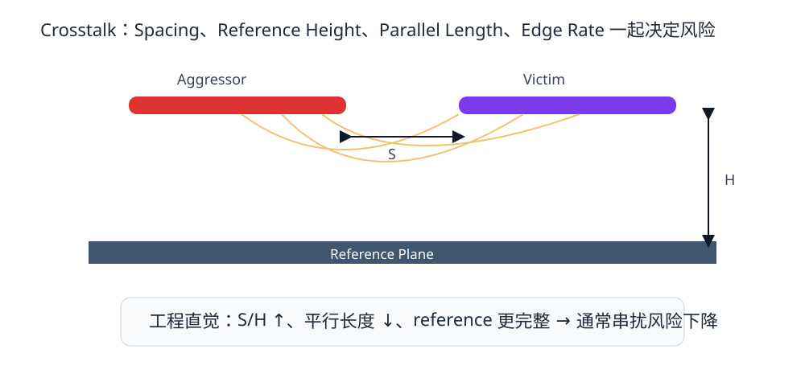
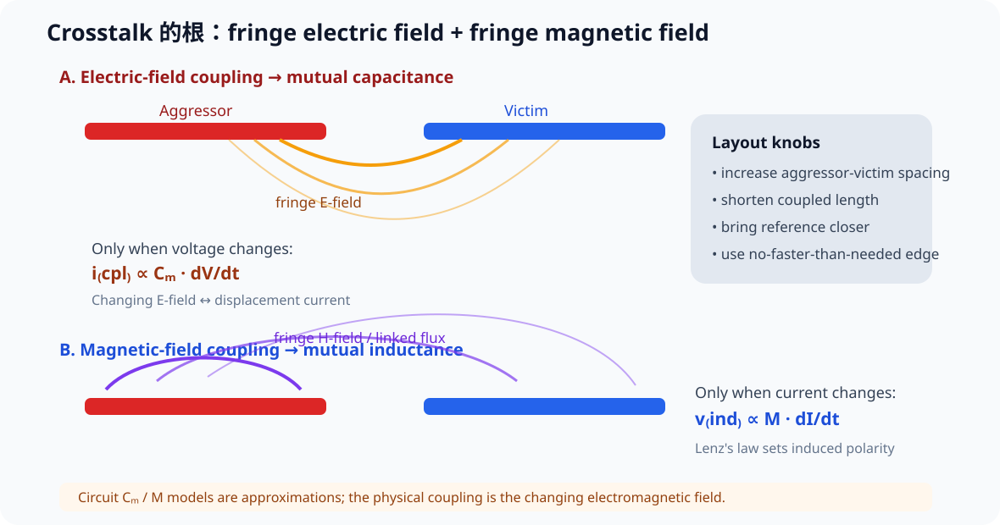
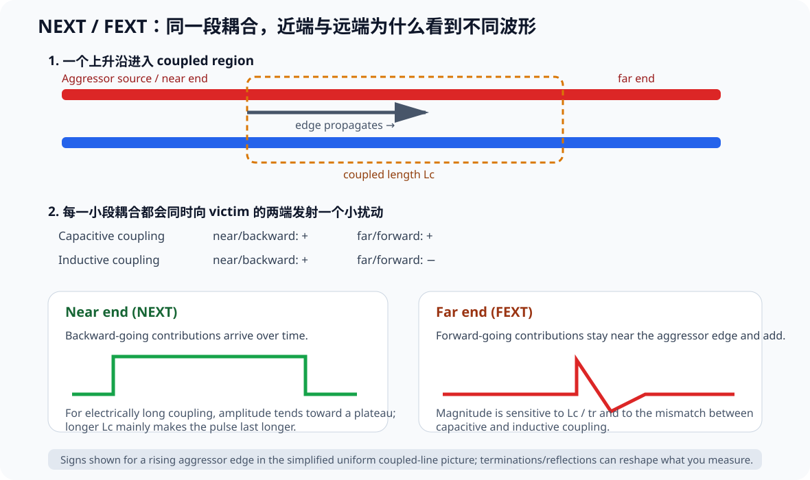
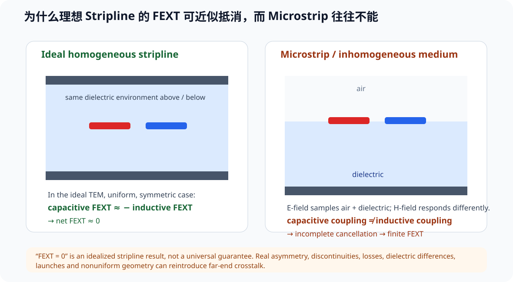

# 05. 串扰与几何隔离：两根没连在一起的线为什么会互相说话

> **这一章为什么现在要学？**  
> 因为 PCB 上相邻导体通过电场和磁场耦合。串扰不是“线挨得近就一定坏”，而是由**几何、平行长度、参考面距离、边沿速度和 victim/aggressor 电气状态**共同决定。

<p align="center"></p>

---

## 5.1 Aggressor 与 Victim

我们先给两根线命名：

- **Aggressor**：正在快速变化、向外耦合能量的线；
- **Victim**：被耦合、出现不希望电压/电流的线。

串扰主要通过：

- capacitive coupling（电容耦合）；
- inductive coupling（电感耦合）。

在真正的传输线分析中，这两者不能完全割裂，它们共同形成 even/odd mode 的耦合系统。

---

### 5.1.1 先把电容 / 电感模型还原成真正的物理：fringe fields

<p align="center"></p>

“电容串扰”和“电感串扰”是好用的电路语言，但它们背后的真实对象是：

- aggressor 与 victim 之间的 **fringe electric field**；
- aggressor signal-return loop 与 victim loop 之间的 **fringe magnetic field**。

电场耦合常用 mutual capacitance Cm 近似。只有 aggressor 电压正在变化时，才有明显耦合电流：

\[
i_{cpl}\propto C_m\frac{dV}{dt}
\]

从场的角度，这就是变化电场对应的 displacement current。

磁场耦合常用 mutual inductance M 近似。只有 aggressor 电流正在变化时，victim 才会出现感应电压：

\[
v_{ind}\propto M\frac{dI}{dt}
\]

因此一个非常重要的串扰直觉是：

> **真正“制造串扰”的主要时间窗口是 edge，而不是逻辑高电平维持的整个周期。**

这也解释了为什么一个“时钟频率不高”的网络，只要 rise/fall time 很快，仍然可能成为强 aggressor。

### 5.1.2 减少串扰，本质上是在减少“穿到邻居身上的场”

从这个图像出发，最有效的几何动作就很自然：

1. **增加 aggressor ↔ victim 距离**：减少跨过去的 fringe E/H field；
2. **把 reference plane 拉近**：让场更集中在 signal-reference 之间；
3. **缩短 coupled / parallel length**：减少边沿持续与邻线耦合的空间；
4. **边沿不需要那么快时就不要过快**：降低 dV/dt / dI/dt。

这比背“3W”更容易迁移到不同 stackup。

---
## 5.2 最重要的四个几何旋钮

### 1. Trace spacing

一般而言，横向距离增大，耦合减弱。

### 2. Height to reference plane

信号线更靠近自己的 reference plane 时，场更容易被约束在 signal-reference 之间，相对于邻线的耦合往往减小。

这就是为什么“线间距”不能只看线宽：

> 两条间距 0.3 mm 的线，如果离参考面只有 0.08 mm，与离参考面 0.4 mm 的情况完全不是一个耦合环境。

### 3. Parallel run length

两根线只在 pad breakout 附近并行 2 mm，和并行 80 mm，不应该使用同一风险判断。

### 4. Edge rate

边沿越快，高频成分越强，瞬态耦合越值得关注。

---

### 5.2.1 两层板为什么常更难控制串扰：问题是 reference geometry，不是“2”这个数字

视频用常见两层 PCB 做了一个很直观的提醒：如果 top routing 只能依赖较远的 bottom GND，板厚又接近常见 1.6 mm，再加上 bottom plane 被走线或 void 切碎，那么 signal-reference 距离大、fringe field 更容易向外扩展。

但教材不把它升级成“只要两层板就一定做不好 SI”。更准确的结论是：

> **两层板通常更难同时做到“密集布线 + 连续 reference + 很小的 H”；四层板通常更容易把 signal layer 紧贴完整 GND。**

特殊薄板 stackup、低密度布局、单面 routing + 完整另一面 GND，可能比典型 1.6 mm 两层板好得多。反过来，一块四层板如果 reference plane 被切碎、快速线跨 slot，也一样会失败。


## 5.3 为什么不把“3W”当统一铁律

你会在不同资料里看到：

- 3W；
- 3H；
- 5W；
- 5H；
- 9H；
- “两到三倍最小工艺间距”。

这些数字并不互相证明谁“绝对正确”，因为它们通常来自不同：

- stackup；
- interface；
- edge rate；
- channel loss budget；
- acceptable crosstalk；
- 厂商经验和仿真条件。

例如 TI 的通用高速设计资料强调：增加间距、缩短 parallel length，并保证良好 return path；Intel 针对特定高速 serial interface 会给出 5H、9H 之类更严格的具体规则。

所以本教材采用：

> **先理解 geometry，再服从具体 interface/device guide。**

---

## 5.4 一个更可迁移的判断方式：S / H

定义：

- `S`：两根线边缘间距；
- `H`：信号线到最近参考面的距离。

当 `S/H` 增大时，通常相邻线耦合相对于 signal-reference 耦合会减弱。

它比简单的 `3×line width` 更能提醒你：

> **reference-plane distance 也是串扰设计变量。**

但 `S/H` 仍然不是精确 crosstalk 计算公式；定量要求应使用 field solver / channel simulation。

---

### 5.4.1 为什么 H 变大时，return current 也会“摊开”

当 reference plane 靠近 signal 时，场主要集中在 signal-reference 之间，plane 上的 return-current density 也较局部。

当 H 增大：

- field fringe 得更远；
- return-current distribution 横向变宽；
- 其他线路更容易进入同一片场环境；
- 即使两根 trace 本身间距不变，crosstalk 也可能增加。

所以 S/H 的意义不只是一个几何比值；它提醒你：

> **两条线之间的耦合，与每条线对自己 reference 的耦合是在竞争。**

这也是为什么高密度设计里，“把 reference 拉近”往往比盲目把所有线都拉开更节省板面积。


## 5.5 Near-End 与 Far-End Crosstalk

对一对耦合传输线，aggressor 的边沿可能在 victim 两端产生不同极性的瞬态：

- NEXT：Near-End Crosstalk；
- FEXT：Far-End Crosstalk。

具体幅值、极性与：

- capacitive/inductive coupling；
- propagation velocity；
- termination；
- microstrip/stripline environment；
- parallel length

有关。

学习阶段先掌握一个工程结论：

> **不要只在接收端看串扰。耦合是整段几何产生的分布效应。**

---

### 5.5.1 一个 edge 经过 coupled region 时，victim 上到底发生什么

<p align="center"></p>

当 aggressor 的 edge 进入一段两线靠近的 coupled region 后，每经过一个很小的耦合单元，就会在 victim 上“发射”一个小扰动。这个扰动会同时向 near/backward 和 far/forward 两个方向传播。

因此 NEXT / FEXT 不是两个彼此无关的噪声源，而是**同一个分布式耦合过程在 victim 两端的不同观察结果**。

### 5.5.2 电容耦合与电感耦合的极性为什么不同

对一个上升沿，在简化均匀 coupled-line 图像下：

| Coupling | Near / backward | Far / forward |
|---|---:|---:|
| capacitive | + | + |
| inductive | + | − |

电容耦合可以理解为 edge 通过 Cm 向 victim 注入位移电流；磁耦合的极性来自 Lenz's law。于是 near direction 的两种贡献倾向同号相加，而 far direction 倾向异号相减。

> **NEXT 中 capacitive / inductive contribution 倾向相加；FEXT 中它们倾向相减。**

### 5.5.3 为什么 NEXT 常像平台，而 FEXT 对 coupled length 更敏感

对 electrically long 的耦合区，backward / near 扰动从不同位置返回 near end 的时间不同，所以表现成一段持续的 NEXT pulse。继续增加 coupled length，更多体现为 pulse duration 变长，幅值不会无限线性上升。

而 forward / far 扰动与 aggressor edge 同方向传播，不同位置产生的贡献更容易在 far end 附近叠加，因此 FEXT 对 **coupled length / rise time** 很敏感。

### 5.5.4 Stripline 与 Microstrip：为什么 FEXT 的结论会不同

<p align="center"></p>

在理想、均匀、对称的 homogeneous stripline 中，forward electric coupling 与 magnetic coupling 可以非常接近等幅反相：

\[
V_{FEXT,C}+V_{FEXT,L}\approx0
\]

所以**理想 stripline 的 net FEXT 可以接近 0**，但 NEXT 仍然存在。

microstrip 的 field environment 明显不均匀：上方通常是空气 / solder mask，下方是 PCB dielectric + reference。电场受 dielectric distribution 影响，而磁场的响应不同，因此 electric / magnetic coupling 不再保持理想抵消关系，microstrip 往往出现有限 FEXT。

#### 不要把“stripline 没 FEXT”写成绝对铁律

真实板还包含 prepreg/core 差异、trace 不居中、loss、roughness、via、pad、connector、geometry transition 和制造偏差。课程只保留这个结论：

> **理想 homogeneous stripline 可以让 forward capacitive / inductive crosstalk 近似抵消；真实通道仍应按实际 geometry 验证。**

### 5.5.5 一个值得保留的定量例子：FEXT 为什么会被 Lc / tr 放大

视频给出一组**特定 50 Ω microstrip 几何**的 field-solver 示例，用近似关系表达趋势：

\[
\frac{V_{FEXT}}{V_{aggressor}}\propto K_{FEXT}\frac{L_c}{t_r}
\]

其中 KFEXT 由具体 cross-section 的 electric / magnetic coupling 差值决定，Lc 是 coupled length，tr 是 rise time。

视频示例中，在“线间距约等于一条线宽”的特定 50 Ω microstrip 条件下，作者展示的 KFEXT 数量级约为 0.005（配合其 inch / ns 归一化）。若 Lc = 10 inch、tr = 0.3 ns：

\[
0.005\times\frac{10}{0.3}\approx0.17
\]

即约 **17% 量级**的教学示例。

> **0.005 不是通用常数。** 换 S/H、width、dielectric、copper thickness 或 reference geometry，就必须重新求 KFEXT。定量设计应使用 2D field solver / coupled-line solver。

### 5.5.6 Reflection 不会创造原始 coupling，但会让测到的串扰波形更复杂

一旦 crosstalk pulse 被注入 victim，对传输线而言它就是普通 travelling wave。它会遇到 open / mismatch 反射，在 victim 两端 bounce，并与后续 NEXT/FEXT 叠加。

aggressor 自己若有 reflection，返回 edge 再次经过 coupled region，也会重新激发串扰。因此真实示波器波形可能是：

~~~text
original coupling
→ victim reflection
→ aggressor reflection
→ recoupling
→ waveform superposition
~~~

机制上要分清：减小 field coupling 改变原始 crosstalk magnitude；改善 termination 主要改变这些 pulse 后续怎样反射 / 叠加。

### 5.5.7 Edge 慢一点为什么通常有帮助

串扰直接受 dV/dt、dI/dt 驱动，而且 FEXT 趋势常与 Lc/tr 相关。所以在功能允许时，使用满足 timing 的最慢 edge / slew setting，通常可以降低 SI / EMI 风险。

这不是无脑把 GPIO 都设成最低 slew；仍要检查 setup/hold、receiver threshold、RC load、clock duty 和 protocol rise/fall limits。


### 5.5.8 规则经验为什么必须先声明 noise budget

“2W、3W、3H、5H 到底哪个正确？”这个问题少了两个前提：

1. 你的系统允许多少 crosstalk？
2. 当前 stackup 下，这个 spacing 实际产生多少耦合？

Eric Bogatin 在访谈里给了一个**代表性数字示例**：对某类常见 50 Ω 数字互连，约 2W 的线间距（在其几何里大致对应数倍 H）可以把单一相邻快速线的串扰压到低个位百分比量级。这个例子是为了说明规则从哪里来，不是通用规格。

如果敏感线两侧各有一根快速线同时切换，噪声预算还要叠加。对敏感模拟节点，你可能连 1% 都不能接受；对某些数字节点，几个百分点也许仍在 margin 内。

所以课程把 rules of thumb 定位成：

> **用于初筛和给布局一个起点；“够不够”必须回到 noise budget + field solver / channel simulation。**

### 5.5.9 很短的并行段为什么通常更安全，但不是“5 mm 就一定没事”

对 electrically short 的耦合段，其他条件相同时，增加 parallel length 通常会增加总耦合；缩短互连可以降低风险。

当耦合结构变得 electrically long 后，行为变成分布式问题：

- NEXT 会出现传播与饱和特征；
- FEXT 对长度、传播速度差异仍可能继续敏感；
- 不能再用“每毫米加一点固定串扰”的集中参数直觉。

因此小板、高密度布局确实有一个优势：**互连能做得更短。** 但快边沿下，几毫米也可能已经是不可忽略的电长度；最后仍应比较 edge time、propagation delay 和实际耦合结构。


## 5.6 为什么“参考面破坏”会放大串扰问题

如果 aggressor 自己有紧邻完整 reference：

- return path 紧凑；
- field 更局部；
- 对邻居的磁/电场耦合更可控。

如果 reference plane 被 slot 打断：

- 回流扩散/绕行；
- loop area 增大；
- 场分布不再局部；
- 邻线被卷入的机会增加。

所以串扰章节和回流章节不是两套独立规则。

---

## 5.6.1 串扰不只来自“走线挨得近”：电感器和完整电流回路也会互感

前面一直用两根 trace 讲 aggressor/victim，但同样的磁耦合直觉还适用于：

- 两只靠得很近的电感器；
- 两个相邻的 switching/current loop；
- 两个对地旁路支路形成的局部环路。

Part 0 的 [实测接地案例](../10_Part0_从二层到多层/06_实测案例_接地过孔与耦合.md) 中，作者在保持原理图不变的情况下，通过：

- 拉开相邻电感；
- 调整电感相对朝向；
- 让两个局部电流环路更接近正交并增加距离；

使高频响应继续改善，尤其在数百 MHz 区域更明显。

把两个回路粗略想成两只线圈，互感与：

- loop area；
- distance；
- relative orientation；
- di/dt；
- surrounding reference structure

有关。

因此“把相邻电感旋转 90°”只能作为**降低互感的候选动作**，不能写成无条件规则。真正应该检查的是磁通是否穿过邻近回路，以及器件实际磁场方向。

视频中对“两个局部电流环路像变压器一样耦合”的机理判断，是根据移动器件/增加 via 后的实测改善提出的工程推断；这是一个很好的证据纪律示例：**测量结果和机理解释应分开标注。**

---

## 5.7 KiCad 中怎么落地

### Net Class 不只是线宽

对关键 aggressor 网络，可以设置：

- 比工艺最小值更大的 clearance；
- 独立走线区域；
- 与敏感 victim 的 keepout / custom clearance rule。

### 不要全板统一拉大间距

空间应该花在风险最高的位置：

- clocks；
- high-slew outputs；
- high-impedance analog nodes；
- reset / interrupt / reference signals；
- 长平行 buses；
- TX 与 RX 长距离并行区域。

普通慢 GPIO 没必要为了“3W”让整块板面积翻倍。

---

## 5.8 不要迷信 Ground Guard Trace

你可能会看到：

```text
signal ---- GND guard ---- signal
```

Guard trace 有时有效，但前提是它自己要被良好接地并具有合适的 via stitching；否则可能：

- 变成悬空耦合导体；
- 破坏阻抗；
- 占据宝贵 routing space；
- 让设计者误以为问题已经解决。

优先顺序通常是：

1. 好 stackup；
2. 完整 reference；
3. 增加间距；
4. 缩短平行长度；
5. 再考虑 guard / shielding 等具体手段。

---

## 5.9 差分 pair 与其他 pair 的隔离

差分对内部耦合不代表它不会影响别的差分对。

应区分：

- intra-pair：同一 pair 两根线的关系；
- inter-pair：不同 pair 之间的关系。

高速 FPGA/SerDes 厂商通常会对 TX-to-TX、TX-to-RX 等给出不同 spacing guideline。这正说明：

> **pair 内 gap 和 pair-to-pair spacing 是两个不同设计参数。**

---

## 5.10 Fault Lab：三个串扰实验

### Fault A — 80 mm 并行时钟

两根快速 GPIO 只按制造最小间距并行 80 mm。

修改：逐渐增大 spacing，保持其他条件不变。

### Fault B — 同间距，不同 H

比较：

- stackup A：H = 0.10 mm；
- stackup B：H = 0.30 mm。

保持线宽和间距相同，讨论为什么串扰风险不同。

### Fault C — 平面 slot 下的两根线

即使线间距不变，破坏 return path 后耦合环境也改变。

---

## 5.11 Crosstalk Lab

打开：

`interactive/crosstalk-lab.html`

现在可以调整：

- trace spacing S；
- reference height H；
- coupled / parallel length；
- rise time；
- microstrip vs idealized stripline；
- victim termination（matched-ish / reflective）。

页面同时画出**归一化教学 NEXT / FEXT waveform trend**，并提示 NEXT 平台、FEXT 的 Lc/tr 敏感性、stripline forward cancellation，以及 reflection 对最终波形的二次塑形。

输出仍然不是 mV / dB / 百分比的真实求解值。要回答定量问题，必须使用当前 stackup 对应的 field solver / coupled-line simulation。

---

## 5.12 Design Review

- [ ] 关键 clocks/high-slew nets 已识别
- [ ] 敏感 victim 已识别
- [ ] 没用 manufacturing minimum spacing 作为全板默认高速 spacing
- [ ] 长平行段已被主动打散或拉开
- [ ] 参考面完整
- [ ] 关键间距规则有 interface/device guide 或工程理由
- [ ] guard trace 不是悬空装饰
- [ ] pair-to-pair spacing 与 intra-pair gap 分开管理
- [ ] 相邻电感/磁性器件的方向和距离已审查
- [ ] 大 di/dt / 高频局部回路之间的互感风险已审查
- [ ] spacing rule 绑定了允许的 crosstalk / noise budget，而不是只写“3W”
- [ ] 高密度区域利用“缩短耦合长度”降低风险，但没有把“短”当免分析通行证
- [ ] 能从 E-field / H-field 解释 capacitive / inductive coupling
- [ ] 能解释 NEXT 与 FEXT 是同一 distributed coupling 的不同观察结果
- [ ] 没把“stripline FEXT≈0”写成真实板的绝对保证
- [ ] 对关键长并行 microstrip 同时审查 spacing、Lc、rise time
- [ ] 看到复杂 crosstalk waveform 时，会继续检查 aggressor / victim termination 与 reflection

---

## 5.13 本章任务

1. 在 V2 里找出最长的 5 组平行走线；
2. 记录 parallel length、spacing、reference height；
3. 标出 aggressor / victim；
4. 至少修改一个高风险并行段；
5. 在 Review 中说明：修改的是 S、H、parallel length 还是 edge rate，为什么；
6. 打开 interactive/crosstalk-lab.html，分别比较 10 mm / 100 mm coupled length、5 ns / 0.5 ns rise time、microstrip / idealized stripline，以及 matched-ish / reflective victim termination。

---

## 参考资料

- Texas Instruments, *Solutions to High-Speed Design Issues*: https://www.ti.com/lit/pdf/spraav0
- Texas Instruments, *PCB Layout Guidelines for High-Performance Isolators*: https://www.ti.com/lit/an/slyt335/slyt335.pdf
- Intel, *Agilex 7 Device Family High-Speed Serial Interface Signal Integrity Design Guidelines*: https://www.intel.com/programmable/technical-pdfs/683864.pdf
- TI Precision Labs, *Crosstalk on PCB layouts* (2026): https://www.ti.com/video/6307563213112
- Robert Feranec / Eric Bogatin, *What Every PCB Designer Should Know - Crosstalk Explained*: https://www.youtube.com/watch?v=EF7SxgcDfCo
