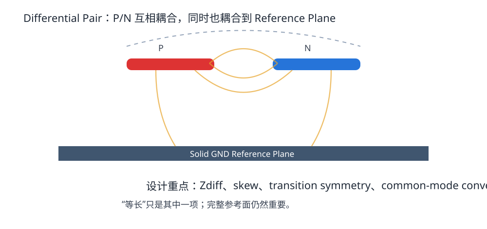
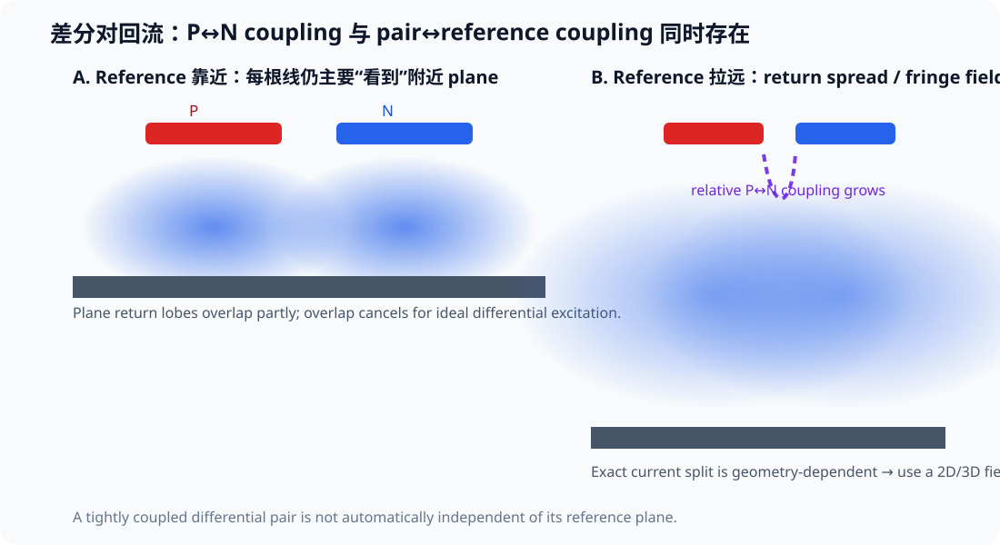
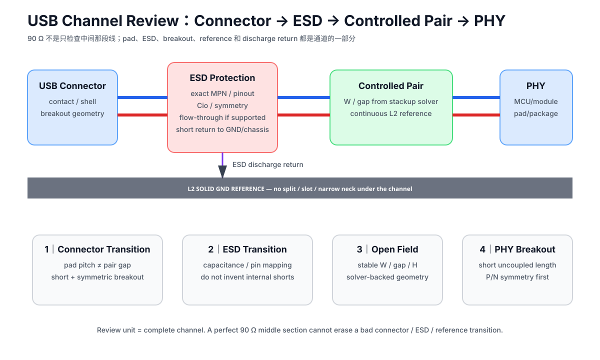

# 06. 差分对与 USB 实战：等长只是最表面的一层

> **这一章为什么现在要学？**  
> USB D+/D− 是你在 STM32F407 V2 上最适合拿来学习差分布线的真实接口：有官方硬件指南、有连接器、有 ESD、有成对走线，而且速度比真正的 SerDes 更适合第一次练习。

<p align="center"></p>

---

## 6.1 差分接收端真正看什么

差分接收器主要关心：

\[
V_{diff}=V_P-V_N
\]

如果外界噪声同时给两根线加上相近的共模扰动：

\[
(V_P+V_n)-(V_N+V_n)=V_P-V_N
\]

理想情况下，共模成分被抵消。

但这要求两条路径足够对称；如果几何、延迟、阻抗不对称，共模与差模会互相转换。

---

## 6.2 差分不是“有两根线就自动抗干扰”

要让 pair 真正发挥作用，至少要关心：

- pair 两根线的 propagation delay；
- 差分 impedance；
- 几何对称；
- layer transition 对称；
- connector / ESD / pad transition 对称；
- pair 与 reference structure 的关系；
- pair 与其他网络的隔离。

因此：

> **“等长”是必要检查项之一，但绝不是差分设计的全部。**

---

## 6.3 Intra-pair skew：为什么两根线不能差太多

假设 P 比 N 长，P 的边沿更晚到达。

在这段时间差内：

- P/N 不再严格等幅反相；
- differential waveform 发生畸变；
- common-mode component 增加；
- 接收 eye margin 可能下降；
- EMI 可能变差。

但“允许差多少”必须来自具体 interface/device guide。

不要写统一：

> “所有差分对必须 ±0.1 mm。”

USB FS、USB HS、HDMI、PCIe、LVDS、MIPI 的 budget 完全不同。

---

## 6.4 Pair gap 为什么应该稳定

当两根线的 gap 突然变化：

- mutual capacitance / inductance 变化；
- odd-mode impedance 变化；
- differential impedance 出现 discontinuity。

因此正常 open-field routing 应保持稳定 pair geometry。

但 pad / connector / via breakout 区域不可避免会短暂 uncouple。我们的目标是：

- transition 尽量短；
- 两边对称；
- 不为了追求“全程固定 gap”做荒谬绕线。

KiCad 10 提供 `diff_pair_uncoupled` 约束，可对过长的 uncoupled section 做 DRC 检查。

---

## 6.5 差分对也需要参考面

“差分自己形成回路，所以完全不需要 GND plane”是错误的。

真实差分 pair 同时存在：

- P ↔ N 之间的耦合；
- P/N ↔ reference plane 的耦合；
- common-mode return current；
- connector/shield/chassis 等更大系统路径。

完整参考面有助于：

- 稳定阻抗；
- 控制 common mode；
- 减少环境变化；
- 让 layer transition 更可预测。

---

## 6.5.1 差分对的 return current 到底走 plane 还是走另一根线？答案：看几何

<p align="center"></p>

最容易背错的一句话是：

> “差分对 P 的回流天然都走 N，所以不需要 reference plane。”

真实情况由 **P↔N coupling** 与 **每根线↔reference coupling** 共同决定。

在访谈展示的一组特定 HFSS microstrip 例子里，即使 P/N 已经排得很紧、目标约为 100 Ω differential，而且 plane 很近，**大部分 conduction return 仍分别集中在各自走线下方的 plane**；只有两条 return-current distribution 重叠的部分互相抵消。该例子报告的重叠或抵消量级约为一成。

这组比例只能说明一个概念：

> **“紧耦合差分对”不等于“回流完全脱离参考面”。**

不要把 90% / 10% 当成所有差分对的固定分配。改变以下任一项，结果都会变：

- pair gap；
- trace width；
- H（到 plane 的距离）；
- stripline / microstrip；
- dielectric；
- frequency；
- surrounding conductors。

### 把 plane 拉远会怎样？

当 plane 变远：

- 每根线在 plane 上的 return distribution 变宽；
- P/N 之间相对耦合占比可能提高；
- fringe field 更广；
- 对外部结构或邻线的敏感度也提高；
- differential impedance 随几何改变。

这解释了为什么 unshielded twisted pair 可以在没有 PCB plane 的情况下工作：两根导体本身形成主要传输结构。但这**不能反推**“PCB differential pair 删除 reference plane 会更好”。

PCB 上保留邻近、连续 reference 的价值，是让 impedance、common mode、crosstalk 和 transition 更可预测。


## 6.6 STM32F407 的 USB：先搞清楚你设计的是哪种模式

STM32F407 具有 USB OTG_FS，以及 OTG_HS 控制器；F407 的 HS 控制器要实现 USB High-Speed 480 Mbit/s 通常需要外部 ULPI HS PHY，但控制器也有 embedded FS PHY 可做 Full-Speed 工作。

本 V2 教学项目默认做：

> **USB Full-Speed device，12 Mbit/s，使用 STM32 embedded FS PHY。**

这意味着它比 USB HS 480 Mbit/s 宽容得多，适合第一次差分布局训练。

ST AN4879 当前版本明确说明：

- USB FS device/OTG 需要精确 48 MHz clock；
- ESD protection 应尽可能靠近 connector；
- VBUS 应远离 DP/DM；
- USB 的具体实现必须结合 MCU 型号和工作模式。

---

## 6.7 USB 阻抗数字怎么写才严谨

USB 生态中常见 90 Ω differential channel/trace 目标，但你不应该仅凭“大家都这么画”就写一个固定几何。

本课程流程：

1. 先确认你实现的是 FS 还是 HS；
2. 查 USB-IF 当前 specification / compliance requirements；
3. 查 ST AN4879 / MCU datasheet；
4. 锁定板厂 stackup；
5. 用板厂 field solver 反算 pair width/gap；
6. 记录 target、tolerance、来源和查询日期。

ST AN4879 对“作为 HS driver 一部分的 full-speed driver”给出 45 Ω ±10% 单端 impedance 说明，但**不要把这句话无条件复制到所有 STM32 embedded FS 场景**。课程以当前 USB-IF + 芯片官方 guide 的组合约束为准。

---

## 6.7.1 为什么“100 Ω = 两根 50 Ω”只能当弱耦合直觉

在 weak-coupling limit：

\[
Z_{diff}=2Z_{odd}
\]

若：

\[
Z_{odd}\approx50\,\Omega
\]

自然有：

\[
Z_{diff}\approx100\,\Omega
\]

这就是 50 Ω 单端生态与 100 Ω differential 常常一起出现的一个直觉来源。

但 pair 一旦有明显互耦：

- mutual C / L 会改变 odd-mode impedance；
- 单独拿走另一根线以后测得的 single-ended Z0 不再等于 Zodd；
- gap / H / W 都会改变结果。

因此：

> **100 Ω differential 不能用“两根各自 50 Ω 就结束”来签核。**

仍然需要 actual stackup + field solver。


## 6.7.2 视频里的 6.7 mil / 8 mil 只能当“特定 Stackup 的 Solver 结果”

这期视频用一个 PCBWay 四层示例，通过 edge-coupled microstrip calculator 输入：

- target differential impedance；
- top copper thickness；
- L1→L2 dielectric height；
- dielectric constant；
- pair gap；

再反算 trace width。

视频示例得到的约：

~~~text
width ≈ 6.7 mil
gap   ≈ 8 mil
~~~

只属于**那一个 stackup + calculator model + input gap**。

它最值得保留的不是数字，而是：

> **Differential width 与 gap 是耦合变量；改 gap，求出来的 width 也会跟着变。**

因此 USB pair 不能用：

~~~text
“我记得以前 USB 是 6 mil / 8 mil”
~~~

来签核。

正确流程仍然是：

~~~text
USB mode / requirement
→ actual board stackup
→ reference plane
→ target Zdiff
→ field solver / fab calculator
→ width + gap
→ KiCad rule
→ fabrication confirmation
~~~


## 6.8 USB connector / ESD 的正确顺序

推荐从板边向 MCU 看：

```text
USB receptacle
     |
   ESD device   ← 尽可能靠近 receptacle
     |
  short, symmetric D+/D-
     |
   STM32 PHY
```

ESD protection 的目标是让 ESD 电流尽早被旁路，而不是让 surge 沿 D+/D− 先跑半块板再被钳位。

### 6.8.1 把 USB 看成“完整通道”，不要只看中间那段平行线

<p align="center"></p>

真正的板级通道是：

~~~text
connector contact
→ connector breakout
→ ESD pad / package
→ post-ESD breakout
→ controlled pair
→ MCU / module pad
→ PHY
~~~

每一段都可能改变：

- width；
- pair gap；
- pad capacitance；
- local reference；
- P/N symmetry；
- common-mode conversion；
- return path。

所以“中间 40 mm 走得很漂亮”不能自动抵消 connector / ESD 两端的糟糕 transition。

### 6.8.2 ESD 器件优先看 Flow-Through Topology，但不能自己发明 Pin Short

视频演示了为了让 D+/D− 尽量直穿 ESD 器件而采用直通式布线的思路，这个方向非常值得保留。

但课程加一条纪律：

> **必须按 exact ESD MPN 的 datasheet pinout 和 internal topology 布局。**

不同器件可能是：

- true flow-through；
- pass-through array；
- rail-to-rail steering；
- discrete TVS；
- 带 common-mode filter 的保护器件。

不能因为 PCB 想走直线，就在 schematic 中把多个 pin 人为并接，然后假设“器件内部本来就一样”。

Review 时记录：

~~~text
ESD MPN
pin mapping
I/O direction / symmetry
Cio / line capacitance
GND pin / discharge return
recommended land pattern
flow-through capability
~~~

### 6.8.3 ESD Ground Return 与 Signal Reference 是两件相关但不同的事

USB pair 的正常高速 reference 可能是：

~~~text
L2 solid GND
~~~

而 IEC ESD 事件的 discharge current 需要：

~~~text
connector
→ TVS
→ very short low-inductance return
→ ground/chassis structure
~~~

两个问题都叫“ground”，但 review 目标不同。

不能只检查：

> “L2 有 GND plane。”

还要检查：

- TVS GND pad 到 return structure 的路径是否短；
- discharge current 是否穿过 MCU core 区；
- connector shield / chassis strategy 是否清楚；
- TVS 位置是否真的位于 entry boundary。

### 6.8.4 不要把“USB 下方画一块 GND Zone”当成完整 Reference Plane

视频演示里为了聚焦 USB pair，在 L2 下方画了一块 GND copper。

教学上能帮助理解 reference plane，但正式四层板应优先使用：

> **连续的 L2 solid GND plane。**

局部 patch 如果：

- 只有很细的 neck；
- 被 void / split 切断；
- 与主 GND 连接很远；
- 周围被 anti-pad 打碎；

就不能因为 net name 是 GND 自动获得理想 reference 的行为。


### 常见错误

```text
connector -------- 60mm trace -------- ESD -------- MCU
```

这里 ESD 器件虽然“原理图上有”，PCB 位置却失去大部分意义。

---

## 6.9 USB pair 周围不要放什么

尽量避免：

- switching regulator SW node；
- HSE oscillator；
- 大电流电源路径；
- 高速 clock 长距离平行；
- plane split；
- 不必要 test stub；
- 单边过孔/不对称 transition。

VBUS 也不应与 DP/DM 长距离贴近并行；ST AN4879 明确建议 VBUS 远离 DP/DM。

---


## 6.9.1 Full-Speed “更宽容”不等于可以忽略通道

视频把 USB Low/Full-Speed 与 High-Speed 做了正确的难度分层：

- LS：1.5 Mbit/s；
- FS：12 Mbit/s；
- HS：480 Mbit/s。

当前 ST AN4879 也列出 USB OTG_FS / OTG_HS 支持的这些速率等级。

USB HS 对 channel discontinuity、loss、jitter 和 layout 更敏感。

但课程禁止推导成：

> “FS 只有 12 Mbit/s，所以 impedance 随便画都没事。”

因为真正影响 transmission-line behavior 的不只是 bit rate，还有：

- driver rise/fall time；
- path length；
- connector / ESD discontinuity；
- reference quality；
- cable/device environment；
- EMC margin。

对于 V2 的 USB FS，90 Ω differential 仍作为一个很好的规范化设计练习；只是 validation 深度和 HS compliance 不同。


## 6.10 KiCad 10：真正用 Differential Pair Router

### 命名

KiCad 会根据成对命名识别差分：

- `USB_DP` / `USB_DN`（P/N suffix）；
- 或 `USB+` / `USB-`。

不要混用不被识别的 suffix。

### Board Setup

对 USB net class 设置来自你 stackup 求解的：

- differential pair width；
- pair gap；
- clearance。

### Routing

KiCad 10 官方文档确认：

- USB+ / USB-；
- USB_P / USB_N

都可以被识别为 differential pair，但 suffix 风格不能混用。

KiCad 10：

- Differential Pair Router：hotkey `6`；
- Pair Length Tuning：`8`；
- Pair Skew Tuning：`9`。

### 一个非常重要的工具事实

KiCad 的 tuner 可以帮你满足几何/长度 target，但它不会判断：

> 你为了等长塞进去的 meander 是否因为 spacing 太小而产生强 self-coupling。

所以 tuner 是工具，不是 SI judge。

---

## 6.11 蛇形线：不要为了 0.05 mm 的差值制造 20 mm 的问题

紧密 meander 的相邻段会彼此耦合，导致“几何长度增加”和“实际电气延迟增加”不再一一对应。

所以顺序应该是：

1. 先通过 placement / routing symmetry 自然等长；
2. 最后只修必要 skew；
3. meander spacing 留足，不做密集 accordion；
4. target 必须来自 protocol，而不是追求数字看起来为 0。

---

## 6.12 Fault Lab：四种差分“看起来正确”

### Fault A — 长度一样，gap 一路变化

长度报告 PASS，但 impedance discontinuity 很多。

### Fault B — D+ 过孔，D− 不过孔

长度可以调回来，但 transition 完全不对称。

### Fault C — 两根线都换层，但 return transition 不对称

pair 本身对称，reference structure 不对称。

### Fault D — 密集蛇形做到 0.01 mm skew

数字漂亮，但局部自耦合强、走线更长、更复杂。

---


## 6.12.1 USB Channel Review Sheet

V2 新增工程模板：

[usb-channel-review.md](../projects/stm32f407-mainline/v2/usb-channel-review.md)

它强制从 connector 一直看到 PHY，而不是只记录一组 width/gap。

至少填写：

- connector footprint / launch；
- ESD exact MPN；
- ESD pin topology；
- pre/post-ESD uncoupled section；
- controlled pair width/gap；
- reference plane；
- plane void/split；
- VBUS adjacency；
- P/N symmetry；
- layer transition；
- measurement access；
- fabrication source。


## 6.13 Design Review

- [ ] USB mode（FS/HS）明确
- [ ] impedance target 有来源
- [ ] pair width/gap 与当前 stackup 对应
- [ ] DP/DM 全程环境大体对称
- [ ] ESD 靠近 connector
- [ ] ESD exact MPN / pin topology / capacitance 已 review
- [ ] connector→ESD→PHY 全通道几何已 review
- [ ] 没有为了“直线”人为发明器件内部 pin short
- [ ] ESD discharge return 与 normal signal reference 都有明确路径
- [ ] VBUS 与 pair 不长距离并行
- [ ] 不跨 reference split
- [ ] layer transition 对称并审查 return structure
- [ ] skew target 来自需求，不追求无意义的绝对 0
- [ ] meander 不密集自耦合
- [ ] 没有使用“差分对不需要参考面”的错误前提
- [ ] 能解释当前 pair 的 P↔N coupling 与 pair↔reference coupling 哪一个更强，必要时用 field solver 验证

---

## 6.14 本章任务

1. 为 V2 选择 USB receptacle 和 ESD part；
2. 从 ST AN4879 提取至少 5 条真正相关的硬件要求；
3. 用当前 stackup 计算 pair geometry；
4. 写进 `v2/si-routing-constraints.md`；
5. 在 KiCad 中用 differential router 完成 pair；
6. 用 skew tuner 只修真正需要的差值；
7. 做一次“几何对称性 Review”，不要只看长度数字；
8. 填写 usb-channel-review.md，从 connector 一直审到 PHY。

---

## 参考资料

- ST AN4879, *USB hardware design guidelines for STM32 microcontrollers*: https://www.st.com/resource/en/application_note/an4879-usb-hardware-design-guidelines-for-stm32-microcontrollers-stmicroelectronics.pdf
- USB-IF Document Library / USB 2.0 Specification: https://www.usb.org/documents?search=usb%202.0
- KiCad 10 PCB Editor — differential routing and length tuning: https://docs.kicad.org/10.0/en/pcbnew/pcbnew.html
- John Teel / Predictable Designs, KiCad USB differential-pair routing video: https://www.youtube.com/watch?v=Itsrdc8tX7M
