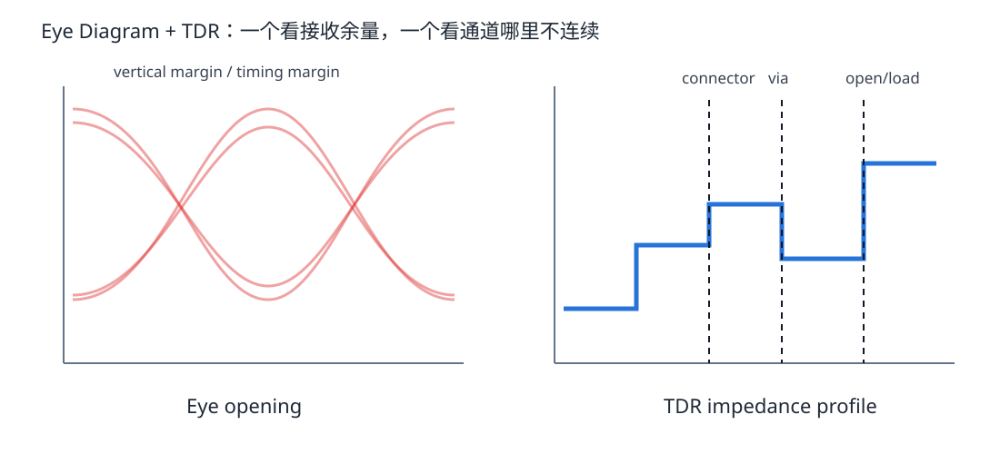
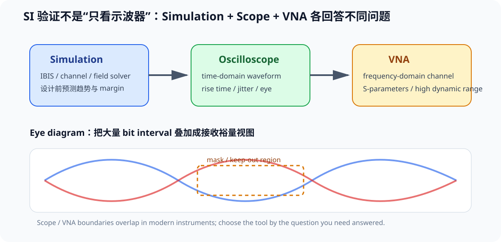

# 07. TDR、眼图与示波器判读：从波形反推 PCB

> **这一章为什么现在要学？**  
> 因为 SI 不能只靠“看布局觉得不错”。真正工程闭环是：**设计 → 仿真/预测 → 测量 → 归因 → 修改。** 本章不要求你马上买昂贵仪器，而是先学会这些图到底在说什么。

<p align="center"></p>

---

## 7.0 先把“仿真、示波器、VNA”放到同一张地图

<p align="center"></p>

Signal Integrity 的验证有两条互补主线：

### 设计前：Simulation

目标是回答：

- 哪个 topology 风险更低？
- source termination 大概应该在哪个范围？
- 某个 discontinuity 会不会明显反射？
- channel loss / crosstalk 是否可能吃掉 margin？

Simulation 的价值不是“算出唯一真相”，而是：

> **在打板前减少设计空间、降低试错成本。**

### 做出硬件后：Test & Measurement

常见工具可以这样建立第一层直觉：

| 工具 | 最擅长的问题 | 常见输出 |
|---|---|---|
| Oscilloscope | “真实 waveform 在时间上长什么样？” | rise/fall、overshoot、jitter、eye |
| VNA | “channel 在频率上怎样传输/反射/耦合？” | S-parameter、insertion/return loss、crosstalk |
| TDR | “阻抗 discontinuity 在哪里？” | impedance vs time / position |

VNA 的高动态范围尤其适合看较小的耦合或较大的衰减，例如某些 far-end crosstalk / channel isolation 问题。

现代仪器的边界已经有很多重叠。例如：

- VNA 可以由频域数据变换出 TDR；
- 频域 channel model 可以进一步生成 eye；
- scope 也可以通过高级分析做 jitter decomposition。

所以不要按仪器名字背功能，应该先问：

> **我现在要测 waveform，还是要 characterize channel？**

---

## 7.1 示波器上的一个方波，能告诉你什么

看一个数字边沿时，至少观察：

- rise/fall time；
- overshoot / undershoot；
- ringing frequency；
- ringing decay；
- threshold crossing；
- source 与 load 的差异；
- 周期性 jitter；
- noise floor。

但一个波形只能告诉你“发生了什么”，不自动告诉你“为什么”。

例如 overshoot 可能来自：

- transmission-line reflection；
- probe ground inductance；
- package resonance；
- supply bounce；
- measurement bandwidth/setup。

所以工程判断必须结合 topology 和测量位置。

---

## 7.2 先学会不被探头骗

普通无源探头的长 ground lead 本身就是明显电感。

快边沿测量优先：

- ground spring；
- 极短 ground connection；
- 合适带宽探头；
- 在真正 receiver pin 附近测；
- 避免随意焊很长飞线。

### 一个简单验证

同一个节点：

1. 长鳄鱼夹地线测一次；
2. ground spring 测一次。

如果 ringing 大幅变化，你看到的一部分“SI 问题”其实属于 measurement loop。

---

## 7.2.1 “Scope 看起来很干净”也可能只是测量链太慢

一个仿真里存在 0.5 ns edge、narrow crosstalk spike 或快速 ringing，不代表任何示波器都能把它如实画出来。

测量链至少包含：

~~~text
test point
→ probe tip / ground
→ probe bandwidth
→ scope analog front-end bandwidth
→ sample rate
→ acquisition / interpolation
~~~

视频强调 sample rate，这个提醒有价值，但课程要再加一层：

> **Analog bandwidth 与 probe connection 是第一阶限制，sample rate 不能替代 bandwidth。**

常见单极点 10–90% 近似：

\[
BW\approx\frac{0.35}{t_r}
\]

若要观察约 0.5 ns edge，700 MHz 只是“不要把边沿严重拖慢”的量级起点；若要高保真观察 overshoot / narrow spike，通常需要更高 bandwidth 和足够 sample rate。

因此测 SI 波形时至少记录：

- scope bandwidth；
- probe bandwidth；
- sample rate；
- bandwidth-limit setting；
- probe tip / ground geometry；
- acquisition mode。

相关案例见：[11｜仿真案例：支路、源端串联终端与 Stackup](11_仿真案例_支路终端与Stackup.md)。


## 7.3 TDR 是什么

TDR = Time Domain Reflectometry。

核心过程：

1. 向 DUT 发一个已知快速阶跃；
2. 阶跃沿 interconnect 传播；
3. 遇到 impedance discontinuity 产生反射；
4. 观察反射随时间变化；
5. 用传播延迟把“时间”映射到“位置”。

所以 TDR 很像：

> 给走线发一声“回声测试”，从回声判断哪里变宽、变窄、开路、短路或 transition 不连续。

---

## 7.4 TDR 上“向上”和“向下”是什么意思

在简化单 discontinuity 情况：

- 局部阻抗高于 reference Z0 → 正反射 → TDR 往上；
- 局部阻抗低于 reference Z0 → 负反射 → TDR 往下。

典型：

| 结构 | TDR 直觉 |
|---|---|
| open | 大幅向上 |
| short | 大幅向下 |
| 线突然变窄、Z 上升 | bump |
| 大 pad / 额外 capacitance | 可能先向下 |
| via inductive discontinuity | 可能表现为向上特征 |

真实 via/connector 是分布 RLC 结构，不能只凭“向上/向下”一句话完成建模。

---

## 7.5 TDR 的空间分辨率受边沿限制

更快的 TDR edge 可以分辨更小的结构。

直觉：

> 如果测试脉冲本身在空间上“很长”，两个很近的 discontinuity 会糊在一起。

因此：

- 测几十厘米线不一定需要极端快边沿；
- 想看 BGA/via/pad 细节需要更高带宽、更快 rise time。

测量设备的 rise time 就像显微镜的分辨率。

---

## 7.6 Eye Diagram 到底是什么

眼图不是一次波形，而是把很多 bit interval 对齐后叠加。

它把大量模式、噪声和 jitter 压缩成一个“接收窗口”视觉图。

主要看：

- **eye height**：垂直噪声/幅度 margin；
- **eye width**：水平 timing margin；
- crossing distribution；
- overshoot / ringing；
- deterministic/random jitter；
- mask margin（若协议规定）。

> **眼睛越开，一般代表接收判决余量越大；但是否合规必须看具体协议 mask/test method。**

---

### 眼图为什么适合把很多 SI 问题压缩成一张图

数字 receiver 最终是在某个 sampling window 里判断 0 / 1。

因此眼图可以把两类 margin 同时可视化：

- **vertical opening**：amplitude / noise margin；
- **horizontal opening**：timing / jitter margin。

常见映射：

| 退化 | 更直接影响 |
|---|---|
| attenuation / noise / crosstalk | vertical opening |
| jitter / ISI / reflection-induced timing shift | horizontal opening |
| severe reflection / mode conversion | 两者都可能受影响 |

### Mask 不是“看起来漂亮”的主观标准

协议 compliance 常会定义 mask / keep-out region：

- 波形不能进入指定区域；
- mask hit 可作为 fail 条件；
- mask 几何和测试方法必须来自具体标准。

因此：

> **眼图是可视化工具，mask 才把“好不好看”升级成“是否满足定义好的测试条件”。**

### Jitter 不是一个单一来源

Jitter 的共同表现是：

> **同一个逻辑 edge 并不总在理想时间点到达。**

工程上常见的分类包括：

- **data-dependent jitter (DDJ)**：与前后 bit pattern、ISI 等相关；
- **periodic jitter (PJ)**：由周期性干扰 / modulation 等造成；
- **random jitter (RJ)**：具有随机统计特征；
- 更广义的 deterministic jitter 还可以包含 duty-cycle distortion、bounded uncorrelated 等类别。

本章先要求你建立“horizontal timing uncertainty”的直觉；严格 jitter decomposition、BER 外推和 compliance 方法属于更深入的测量专题。


## 7.7 什么会把眼图“关上”

### Reflection

阻抗不连续让多个延迟副本叠加。

### Loss

高频成分被更强衰减，边沿变慢，ISI 增加。

### Crosstalk

邻道模式相关噪声叠加到 victim。

### Jitter

边沿横向漂移，eye width 变小。

### Supply/ground noise

threshold 和 driver amplitude 被调制。

### Skew / mode conversion

差分对失去对称，common-mode 与 differential-mode 互换。

---

## 7.8 STM32F407 V2 需要做眼图吗？

对 USB FS、普通 SPI/SDIO 学习项目：

- 你不需要为了“显得高级”强行做完整高速 SerDes eye compliance；
- 但眼图概念非常值得提前学，因为 Part 7 六层高速板会真正用到。

当前阶段更实用的是：

- 比较 source/load edge；
- 观察 ringing；
- 验证 series resistor；
- 检查 USB waveform 是否明显畸变；
- 理解 compliance 测试是协议定义的，不是看“波形漂亮”就算 PASS。

---

## 7.9 TDR 和示波器如何组合定位问题

一个推荐思路：

### 波形告诉你“症状”

例如 receiver 有双台阶。

### TDR 告诉你“哪里不连续”

例如 connector 后 15 mm 出现明显低阻抗 dip。

### PCB 结构告诉你“为什么”

打开 layout，发现那里有一个巨大 test pad。

于是形成：

```text
waveform symptom
      ↓
TDR location
      ↓
layout geometry
      ↓
physical model
      ↓
fix
```

这才是 SI 调试，而不是“看到振铃就加电阻”。

---

## 7.10 Fault Lab：测量归因练习

### Case A

接收端 overshoot，但换 ground spring 后消失大半。

结论：先修测量方法。

### Case B

source 干净，load 有规律 staircase，时间间隔约等于 `2td`。

优先怀疑：reflection / round-trip。

### Case C

某一段 TDR 明显向下，PCB 对应位置有大面积 pad。

优先怀疑：局部 capacitive discontinuity。

### Case D

eye horizontal opening 变窄，但 amplitude 尚可。

优先排查：timing jitter / ISI / crosstalk，而不是只盯直流电压。

---

## 7.11 测量设备分三级

### Level 1 — 学习必备

- 普通示波器；
- 合理探头；
- logic analyzer。

可做：边沿、振铃、source/load 比较。

### Level 2 — 进阶

- 更高带宽 scope；
- differential probe；
- 简单 TDR/fast step setup。

可做：差分 waveform、反射定位。

### Level 3 — 专业 SI

- 高性能 TDR；
- VNA；
- compliance fixture/software；
- channel simulator。

可做：S-parameter、de-embedding、eye/mask、channel characterization。

本教材不会要求你买齐 Level 3 才能继续。

---

## 7.12 Design Review

- [ ] 测量点靠近真正的 receiver/source node
- [ ] probe connection 不形成巨大 loop
- [ ] 波形问题先区分 measurement artifact 与 DUT behavior
- [ ] 会用 flight time 解释重复反射间隔
- [ ] TDR interpretation 与 PCB 物理位置对应
- [ ] eye diagram 不脱离 protocol mask/spec 单独判 PASS
- [ ] 不从一个截图直接跳到唯一根因

---

## 7.13 本章任务

1. 画一张 V2 的 source/load 测量点图；
2. 为 SPI_SCK 预留 source 与 load 两个可探测位置；
3. 设计一页“长地线探头 vs ground spring”的实验记录模板；
4. 用 Reflection Lab 预测一个 100 mm 线的 round-trip 时间；
5. 写出如果 scope 上看到同样时间间隔的 ringing，你会如何验证。

---

## 参考资料

- Analog Devices, *Propagation Delay Measurements Using TDR*: https://www.analog.com/en/resources/technical-articles/propagation-delay-measurements-using-tdr-timedomain-reflectometry.html
- Keysight, *How to Analyze PCB Signal Integrity*: https://www.keysight.com/us/en/use-cases/analyze-pcb-signal-integrity.html
- Tektronix, *TDR Test*: https://www.tek.com/en/documents/primer/tdr-test
- Tektronix, *The Basics of Serial Data Compliance and Validation Measurements*: https://www.tek.com/en/documents/primer/basics-serial-data-compliance-and-validation-measurements
- Rohde & Schwarz, *Understanding Signal Integrity*: https://www.youtube.com/watch?v=anX8QZMhVjI
