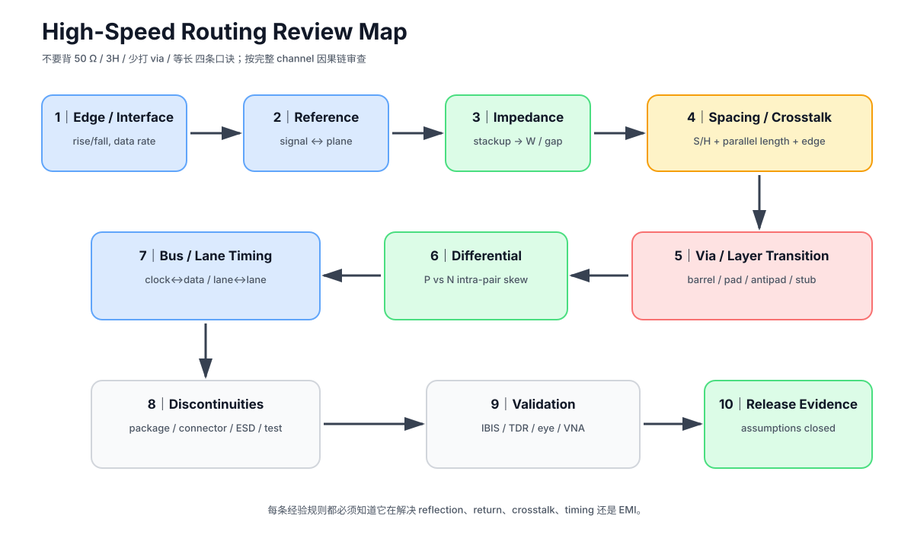

# 08. KiCad 中的 SI 落地与 Review：把物理概念变成可执行规则

> **这一章为什么现在要学？**  
> 前面七章如果不能落进 EDA 规则、布线顺序和 Review 流程，就很容易重新退化成“懂了一堆概念，但画板时还是凭感觉”。

---

## 8.1 SI 工作流不是“最后跑一次 DRC”

推荐顺序：

```text
Requirement
   ↓
Source / Load / Protocol
   ↓
Stackup + Reference Planes
   ↓
Impedance / Timing / Spacing targets
   ↓
Placement
   ↓
Routing topology
   ↓
KiCad rules
   ↓
Route
   ↓
Reference-plane review
   ↓
Length / skew review
   ↓
DRC
   ↓
Manual SI review
   ↓
Fabrication / measurement
```

如果直到 routing 完成才问“这是不是 90 Ω”，顺序已经反了。

---

## 8.2 第一步：SI Net Inventory

为关键网络建表：

| Net/Group | Source | Load | Topology | Edge/Data info | Layer | Ref plane | Impedance | Length/Skew | Spacing | Termination | Source |
|---|---|---|---|---|---|---|---|---|---|---|---|

其中 `Source` 一栏最后的意思是**约束来源**：

- datasheet；
- app note；
- protocol spec；
- board fab；
- engineering assumption。

任何没有来源的精确数字，都应该被标成 assumption，而不是“规范”。

---

## 8.3 Net Classes：用来表达“网络类别”

适合写：

- default track width；
- clearance；
- via size；
- diff pair width；
- diff pair gap。

例如：

```text
Default
USB_FS
CLOCK_FAST
SDIO
POWER
SENSITIVE
```

Net Class 的作用是帮助 router 保持基本几何，不是替代具体 protocol analysis。

---

### 8.3.1 KiCad 10 Tuning Profiles：比“先画 10 mil，最后批量改”更适合正式项目

KiCad 10 已提供 **Tuning Profiles**。

它可以为具有特定 impedance requirement 的单端 / 差分网络定义：

- target impedance；
- signal layer；
- reference layer(s)；
- per-layer track width；
- differential pair gap；
- propagation delay。

在 stackup 已配置后，KiCad 10 可以根据 target impedance 与 signal-reference geometry 自动计算部分 width / gap，并把 profile 绑定到 Net Class；interactive router 会使用对应 geometry，DRC 也可以检查是否偏离 profile。

这意味着本课程把视频里的“临时较宽线 → 最后统一改线宽”升级成：

~~~text
Requirement
→ provisional Net Class / Tuning Profile
→ reserve routing envelope
→ fab / stackup freeze
→ recalculate profile
→ router + DRC
→ review affected transitions
~~~

### 为什么这比“按线宽批量选择”更可靠？

因为：

- 网络身份由 Net Class 表达；
- per-layer geometry 可以不同；
- diff pair width / gap 不会只改一半；
- stackup 改变时有明确 reopen 点；
- DRC 可以帮助发现漏改的段落；
- 多人协作时不依赖“记住 10 mil 是临时值”。

### 但 Tuning Profile 仍然不是板厂签核

KiCad 的 calculator 是基于配置的 stackup 与理想化 microstrip/stripline geometry。

最终 production geometry 仍应和：

- current fab；
- actual stackup；
- finished copper；
- Dk model；
- soldermask；
- etch compensation；
- impedance tolerance

一起冻结。

所以正确关系是：

~~~text
KiCad Tuning Profile = executable design rule
Fab calculator / field solver = geometry source / cross-check
CAM / coupon / TDR = manufacturing evidence（按项目需要）
~~~

官方 KiCad 10 文档：
https://docs.kicad.org/10.0/en/pcbnew/pcbnew.html

## 8.4 Custom Rules：用来表达“条件化约束”

KiCad 10 custom rules 可以表达比 net class 更具体的关系。

示例思想：

### USB pair gap

对 `/USB` differential pair 设置 pair gap target。

### Pair 与其他网络间距

对所有 differential pair 与非本 pair 网络设置额外 clearance。

### Clock 特殊 clearance

对 `SDIO_CK`、`SPI_SCK` 与敏感网络设置更大 clearance。

### 禁止区

禁止高速线进入：

- switching node 区域；
- crystal keepout；
- connector shield mechanical keepout。

> Custom Rule 要表达“为什么需要这个条件”，不要只追求规则文件看起来复杂。

---


### 8.4.1 Differential Router 在 Connector / ESD 处“接不上”怎么办？

视频演示了一个很常见的真实情况：

- open field 中 differential router 很顺；
- 进入 connector / ESD / module pad 时，pin pitch 与设置的 pair gap 不一致；
- router 可能需要短暂 uncouple / fan-out。

KiCad 10 官方文档也明确说明：当起点或终点 pad spacing 与配置的 differential gap 不同时，router 会生成一小段 fan-out，以尽量减少 uncoupled length。

课程要求：

~~~text
open-field pair
→ controlled width/gap

breakout / ESD / connector
→ short + symmetric transition
→ width/gap 可暂时偏离
→ DRC / manual review
~~~

不要为了让 router 强行维持固定 gap 而：

- 绕奇怪的 S 弯；
- 在 ESD pad 前后塞不必要 meander；
- 拉长 uncoupled section；
- 破坏 P/N symmetry。

对这些区域，**几何对称 + transition 短**通常比“视觉上全程恒 gap”更重要。

KiCad 10 还提供 diff_pair_uncoupled 约束，可以对过长的 uncoupled section 做 DRC。


## 8.5 KiCad Differential Pair Router 的边界

KiCad 10 能：

- 识别 P/N 或 +/- pair；
- 按规则保持 width/gap；
- 放置成对 vias；
- 做 differential pair length tuning；
- 做 skew tuning；
- 检查 `diff_pair_uncoupled`。

KiCad 不能自动替你判断：

- 目标 impedance 是否来自正确 stackup；
- connector/ESD transition 是否对称；
- reference plane 是否在每个位置都健康；
- via return transition 是否合理；
- meander 是否自耦合严重；
- protocol budget 是否被满足。

---

## 8.6 Length Tuning：先搞清楚你调的是什么“长度”

KiCad 10 length tuner 会结合 routing path，并可在配置正确时计入 via 的 layer-to-layer 长度。

但实际时序关心的是：

\[
t_{flight}=\int \frac{dl}{v(l)}
\]

如果不同段走在不同 dielectric environment：

- 1 mm microstrip；
- 1 mm stripline

它们的传播时间不一定完全相同。

所以高级设计最终是 **delay matching**，不只是几何铜长 matching。

对当前 STM32F4 V2，我们先把：

- same layer；
- same stackup environment；
- symmetry

做好，再用几何长度作为实用近似。

---


## 8.6.1 High-Speed Routing Review Map：不要把规则拆成互不相干的口诀

<p align="center"></p>

这期 Phil's Lab 视频把高速布局常见问题放在一条线里：edge rate、reference plane、stackup、controlled impedance、spacing/crosstalk、via/return transition、differential matching、bus lane timing 和 EMI。

课程把它升级成固定 Review 顺序：

~~~text
1. Edge / interface requirement
2. Source → load topology
3. Signal layer ↔ reference layer
4. Stackup / impedance geometry
5. Spacing + parallel length
6. Via / layer transition / return transition
7. Differential intra-pair skew
8. Inter-pair / clock-data timing budget
9. Connector / protection / package discontinuities
10. SI + EMC validation evidence
~~~

这样可以防止一种常见错误：

> “我已经做了 50 Ω、3H、等长，所以高速设计完成了。”

这些动作只有放进同一条 channel / timing / return-path 因果链里才有意义。

### Intra-pair 与 Inter-pair 不要混

视频同时展示了 differential pair 内 P/N matching，以及 MIPI CSI 这类总线中 clock lane 与 data lane 的 relative matching。

它们回答不同问题。

Intra-pair：

~~~text
P vs N
→ differential skew
→ common-mode conversion / eye degradation
~~~

Inter-pair / lane-to-lane：

~~~text
clock lane vs data lane
or data lane A vs data lane B
→ interface timing / deskew budget
~~~

是否需要后者、允许多少 skew，必须来自 interface specification、PHY capability、controller timing model、package delay 与 receiver deskew。

不能因为“都是 differential pair”就自动要求所有 lanes 铜长完全相等。

### 在 Via 附近做局部补偿也要看 Electrical Delay

视频展示了在 discontinuity / via 附近做 differential-pair length correction 的直觉。它的好处是避免 pair 在很长距离上持续处于 phase-skewed 状态。

但最终仍以 electrical delay、stackup propagation、via/package delay 与 protocol skew budget 为准，而不是只追求 CAD copper length 相等。


## 8.7 SI Review 的五张图

每个项目至少保存以下截图：

### 图 1 — Critical Nets Overview

只显示关键网络。

### 图 2 — Reference Plane Projection

关键线 + 参考层，检查 slot/void。

### 图 3 — Layer Transition Map

所有关键 signal vias，用标记指出 return transition。

### 图 4 — Differential Pair Geometry

USB pair 从 MCU 到 connector 的全路径。

### 图 5 — Parallel Run / Crosstalk Review

标出最长的高风险平行段。

这些截图应该进入 `review/`，成为设计历史，而不是只在你脑中看过一次。

---

## 8.8 V2 SI Review Checklist

### Transmission-line screening

- [ ] 关键网络已比较 `td` 与 `tr`
- [ ] 协议指定 controlled impedance 的网络已标出

### Impedance

- [ ] stackup 名称和查询日期已记录
- [ ] width/gap 来自对应 stackup 求解
- [ ] 没有无意义 width discontinuity

### Reflection / termination

- [ ] 点对点快速输出评估 source termination
- [ ] series resistor 靠近 source
- [ ] 没有多余 stub/test branch

### Return path

- [ ] 每根关键线能指出 reference
- [ ] 不跨 slot/split
- [ ] layer transition 有 return transition 解释

### Crosstalk

- [ ] 长 parallel run 已检查
- [ ] clock/high-slew 与 sensitive nets 有隔离
- [ ] spacing 不是只用板厂 minimum

### Differential

- [ ] pair geometry 连续
- [ ] transition 对称
- [ ] skew target 有来源
- [ ] meander 不过度

### Measurement

- [ ] 关键 source/load 有可测位置
- [ ] 测量点不会制造明显 stub

---

## 8.9 Fault Lab Review：不要告诉自己“以后注意”

每发现一个问题都要求形成：

```text
Fault ID
↓
Symptom / risk
↓
Physical explanation
↓
Before screenshot
↓
Fix
↓
After screenshot
↓
Rule/checklist added
```

只有最后一步完成，这个坑才真正变成你的工程资产。

---

## 8.10 V2 的毕业条件

Part 2 结束时，不要求你已经完成 USB compliance lab，但要求：

1. V2 有完整 SI Net Inventory；
2. USB pair 有正式 geometry/source 记录；
3. 至少 3 根单端快速线完成 transmission-line screening；
4. 至少 2 个 source resistor footprint 有明确用途；
5. 所有关键 layer transitions 有回流解释；
6. 完成 crosstalk parallel-run review；
7. Fault Lab 至少完成 5 个 before/after；
8. SI Review Checklist 全部逐项回答，不允许“凭感觉 PASS”。

---

## 8.11 本章任务

建立：

- `projects/stm32f407-mainline/v2/si-net-inventory.md`
- `projects/stm32f407-mainline/v2/si-routing-constraints.md`
- `projects/stm32f407-mainline/v2/si-review.md`

然后把 Part 2 中所有设计结论迁进去。

> **真正的工程教材最终应该留下一个能审、能复盘、能修改的项目，而不是只留下“我看完了八章”。**

---

## 参考资料

- KiCad 10 PCB Editor documentation: https://docs.kicad.org/10.0/en/pcbnew/pcbnew.html
- Saturn PCB Toolkit: https://saturnpcb.com/saturn-pcb-toolkit/
- Robert Feranec, track-width / provisional-routing video: https://www.youtube.com/watch?v=VGY1qFE-kC0
- ST AN4879 USB hardware guide: https://www.st.com/resource/en/application_note/an4879-usb-hardware-design-guidelines-for-stm32-microcontrollers-stmicroelectronics.pdf
- Texas Instruments, *Solutions to High-Speed Design Issues*: https://www.ti.com/lit/pdf/spraav0
