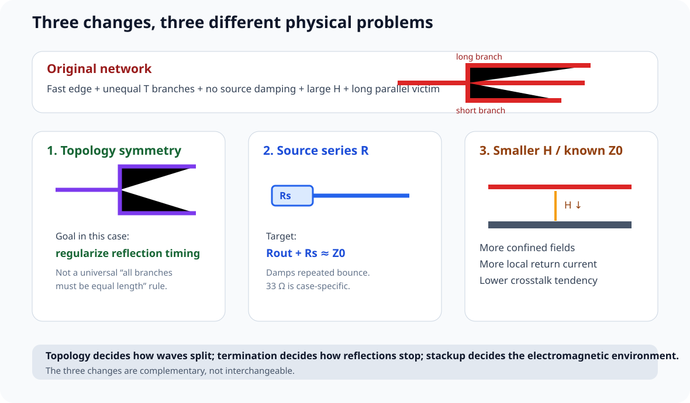
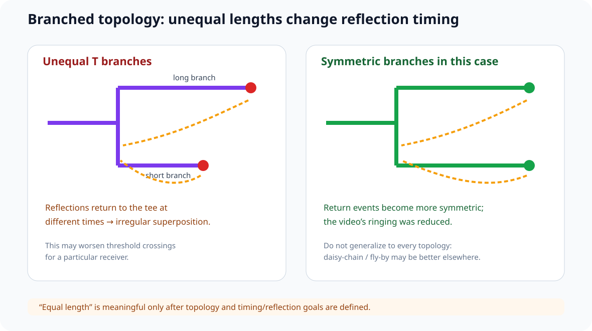

# 11｜仿真案例：支路、源端串联终端与 Stackup 怎样一起把坏波形救回来

> 本章吸收 Robert Feranec 的 *3 Simple Tips To Improve Signals on Your PCB - A Big Difference*，把一个非常典型的数字板问题拆成可复现的 A/B 实验：
>
> **同一个 10 MHz 逻辑信号，为什么会因为 0.5 ns 量级边沿、长支路、强串扰和阻抗不连续而出现严重振铃与误触发风险？**
>
> 重点不是背“33 Ω”“50 Ω”“两条支路必须等长”，而是学会把 **topology、termination、stackup、edge rate、electrical length** 放到同一张图里。

---

## 11.1 仿真电路：两个很普通的问题放到同一块板上

视频使用 SN74LVC 系列 buffer 的 IBIS 模型，构造两组网络：

### Network A：一个输出驱动两个输入

~~~text
              ┌── branch A ── receiver 1
driver ───────┤
              └── branch B ── receiver 2
~~~

这是很多板都会出现的 clock fanout、enable/reset 分支、一路 GPIO 驱动多个器件等结构。

### Network B：相邻 victim

另一根 buffer output 保持静态 0 V，但其走线与 Network A 中一段快速线长距离平行。

所以它只用来观察：

> **aggressor edge 会向一根本来不翻转的 victim 注入多少 crosstalk。**

---

## 11.2 视频原始几何与边沿条件

视频给出的主要教学参数：

| 项目 | 原始条件 |
|---|---|
| Logic amplitude | 5 V |
| Aggressor repetition | 10 MHz |
| Driver / receiver | SN74LVC buffer IBIS |
| Trace width | 12 mil |
| Adjacent-trace spacing | 12 mil |
| Parallel / coupled length | 2000 mil ≈ 50.8 mm |
| Branch A | 800 mil ≈ 20.3 mm |
| Branch B | 1600 mil ≈ 40.6 mm |
| Initial signal-reference height | 63 mil ≈ 1.60 mm |
| Driver rise/fall | simulation showed about 0.6 / 0.5 ns |

这里最重要的对比不是“10 MHz 很低”，而是：

> **100 ns 周期里，真正激励反射和串扰的是约 0.5 ns 的 edge。**

也就是说：

\[
\frac{100\,ns}{0.5\,ns}=200
\]

周期和边沿根本不在同一个时间尺度上。

---

## 11.3 为什么原始波形这么差：不是一个问题，而是三个问题叠加

原始设计同时存在：

1. **不对称 branched topology**：两条支路长度差一倍，反射返回 tee / source / 另一支路的时刻不同。
2. **source 与 line 没有做阻尼/匹配**：driver output impedance 较低，反射容易多次往返。
3. **signal-reference height 很大，邻线又很近**：H ≈ 1.6 mm，S ≈ 0.305 mm，fringe field 很容易覆盖邻线。

所以 ringing、overshoot、threshold crossing 与 victim noise，是：

~~~text
topology reflection
+ source mismatch
+ large H / strong fringe-field crosstalk
+ fast edge
~~~

共同作用的结果。

---

## 11.4 改动一：把两条 branch 做成对称 topology

视频第一项变化：

~~~text
branch A: 800 mil  → 1600 mil
branch B: 1600 mil → 1600 mil
~~~

视频的单变量 A/B 显示：在这个特定 T-branch 网络里，支路对称化明显减少了接收端波形中的一部分 ringing。

### 为什么可能改善

在 branched transmission line 中，tee 本身就是 discontinuity。

当两条支路长度不同：

- wave 到两个 receiver 的时间不同；
- load reflection 返回 tee 的时间不同；
- 两个返回波与后续边沿叠加的相位不同；
- 某一 receiver 可能在阈值附近遇到更坏的 superposition。

让支路对称后，多个反射事件的时间关系更规则，在该案例里减少了振铃。

### 但不要把它学成“所有分支都必须等长”

“等长”可能服务于 arrival-time / skew、topology symmetry、reflection timing 或 interface timing budget。

它不是通用 anti-ringing 魔法。

对于其他网络，更好的拓扑可能是：

- point-to-point；
- daisy chain / fly-by；
- source-series terminated multi-drop；
- end termination；
- dedicated clock buffer fanout。

所以正确规则是：

> **先选 topology，再决定哪些长度需要匹配。不要为了“等长”在错误 topology 上塞蛇形线。**

---

## 11.5 改动二：在 source 加 33 Ω 串联电阻

视频第二项变化是在 driver 旁加入：

\[
R_s = 33\,\Omega
\]

这个数字在该仿真里效果很好，但它不是“数字板通用阻值”。

真正的 source-series termination 目标是：

\[
R_{out}+R_s\approx Z_0
\]

其中：

- Rout：driver 在对应电压、process、slew 条件下的动态输出阻抗；
- Rs：外加 series resistor；
- Z0：实际 PCB interconnect 的 characteristic impedance。

### 为什么 source termination 即使 load 很高阻也能工作

数字 CMOS receiver 在边沿时间尺度上常接近高阻 + 输入电容，因此负载端并不等于 50 Ω。

这并不妨碍 source termination 工作。

简化过程：

1. source launch 的 incident wave 由 Rout + Rs 与 Z0 决定；
2. wave 到达 high-Z load；
3. load 产生正反射；
4. load 电压最终上升到接近目标逻辑电平；
5. reflection 返回 source；
6. 若 source side 近似匹配 Z0，返回能量被吸收，不再反复 bounce。

所以准确表述是：

> **source-series termination 可以让 high-Z load 产生的一次主要反射在回到 source 后被吸收，从而抑制重复往返振铃。**

### 对 branched net 仍然要谨慎

一旦网络有 tee、multiple loads、stubs 或 connector branches，传播过程比单纯 point-to-point 更复杂。

所以 22 Ω / 33 Ω 最合理的课程用法是：

> **预留 footprint + IBIS / measurement tuning。**

---

## 11.6 改动三：把 reference plane 拉近

视频把 signal-reference height 从：

\[
H=63\,mil\approx1.60\,mm
\]

改成：

\[
H=7\,mil\approx0.178\,mm
\]

并保持该仿真中的 12 mil trace width。

在工具里，这个 cross-section 约得到：

\[
Z_0\approx50\,\Omega
\]

### 这一项同时改善了两件不同的事

#### A. 更明确的 transmission-line impedance

当 stackup、W、H、铜厚、Dk 被固定后，走线有可预测的 Z0，使 source-series termination 有明确目标。

#### B. 更小的 H 让场更受 reference 约束

当 reference 更靠近 signal：

- signal-reference capacitance 增大；
- field 更集中；
- return current 更局部；
- 邻线进入 fringe field 的比例下降；
- crosstalk 往往减小。

这解释了视频中一个非常明显的结果：

> **仅改变 stackup，就让 victim crosstalk 大幅下降。**

### 注意：H 变小不等于“自动 50 Ω”

视频中 7 mil + 12 mil trace 恰好在其模型、介质和铜厚下接近 50 Ω。

真实设计必须重新使用 fab stackup、Dk、copper thickness、solder mask 与 field solver / fab impedance calculator 反算 width。

---

## 11.7 三项改动为什么叠加后效果最大

视频做了非常有价值的 ablation：

- 只 balance branch；
- 只改 stackup；
- 只加 33 Ω；
- 两两组合；
- 三项一起。

| 改动 | 主要改善对象 |
|---|---|
| Branch topology symmetry | reflection timing / multi-drop interaction |
| Source series R | repeated reflection / ringing |
| Smaller H + controlled Z0 | crosstalk + line predictability + return-field confinement |

因此课程把这条视频提炼成：

> **Topology 决定波怎么分；Termination 决定反射怎么停；Stackup 决定波在哪种电磁环境里传播。**

三者不是互相替代。

---

## 11.8 “短到一定程度就没事”应该怎样严格表达

视频最后把原来的几十毫米路径缩到 20 mil、8 mil、16 mil，也就是约 0.51 / 0.20 / 0.41 mm。

在同样 driver / stackup / 无 termination 条件下，仿真波形变得非常干净。

这个现象合理，因为整条结构相对于 0.5 ns edge 已经**电气上极短**。

### 不要用“500 ps → 2 GHz → 自由空间波长 15 cm”直接判 PCB 长度

视频用 1/tr 得到约 2 GHz，再查自由空间 wavelength 作为直觉。

它可以帮助初学者意识到 edge 对应很高的频率尺度，但判断 PCB 是否 electrically long，更直接的方法是比较：

\[
\rho=\frac{t_d}{t_r}
\]

其中：

\[
t_d=\frac{L}{v_p}
\]

PCB 上：

\[
v_p\approx\frac{c}{\sqrt{\varepsilon_{eff}}}
\]

例如若 vp ≈ 160 mm/ns：

- 50 mm line → td ≈ 0.31 ns；
- 对 tr = 0.5 ns，td/tr ≈ 0.62。

这已经不是“整条线同时变化”的集中参数环境。

而 0.5 mm line：

- td ≈ 3 ps；
- td/tr ≈ 0.006。

自然非常接近 lumped behavior。

因此课程统一采用：

> **flight time vs rise time**

作为 transmission-line 风险筛选尺。

---

## 11.9 为什么 10 MHz 也能有严重 SI / Crosstalk

本案例是一个很好的反例：

~~~text
Clock repetition = 10 MHz
Period = 100 ns

Driver edge ≈ 0.5 ns
~~~

所以“频率低”只说明 edge 出现得不频繁，并不说明 edge 本身变化得慢。

只要使用同一个快 buffer，而且互连够长，单个边沿的 reflection/crosstalk physics 可以非常相似。

---

## 11.10 用 IBIS 做这种实验时，输入必须可追溯

视频用 Cadence System Analysis / Sigrity Topology Explorer 搭了：

~~~text
IBIS transmitter
→ coupled PCB trace block
→ tee / branches
→ IBIS receivers
~~~

至少保存：

| Input | 必须记录 |
|---|---|
| IBIS file | vendor / version |
| model | exact buffer model |
| supply | 5 V in this video |
| pattern | 010101 |
| edge | model-generated waveform |
| trace width | 12 mil |
| H | 63 mil / 7 mil |
| coupled length | 2000 mil |
| spacing | 12 mil |
| branch lengths | 800 / 1600 mil |
| Rs | 0 / 33 Ω |
| receiver threshold | exact datasheet corner |

不要把“IBIS 模型导进去了”等价成“仿真一定真实”。仍要检查 pin mapping、corner、package、stackup 与 load。

---

## 11.11 Receiver threshold：为什么“看起来有点噪”可能已经是逻辑错误

视频把 victim waveform 与 buffer datasheet threshold 放在同一张图里。

SI 的最终问题不是波形够不够漂亮，而是：

> **噪声有没有跨过 receiver 的有效输入判决区，并持续足够时间造成错误状态。**

所以 Design Review 应同时看：

- VIH / VIL；
- hysteresis；
- min/max threshold；
- pulse-width filtering；
- setup/hold；
- noise margin。

---

## 11.12 示波器为什么可能把真正的坏边沿“看好”

视频提醒：便宜 scope 可能看不到仿真里的很快 ringing / spike。方向是对的，但原因不只是 sampling rate。

测量链至少包括：

~~~text
DUT
→ test point
→ probe tip
→ probe ground / return
→ probe bandwidth
→ scope analog bandwidth
→ sample rate
→ acquisition / interpolation
~~~

常见单极点近似：

\[
BW\approx\frac{0.35}{t_r}
\]

若 tr = 0.5 ns，则仅为了不让测量系统把边沿严重拖慢，带宽已经是约 700 MHz 量级。

要高保真观察 overshoot / narrow crosstalk spike，通常还需要更高 bandwidth 和合适 sample rate。

所以课程规则是：

> **先问 analog bandwidth / probe connection，再问 sample rate；不能只拿 GS/s 判断一台 scope 是否能看清 SI。**

---

## 11.13 联合互动实验

打开：

interactive/topology-termination-lab.html

可以调：

- branch length mismatch；
- source series R；
- line Z0；
- signal-reference height H；
- coupled spacing S；
- total electrical length；
- rise time。

页面会把风险拆成 reflection / ringing trend、crosstalk trend、electrically-long ratio，并提示当前最值得优先修改的变量。

它是**定性教学模型**，不是 IBIS / SPICE / field solver。

---

## 11.14 Design Review

- [ ] 网络拓扑已明确：point-to-point / tee / star / daisy chain / fly-by
- [ ] 没把“所有 branch 等长”当 SI 万能规则
- [ ] Source series resistor 的依据是 Rout + Rs ≈ Z0，不是固定 33 Ω
- [ ] Rs footprint 靠近 driver，而不是随便放在线中间
- [ ] Stackup 变化后重新计算了 Z0
- [ ] 没把 7 mil / 12 mil = 50 Ω 当成跨 stackup 规则
- [ ] Crosstalk 同时检查 S、H、parallel length、edge rate
- [ ] 用 td/tr 判断 electrical length，不只看 clock MHz
- [ ] Receiver threshold / noise margin 已进入判据
- [ ] 仿真输入可追溯到 IBIS / stackup / geometry
- [ ] Scope bandwidth、probe、sample rate 都能覆盖待观察 edge
- [ ] 最终通过 simulation ↔ measurement 闭环确认

---

## 11.15 本章任务

1. 在 V2 找一根“一驱多收”网络；
2. 画出 topology，不要先画成“等长要求”；
3. 记录每一段 branch length 与 propagation delay；
4. 预留一个 source-series resistor footprint；
5. 用实际 stackup 得到 Z0，并估计合适 Rs 范围；
6. 在 interactive/topology-termination-lab.html 做四次 A/B：
   - unequal → symmetric branches；
   - Rs = 0 → source-damped；
   - H large → H small；
   - long line → electrically short；
7. 写出：哪个改动是在解决 reflection，哪个主要解决 crosstalk，哪个改变了 transmission-line environment。

---

## 参考资料

- Robert Feranec, *3 Simple Tips To Improve Signals on Your PCB - A Big Difference*: https://www.youtube.com/watch?v=CDJn-35W8sg
- IBIS Open Forum，IBIS specification / models
- 本课程 01：flight time vs rise time
- 本课程 03：reflection / source termination
- 本课程 05：crosstalk / S-H geometry
- 本课程 10：IBIS board-level simulation

> 本章中的 12 mil、63 mil、7 mil、33 Ω、2000/800/1600 mil、5 V、10 MHz 与阈值波形均属于视频中的特定仿真设置或教学例子，不是跨项目固定设计值。
