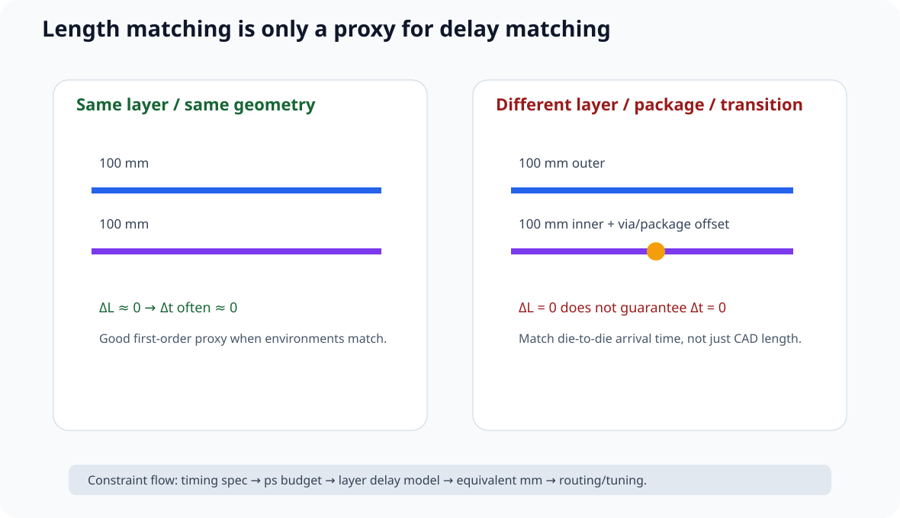
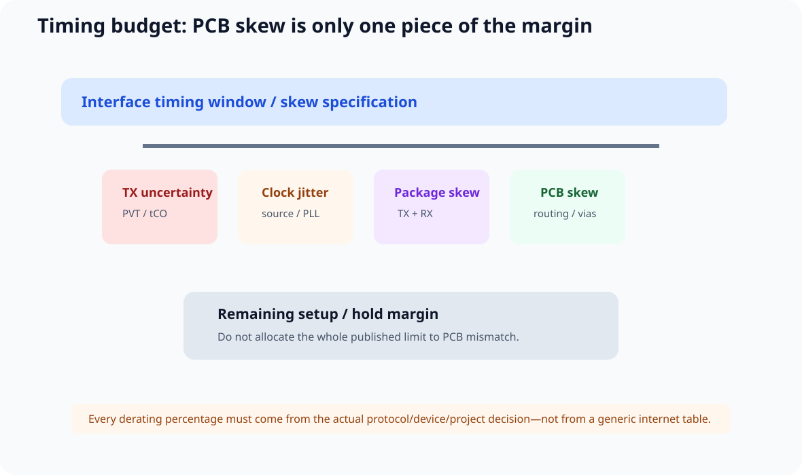
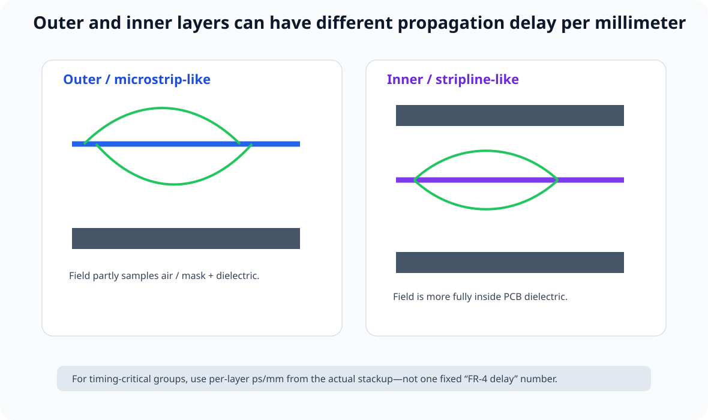
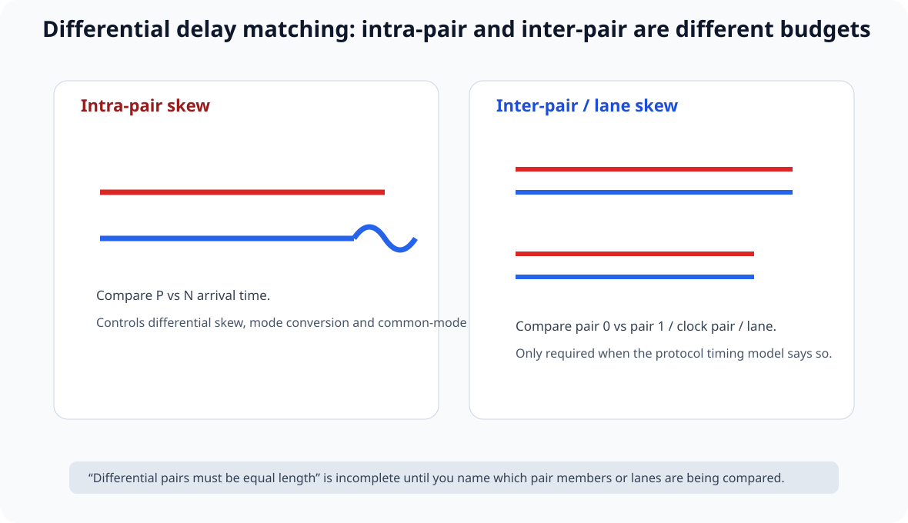

# 12｜高速时延匹配：Timing Budget、层间差异与真正的“等长”

> 本章吸收 Phil's Lab #110 *PCB High-Speed Delay Matching*。
>
> 公开视频明确覆盖 Delay Matching Basics、Outer vs Inner Layer、Delay Calculator、Timing Margins、DDR Skew Spec & Derating、Same Layer/Transition Routing、Single-Ended Tuning、Differential Pair / Intra-Pair Tuning 与 Package Delays。
>
> 核心结论：
>
> **PCB 真正要匹配的是 arrival time，而不是 CAD 里显示的毫米数。**

---

## 12.1 “等长”只是 Delay Matching 的一种实现方式

如果所有网络都在同一层、使用相同几何、相同介质环境、相同 via transition，而且 package delay 也相近，那么 physical length mismatch 可以很好地近似 propagation-delay mismatch。

但只要条件不同：

\[
\Delta L=0
\]

也不保证：

\[
\Delta t=0
\]

正式工程量应该是：

\[
t_{arrival}=t_{package}+t_{PCB}+t_{via}+t_{connector}+...
\]

---

## 12.2 Delay Matching 的起点是 Timing Budget

不要先打开 length-tuning tool。

先写：

~~~text
Interface timing requirement
− transmitter uncertainty
− receiver setup/hold
− clock jitter
− package skew
− PCB transition uncertainty
− margin
=
PCB skew budget
~~~

然后才决定 PCB 允许多少 ps mismatch。

正式 constraint 应优先写：

~~~text
Allowed board skew: XX ps
Propagation model: YY ps/mm
Equivalent delta-L: ZZ mm
Source:
~~~

长度只是 stackup 冻结后的实现值。

---

## 12.3 Outer Layer 与 Inner Layer：相同 mm 不一定相同 ps

视频专门强调 outer vs inner layer。

microstrip-like outer trace 的电磁场一部分在 dielectric、一部分在 air / solder-mask 周围；stripline-like inner trace 的场更主要处于 PCB dielectric 中。

因此：

\[
v_p\approx\frac{c}{\sqrt{\epsilon_{eff}}}
\]

不同 layer structure 的有效介电常数不同，于是相同 physical length 可能有不同 flight time。

### 最省心的 timing group

尽量：

- 同一层；
- 同一 stackup environment；
- 同一 via count / transition pattern。

### 如果必须跨层

不要只比较 total routed length。

应该计算：

\[
t_{PCB}=\sum_i L_i\cdot k_i
\]

其中 \(k_i\) 是该层结构的 ps/mm。

---

## 12.4 Delay Calculator 应该算什么

一个合格的 delay calculator 至少需要：

- layer structure；
- dielectric model；
- geometry；
- effective Dk / propagation velocity；
- trace length。

任何 online calculator 的结果都应标记：

> **Estimate / source / assumptions**

更正式时使用：

- board-fab impedance solver；
- 2D field solver；
- EDA stackup calculator；
- extracted interconnect model。

不要用“FR-4 固定若干 ps/mm”覆盖所有层。

---

## 12.5 Timing Margin：不要把规范全部吃掉

假设 interface 给出容许 skew：

\[
T_{spec}
\]

PCB 不应该直接把全部预算吃完，因为系统还存在：

- process；
- voltage；
- temperature；
- transmitter package；
- receiver package；
- clock jitter；
- connector；
- modeling uncertainty。

视频用 DDR skew spec / derating 来说明这种思路。

课程不猜公开视频里未提供的具体百分比，统一要求：

> **每个 derating 数字必须来自项目 spec / vendor guide / architecture decision。**

---

## 12.6 Same-Layer Routing 为什么有价值

same-layer group 更容易保证：

- 相同 propagation velocity；
- 相同 reference；
- 相似 copper geometry；
- 相同 transition 数量；
- 更简单的 timing model。

所以在 timing-critical bus 里：

> **一致性本身就是设计资产。**

---

## 12.7 Via 不能只按“颗数一样”做 Delay Matching

两个网络都 2 个 via，不代表 delay 完全一样。

还要看：

- layer span；
- barrel length；
- unused stub；
- pad / antipad；
- reference transition；
- nearby return vias；
- via field geometry。

低速并行 bus 可把 identical via count 当成良好的 first-order discipline；更高速时要进一步用 via model / extraction / 3D EM 验证。

---

## 12.8 Single-Ended Group：匹配谁？

典型 parallel interface 可能包含：

~~~text
CLK
DATA[]
ADDR[]
CMD
~~~

不要默认所有信号组成一个 length group。

应该根据：

> **同一个 sampling event**

分组。

例如：

- clock ↔ address/control；
- clock ↔ write data；
- clock ↔ read data；

可能对应不同 timing equation。

所以：

> **Timing group 不等于 Net class，也不等于肉眼看到的一束线。**

---

## 12.9 蛇形线只是补 Delay 的最后工具

正确顺序：

~~~text
placement
→ natural route
→ measure delay
→ compare budget
→ tune only the short nets
~~~

而不是先画一排蛇形让板子“看起来高速”。

meander 会带来：

- self-coupling；
- local impedance change；
- crosstalk；
- extra loss；
- area consumption。

因此：

> **最好的 delay matching 往往来自好的 placement，而不是漂亮蛇形。**

---

## 12.10 蛇形为什么不能挤得太密

相邻 meander segments 属于同一根 net。

当 spacing 很小：

- nearby segments 会互相耦合；
- 实际增加的 electrical delay 小于简单 centerline length 所暗示的值；
- local Z0 也会变化。

因此不要把 CAD 显示的 added length 直接等价成 added delay。

课程也不把固定 3W / 5W 当自然定律；应结合 stackup、H、W、edge spectrum 与目标 delay accuracy 决定 pitch。

---

## 12.11 Differential Pair：有两种不同 Delay Matching

### A. Intra-Pair Matching

比较：

\[
t_P-t_N
\]

目的是控制：

- differential skew；
- mode conversion；
- common-mode generation；
- eye degradation。

### B. Inter-Pair / Lane Matching

比较不同 pair / lane / clock pair 之间的 arrival time。

是否需要匹配、允许多少，取决于 protocol。

所以：

> **“差分对等长”必须先说清是 pair 内还是 pair 间。**

---

## 12.12 Intra-Pair Tuning 应尽量靠近失配发生处

如果 pair 在 connector breakout / BGA escape 里产生 skew，更好的第一反应通常是尽早补偿。

如果 P/N 长时间带着 skew 继续传播：

- differential energy 会部分转成 common mode；
- 后面即使终点长度补平，也不能保证前面的传播过程等于“从没失配过”。

这不是说所有蛇形必须贴 pad，而是：

> **pair skew 是沿路径传播的问题，不只是终点两个长度数字。**

---

## 12.13 Package Delay：PCB Editor 看不到的路径

视频最后专门提醒 package delays。

器件内部从：

~~~text
silicon die
→ package substrate / bond
→ package ball or pin
~~~

本身就有 propagation delay / skew。

因此：

\[
t_{total}=t_{TXpkg}+t_{PCB}+t_{RXpkg}
\]

某些 FPGA / DDR 工具会提供 package flight time / pin delay。

所以：

> **PCB route 一样长，有时反而会让 die-to-die path 不一样长。**

---

## 12.14 Connector / Cable 也属于 Delay Budget

如果 timing-critical path 穿过 mezzanine connector、flex、cable 或 backplane，它们也属于 channel delay。

不能因为 PCB length 已经“绿色”就宣布 timing 闭环。

---

## 12.15 Delay Matching Budget Lab

打开：

**interactive/delay-matching-budget-lab.html**

可以设置：

- outer-layer ps/mm；
- inner-layer ps/mm；
- 两条网络各层长度；
- via-transition delay；
- package-delay offset；
- total skew budget。

页面输出：

- physical length mismatch；
- PCB delay mismatch；
- die-to-die mismatch；
- remaining timing margin。

它会故意展示：

> **0 mm mismatch 也可能出现非 0 ps skew。**

---

## 12.16 KiCad 落地：Length 只是一个可视化指标

KiCad 的 length / skew tuning 很有价值，但工具不知道：

- package delay；
- 真实 layer-dependent ps/mm；
- timing spec；
- jitter budget。

所以 constraint 工作流：

~~~text
datasheet / interface timing
→ timing-budget.md
→ stackup ps/mm
→ allowed route mismatch
→ KiCad tuning
→ post-route delay review
~~~

而不是：

> Tune Length 全绿 = timing 已证明。

---

## 12.17 旧版“统一 ps/mm + 统一长度表”的修正

Legacy 章节常见：

~~~text
FR-4 = one fixed ps/mm
USB = fixed mm rule
HDMI = fixed mm rule
...
~~~

这种表可以帮助建立数量级直觉，但不能作为正式项目 constraint。

原因：

1. ps/mm 随 stackup / layer 改变；
2. protocol revision / device guide 才是 skew 来源；
3. package delay 可能不可忽略；
4. interface 可能有 internal training / deskew；
5. differential intra-pair 与 bus inter-signal 是不同 budget。

正式课程统一采用：

> **Spec → ps → stackup → mm。**

---

## 12.18 Design Review

- [ ] timing constraint 首先以 ps 表达
- [ ] length constraint 有 stackup / ps-mm 来源
- [ ] outer / inner layer delay 已区分
- [ ] timing-critical group 尽量同层 / 同 transition
- [ ] via 不只按数量判断
- [ ] clock / data / address 按 sampling relation 分组
- [ ] meander 只补必要 mismatch
- [ ] meander pitch 不依赖固定口诀
- [ ] differential intra-pair 与 inter-pair 分开
- [ ] package delay 已检查
- [ ] connector / cable 若存在已进入 timing budget
- [ ] KiCad 绿色不是最终 timing evidence

---

## 12.19 本章任务

### Task A：同长度、不同层

建立两根 100 mm trace：

- A：全部 outer layer；
- B：全部 inner layer。

用实际 stackup solver 取 ps/mm，比较 delta-L 和 delta-t 是否同时为零。

### Task B：Package Compensation

给两条网络人为设置：

~~~text
Package A = +40 ps
Package B = 0 ps
~~~

计算 PCB 应该补多少 delay 才能让 die-to-die path 对齐。

### Task C：Differential Pair

找一条 pair：

- 记录 breakout 产生的 skew；
- 决定补偿区域；
- 比较终点补平和失配附近补偿的差别。

---

## 参考资料

- Phil's Lab #110, *PCB High-Speed Delay Matching*: https://youtu.be/xdUR3NzXUkc?si=5AhXkapc3KF_Iihc
- 本课程 Part 0：Edge Rate / Propagation Delay
- 本课程 Part 7：SDRAM Board Timing
- 具体 DDR / memory / SERDES timing 数值必须回到对应器件与接口官方文档

> 来源纪律：视频的主题与章节顺序来自公开视频页面。由于当前没有完整逐字稿，本章没有猜测视频里的具体 DDR 数值；Timing Budget、package/connector 统一模型与 KiCad Gate 属于课程补强。
