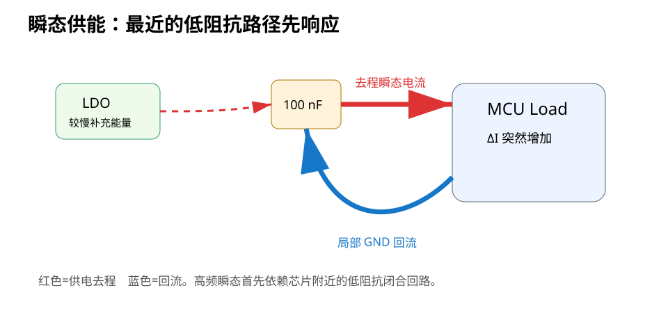

# 01｜瞬态电流：为什么芯片旁边一定要有去耦

> 先不谈 ESR、ESL、PDN，也不谈复杂公式。先回答最重要的问题：**芯片突然需要电流时，谁能最快把电荷送到它脚下？**

---

## 1.1 直流电源图为什么骗了你

原理图上通常这样画：

```text
5 V → LDO → 3.3 V → STM32 VDD
```

它很容易让人形成一个错误直觉：

> STM32 要电流时，LDO 立刻把电流送过来。

现实不是这样。

LDO、走线、过孔、平面、封装都有有限带宽和寄生电感。芯片内部成千上万个晶体管在时钟边沿附近同时翻转时，负载电流可能在很短时间内变化。

如果远处电源来不及补充，局部电源节点会先掉压。

---

## 1.2 把“芯片需要电流”拆成时间尺度

想象 MCU 从轻负载进入大量 IO 翻转：

```text
负载电流
   ▲
   │            ┌────────
   │            │
   │────────────┘
   └──────────────────→ t
                ↑
              电流突变
```

这个变化并不是由一个器件独自承担。

更合理的分工是：

```text
非常短时间尺度：封装/芯片内部电容
        ↓
较高频：芯片旁本地 MLCC
        ↓
更低频：板上 bulk capacitor / plane
        ↓
低频与平均功率：LDO / Buck / 上游电源
```

这是一条“从近到远、从快到慢”的供能链。

---

## 1.3 去耦电容到底在做什么

电容最基本关系：

```text
I = C · dV/dt
```

换一个更适合本章的形式：

```text
ΔV ≈ ΔI · Δt / C
```

它告诉你：

- 负载电流变化 `ΔI` 越大，电压越容易掉；
- 电源必须独自撑住的时间 `Δt` 越长，电压越容易掉；
- 本地可用电容 `C` 越大，理想情况下掉压越小。

### 教学例子

假设某瞬间需要额外 20 mA，并且本地电容需要先独自撑 5 ns：

```text
C = 100 nF
ΔV = 20 mA × 5 ns / 100 nF
   = 1 mV
```

这个计算只是在说明“电荷预算”的直觉。

真实 PCB 还要加：

- ESR；
- ESL；
- 安装电感；
- DC Bias；
- package inductance；
- plane spreading inductance。

所以不能拿这条式子直接宣布“100 nF 一定够”。

---

## 1.4 关键直觉：电容不是给整块板“存电”

一个常见说法：

> 去耦电容就是小水库。

这个比喻可以入门，但不够准确。

真正重要的是：

> **它在目标频率范围内，为芯片建立一个低阻抗的局部供电回路。**

所以同样是 100 nF：

```text
Case A：紧贴 VDD，短连接，短回地
Case B：离 MCU 30 mm，细线连接
```

它们的“电容值”一样，电气效果却完全可能不同。

后面的安装电感章节会把原因拆开。

---

## 1.5 供电回路必须闭合

把去耦看成完整电流回路：

```text
        ┌──────────────→ VDD pin
        │                 MCU
   +----|| Cdec ───────→ internal load
   |                         │
   └──── GND ←───────────────┘
```

瞬态电流不是只经过“VDD 那一条线”。

它还必须经过：

- 电容 VDD 焊盘；
- VDD 铜；
- MCU VDD pin；
- MCU 内部开关网络；
- MCU VSS pin；
- GND 铜；
- 回到电容 GND 焊盘。

这整个几何结构决定了局部供电回路的电感。

> PI 的很多问题，本质上仍然是 Part 0/2 学过的“完整电流路径”问题。



---

## 1.6 为什么 LDO 不能替代本地去耦

假设 LDO 距离 MCU 40 mm。

即使 LDO 本身调节性能很好，LDO 和芯片之间仍有：

- PCB 走线/平面电感；
- 过孔；
- LDO control-loop bandwidth 限制；
- 输出电容的物理位置。

在非常短的边沿时间尺度上，远处电源路径的阻抗可能明显高于本地 MLCC 回路。

所以：

```text
LDO 负责“维持平均 3.3 V”
本地去耦负责“高频瞬态先别让 3.3 V 掉下去”
```

它们不是替代关系。

---

## 1.7 STM32F407 的官方要求

ST AN4488 对 STM32F4 的电源去耦给出了器件级要求：

- VDD：package 级一个至少 4.7 µF、典型 10 µF 的 Tantalum 或 Ceramic；
- 每个 VDD pin：一个 100 nF ceramic；
- VDDA：100 nF + 1 µF；
- VCAP1/VCAP2：当内部 regulator enabled 时，连接规定的低 ESR 电容。

这些不是我们从公式“算出来”的，而是**器件厂商要求**。

### 教材纪律

对于这类规定：

```text
先遵守 datasheet / application note
        ↓
再用 PI 理论解释为什么 placement / loop / parasitic 仍然重要
```

不要反过来拿一个简化公式去推翻器件厂商要求。

---

## 1.8 去耦的三个层次

### 层次 1：Value 正确

有规定的值，先满足规定。

### 层次 2：Connection 正确

不能出现：

```text
VDD pin ─────很长细线───── Cdec ─────很长线──── GND
```

### 层次 3：Loop 正确

真正审的是：

> 从电容 → VDD pin → 芯片内部 → VSS pin → GND → 电容的局部环路是否低电感。

这比“电容中心到引脚多少 mm”更接近物理本质。

---

## 1.9 Fault Lab：最常见的“漂亮去耦”

错误板：

- 所有 100 nF 排成整齐一排；
- 看起来很美；
- 与 MCU 相距 15~25 mm；
- 通过细长走线接到不同 VDD；
- GND 端再绕到一颗公共地过孔。

为什么新手喜欢这样？

> 因为视觉整齐。

为什么工程上可能差？

> 因为局部瞬态回路被拉长，而且多个电容共享狭窄回流路径。

正确思路：

- 电容属于“那个电源引脚”，不是属于“电容区域”；
- 先把回路做短，再考虑视觉排列；
- 多个 VDD pin 不要为了漂亮而共享不必要的长窄颈部。

---

## 1.10 打开 KiCad：第一次 PI 审查

在 STM32F407 V2 上：

1. 隐藏大多数信号 ratsnest；
2. 只看 `+3V3`、`GND`、`VCAP1`、`VCAP2`、`VDDA`；
3. 对每个 VDD pin 找到对应 100 nF；
4. 画出“电容 → VDD → MCU → VSS → GND → 电容”的闭合路径；
5. 记录路径中：
   - 走线长度；
   - 过孔数量；
   - 是否共享狭窄 neck；
   - GND 是否直接进入完整平面；
6. 不要先问“是不是 2 mm 内”，先问“loop 有没有更短、更低电感的画法”。

---

## 1.11 本章任务

### 任务 A

对 V2 所有电源引脚建立一张表：

| Pin group | 官方去耦 | 本地电容 | 回路问题 | Action |
|---|---|---|---|---|
| VDD | 100 nF / pin + package bulk |  |  |  |
| VDDA | 100 nF + 1 µF |  |  |  |
| VCAP | 按 AN4488 |  |  |  |

### 任务 B

找一张你以前画过的 MCU PCB，把去耦电容重新按“loop ownership”排序。

### 任务 C

回答：

> 如果一颗 100 nF 离 MCU 很近，但它的 GND 端通过很长的细线才到地平面，这算“去耦很近”吗？为什么？

---

## 1.12 你应该记住的不是“100 nF”

本章真正要记住的是：

> **负载电流变化需要局部电荷，而局部电荷必须通过低阻抗闭合回路送到芯片。**

下一章我们会发现更麻烦的一件事：

> 你买来的“100 nF 电容”，到了高频并不一定还像 100 nF。
