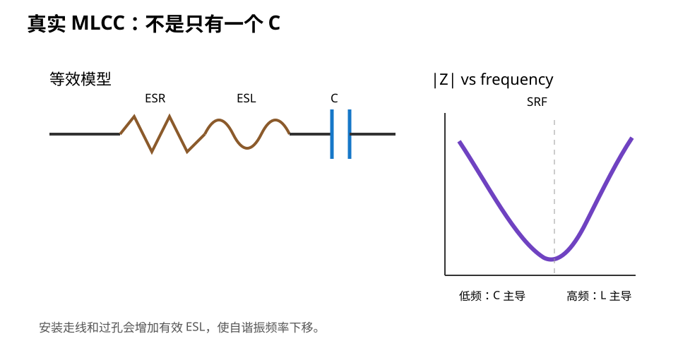

# 02｜真实电容：C、ESR、ESL 与自谐振

> 理想电容只有一个 C。PCB 上真正焊着的电容，同时带着电阻和电感。

---

## 2.1 理想电容的阻抗

理想电容：

```text
Z_C = 1 / (jωC)
|Z_C| = 1 / (2πfC)
```

频率越高，理想电容阻抗越低。

如果世界真的这么简单：

> 只要电容足够大，高频电源阻抗就可以无限低。

现实明显不是这样。

---

## 2.2 真实电容的第一阶模型

最常用的简化模型：

```text
         ESR        ESL
---+----/\/\/------LLLL------||----+---
                               C
```

于是：

```text
Z ≈ ESR + jωESL + 1/(jωC)
```

三个区域：

1. **低频：C 主导**，频率越高阻抗越低；
2. **自谐振附近：C 与 ESL 抵消**，阻抗最低，主要看 ESR；
3. **更高频：ESL 主导**，频率越高阻抗反而越高。



---

## 2.3 Self-Resonant Frequency（SRF）

忽略 ESR 时：

```text
f_SRF ≈ 1 / (2π√(ESL·C))
```

这个频率附近：

```text
|X_C| ≈ |X_L|
```

所以：

- SRF 以下，元件主要像电容；
- SRF 附近，阻抗最低；
- SRF 以上，元件越来越像电感。

### 一个非常重要的认知

> “这是 1 µF 电容”只说明它的标称低频电容量，不代表它在 100 MHz 仍然表现为 1 µF 的理想电容。

真正做 PI 时要看：

- impedance-vs-frequency；
- S 参数；
- 厂商等效模型；
- 实际 DC bias 条件。

---

## 2.4 ESR 不是永远越低越好

ESR 会造成损耗：

```text
V_ESR = I × ESR
```

因此低 ESR 往往有利于降低阻抗。

但多电容网络里，**一些阻尼反而可以压制尖锐共振峰**。

所以不要形成第二个口号：

> ESR 越低越好。

正确说法：

> ESR 是真实网络阻尼的一部分。它是否“好”取决于稳压器要求、PDN 目标和共振行为。

有些 LDO 对输出电容 ESR 范围有稳定性要求；有些现代 LDO 支持低 ESR ceramic。必须查器件 datasheet。

---

## 2.5 ESL 从哪里来

ESL 不只是“电容内部寄生”。

完整的有效电感包括：

```text
电容内部电感
+ 焊盘/端头
+ PCB 走线
+ via
+ plane spreading
+ package connection
```

所以一颗 datasheet 上非常优秀的 0201 电容，如果通过长线和远过孔连接，系统看到的 ESL 仍可能很差。

这就是为什么下一章专门讲 **mounting inductance**。

---

## 2.6 为什么小封装常常高频更好

在相同/相近介质体系下，较小封装通常有机会获得更低的端到端寄生电感。

例如：

```text
0402 metric / 01005 imperial
0603 metric / 0201 imperial
1005 metric / 0402 imperial
1608 metric / 0603 imperial
```

注意中英文/公英制封装名字容易混淆，采购时必须看实际尺寸。

工程结论不是“越小越高级”，而是：

- 高频去耦需要低寄生；
- 但更小封装的可获得容量、电压额定、装配良率、成本也不同；
- 量产能力决定你能安全使用多小的器件。

---

## 2.7 DC Bias：你买的 10 µF 可能不是 10 µF

Class 2 MLCC（常见 X5R/X7R）有一个对初学者很阴险的特性：

> 加上直流电压后，有效电容量会下降。

Murata、TDK 等厂商都明确给出 DC bias 特性和模型。

### 为什么这件事重要

假设 BOM 写：

```text
10 µF / 6.3 V / X5R / 0402
```

工作电压 3.3 V。

你不能仅凭“额定 6.3 V > 3.3 V”就认定实际仍有 10 µF。

应查该**具体料号**在 3.3 V 下的：

```text
Effective Capacitance
```

不同：

- 尺寸；
- 额定电压；
- 介质；
- 厂家；
- 系列；

都会影响 DC Bias 曲线。

---

## 2.8 温度、老化、容差也在变

有效电容还会受：

- 初始容差；
- 温度；
- Class 2 ceramic aging；
- AC drive level；
- DC bias；

影响。

所以大容量 MLCC 用于电源时，BOM 审查应该从：

```text
Nominal value
```

升级成：

```text
Effective capacitance under operating condition
```

---

## 2.9 为什么多个不同值经常一起出现

你经常看到：

```text
100 nF + 1 µF + 10 µF
```

传统解释是：

```text
100 nF 管高频
1 µF 管中频
10 µF 管低频
```

这个说法只够当第一层直觉。

真实网络里每颗电容都有自己的：

- C；
- ESR；
- ESL；
- mounting inductance；
- DC bias 后有效容量。

它们并联后会形成复杂阻抗曲线，甚至出现 **anti-resonance peak**。

所以：

> 多放不同值并不自动等于“频段覆盖完美”。

Part 3 第 5 章会专门拆这个坑。

---

## 2.10 一个简单数值实验

假设：

```text
C = 100 nF
ESL = 0.8 nH
```

自谐振频率近似：

```text
f ≈ 1 / (2π√(0.8 nH × 100 nF))
  ≈ 17.8 MHz
```

如果安装连接再带来 2 nH：

```text
L_total ≈ 2.8 nH
f ≈ 9.5 MHz
```

同一颗“100 nF”，因为 PCB 安装几何，自谐振行为可以明显变化。

这正是 PI 不可以只看 BOM 的原因。

---

## 2.11 互动实验

打开：

[Decoupling Impedance Lab](../interactive/decoupling-impedance-lab.html)

调整：

- C；
- ESR；
- ESL；
- Mounting L；

观察：

- SRF 怎么移动；
- 高频区为什么开始随频率上升；
- 为什么安装电感可能比你换一个电容值更重要。

> 这是教学 RLC 模型，不等同于具体 MLCC 厂商模型。

---

## 2.12 Fault Lab：BOM 上是 10 µF，板上却不够

症状：

- MCU 高负载时 3.3 V dip 比预计大；
- BOM 明明有很多 10 µF；
- 仿真用理想 10 µF 看起来没有问题。

排查：

1. 查具体 MLCC 料号；
2. 查 3.3 V DC Bias 下有效 C；
3. 查封装与安装电感；
4. 查稳压器输出电容要求；
5. 再看阻抗曲线，而不是继续盲加“10 µF”。

---

## 2.13 KiCad / BOM 动作

为 V2 的电容表增加列：

| Ref | Rail | Nominal C | Package | Voltage rating | Dielectric | Effective C @ rail | Role | Source |
|---|---|---:|---|---:|---|---:|---|---|
| Cxx | 3V3 | 100 nF | 0402 | 16 V | X7R | 查料号 | local decoupling | ST + vendor |
| Cyy | 3V3 | 10 µF | 0603 | 6.3/10 V | X5R/X7R | 查料号 | bulk | regulator/vendor |

不要把“10 µF”当完整器件规格。

---

## 2.14 本章任务

1. 找你手头一个 X5R/X7R MLCC 的具体料号，查 DC Bias 曲线；
2. 写出它在实际 rail 电压下的大致有效 C；
3. 用互动实验比较 100 nF、ESL 0.5 nH 与 ESL 3 nH 的 SRF；
4. 解释为什么“更大的电容”不保证“更好的 100 MHz 去耦”。

---

## 2.15 本章结论

> **PI 里真正有用的不是元件丝印上的 C，而是“该元件 + 安装结构”在目标频率和实际偏置下呈现的阻抗。**
