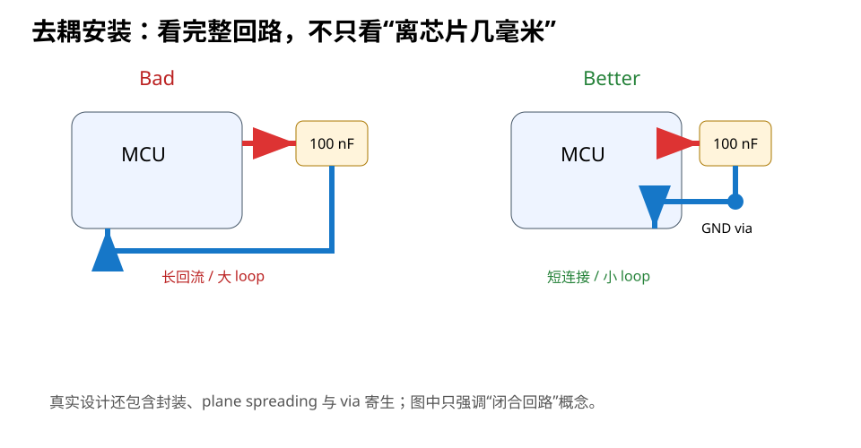
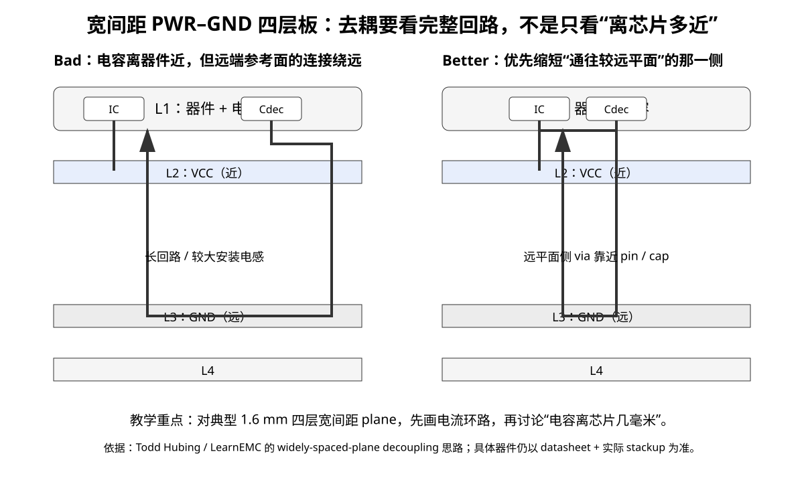

# 03｜安装电感：为什么“位置”往往比电容值更重要

> 去耦不是把电容“放在附近”，而是要把**完整瞬态供电环路的电感**压下来。

---

## 3.1 先看一个反直觉案例

两颗完全一样的 100 nF：

```text
A：0402，紧贴 MCU，但 GND 端绕 12 mm 细线再落地
B：0603，稍远一点，但 VDD/GND 都直接通过短宽铜和邻近平面连接
```

谁更好？

不能只看“中心距”。

真正要比较的是：

```text
L_loop = L_component + L_pad + L_trace + L_via + L_plane + L_package
```

目标是让整个闭合回路的有效电感更低。

---

## 3.2 为什么电感这么致命

电感两端电压：

```text
V = L · di/dt
```

假设回路多出 2 nH，而负载电流变化速度达到：

```text
di/dt = 100 mA/ns
```

那么额外电压扰动量级：

```text
V = 2 nH × 100 mA/ns = 200 mV
```

这只是教学数量级例子，不代表 STM32F407 某个确定引脚的真实 `di/dt`。

它说明：

> 在快瞬态里，几 nH 并不“小”。

---

## 3.3 哪些 PCB 几何会增加安装电感

### 长而窄的 trace

电流路径越长、环路面积越大，一般越不利。

### via 离 pad 很远

这会额外加入横向走线，而且扩大环路。

### 电源和地过孔互相离得很远

往返电流的磁场不能充分抵消，环路面积增大。

### 多个电容共享细 neck

虽然 BOM 上有很多电容，但它们都通过同一段狭窄高电感路径接入芯片。

### 换层绕路

电容在底层、芯片在顶层并不一定错，但必须审完整垂直互连结构。

---

## 3.4 “最近”到底怎么定义

很多教程给一个固定距离：

```text
≤ 1 mm
≤ 2 mm
```

这类数值可以作为某些设计的经验目标，但不是第一性原理。

更好的问题顺序：

1. capacitor pad 到 power pin 的连接多长？
2. capacitor GND pad 多快进入低阻抗 GND？
3. power via 和 GND via 的相对位置如何？
4. 这条 loop 是否被其他器件迫使绕路？
5. package 内部 power/ground pin 的位置怎样？
6. 是否存在更低电感的 pad/via topology？

---

## 3.5 好与坏的典型结构



### Bad

```text
MCU VDD ───────── C
                  │
                  └──────── GND via
```

### Better

```text
MCU VDD ─ C
          │
       GND via
```

### 更工程化的审查

如果 stackup 有紧邻 GND plane：

- 尽快让 GND 端进入平面；
- power path 保持短、宽、少过孔；
- 不要为了“布线漂亮”让去耦回路横跨器件群。

---

## 3.6 Via placement：别只数过孔

常见误区：

> 一个电容放两颗地孔一定比一颗好。

不一定。

两颗 via 如果都离 pad 很远，未必比一颗紧贴 pad 的 via 低电感。

正确做法是看：

- via 数量；
- via 位置；
- via 间距；
- pad 到 via 的铜；
- 进入 plane 后的 spreading；
- 制造能力。

多 via 常用于降低等效电感/电阻和改善电流分布，但需要**正确几何**。

---

## 3.6.1 Via 数量、Via 位置与 Via Pair：优先级不要搞反

视频中的多组 A/B 仿真说明，以下几个变量必须一起看：

1. pad → via 的横向路径；
2. PWR via ↔ GND via 的相对距离；
3. via 数量；
4. 进入 plane 后的 spreading；
5. same-side / opposite-side vertical transition。

其中一个很重要的工程直觉是：

> **把 PWR/GND 两条往返路径做成紧凑的一对，常常比只把某一颗 via 再挪近一点更有意义。**

多个并联 via 确实可能降低互连阻抗，但收益通常不是严格的 1/N，因为会受到 mutual inductance 与 shared spreading 的限制。

完整 A/B 案例见：[14｜仿真案例：去耦电容的 Via、走线与正反面连接到底差多少](14_仿真案例_去耦过孔与连接拓扑.md)。


## 3.7 电源 pin 与地 pin 的配对意识

MCU 封装里，VDD/VSS 往往有多个引脚分布在芯片周围。

不要把所有 100 nF 都当成“给 3.3 V 总线”的。

更好的心智模型：

> 每颗 local decoupler 属于一个局部 power-ground current loop。

这会自然引导你：

- 分散摆放；
- 贴近对应引脚组；
- 避免多个局部回路挤成一个共享 bottleneck。

---

## 3.8 Plane 不是“零电感超级导线”

把去耦接入 plane 后，并不是问题立刻结束。

平面仍有：

- spreading inductance；
- cavity resonance；
- 过孔转换；
- plane pair spacing 的影响。

但对常见四层 MCU 板，完整、邻近的 GND plane 通常是非常重要的低阻抗基础设施。

---

## 3.8.1 30 秒数量级：为什么“几毫米”就能让去耦失效

EEVblog 的工程师讨论里经常用一个非常粗、但很有教学价值的数量级：

> PCB 互连可以先用“约 1 nH/mm”做快速 sanity check。

它**不是精确走线电感公式**，但能帮你立即发现离谱布局。

例如只看一段约 3 mm 的高频连接，先粗估：

[
Lapprox 3	ext{ nH}
]

在 100 MHz：

[
X_L=2pi fLapprox 1.9 Omega
]

在 200 MHz 已经接近：

[
X_Lapprox 3.8 Omega
]

如果完整去耦 loop 的 PWR 与 GND 两边合计路径更长，实际 loop inductance 还会继续增加。

### 🔬 这解释了一个常见“视觉骗局”

~~~text
[MCU VDD]  C
     |     |
     +-----+     ← 看起来电容很近
                           15 mm GND trace
                                         via → plane
~~~

元件中心到芯片可能只有 2 mm，但真正瞬态回路里仍然塞了很长的高频路径。

所以：

> **“电容距离芯片 2 mm”不是电气指标。**

更有意义的是：

- VDD pad → capacitor 的 loop path；
- capacitor GND → reference plane 的 path；
- PWR/GND via pair 的相对位置；
- 是否共享 narrow neck；
- plane entry 是否就近。

### 🧩 现场判断题

下面两种结构，哪一个更值得优先？

**A**

~~~text
MCU pin ─ 1 mm trace ─ C ─ 10 mm trace ─ GND via
~~~

**B**

~~~text
MCU pin ─ via/plane ─ C
                  C GND pad ─ nearby GND via
~~~

不要用“电容离 pin 更近”直接判 A。  
你要画完整 loop，再比较总安装电感。

### 工程实践来源（论坛讨论，不是规范）

- EEVblog, *Decoupling caps*  
  https://www.eevblog.com/forum/beginners/decoupling-caps/
- Electronics StackExchange, *Decoupling caps, PCB layout*  
  https://electronics.stackexchange.com/questions/15135/decoupling-caps-pcb-layout

这两组讨论内部也存在不同设计流派：有人强调 local island / 抑制 plane 激励，有人强调直接进 plane、最小 loop inductance。教材不把某一帖升级成铁律；真正共同点是：

> **先分析高频电流闭合路径，再谈“电容多近、多少颗、什么值”。**


## 3.8.2 三种 PDN 环境，去耦“距离规则”为什么完全不同？

文章/应用笔记资料里一个很重要的共同点是：

> **不要脱离 stackup 谈 decoupling placement。**

同样一颗 100 nF，在下面三种板上承担的角色并不一样。

| PDN 环境 | 高频电流主要依赖什么 | Layout 重点 |
|---|---|---|
| 没有真正 plane pair，电源靠 trace/pour | 离散电容 + 完整 mounting loop | 电容、PWR/GND via、pin 之间的 loop L |
| 典型 1.6 mm 四层，PWR–GND 相隔很远 | plane C 很弱，仍主要靠离散电容 | via pair、same-side placement、局部 loop |
| 紧耦合 plane pair（更高层数/特定 6L+） | plane pair 可承担更高频储能/传播 | cap 位置敏感度可能下降，但 cavity/target-Z 仍需分析 |

### 🗺️ PDN Regime Map

~~~mermaid
flowchart TD
    A[先看实际 PWR-GND separation] --> B{是否紧耦合?}
    B -- 否 --> C[把 decoupling 当成 mounting-inductance 问题]
    C --> D[优化 cap-via-pin 完整 loop]
    B -- 是 --> E[评估 plane-pair C / spreading impedance]
    E --> F[再决定 cap 数量/位置与 anti-resonance]
    D --> G[验证 Ztarget / noise]
    F --> G
~~~

### “多加几颗电容”不一定比“把两颗移近”更有效

Signal Integrity Journal 收录的 decoupling optimization 案例展示过：

- 原本若干电容都在较远位置；
- 不增加 BOM；
- 只是把其中一部分移到更低 loop-inductance 的位置；
- pin 端看到的 PDN impedance 就明显改善。

所以当 PDN fail 时，修改顺序不要只有：

~~~text
再加 100 nF
→ 再加 1 µF
→ 再加 10 µF
~~~

还要问：

> **现有这些电容，有多少真的通过低电感路径“看得见”芯片 pin？**

### BGA 的特殊情况

处理器/BGA 常见做法是：

- mid/high-frequency MLCC 放在器件背面；
- PWR/GND vias 尽量短而密；
- 必要时使用 via-in-pad / buried structure；
- bulk 放得更远，负责更低频能量。

这不是因为“BGA 背面看起来专业”，而是为了降低 die/package/board 到 capacitor 的总 loop inductance。

### 一手/高质量来源

- Sierra Circuits, *Decoupling Capacitor Placement Guidelines*  
  https://www.protoexpress.com/blog/decoupling-capacitor-placement-guidelines-pcb-design/
- Signal Integrity Journal, *On-Board Decoupling Capacitor Optimization*  
  https://www.signalintegrityjournal.com/articles/1345-on-board-decoupling-capacitor-optimization
- TI, *Sitara Processor Power Distribution Networks* (SPRAC76H)  
  https://www.ti.com/lit/an/sprac76h/sprac76h.pdf

> 资料中的具体 MHz、距离和电容值属于对应结构/案例；课程吸收的是 **PDN 环境决定 layout 策略** 这个方法。


## 3.8.3 Hubing：宽间距四层板，电容到底应该靠哪个 Pin？

前面说“电容要靠近芯片”还不够。Todd Hubing 专门讨论了 **PWR–GND 间距较大的四层板**：这类板的 plane loop inductance 不能忽略，电容摆放要看哪个 pin 通向**更远的参考平面**。



### 用人话理解

假设器件在 L1，L2 是 VCC，L3 是 GND，而且 L2–L3 隔得很远：

- VCC pin 很快就进入 L2；
- GND pin 还要穿过更长的 via path 才到 L3；
- 因此这个 **GND 侧路径更容易成为高频环路的电感瓶颈**。

所以这类结构里，不是机械地把电容“贴 IC 最近的位置”，而是让 **电容到远平面那一侧的 via / pin 回路最短**。

### 30 秒判断题

同样一颗 0402，两种布局都距离 MCU 1.5 mm：

| 方案 | 几何 | 判断 |
|---|---|---|
| A | 电容很近，但 GND pad 先走一段 trace 再下 via | 看起来近，回路仍可能很差 |
| B | 电容稍微转 90°，GND via 贴着 pad 和 MCU GND pin | 往往更合理 |

这也是为什么 **via-in-pad / via-beside-pad** 常比“先拉一小段线再打孔”有效。

### Hubing 给了什么新证据？

资料中的实测 pad-layout 连接电感从约 **0.6 nH 到十几 nH** 都可能出现；差异主要来自连接几何，而不是陶瓷本体突然变了。

> 这些数值属于 Hubing 的具体测试结构。课程吸收的是：**连接几何能让同一颗电容的有效高频能力相差一个数量级。**

### 来源

- Todd Hubing, *Estimating the Connection Inductance of a Decoupling Capacitor*  
  https://learnemc.com/estimating-connection-inductance
- Todd Hubing, *Power Bus Decoupling Guidelines for Boards with Widely Spaced Planes*  
  https://learnemc.com/decoupling-for-boards-with-widely-spaced-planes


## 3.9 KiCad 实操：对 V2 做“环路审查”

### 步骤 1

给每颗关键去耦加 `Properties → Reference/Value` 清晰标识。

### 步骤 2

切换层可视化，只留下：

- MCU footprint；
- 3V3；
- GND；
- decouplers；
- vias。

### 步骤 3

逐颗记录：

| Cap | VDD path | GND path | vias | shared neck? | action |
|---|---|---|---:|---|---|
| C1 | short | short | 1/1 | no | keep |
| C2 | long | short | 1/1 | no | move |

### 步骤 4

优先修：

1. VCAP；
2. VDDA/VREF；
3. 核心 VDD local decoupling；
4. package bulk；
5. 其他 rail bulk。

---

## 3.10 Fault Lab：离得近，但回路很差

故意构造：

- 电容距 VDD pad 0.8 mm；
- GND pad 通过 15 mm 细线才到 via；
- DRC 全过；
- 视觉上“电容很近”。

要求学生：

1. 画出完整供电 loop；
2. 标出不必要的电感来源；
3. 把 GND via 移到 capacitor pad 边；
4. 比较 before/after loop area；
5. 把规则写进 Review Checklist。

---

## 3.11 本章任务

1. 对 STM32F407 V2 选 5 颗关键去耦，手动画完整 loop；
2. 找一颗“距离近但回路差”的候选；
3. 修改 placement/via 后重新截图；
4. 写一句设计决策：

> 我移动这颗电容不是为了满足 X mm 规则，而是为了减少 ______。

正确答案应该接近：**安装电感 / 闭合回路面积 / 共享瓶颈**。

---

## 3.12 本章结论

> **去耦布局的核心指标不是“电容离芯片多近”，而是“芯片瞬态电流看到的完整回路阻抗有多低”。**
