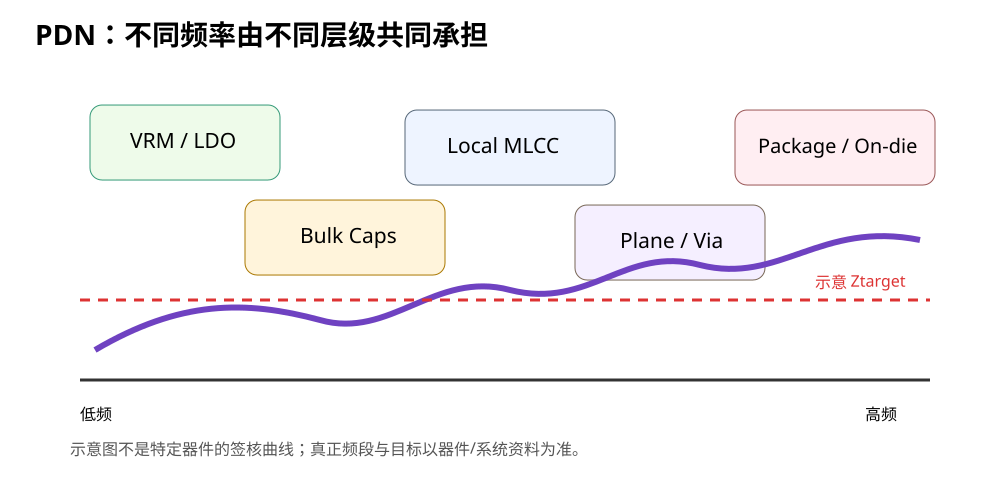

# 04｜PDN 与 Target Impedance：把“电源要稳”变成可设计的目标

> Power Distribution Network（PDN）不是“电源线”。它是从稳压器、平面、过孔、电容、封装一路到芯片内部的整个供电网络。

---

## 4.1 PDN 包含什么

对一条 3.3 V rail：

```text
上游电源
  ↓
LDO / Buck
  ↓
输出电容
  ↓
PCB power routing / plane
  ↓
bulk / local decoupling
  ↓
via / package
  ↓
MCU internal load
  ↓
GND return path
```

所有这些共同决定芯片看到的：

```text
Z_PDN(f)
```

也就是“电源网络阻抗随频率怎么变化”。

---

## 4.2 为什么要看阻抗，不只看电压

如果负载电流扰动为：

```text
ΔI(f)
```

电源电压扰动近似：

```text
ΔV(f) ≈ Z_PDN(f) · ΔI(f)
```

因此：

- `Z_PDN` 越高，同样电流变化引起的电压变化越大；
- 只看 DC 3.300 V 不能说明高速瞬态是否健康；
- PI 的核心设计动作之一，就是控制 `Z_PDN(f)`。



---

## 4.3 Target Impedance 的直觉

假设：

- rail = 1.0 V；
- 允许电压扰动 = ±25 mV；
- 负载瞬态变化量 = 1 A。

最简单的阻抗预算：

```text
Z_target ≈ ΔV_allowed / ΔI_transient
         = 25 mV / 1 A
         = 25 mΩ
```

意思不是“放一个 25 mΩ 电阻”。

意思是：

> 在关注的频率范围内，希望整个 PDN 的阻抗不要高到让负载瞬态把 rail 推出允许窗口。

---

## 4.4 为什么不同资料里的 Ztarget 公式不完全一样

你会在厂商 PI 文档里看到不同形式：

```text
Ztarget = allowed ripple / transient current
```

也可能看到额外系数，例如对电流谱、峰峰值定义、容差分配做处理。

TI 的一些 PDN 方法会使用厂商定义的频域目标与电流假设。

### 教材纪律

不要把某一个简化公式写成所有芯片通用签核公式。

正确流程：

1. 有芯片厂商明确 PDN target → 用厂商要求；
2. 没有 → 用系统允许纹波和瞬态电流做工程估算；
3. 明确 `ΔI` 和 `ΔV` 是怎样定义的；
4. 记录频率范围；
5. 对 DDR/SerDes/高端 SoC，按厂商要求做更完整的 PI/sign-off。

---

## 4.5 为什么必须带“频率范围”

写：

```text
Ztarget = 50 mΩ
```

还不完整。

需要写：

```text
Ztarget = 50 mΩ, DC → Fmax
```

因为供电责任随频率变化：

```text
低频：VRM control loop
中低频：bulk capacitor
中高频：local MLCC + planes
更高频：package / on-die capacitance
```

板级电容不是无限高频都有效。

---

## 4.6 STM32F407 需要做到 SoC 级 PIA 吗？

通常没有必要把一块普通 F407 四层学习板做成高端 SoC 的完整 target-impedance sign-off。

但它非常适合学习以下能力：

- 把“允许电压扰动”和“负载变化”写成预算；
- 理解 PDN 的频率分工；
- 看懂 impedance plot；
- 知道为什么以后 STM32H7 + SDRAM / FPGA 会需要更严谨的 PI。

所以 V2 采用：

> **教学级 PDN budget + 官方 decoupling requirement + 低电感 layout review。**

到六层高速阶段再升级工具深度。

---

## 4.7 一个教学级 3.3 V rail 预算

以下数字只是演示，不是 STM32F407 官方 PI 限值：

```text
Vrail = 3.3 V
允许瞬态扰动 = 100 mV
假设关注的快速负载变化 = 200 mA
```

得到：

```text
Ztarget ≈ 0.1 / 0.2 = 0.5 Ω
```

这个值看起来并不严苛，因为 F407 与大电流 SoC 完全不是一个量级。

真正教学价值是学会：

> 如果未来 rail 只有 0.9 V、允许 18 mV、瞬态电流 3 A，目标会一下进入 mΩ 级。

---

## 4.8 PDN 阻抗曲线怎么看

典型图：

```text
|Z|
 ▲
 │  VRM
 │   \          anti-resonance
 │    \___     /\
 │        \___/  \____
 │                   \  package/on-die
 └────────────────────────→ frequency
```

你应该找：

- 是否存在高于 target 的峰；
- 峰出现在哪个频段；
- 哪一段由 VRM、bulk、MLCC、plane、package 主导；
- 加电容后是压低峰，还是制造了新峰。

---

## 4.9 互动实验：Target Impedance Lab

打开：

[Target Impedance Lab](../interactive/target-impedance-lab.html)

输入：

- rail voltage；
- allowed ripple；
- transient current；
- safety/definition factor。

观察目标阻抗怎么变化。

实验目的：

- 电压越低、允许纹波越小，PI 越难；
- 电流越大，Ztarget 越低；
- 高性能 SoC/FPGA 的核心 rail 为什么会进入几十 mΩ 甚至更低。

---

## 4.10 Target Impedance 不是“多放电容”的同义词

想让 `Z_PDN` 低，可以动的变量包括：

- VRM 输出网络；
- bulk cap；
- MLCC value / ESR / ESL；
- 安装电感；
- plane geometry；
- via topology；
- package；
- on-die decap。

盲目加电容的问题：

1. 可能没有改善目标频段；
2. 可能制造 anti-resonance；
3. 占 BOM / 面积；
4. 可能违反某些 regulator 输出电容稳定性要求。

---

## 4.11 KiCad 项目动作

在 `projects/stm32f407-mainline/v2/` 建 rail budget：

| Rail | Source | Nominal | Allowed disturbance | Estimated transient | Teaching Ztarget | Sign-off source |
|---|---|---:|---:|---:|---:|---|
| 3V3 | LDO | 3.3 V | TBD | TBD | calculate | board estimate |
| VDDA | filtered 3V3 | 3.3 V | TBD | small | n/a | ST requirement |
| VCAP | internal regulator node | device-defined | device-defined | device-defined | n/a | ST AN4488 |

注意：

> VCAP 不是普通用户电源 rail，不能拿通用 3.3 V target-impedance 逻辑随意改它的电容。

---

## 4.12 Fault Lab：只看平均电流

错误设计：

- 统计 MCU 平均只吃 80 mA；
- 于是认为任何“能供 100 mA”的路径都够；
- 完全不考虑瞬态 `ΔI` 和路径电感。

症状：

- 平均电流没超；
- rail DC 万用表正常；
- 高负载边沿仍出现 dip / reset / ADC noise。

修复思路：

> 把“平均功率预算”和“动态阻抗预算”分开。

---

## 4.13 本章任务

1. 给 V2 3.3 V rail 建一个教学级 `ΔV/ΔI` 预算；
2. 明确哪些数字是估算、哪些来自器件资料；
3. 用 Target Impedance Lab 改变负载电流，观察目标难度；
4. 解释为什么“LDO 额定 600 mA”不能替代 PDN 分析。

---

## 4.14 本章结论

> **Target Impedance 的价值，是把模糊的“电源要稳”变成“在某个频率范围内，PDN 阻抗要低于一个有来源的目标”。**
