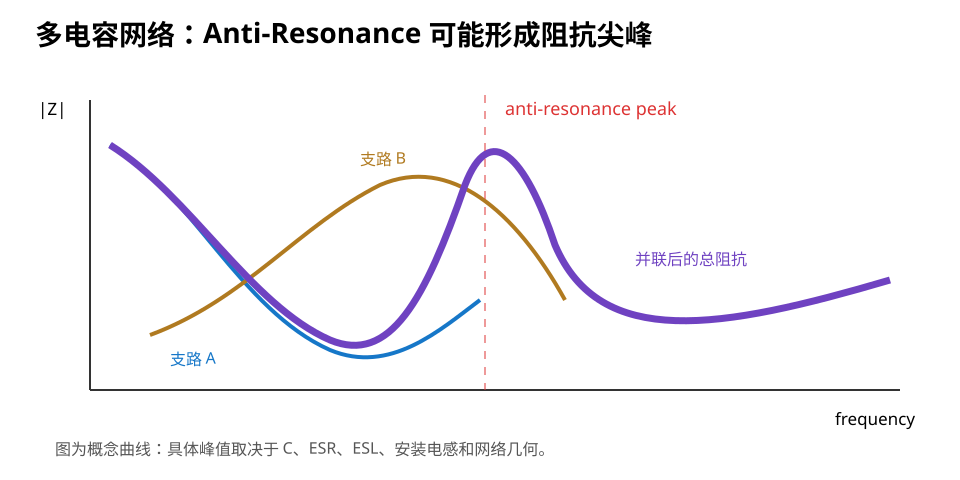

# 05｜多电容网络与 Anti-Resonance：为什么“100 nF + 1 µF + 10 µF”不一定完美

> 并联多个电容的目标是降低一段频率范围内的 PDN 阻抗；但真实 RLC 元件并联后，也可能制造新的高阻抗峰。

---

## 5.1 理想世界里的并联电容

理想电容并联：

```text
C_total = C1 + C2 + C3 + ...
```

所以直觉会说：

> 电容越多越好。

如果每颗都是理想 C，这几乎没毛病。

但真实电容是 RLC 网络。

---

## 5.2 两颗不同 SRF 的电容并联会发生什么

假设：

```text
C1 = 100 nF，SRF 较高
C2 = 10 µF，SRF 较低
```

在某些中间频率：

- C2 可能已经偏感性；
- C1 仍偏容性；

于是两条支路可能形成一个并联谐振条件。

结果：

```text
|Z|
 ▲
 │        /\  ← anti-resonance peak
 │  \____/  \____
 │
 └────────────────→ f
```

这个峰可能比单颗电容时的阻抗更高。



---

## 5.3 什么是 Anti-Resonance

“Resonance”常让阻抗下降到局部低点。

“Anti-Resonance”在并联网络里常表现为：

> 某个频率附近总阻抗反而出现尖峰。

其根源是不同支路的电容性/电感性电流互相抵消，使供电端看到较高阻抗。

这不是神秘现象，而是 RLC 网络的自然结果。

---

## 5.3.1 别把 Series Resonance 和 Anti-Resonance 混在一起

Part 2 的阻抗基础补充后，课程统一术语：

### 单颗真实 capacitor 的 series resonance

series ESL 与 C 抵消：

> **|Z| 出现 minimum。**

### 多支路 PDN 的 parallel / anti-resonance

一个 branch 偏 inductive，另一个 branch 偏 capacitive，支路电流可能互相抵消：

> **总 |Z| 反而出现 maximum。**

所以看到 resonance 一词时，必须问：

> **是 series resonance 的低谷，还是 parallel / anti-resonance 的高峰？**

二者对 PI 的意义恰好相反。


## 5.4 为什么 ESR 会影响峰值

如果所有元件 ESR 极低，谐振可能非常尖锐。

存在适当阻尼时，峰可能被压低。

因此工程里有时会看到：

- deliberately damped capacitor；
- polymer/electrolytic 与 MLCC 混用；
- 通过实际 ESR 形成阻尼；
- 特定 RC damping network。

不要由此得出“高 ESR 更好”。

正确理解：

> **系统需要低阻抗，同时也需要控制不希望出现的高 Q 共振。**

---

## 5.4.1 Fast Edge 可以“敲响”一个低得多的 PDN Resonance

负载 repetition frequency 很低，不代表 PDN 只会在那个频率上响应。

一次快速 current step 含有宽频谱；如果其中某些频率成分落在 PDN resonance 上，就会出现 ring-down。

若下一次 switching 在振荡尚未衰减时再次注入能量，且时序接近 resonance / harmonic relation，ringing 可能持续增强。

因此：

> **要区分 load repetition frequency 与 PDN natural resonance。**

案例见：[13｜实测案例：PDN 阻抗峰为什么会变成 VCC 噪声](13_实测案例_PDN阻抗峰与VCC噪声.md)。


## 5.5 “十倍值阶梯”不是物理定律

旧式经验常说：

```text
100 pF + 1 nF + 10 nF + 100 nF + 1 µF + 10 µF
```

仿佛每十倍一个值就自动覆盖全频段。

现代 MLCC 的寄生、封装、DC Bias 和安装结构，使这种机械规则并不可靠。

更好的方法：

1. 先有 target / frequency concern；
2. 获取具体电容模型；
3. 带入 mounting inductance；
4. 看总阻抗曲线；
5. 根据峰/谷调整，而不是按 decade collect capacitor values。

---

## 5.6 相同值多颗并联有什么好处

例如多颗相同 100 nF 并联：

- 理想总容量增加；
- ESR/ESL 可在一定程度上并联下降；
- 可以分布在多个电源引脚附近，各自服务局部 loop；
- 相比“为了频段覆盖随便混很多值”，行为更容易预测。

但它也不是万能解：

- 每颗安装路径不同；
- plane spreading 不同；
- package 到不同引脚的路径不同。

所以“相同值”也需要 layout-aware analysis。

---

## 5.7 Bulk 与 Local Decoupling 的角色不要混

### Bulk capacitor

更偏向：

- 较低频能量；
- VRM/LDO 输出稳定；
- 负载阶跃的较慢部分；
- connector/hot-plug 等系统级能量缓冲。

### Local MLCC

更偏向：

- 高一些的频率；
- 芯片局部瞬态；
- 缩短供电回路。

两者角色有重叠，但不能简单互相替换。

---

## 5.8 一个设计流程例子

假设某 rail 已有：

```text
1 × 22 µF bulk
8 × 100 nF local
2 × 1 µF local/nearby
```

不要先问：

> 要不要再加 10 nF？

应该先问：

1. 当前 `Z_PDN(f)` 哪个频段超目标？
2. 22 µF 在工作电压下有效容量多少？
3. 100 nF 的 mounting L 多大？
4. 是容量不足，还是安装电感主导？
5. 是否已有 anti-resonance peak？
6. regulator 对输出电容总量/ESR 有什么要求？

---

## 5.9 STM32F407 V2 的处理方式

V2 不需要做成高端 SoC 那种几十颗不同电容的“电容农场”。

我们采取：

- 按 ST AN4488 满足 VDD / VDDA / VCAP 官方要求；
- package bulk 按官方建议；
- local 100 nF 分散服务对应 VDD pin；
- 对 LDO 输出电容按 regulator datasheet；
- 不为了“看起来高级”随意堆额外 decade values；
- 记录具体料号的 DC Bias / package。

这本身就是一种 PI 工程纪律。

---

## 5.10 Fault Lab：电容农场

错误板：

```text
每个电源 rail：
10 pF
100 pF
1 nF
10 nF
100 nF
1 µF
10 µF
100 µF
```

理由：

> “这样从低频到高频都覆盖了。”

任务：

1. 质疑每一个值的来源；
2. 查具体元件模型；
3. 画出并联网络可能产生的峰；
4. 删除没有依据的值；
5. 把剩余电容按角色分类：regulator / bulk / local / interface。

---

## 5.11 什么时候需要真正做 PDN 仿真

普通低功耗 MCU 板：

- 官方 decoupling；
- 合理 placement；
- 完整 plane；
- 示波器验证；

通常已经能解决大部分实际问题。

当进入：

- FPGA core rail；
- 大电流 SoC；
- DDR；
- 高速 SerDes；
- 多 rail 同时切换；

就应该考虑：

- capacitor vendor models；
- package model；
- board extraction；
- PDN impedance simulation；
- power-aware SI。

这会在 STM32H7 / FPGA 专项里继续升级。

---

## 5.12 本章任务

1. 把 V2 所有电容按 `regulator / bulk / local / analog / VCAP` 分类；
2. 找出任何“只是因为习惯所以放”的值；
3. 为它写来源，或者删除；
4. 用纸笔画出 100 nF 与 10 µF 两个真实 RLC 支路并联时为什么可能有 anti-resonance；
5. 回答：为什么“更多电容”不等于“更低的所有频率阻抗”？

---

## 5.13 本章结论

> **去耦网络是一个频率相关的 RLC 系统，不是电容值的收藏列表。**
