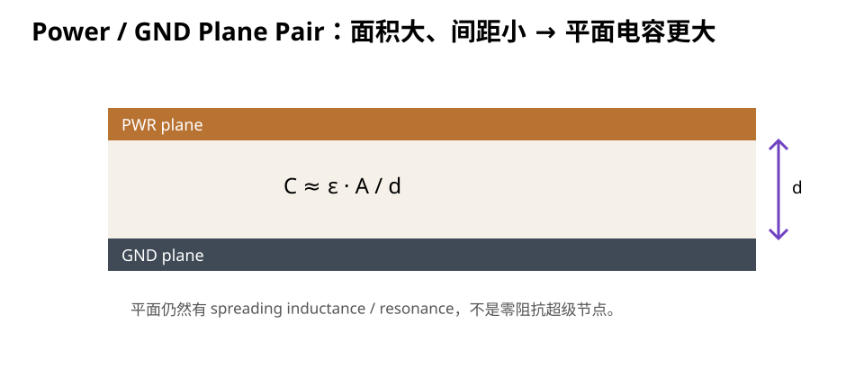
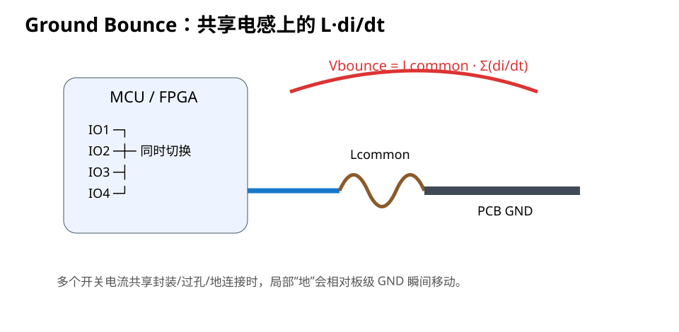

# 06｜电源/地平面、Ground Bounce 与 SSN

> “有一整层 GND”不是终点。PI 关心的是电源和地作为一个供电系统，如何承载快速变化的电流。

---

## 6.1 Power Plane 与 Ground Plane 为什么有价值

多层板里，连续平面提供：

- 较低的直流电阻；
- 更好的大面积电流分布；
- 与相邻参考平面形成较小的回路高度；
- 为信号 Return Path 提供连续参考；
- 为电源网络提供低阻抗几何基础。

但注意：

> 平面不是“零欧姆、零电感、无限带宽”的理想节点。

---

## 6.2 Plane Pair 本身有电容

相邻电源/地平面类似一个很大的平板电容：

```text
C ≈ ε · A / d
```

其中：

- `A` = 重叠面积；
- `d` = 平面间介质厚度；
- `ε` = 介质介电常数相关项。

因此：

- 平面越近；
- 重叠面积越大；

plane-pair capacitance 越大。



但对普通四层 1.6 mm 板，如果 PWR/GND 中间 core 很厚，plane-pair capacitance 往往并没有新手想象得那么巨大。

所以它是 PDN 的一部分，不是 local MLCC 的替代品。

---

## 6.3 Spreading Inductance

电流从一颗电容经 plane 向芯片扩散时，并不是瞬间在整块铜上平均分布。

高频下存在：

```text
spreading inductance
```

其大小受：

- plane separation；
- source/load 距离；
- via transition；
- plane cutout；
- current spreading geometry；

影响。

所以：

> “已经接到地平面”不等于“安装电感为零”。

---

## 6.4 Ground Bounce 是什么

芯片内部和封装的“地”并不是理想零阻抗。

多个输出同时切换时，大电流变化经过共享 ground inductance：

```text
V_bounce = L_common · di/dt
```

于是芯片局部 VSS 相对 PCB 全局 GND 会瞬间移动。

这就是 Ground Bounce 的核心直觉。



---

## 6.5 SSN：Simultaneous Switching Noise

假设多个 GPIO 同时从高变低：

```text
IO1 ┐
IO2 ├──同时切换──→ package / VSS common path
IO3 ┤
IO4 ┘
```

每路单独看电流不大，但总 `di/dt` 在共享封装/地路径叠加。

可能带来：

- ground bounce；
- VDD droop；
- threshold margin 变差；
- jitter；
- ADC reference/noise 问题；
- EMI 增加。

---

## 6.6 为什么“地越多越好”仍然需要解释

增加 GND pin / GND via 往往有利，因为可以：

- 降低共享路径电感；
- 分散电流；
- 缩短局部回路；

但不能机械写成：

> 每两个 pad 必须一个地孔。

真正依据仍然是：

- package pinout；
- current density；
- return path；
- via geometry；
- stackup；
- manufacturer guidance。

---

## 6.7 为什么完整 GND plane 很关键

对 STM32F407 四层板，L2 完整 GND 的价值同时属于 SI 和 PI：

### SI

提供连续 return/reference。

### PI

给：

- VSS pins；
- decoupling GND；
- regulator GND；
- interface return；

提供低阻抗共同基础。

把 L2 为了救一根信号线切开，会同时伤害 SI 和 PI。

---

## 6.8 Power plane split 的问题

L3 可能包含多个 power island：

```text
3V3
5V
VDDA/filter region
其他 rail
```

分割本身不一定错。

问题是：

1. 是否产生狭窄 neck 造成供电阻抗上升；
2. 是否让 Bottom 信号跨 split；
3. local decoupling 是否被迫跨越长路径；
4. plane island 是否形成意外天线/耦合；
5. 是否存在不必要的孤岛。

---

## 6.9 3.3 V 的“最短路径”不等于最优

如果为了给 MCU 供电，在 L3 画一条非常窄、但几何直线最短的铜颈：

```text
LDO ======= narrow neck ======= MCU
```

它可能：

- DC 压降变大；
- spreading/constriction impedance 变差；
- 所有瞬态电流共享 bottleneck。

所以 power routing 要看：

- 铜宽/面积；
- thermal；
- current return；
- decoupling distribution；

不只看 path length。

---

## 6.10 Analog rail：不要用“分割地”解决所有噪声

ADC 噪声问题经常引出一个危险反应：

> “把模拟地和数字地彻底割开。”

这可能制造更糟的 return discontinuity。

对 STM32F4 类 MCU，更好的起点通常是：

- 遵守 VDDA/VREF 官方供电/去耦要求；
- 控制数字高 `di/dt` 回路；
- 保持完整参考平面；
- 合理过滤/隔离模拟供电；
- 对敏感模拟 routing 做物理隔离；

而不是先切一个巨大的地缝。

具体模拟地策略要看器件文档和系统拓扑。

---

## 6.11 Fault Lab：多个 VSS 共用一条细长回地

错误设计：

- MCU 多个地引脚先在 Top 用细线串起来；
- 最后只通过一颗远处 via 下到 L2 GND；
- DRC 完全通过。

分析：

```text
多个 switching current
        ↓
共享细长 inductive path
        ↓
Lcommon · Σ(di/dt)
        ↓
local ground bounce 增大
```

修复：

- 根据 footprint/pin 分布让 VSS 更直接进入 plane；
- 避免不必要共享 neck；
- 与对应去耦 loop 一起审查。

---

## 6.12 KiCad Review

检查：

### GND

- L2 是否保持连续；
- MCU VSS 是否直接、分散地进入平面；
- decoupling GND 是否存在细长共享路径。

### Power

- L3 3V3 是否有 bottleneck；
- split 边界是否穿过关键 Bottom 信号；
- bulk 到 local 的供电路径是否合理。

### Analog

- VDDA/VREF 是否按 ST 方案；
- 数字大电流回路是否穿过敏感 analog area。

---

## 6.13 本章任务

1. 对 V2 关闭所有信号层，只看 L2/L3；
2. 标出 3 个可能的 power bottleneck；
3. 标出所有 power split 边界；
4. 检查 Bottom 关键网络是否跨 split；
5. 找出 MCU VSS 进入 GND plane 的路径；
6. 解释 Ground Bounce 为什么不是“地线电阻太大”这么简单。

---

## 6.14 本章结论

> **完整平面让电流有更好的几何基础，但 PI 仍然必须审查局部回路、共享电感、plane spreading 与分割。**


## 6.15 延伸：Power Plane 是否真的需要

平面的价值必须拆成 DC distribution、signal reference、plane-pair、return transition 与 thermal 等不同角色。对于中小电流四层板，`SIG/GND/GND/SIG` 有时能让跨层信号通过 nearby same-net GND via 获得更低电感的 reference transition；但这不是所有项目的默认答案。

详见：[12｜电源层真的必要吗：双 GND、Reference Transition 与 Plane Cavity](12_电源层真的必要吗_双地平面与PlaneCavity.md)。
