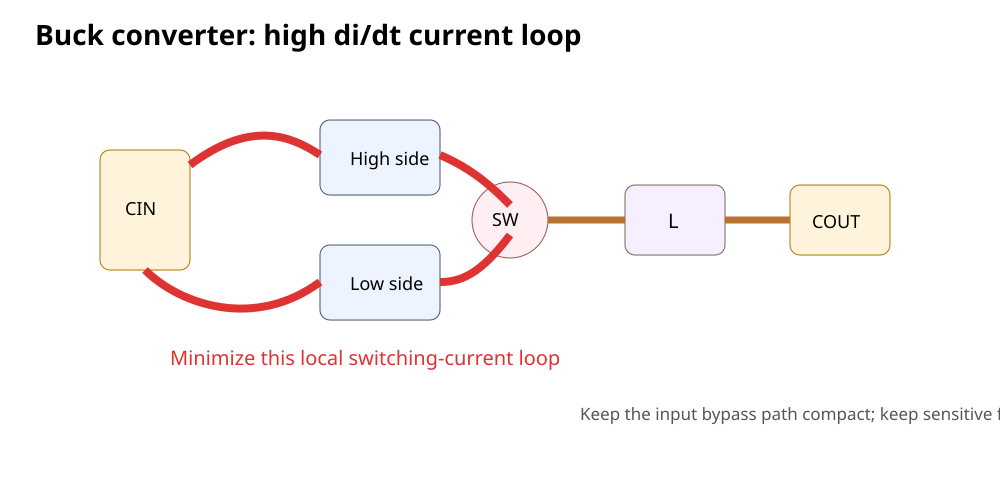

# 07｜Buck Hot Loop：开关电源为什么最吃布局

> 开关电源最危险的误区之一是：**只要原理图连接正确、线够粗，就能正常工作。**
>
> Buck 的很多 EMI、振铃、效率和稳定性问题，首先是“高 `di/dt` 电流环路几何”问题。

---

## 7.1 先看 Buck 的基本结构

同步 Buck 简化为：

```text
VIN
 │
CIN
 │
HS FET ── SW ── L ── COUT ── LOAD
 │
LS FET
 │
GND
```

新手容易把所有大电流路径都当成同等重要。

实际上布局优先级并不一样。

---

## 7.2 找 Hot Loop 的方法：比较两个开关状态

### High-Side ON

电流：

```text
CIN+ → HS FET → SW → L → output/load → GND → CIN-
```

### Low-Side ON

电流：

```text
LS FET → SW → L → output/load → GND → LS FET
```

把两个状态相减，会发现**最剧烈变化的电流路径**集中在：

```text
CIN
 ↕
HS FET
 ↕
LS FET
```

也就是输入电容和开关桥之间的高 `di/dt` loop。

TI 的 Buck layout 资料明确强调：这条不连续大电流环路是必须优先最小化的关键路径。



---

## 7.3 为什么 Hot Loop 会辐射

快速变化电流 + 有限环路面积：

```text
magnetic field ∝ loop current × loop area
```

所以：

- loop area 越大；
- `di/dt` 越快；

越容易产生磁场耦合与 EMI。

这与 Part 0/2 的 return-path 思维完全一致。

---

## 7.4 输入电容为什么通常是布局第一优先级

因为它应该让高 `di/dt` 电流在**局部**闭合：

```text
CIN → switch pair → PGND → CIN
```

如果输入电容离芯片很远：

```text
VIN connector ───── C_IN far away ───── converter
```

高频脉动电流就会被迫沿更大面积 PCB 路径流动。

后果可能包括：

- SW ringing；
- VIN ringing；
- radiated/conducted EMI；
- 芯片额外应力；
- 测量波形变差。

---

## 7.5 SW Node：不是越大越好

SW node 需要连接：

```text
switch output → inductor
```

它具有很快的 `dv/dt`。

因此通常希望：

- 必要的铜足够承载电流；
- 但面积不要无意义扩大；
- 远离敏感 FB / analog / crystal / connector；
- 不在其下方/附近布敏感网络；
- 遵守器件厂商 layout 示例。

### 一个错误做法

> “大电流网络都铺超大铜。”

SW node 铺得过大可能增加电场耦合面积。

---

## 7.6 Power Ground 和 Signal Ground

很多 Buck 芯片区分：

- PGND；
- AGND / SGND；
- exposed pad；
- FB return。

如何连接必须看**具体芯片 datasheet/reference layout**。

不要背：

```text
所有开关电源一定单点接地
```

或者：

```text
所有地一定全铺在一起
```

正确做法：

1. 找 datasheet 的 recommended layout；
2. 识别 high-current switching loop；
3. 识别 quiet analog sensing path；
4. 按厂商定义处理 PGND/AGND connection；
5. 避免反馈采样穿过 noisy copper。

---

## 7.7 Feedback 为什么要安静

FB pin 测的是输出电压的一小部分。

如果 FB trace：

- 靠近 SW node；
- 穿过 inductor 边缘；
- 与 gate/SW 并行；
- 从大电流地回路取参考；

它可能把 switching noise 注入控制环路。

正确思路：

- 从正确输出节点 Kelvin sense；
- 远离 SW/high `dv/dt`；
- reference return 安静；
- 分压器靠近控制器 FB；
- follow datasheet layout。

---

## 7.8 输出电容为什么不是 Hot Loop 的全部

输出侧也有 ripple current，但对典型 Buck：

> **输入开关环路是最关键的高 `di/dt` discontinuous-current loop。**

这就是为什么不能只盯：

```text
inductor → COUT → load
```

而忽略 CIN 与 FET/IC 的关系。

---

## 7.9 互动实验：Buck Hot Loop Lab

打开：

[Buck Hot Loop Lab](../interactive/buck-hot-loop-lab.html)

切换：

- input capacitor near / far；
- loop area small / large；
- SW copper compact / oversized；

页面会用教学指标展示潜在 EMI/寄生趋势。

> 它不是开关电源 SPICE/EM 仿真，只用于训练“先找哪条 loop”的眼睛。

---

## 7.10 STM32F407 V2 为什么要学 Buck

V2 当前主 3.3 V 可以继续由简单 LDO 教学供电。

但未来：

- USB 外设；
- Ethernet；
- SDRAM；
- STM32H7；
- FPGA；

功耗提升后，Buck 会变成必修。

因此本 Part 在 Fault Lab 增加一个**独立 Buck power stage 小区域**，专门训练布局，不强行把 V2 主电源换成一个未经验证的复杂转换器。

---

## 7.11 Fault Lab：四种错误布局

### Fault A：CIN 在连接器旁，不在 Buck 旁

症状：hot loop 面积巨大。

### Fault B：SW node 铺成大铜岛

症状：高 `dv/dt` coupling area 增大。

### Fault C：FB 穿过 SW node 下方

症状：采样噪声进入控制环路。

### Fault D：输入电容地回路绕远

即使 `CIN` 看似很近，如果 GND connection 绕路，hot loop 仍然很大。

---

## 7.12 示波器看 SW 节点时的陷阱

TI 的官方 Buck layout/measurement 资料强调：

- 测 SW ringing 需要低电感探测；
- 长 ground lead 会自己制造 ringing；
- 20 MHz bandwidth limit 会隐藏真实高频尖峰。

因此“波形看起来很干净”不一定是真的干净。

下一章会系统讲探头。

---

## 7.13 KiCad 布局顺序

对于具体 Buck，推荐从 datasheet reference layout 出发：

1. IC；
2. input bypass capacitor；
3. switch loop / PGND；
4. inductor；
5. output capacitor；
6. feedback divider / compensation；
7. thermal vias / exposed pad；
8. 其余 power routing。

不是先摆 connector，再“把 Buck 塞进剩下空间”。

---

## 7.14 Design Review Checklist

- [ ] 已标出 high `di/dt` hot loop
- [ ] CIN 紧邻 switching power pins
- [ ] CIN GND return 同样短
- [ ] SW node 面积只做到必要大小
- [ ] FB / compensation 远离 SW/inductor noisy region
- [ ] PGND/AGND 按 datasheet 连接
- [ ] thermal path 满足器件要求
- [ ] 使用厂商 reference layout 逐项对照
- [ ] 示波器测量采用 low-inductance probing

---

## 7.15 本章任务

1. 随便找一个 Buck datasheet 的 recommended layout；
2. 不看文字，先自己画出 hot loop；
3. 再对照厂商说明；
4. 在 Fault Lab 里把 CIN 从远处移动到 switching pins 附近；
5. 解释“为什么输入电容是第一优先级”，不要回答“datasheet 这么说”。

---

## 7.16 本章结论

> **Buck 布局首先是高 `di/dt` 回路几何设计，其次才是把原理图网络连接起来。**
