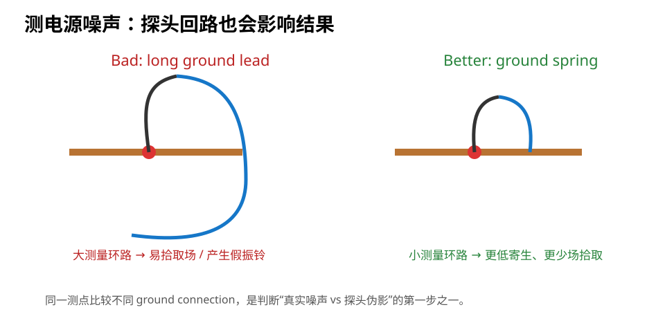

# 08｜如何正确测电源噪声：别让探头自己制造“问题”

> PI 学到这里，最容易掉进另一个坑：设计本身没那么差，是你的测量方法把波形测坏了。

---

## 8.1 为什么普通探头地线很危险

传统被动探头常带一根 10 cm 左右的鳄鱼夹地线。

这根线有明显寄生电感。

当你测一个包含快速边沿的电源节点时：

```text
probe tip ───── node
   |
   | long ground lead
   L
   |
  GND
```

探头自身就形成一个大面积高频环路。

结果可能看到：

- 假振铃；
- 假尖峰；
- 比真实值更大的噪声；
- 对附近 SW node 的磁场拾取。

---

## 8.2 Ground Spring / Low-Inductance Probe

更好的方式：

- 使用 ground spring；
- 或 coax/pigtail 极短地连接；
- 测试点设计 tip + nearby GND；
- 尽量缩小测量回路面积。



### 教材直觉

> 你测的是“电源节点 + 探头回路”的组合。

所以测量工具也必须纳入电磁回路分析。

---

## 8.3 20 MHz Bandwidth Limit 到底该不该开

很多示波器有：

```text
20 MHz BW Limit
```

它非常有用，但用途要分清。

### 场景 A：看低频 rail ripple / regulator behavior

可能希望开 bandwidth limit，减少不相关的高频噪声。

### 场景 B：看 SW-node overshoot / fast transient

如果开 20 MHz 限带，可能把真正的高频尖峰过滤掉。

TI 的 Buck 测量资料就明确提醒：测 SW node 高频 excursion 时，带宽限制会把真实行为“变漂亮”。

所以：

> **先决定你想测什么频段，再决定 bandwidth。**

---

## 8.4 AC Coupling 与 DC Coupling

### DC Coupling

适合看：

- rail 的绝对电压；
- startup；
- droop；
- 大幅 transient。

### AC Coupling

适合在一个 3.3 V 大 DC 上放大观察几十 mV 的 ripple/noise。

但要理解示波器前端高通特性，不要拿 AC coupling 测极慢变化。

---

## 8.5 量程决定你能不能看清几十 mV

如果用：

```text
1 V/div
```

去看 10 mV ripple，分辨率和前端噪声可能都不理想。

正确方法之一：

- AC coupling；
- 降低 V/div；
- 控制 offset；
- 根据仪器能力选择 1×/10× probe 或 power-rail probe。

---

## 8.6 测哪里也非常重要

同一条 3.3 V rail：

```text
LDO output pin
bulk cap
MCU local decoupler
MCU VDD vicinity
connector
```

测出来可能不一样。

这不是“测量不一致”，而是 PDN 本来就是空间分布网络。

因此每次截图必须记录：

```text
Probe location
Ground location
Probe type
Bandwidth
Coupling
Sample rate
Time scale
Vertical scale
Load state
```

---

## 8.7 动态负载测试

PI 的重点是负载变化。

比“空载看 3.3 V 很平”更有价值的是：

- MCU GPIO bank 同时翻转；
- CPU workload step；
- peripheral enable/disable；
- SDIO burst；
- USB activity；
- 人工 electronic load step（如果 rail 允许）。

然后触发观察：

```text
Load step
   ↓
Rail droop
   ↓
Recovery
   ↓
Ringing / overshoot
```

---

## 8.7.1 用可控 GPIO Load 做“简易 PDN 激励”实验

一个很有教学价值的方法是：

- 多路 GPIO 同时驱动已知电阻负载；
- 改变 repetition frequency；
- 同步测 GPIO 与 local VCC；
- 记录 VCC ripple / ringing 随频率变化。

如果 noise-vs-frequency 的峰和 measured ZPDN 峰对应，就获得了很强的因果证据。

Robert Feranec / Florian Hämmerle 的案例在真实板上观察到约 66 kHz 的突出 peak，而仿真峰位置不同；这恰好说明 simulation 需要由真实 system measurement 校准。

详见：[13｜实测案例：PDN 阻抗峰为什么会变成 VCC 噪声](13_实测案例_PDN阻抗峰与VCC噪声.md)。


## 8.8 如何区分真实振铃和探头振铃

### 方法 1：缩短 ground

如果换 ground spring 后振铃大幅下降，原测量回路贡献很大。

### 方法 2：换测量位置

真实 PDN 问题通常会随空间位置呈现可解释变化。

### 方法 3：改变 bandwidth

高频尖峰随 BW limit 消失并不代表问题不存在，只说明频谱被截掉。

### 方法 4：用第二种探测方式交叉验证

例如短 coax + 50 Ω 输入（确保信号和仪器条件允许）。

---

## 8.9 Probe Loop 也是一副小天线

特别是在 Buck 周围：

- inductor；
- SW node；
- hot loop；

会产生很强的局部场。

长探头地线可能直接拾取这些场，而不是只测节点电压。

因此：

> 在开关电源旁边看到“鬼一样的尖峰”，先审探测回路，再怪 PCB。

---

## 8.10 V2 的测试点设计

在 PCB 设计阶段就给 PI 测量留条件：

### 3V3 main

- signal test pad；
- 紧邻 GND test pad；
- 允许 ground spring / short loop。

### VDDA

- 独立测点；
- 邻近 GND。

### LDO input/output

便于看：

- startup；
- dropout；
- output transient。

### Buck Fault Lab

预留：

- VIN；
- SW；
- VOUT；
- PGND near probe point。

---

## 8.11 Fault Lab：测出来 400 mV 尖峰

症状：

- 3.3 V rail 上看到 400 mV 高频尖峰；
- 工程师立刻开始加电容。

先做：

1. 把 10 cm ground clip 换成 ground spring；
2. 固定同一测点；
3. 对比 full bandwidth / 20 MHz limit；
4. 移开 probe loop，减少对 Buck field 的拾取；
5. 再决定是否修改 PCB。

这叫：

> **先验证 measurement integrity，再判断 power integrity。**

---

## 8.12 把测量结果写进 Review

模板：

| Test | Point | Load condition | Probe | BW | Result | Limit/source | Pass? |
|---|---|---|---|---|---|---|---|
| 3V3 startup | TP3V3 | power-on | passive + spring | full |  | board target |  |
| 3V3 ripple | local MCU | workload | passive + spring | 20 MHz |  | board target |  |
| SW overshoot | SW TP | max load | low-L probe | full |  | converter rating |  |

---

## 8.13 本章任务

1. 在 V2 增加至少 3 个 PI 测点；
2. 每个电源测点旁设计短 GND access；
3. 写出“看 rail ripple”和“看 Buck SW overshoot”的不同示波器设置；
4. 解释为什么 20 MHz limit 有时应该开、有时绝不能用来做最终判断。

---

## 8.14 本章结论

> **Power Integrity 的测量本身也有完整回路。错误探测方法可以产生与真正 PCB 问题非常像的假象。**
