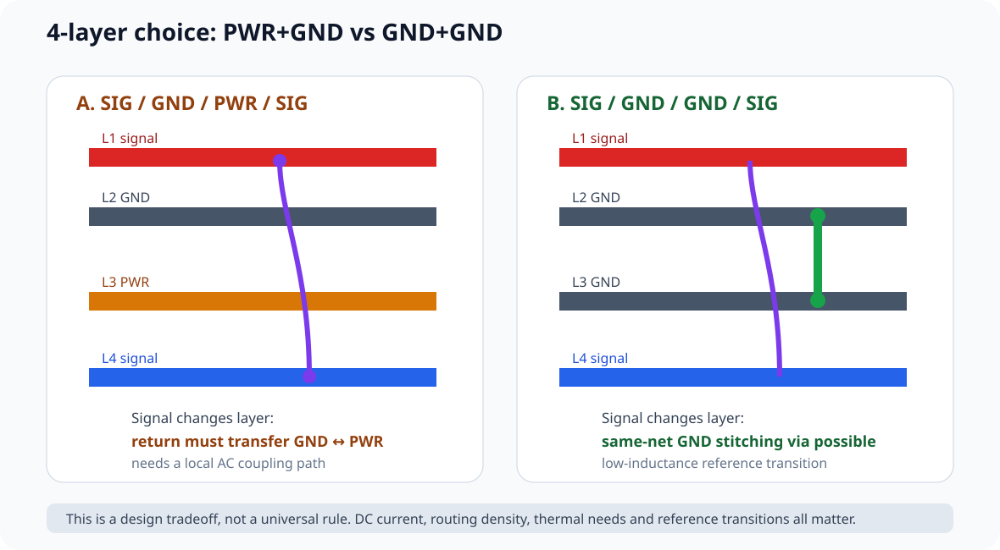
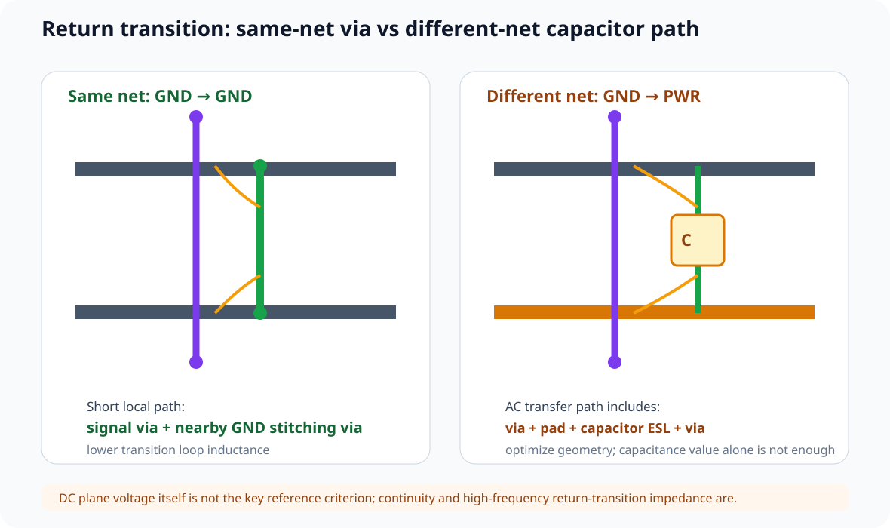
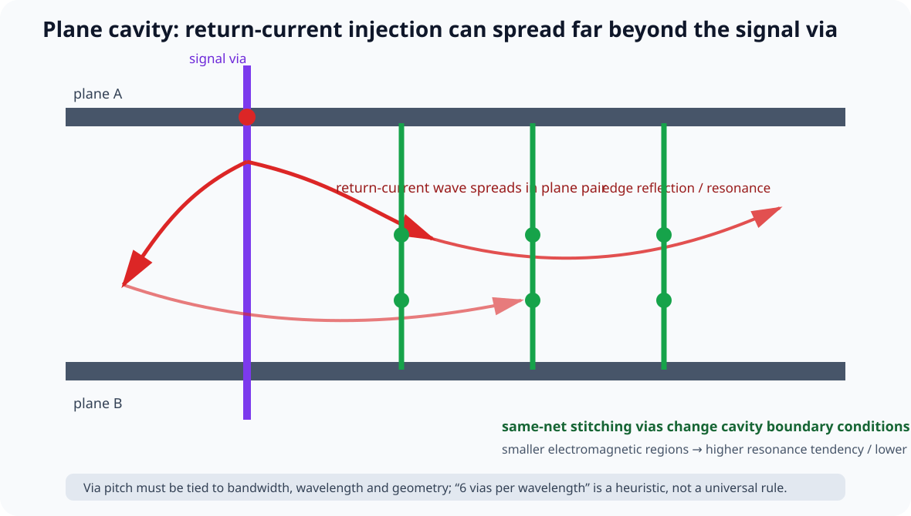
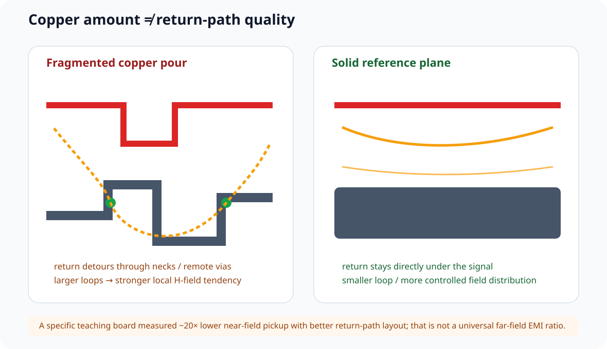

# 12｜电源层真的必要吗：双 GND、Reference Transition 与 Plane Cavity

> 这一章讨论一个经常被简化成“4 层板一定要 SIG/GND/PWR/SIG”的问题：**Power Plane 到底在解决什么？如果不用专用电源层，会不会更好？**
>
> 结论不是“永远不要 Power Plane”，而是先把四个问题拆开：
>
> 1. DC 电流到底需要多宽的铜；
> 2. 快速信号需要怎样的 reference；
> 3. 信号换层时 return current 怎样跨 plane；
> 4. 两个大平面形成的 cavity 会不会被同时切换电流激励。

---

## 12.1 先问：Power Plane 在解决什么问题

一个专用 power plane 可能承担：

- 大电流 DC distribution；
- 降低供电路径电阻；
- 与 GND 形成 plane-pair capacitance；
- 作为相邻 signal layer 的 AC reference；
- 帮助热扩散；
- 简化多负载供电拓扑。

但这些功能不是同一个问题，也不要求永远用“整层 plane”解决。

例如一个 rail 只有数百 mA，局部 wide trace / pour 可能已经满足 DC drop 和温升要求；此时保留另一整层 GND，可能反而更有利于 signal return transition。

所以 Stackup 设计前先写：

~~~text
为什么我要这层 PWR？
→ DC current?
→ routing density?
→ thermal?
→ reference?
→ plane-pair capacitance?
~~~

如果答案只有“4 层板一般都这样画”，就还没有做工程选择。

---

## 12.2 视频中的“细线也能过很大电流”要怎么正确吸收

视频用 1 oz、约 6 mil 的铜线做教学例子，强调很多设计者会高估“必须用整层 power plane 才能送几安培”的必要性。

这个方向非常有价值：

> **中小电流 rail 不一定需要专用 power plane。**

但视频中出现的：

- 6 mil 走 1 A；
- 20 mil 走约 3 A；
- 100 mil 走约 10 A；

都不应当变成课程里的固定线宽表。

真实 current-carrying capability 与：

- copper thickness；
- external / internal layer；
- trace length；
- allowable temperature rise；
- ambient / airflow；
- 邻近大铜面；
- board thickness / material；
- connector / via bottleneck；
- DC drop budget；

都有关。

IPC-2152 的正确用法也是：

> **给定允许温升与结构条件 → 求合理 conductor size。**

因此教材只保留视频的设计原则：

> **不要因为“几安培听起来很大”就自动牺牲 reference plane；先做 DC PI / thermal calculation。**

### 一个更安全的决策流程

~~~text
Imax
→ allowable ΔV
→ allowable ΔT
→ copper thickness / layer
→ trace / pour resistance
→ via / connector bottleneck
→ thermal estimate
→ decide trace / pour / plane
~~~

---

## 12.3 为什么 4 层板常值得比较“PWR+GND”与“GND+GND”

典型候选：

~~~text
A:
L1  SIG
L2  GND
L3  PWR
L4  SIG
~~~

与：

~~~text
B:
L1  SIG
L2  GND
L3  GND
L4  SIG
~~~

两者都有一个共同优点：

- L1 紧邻 solid plane；
- L4 紧邻 solid plane。

真正差异会在**信号换层**时出现。

如果 top signal 从 L1 经 via 到 L4：

### A：GND → PWR

return current 从 L2 GND 迁移到 L3 PWR。

两个 plane 是不同 DC net，不能用一颗 shorting via 直接连接。

### B：GND → GND

L2 / L3 同属 GND，可以在 signal via 附近放 GND stitching via，提供非常局部的 reference transition。

于是双 GND 的主要价值不是：

> “GND 比 PWR 更纯净。”

而是：

> **同网 plane 之间可以用低电感 via 直接完成 return transition。**

---

### 12.3.1 不只比较 PWR vs 双 GND：还有一对“内外翻转”的四层拓扑

Zach Peterson / Altium Academy 的另一段四层板讲解把选择继续展开成：

~~~text
GND / SIG+PWR / SIG+PWR / GND
               ↕ invert
SIG+PWR / GND / GND / SIG+PWR
~~~

这两者的核心 tradeoff 不是“谁更高级”，而是：

- 外层 GND：更偏向 external-noise shielding / surface-ground access，但高 via density 可能 perforate GND，内层 signal 还要防 broadside coupling；
- 内层双 GND：更方便 Top↔Bottom 的 same-net reference transition，表面 signal 可直接进入器件，但 Power 要改用 pour / wide trace，并失去专用大面积 PWR plane 的 routing / plane-pair 资源。

完整拓扑图、via perforation 边界和 V1 选型问题见 Part 1：[四层 Stackup：从真实板厂数据开始](../11_Part1_STM32F407四层板/03_四层Stackup与KiCad设置.md#32-四层板的层角色不是固定模板三种工程拓扑)。

这部分不会重复本章已经讲过的 return-current 物理；它只把“电源层是否必要”提升成更完整的 **layer-role allocation** 问题。

## 12.4 Power Plane 当 signal reference 时，DC 电压是不是必须等于 IO 电压？

不是。

假设一个 3.3 V CMOS signal 参考一块 12 V plane。

只要在关心的频率范围内：

- plane 是连续导体；
- signal-plane geometry 稳定；
- return current 可以形成局部闭合路径；
- 没有跨 split / void；

那么这个 plane 的**DC 电位数值本身并不决定它能不能成为 AC reference**。

所以：

> **3.3 V signal 并不要求只能参考 3.3 V plane。**

真正危险的是：

~~~text
continuous 12 V plane
      → 12 V / 5 V split
      → signal crosses boundary
~~~

这时 reference continuity 被破坏。

---

## 12.5 Same-Net Plane Transition：为什么一颗 stitching via 很强

对于：

~~~text
L1 signal → via → L4 signal
L2 GND           L3 GND
~~~

return current 需要从 L2 转移到 L3。

若 signal via 旁有 stitching via：

~~~text
signal via
   │
   │       nearby GND via
   │           │
L2 GND =========│========
                 │
L3 GND =========│========
~~~

那么 return-current transition loop 很小。

在高频问题里真正重要的是：

\[
V_{noise}=I_{return}\cdot Z_{transition}
\]

以及其中的快速部分：

\[
V\approx L_{transition}\frac{di}{dt}
\]

所以“信号 via 旁边的 GND via”不是装饰，它是在降低 reference transition impedance。

---

## 12.6 Different-Net Plane Transition：为什么电容只是“带 DC Block 的连接路径”

如果：

- old reference = GND；
- new reference = PWR；

不能用 metal via 短接。

工程上会通过附近的 GND↔PWR decoupling / AC coupling path 让高频 return current 转移。

但要注意：

> **真正决定高频 transfer path 的不只是 capacitance value，更关键的是安装路径的 ESL / geometry。**

典型路径是：

~~~text
old GND plane
→ GND via
→ capacitor
→ PWR via
→ new PWR plane
~~~

与单一 same-net stitching via 相比，它天然多出：

- via；
- pad；
- capacitor ESL；
- spreading path。

所以在其他条件相当时，same-net stitching via 往往可以做到更低的 transition inductance。

这并不意味着：

> GND↔PWR decoupling 没用。

而是说：

> **它是不同 DC net 时必须接受并优化的 AC transfer structure，不应假装等价于一颗理想短路 via。**

---

## 12.7 两个平面之间不是“什么都没有”：它们构成 Plane Cavity

两个相邻大铜面，无论 DC 电压相同还是不同，在高频都构成一个分布式 electromagnetic structure。

它具有：

- spreading impedance；
- propagation delay；
- boundary reflection；
- resonant modes。

当一个信号 via 换层时，return current 若被注入这个 plane pair：

~~~text
return current injection
        ↓
plane-pair cavity
        ↓
wave spreads
        ↓
edge reflection
        ↓
cavity resonance
~~~

噪声就不一定只局限在 signal via 附近。

这也是为什么多根 signal 同时换层时，会出现：

\[
V_{cavity}\sim Z_{cavity}\sum i_{return}
\]

以及更强的 simultaneous-switching / shared-reference noise。

### 大板为什么更值得关注 cavity

cavity resonant frequency 与：

- board / plane region dimensions；
- dielectric constant；
- plane separation；
- boundary geometry；
- stitching via distribution；

有关。

尺寸越大，最低 resonance 往往越低。

但不要背“某尺寸一定等于某 GHz”。

视频举了约 25–35 mm 结构与 GHz 量级 resonance 的教学数量级，这只能用于建立直觉，真实板应按实际 geometry 计算或仿真。

---

## 12.8 “每个波长 6 个 via”怎么正确理解

视频引用了一条 cavity stitching 的经验思路：

> 在关心的最高频率对应 wavelength 内，提供多颗 stitching via，把大 cavity 切成更小的 electromagnetic region。

作者给出的教学经验是**约每 wavelength 6 个 via**。

课程把它归类为：

> **heuristic / initial screening rule，不是 fabrication 或 EMC 的通用 requirement。**

真正设计要先定义：

1. signal bandwidth；
2. dielectric 中传播速度；
3. wavelength；
4. plane geometry；
5. cavity modes；
6. acceptable noise。

然后再决定 stitching density。

尤其不要把：

> “每 25 mm 一颗 GND via”

写成跨板厚、跨频率、跨材料的固定规则。

---

## 12.9 Broadside Coupling：相邻 signal layer 为什么危险

如果 Stackup 出现：

~~~text
SIG
thin dielectric
SIG
farther reference
~~~

两层 signal 在 Z 方向可能比同层相邻 traces 还靠得近。

若两层长距离 co-parallel：

> 会形成 broadside coupling。

它同时涉及：

- capacitive coupling；
- mutual inductance；
- overlapping return geometry。

常用降低风险方法：

- 两层主要 routing direction 尽量正交；
- 更重要的是优化 signal-to-reference adjacency；
- 避免长距离上下重叠；
- BGA escape 等局部不可避免区域做定量检查。

“相邻 signal layer 必须永远 X/Y 正交”仍然不是绝对规则，但对缺乏仿真依据的高密度结构，这是很实用的 risk-reduction strategy。

---

## 12.10 Stackup 对称性：这是机械问题，不只是 SI

视频还强调了另一个常被高速设计者忽略的点：

> copper / dielectric stackup 的严重不对称可能增加 PCB warpage 风险。

原因包括：

- laminate cure；
- copper / resin thermal expansion mismatch；
- copper distribution imbalance；
- board size / thickness；
- assembly reflow thermal cycle。

因此正式 stackup review 除了：

- impedance；
- reference；
- routing；
- power；

还要问：

> **板厂是否认可这个结构的机械对称性和 copper balance？**

这里不把“上下每一层铜面积必须完全相等”写成规则；制造商对 stackup symmetry、copper balancing、thieving 等有具体工艺要求，应与板厂确认。

---

## 12.11 Copper Pour 为什么不能替代 Solid Reference Plane

常见两层布板流程：

~~~text
先在 Top / Bottom 两面自由 routing
→ 最后剩余区域 flood GND copper
→ 再加几颗 stitching via
~~~

视觉上“铜很多”，但快速 return current 看到的可能仍是：

- 碎片化 GND；
- 窄 neck；
- 远处 stitching via；
- 多个绕行 loop。

因此：

> **Copper amount ≠ return-path quality。**

视频展示了两个同原理图、同 firmware 的 ATmega328 教学板：

- commercial-style fragmented copper-pour layout；
- routing 尽量集中在一层、另一层保持 solid GND 的 layout。

作者用 H-field near-field pickup 做 A/B，对第二种 layout 测到**超过一个数量级、约 20× 量级**的近场降低。

这必须标成：

> **该教学板、该 probe position/orientation、该测试方法下的特定实测结果。**

不能升级成：

> “Solid plane 一定降低远场 EMI 20×。”

因为 near field 与 formal far-field radiated emission 不是一回事。

---

## 12.12 Near Field 不是 Far Field，但非常适合做 Layout A/B

视频里的 near-field 实验非常适合本课程采用：

~~~text
same schematic
same firmware
same switching event
same probe method
layout A vs layout B
~~~

Near-field scan 能帮助：

- 找 loop hotspot；
- 比较 return-path engineering；
- 找换层 cavity noise；
- 验证整改方向。

但必须牢记：

> **Near-field 强，不自动等于远场认证 FAIL；反过来，真正的 far-field source 往往也会在 near field 留下可定位痕迹。**

所以 near-field 是：

> **debug / comparative evidence**

不是：

> **FCC / CISPR compliance result**

---

## 12.13 视频中的 Return-Via 实测案例

作者设计了一块四层教学板：

- top / bottom 为 signal；
- 中间为两块 plane；
- 约 12 路 IO 同时切换；
- signal 从一侧 layer 通过 via 换到另一侧；
- 另做一条 quiet victim line 测 plane/reference noise。

视频给出的教学条件大致是：

- edge ~ 1 ns；
- 每路约 30 mA switching current；
- 12 路合计约 360 mA/ns 的 di/dt 数量级。

在**没有 local plane-to-plane return via** 的版本上，victim 测到约数百 mV、最高约 700 mVpp 量级的噪声。

加入 local same-net return vias 后，波形显著下降。

这个案例应该怎样使用？

### 可以学

- simultaneous signal vias 会向 plane cavity 注入 return current；
- local same-net stitching via 能大幅降低 transition impedance；
- quiet victim line 是观察 shared-reference noise 的好方法。

### 不可以学

- “12 路 IO 一定产生 700 mV”；
- “一颗 stitching via 永远降低多少 dB”；
- “所有 4 层 PWR/GND stackup 都会失败”。

它是一个**结构对比实验**，不是通用规格表。

---

## 12.14 如何在自己板上测这种噪声

最容易解释的做法是找一条本应保持静态的 quiet net：

- tied-low GPIO；
- unused test net；
- intentionally quiet victim structure。

让其他 aggressor 在 worst-case 模式下同时切换，然后测 quiet net。

优势：

> quiet net 理想值接近 0，所以观测到的动态成分更容易解释为 coupled / reference noise。

### Probe 仍然可能骗你

视频再次强调：

- 10× high-impedance probe 对 ns 级实验可以使用；
- 关键是**极低 tip inductance**；
- 优先 ground spring / 专门 test point；
- 不要用大鳄鱼夹地线做快速噪声结论。

Scope bandwidth 也必须足够，否则：

- edge 被仪器变慢；
- peak noise 被滤掉；
- ringing 频率看错。

视频给出 BW ~ 1/tr 作为粗略学习经验。

课程仍把它归类为**快速估算 heuristic**，最终测量带宽应结合：

- desired amplitude accuracy；
- edge spectrum；
- probe bandwidth；
- noise floor；
- aliasing / sampling；

共同决定。

---

## 12.15 设计决策树：四层板到底要不要 Power Plane

~~~text
Power rail current / DC drop / thermal need
            │
            ├─ 很高，trace/pour 不现实
            │       ↓
            │    考虑 PWR plane
            │
            │
            └─ 中低电流
                    ↓
          wide trace / local pour 是否足够？
                    │
              yes ──┴── no
               │           │
        保留额外 GND?     PWR plane
               │           │
               ↓           ↓
      signal vias can use   若作为 reference，
      same-net return via   设计 GND↔PWR AC transition
               │           │
               └─────┬─────┘
                     ↓
             cavity / split / EMC review
~~~

本课程不会把：

> “所有四层板都用 GND/GND”

写成统一答案。

对于：

- 大电流 FPGA / CPU；
- 多 rail routing 密度很高；
- thermal spreading；
- BGA power escape；
- 特定 stackup / impedance；

PWR plane 可能完全合理。

课程真正推荐的是：

> **每一个 plane 都要能说清楚它解决的工程问题。**

---

## 12.16 Design Review

- [ ] PWR plane 的存在有明确工程理由，不是惯例
- [ ] DC current / voltage drop / thermal 已单独算过
- [ ] 没把视频中的 6 mil / 20 mil / 100 mil 电流数字当通用规则
- [ ] 每个高速 signal layer 都有明确 continuous reference
- [ ] signal via 换层时同时画出了 reference transition
- [ ] same-net plane transition 优先检查 local stitching via
- [ ] different-net reference transition 检查 local GND↔PWR coupling path 与 ESL
- [ ] power split 没有被关键 signal 跨越
- [ ] 相邻 signal layers 检查 broadside coupling
- [ ] stackup symmetry / copper balance 已与 fab 对齐
- [ ] 大 plane pair 已考虑 cavity / resonance，而不是当理想节点
- [ ] stitching density 有 bandwidth / geometry 依据
- [ ] copper pour 没被当成 solid reference plane 的自动替代品
- [ ] near-field A/B 不冒充 far-field compliance
- [ ] quiet-net measurement 使用低电感 probe connection

---

## 12.17 本章任务

1. 对自己的 4 层候选 Stackup 写出：
   - SIG/GND/PWR/SIG
   - SIG/GND/GND/SIG
   两个版本的优缺点。
2. 标出 5 个 signal via，并为每个 via 写明：
   - old reference；
   - new reference；
   - return transition support。
3. 对最大 rail 做一次 DC trace / pour / plane sizing。
4. 打开 interactive/reference-transition-lab.html，比较：
   - GND→GND + local via；
   - GND→GND + remote via；
   - GND→PWR + local capacitor path；
   - multiple simultaneous switching vias。
5. 为板子规划一个 quiet-net noise test point。
6. 在 EMC 预兼容计划里加入一次：
   - solid-reference layout vs fragmented-return layout 的 H-field A/B。

---

## 参考资料

- Robert Feranec / Eric Bogatin, *Do You Really Need Power Planes? Are you sure?*: https://www.youtube.com/watch?v=kdCJxdR7L_I
- IPC-2152, *Standard for Determining Current Carrying Capacity in Printed Board Design*
- 本课程 Part 2：Return Path / Reference Transition
- 本课程 Part 4：Near-field / EMC pre-compliance

> 本章中的 1 A、3 A、10 A、700 mVpp、20× 等数字都来自视频中的教学叙述或特定实验，只用于理解量级与趋势；真实设计必须重新计算、仿真或测量。
