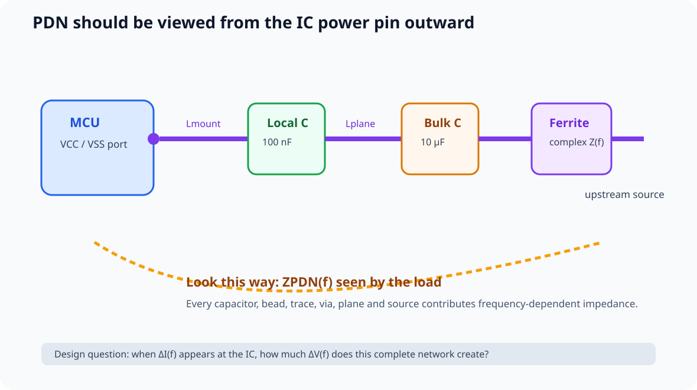
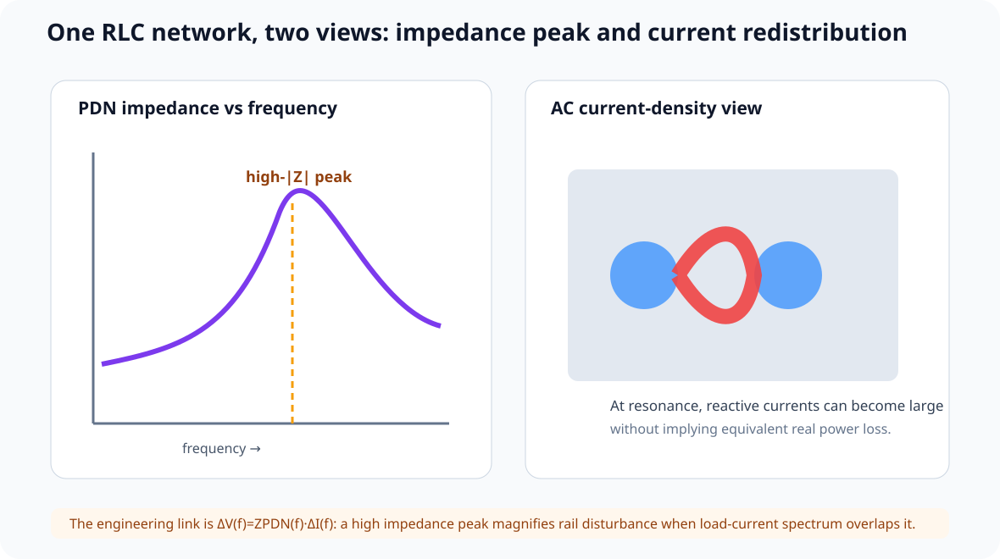
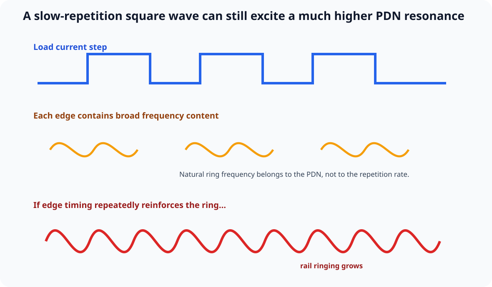

# 13｜实测案例：PDN 阻抗峰为什么会变成 VCC 噪声

> 本章吸收 Robert Feranec 的 *PCB Layout & Decoupling - Explained why it's so complicated (Part 1)*。
>
> 这不是“100 nF 应该放多近”的规则章，而是一个完整的 **Simulation → Measurement → Interpretation** 案例：
>
> - 从 MCU VCC pin 往外看整个供电网络；
> - 建立 VRM / ferrite / bulk / local decoupling / interconnect 的等效模型；
> - 观察 PDN impedance vs frequency；
> - 用真实 GPIO switching 作为动态负载；
> - 比较仿真峰、实测峰与 VCC noise。

---

## 13.1 最重要的视角变化：不是“电源怎么送过去”，而是“芯片脚看到什么”

传统原理图容易让人这样想：

~~~text
USB / VRM
→ ferrite
→ bulk C
→ 100 nF
→ MCU VCC
~~~

但做 PI 时，更有用的观察方向是：

~~~text
MCU VCC/VSS port
→ local interconnect
→ local decoupler
→ bulk capacitor
→ ferrite / rail
→ upstream source
~~~

也就是：

> **从 load port 往外看 input impedance。**

这个 port impedance 就是：

\[
Z_{PDN}(f)=\frac{V(f)}{I(f)}
\]

真正关心的是 magnitude / phase 随频率怎样变化。

---

## 13.2 视频中的教学板

视频使用一块实际 MCU 板作为案例。VCC 路径大致包含：

- MCU VCC pin；
- 本地 100 nF；
- 附近 10 µF；
- ferrite bead；
- 上游 5 V / 3V3 rail；
- USB input；
- 较大的 input/output bulk capacitors；
- PCB trace / plane / vias。

仿真使用 Keysight ADS 做 AC / PDN 分析，并建立 VRM/source port、sink/load port、器件模型和 PCB geometry parasitics。

重点不是软件品牌，而是建模结构。

---

## 13.3 为什么短短几毫米铜也不能忽略

视频里 Eric Bogatin 用一个非常有价值的方式解释：

~~~text
VCC pin
→ little interconnect inductance
→ local capacitor
→ another interconnect inductance
→ bulk / bead / source
~~~

在高频下：

\[
|Z_L|=\omega L
\]

所以即使只有几 nH：

\[
Z_L = 2\pi fL
\]

也可能快速上升。

例如：

\[
L=10\,nH,\quad f=1\,GHz
\]

则：

\[
|Z_L|\approx63\,\Omega
\]

这个数字只是建立数量级直觉，不是某块板的精确提取结果。

真正结论是：

> **“只有几毫米”不是忽略安装/互连电感的理由。**

---

## 13.4 Current Density 图为什么会在某些频率突然变红

视频里对不同 AC frequency 做 current-density visualization。

低频时，current distribution 相对平缓；靠近某些 PDN resonance / anti-resonance frequency 时，局部 current density 显著增加。

但要避免一个误解：

> current-density 图“变红”不等于那里一定发生更多 real power loss。

AC network 中可能主要是在 L/C 之间交换 reactive energy。

所以课程不采用“高 impedance = 高 loss”这种过度简化。

更准确的是：

> **高 |ZPDN| 表示相同 dynamic current disturbance 会产生更大的 rail voltage disturbance。**

---

## 13.5 真正把 PDN 与噪声连起来的公式

频域里最核心关系：

\[
\Delta V(f)=Z_{PDN}(f)\cdot\Delta I(f)
\]

因此某个频率如果同时满足：

1. load current spectrum 在这里有能量；
2. PDN 在这里有高 impedance peak；

那么 rail noise 就容易被放大。

这就是 target impedance 思维的根。

---

## 13.6 真实实验：5 路 GPIO 人工制造动态负载

视频中的实测板在约 5 个 MCU output 上各接 270 Ω 到 GND。

每路电流量级约 8 mA，总动态负载约 40 mA。

让这些 outputs 同时 HIGH/LOW，并改变 repetition frequency，同时测 output switching waveform 与 MCU VCC rail noise。

这相当于人为给 PDN 注入一个可控 dynamic load。

---

## 13.7 为什么低频 switching 也能看到高频 ringing

即使 output repetition 只有几百 Hz / kHz，切换瞬间仍可出现约几十 kHz 的 ringing。

原因不是“GPIO 正在以几十 kHz 切换”，而是：

> **每个 fast edge 都包含宽频谱，它像一次 step excitation，会激励 PDN 自己的自然谐振模式。**

如果下一次 switching 在 ring-down 还没消失前再次注入能量，而且时机接近 resonance，oscillation 会被重复“推一把”。

---

## 13.8 视频里的约 66 kHz 峰：为什么实测最重要

视频仿真的一个低频 PDN peak 大约落在几十 kHz，但真实板实测 peak 出现在约：

\[
66\,kHz
\]

附近。

当 GPIO switching 靠近这个频率时，VCC noise 达到视频中最明显的峰值。

这说明：

### PDN impedance curve 能预测“哪里容易出问题”

VCC noise vs switching frequency 的趋势和 measured PDN impedance curve 高度对应。

### 仿真频率不一定和实板完全一致

仿真可能没有完整包含 USB cable、PC power supply output impedance、connector、exact ferrite model、capacitor bias / ESR / ESL、PCB parasitics、fixture 和 package/device details。

所以工程闭环是：

~~~text
simulate
→ predict peak
→ measure ZPDN
→ measure rail noise
→ correlate
→ improve model
~~~

---

## 13.9 低频下为什么能从 ΔV / ΔI 估计阻抗

视频在约 100 Hz 的动态测试里，用 rail ripple 与 current change 估算出约：

\[
Z\approx\frac{\Delta V}{\Delta I}\approx0.4\,\Omega
\]

并发现和 measured PDN impedance 在同频附近相符。

这就是最朴素的 Z=V/I，但要注意：

- 这里只是该 frequency / setup 下的有效小信号 impedance；
- 高频完整测量需要更严格的 injection / fixture / calibration；
- 不能拿万用表 DC resistance 替代 PDN impedance。

---

## 13.10 为什么“100 nF + 10 µF + ferrite”仍然可能共振

整个网络同时包含 capacitor C、ESR/ESL、ferrite complex impedance、trace/via inductance、plane spreading 和 source output impedance。

所以它天然是一个多阶 RLC network，会形成 series resonance、parallel resonance、anti-resonance 与不同 Q 的 peaks。

因此：

> **“我已经放了很多去耦”不能证明 PDN 一定低阻抗。**

---

## 13.11 Ferrite Bead 不是免费滤波器

ferrite 的阻抗随频率变化，而且通常同时包含 resistive、inductive 与 parasitic-capacitive behavior。

它与 rail capacitor 组合后可能在某些频段形成新的 impedance peak。

所以 ferrite + capacitor 的设计不能只看“100 MHz impedance = 600 Ω”这一个 datasheet 数字。

要看 actual DC current、bias derating、capacitor network、source/load impedance 与 full frequency response。

---

## 13.12 仿真建模纪律

视频里的模型精度不同：0 Ω resistor 用简单 R，inductor 用 L + series R，ferrite 用 manufacturer model，capacitors 用 database/vendor model。

教材提炼为：

> **模型精度必须和你要回答的问题匹配。**

如果只想看 DC / low-kHz trend，简单模型可能够。

如果要分析 MHz anti-resonance、ferrite loss peak、MLCC SRF 或更高频 mounting behavior，就必须升级 vendor SPICE / S-parameter / EM-extracted interconnect / measured model。

---

## 13.13 互动实验

打开：

**interactive/pdn-resonance-lab.html**

可以调 local C、local ESR、mounting L、bulk C、upstream L / bead-like isolation、source R、load-step repetition frequency 与 edge severity。

页面会显示 normalized PDN impedance、natural resonance 与 repeated excitation 下的 rail-ringing tendency。

它是教学模型，不是 ADS/PIPro/PowerSI 替代品。

---

## 13.14 Design Review

- [ ] PDN 是从 load pin 往外看的，不只从 regulator 往下游看
- [ ] 已包含 local decoupler + interconnect + bulk + source
- [ ] 没把高 |Z| 误写成“更高真实功耗损失”
- [ ] 使用 ΔV = Z·ΔI 解释 rail disturbance
- [ ] 明白 fast edge 可激励远高于 repetition frequency 的 resonance
- [ ] measured resonance 与 simulated resonance 不一致时会检查 missing system elements
- [ ] ferrite 与 capacitor 被视为可能产生 resonance 的组合网络
- [ ] component model fidelity 与目标频段匹配
- [ ] 最终会用 measurement 校准 simulation

---

## 13.15 本章任务

1. 给 V2 画一张从 MCU VDD pin 向外看的 PDN ladder；
2. 标出 local C、mounting L、plane/trace L、bulk、regulator/source；
3. 在 Mixed/PDN lab 中调出一个高-Q peak；
4. 保持 peak 不动，改变 switching frequency，观察 repeated excitation；
5. 再增加 damping，比较 ringing；
6. 解释为什么一个 1 kHz 方波负载，也可能在几十 kHz 的 PDN resonance 上看到 ringing。

---

## 参考资料

- Robert Feranec, *PCB Layout & Decoupling - Explained why it's so complicated (Part 1)*: https://www.youtube.com/watch?v=5Ca0Eah7eKI
- Eric Bogatin / Florian Hämmerle 在视频中的讲解与实测
- 本课程 02：真实电容
- 本课程 04：PDN / Target Impedance
- 本课程 05：Anti-Resonance
- 本课程 08：Power Rail Measurement

> 本章中的约 40 mA、270 Ω、约 0.4 Ω、约 66 kHz 等数字都属于视频中的特定教学板与测试设置，不是通用 MCU/PDN 规格。
