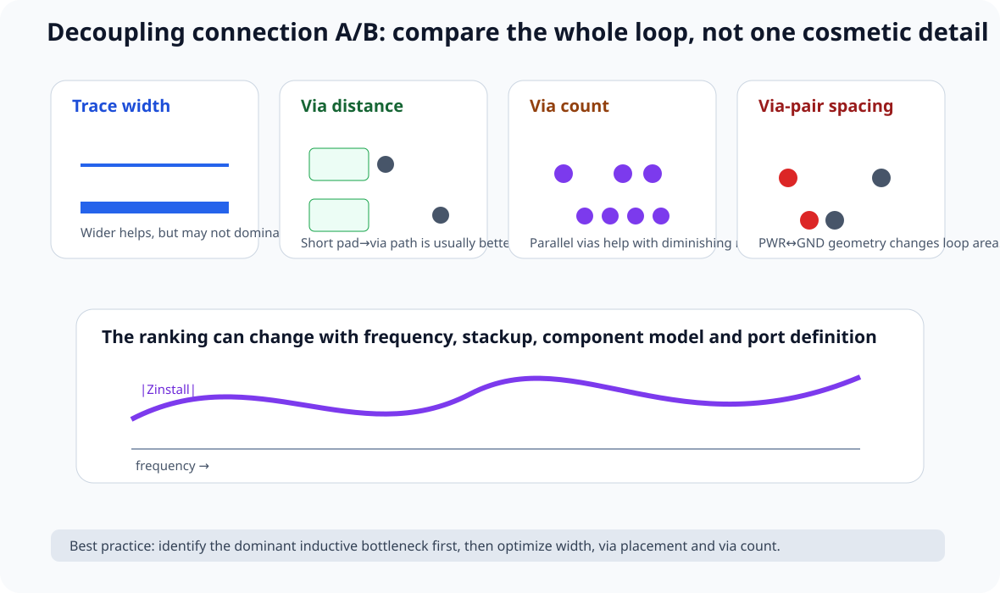
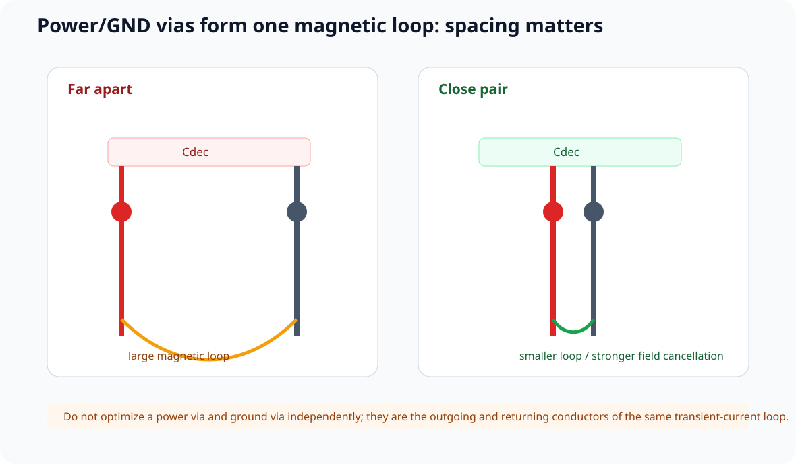
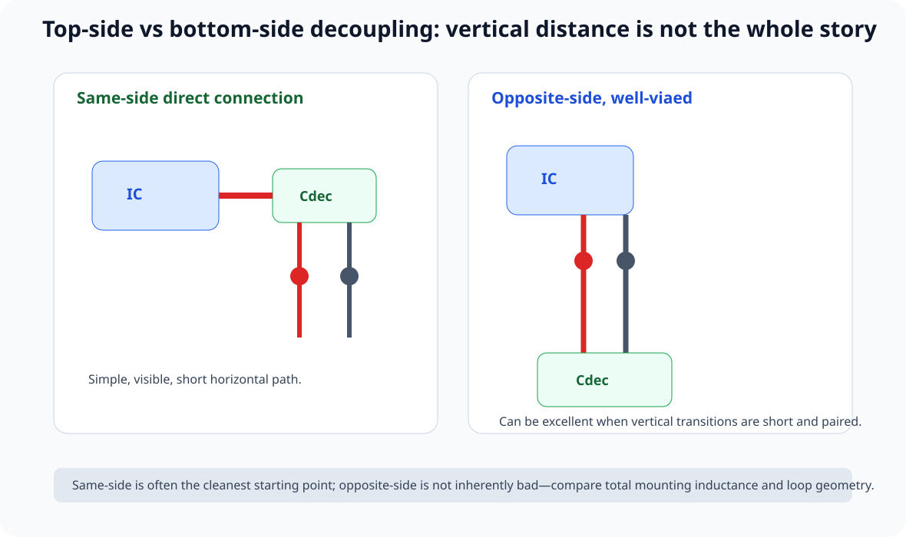

# 14｜仿真案例：去耦电容的 Via、走线与正反面连接到底差多少

> 本章吸收 Robert Feranec 的 *What is The Best VIA Placement for Decoupling Capacitors?*。
>
> 这条视频最有价值的地方，不是告诉你“某颗 via 必须放在某个像素位置”，而是做了大量 **A/B connection topology comparison**：
>
> - 窄走线 vs 宽走线；
> - via 靠 pad / via 离 pad；
> - 单 via vs 多 via；
> - power / GND via 是否成对靠近；
> - capacitor 在 top vs bottom；
> - 多 power / GND via 的收益是否一直线性增加。
>
> 课程把它整理成一个更可迁移的问题：
>
> **芯片 VDD/VSS port 看到的安装阻抗，究竟由哪些几何变量主导？**

---

## 14.1 先定义比较对象：不是“电容的位置”，而是完整连接网络

一颗 decoupling capacitor 的局部路径至少包括：

~~~text
IC power pin
→ local copper / trace
→ power via / plane
→ capacitor power pad
→ capacitor body
→ capacitor GND pad
→ GND via / plane
→ IC ground return
~~~

不同 layout 只是改变了这条路径中的：

- 横向 trace length；
- trace width；
- via length；
- via count；
- power-via / GND-via mutual geometry；
- plane spreading；
- same-side / opposite-side transition。

所以要比较的是：

\[
Z_{install}(f)
\]

而不是：

> “电容中心离芯片几 mm”。

---

## 14.2 视频里的一个重要惊喜：宽线比窄线好，但未必好到你想象的程度

视频比较了不同 trace width 的 decoupling connection。

直觉上：

> 越宽越好。

方向没错，因为更宽铜通常会：

- 降低 DC resistance；
- 降低一部分局部 partial inductance；
- 增大 current-carrying area。

但仿真中，一些“很宽”与“普通宽度”的连接在感兴趣频段并没有出现数量级差异。

为什么？

因为安装电感不只由这段 trace 决定。一旦总路径里还有 via、power/GND separation、plane spreading、package 与 capacitor ESL，单独把一小段线再加宽，收益会出现**边际递减**。

所以课程不教：

> “把去耦 trace 画成铜皮就一定最好。”

而是：

> **先消灭不必要的 loop length / loop area，再优化 conductor width。**

---

## 14.3 Via 离 Pad 多远：别把“最靠近”变成视觉规则

视频比较了几种 via placement：

~~~text
Cap pad ─ via

Cap pad ───── via

via ─ Cap pad
~~~

某些看起来明显不同的摆法，在仿真阻抗上差异并没有想象中夸张。

这提醒我们：

> **一个 via 的“绝对坐标”不是唯一变量。**

真正要一起看：

- pad → via 横向距离；
- power via 与 GND via 相互距离；
- via 到相邻 plane 的有效路径；
- capacitor 与 IC pin 是否有直接连接；
- 这两颗 via 是否把往返电流保持得足够靠近。

---

## 14.4 Power Via 与 GND Via 为什么应该靠近看成“一对”

如果 power via 和 GND via 离得很远：

~~~text
PWR via                         GND via
   |                               |
   |<--------- large loop -------->|
~~~

往返电流的 magnetic field 不能充分互相抵消。

如果两颗 via 靠近：

~~~text
PWR via  GND via
   |       |
   |<--->  |
  small loop
~~~

通常更有利于降低 loop inductance。

因此对于 local decoupling：

> **“一颗 via 要不要离 pad 再近 0.2 mm”有时没有“power/GND via pair 是否靠近”重要。**

---

## 14.5 多 Via：确实能帮忙，但不是无限线性收益

视频比较了 1 via、2 vias 和更多 vias 的一系列布局。

总体方向：

> 多个并联 vias 有机会降低等效互连阻抗。

但收益不是：

~~~text
1 via = L
2 vias = L/2
10 vias = L/10
~~~

这么简单。

因为 vias 之间存在 mutual inductance、shared pad/trace spreading、plane spreading 与 current crowding。

特别是如果很多 vias：

- 都离 capacitor pad 很远；
- 彼此挤在错误一侧；
- 通过同一条狭窄 neck；

那么“数量”增加了，但真正的 loop geometry 没改善多少。

### 更正确的使用顺序

1. 先把 via 放到有效位置；
2. power / GND return geometry 配对；
3. 再根据频率、电流和空间增加并联 via；
4. 看实际 extracted / simulated impedance 是否继续改善。

---

## 14.6 “多颗 Via 围一圈”什么时候才真的有意义

视频中表现更好的多-via topology，有一个共同点：

> **增加的 via 真正缩短或并联了高频 current path。**

所以多 via 的 Design Review 问题应该是：

- 每颗 via 承担哪一股 current？
- 是否缩短了 pad → plane path？
- 是否缩小 power/ground loop area？
- 是否降低 shared bottleneck？
- 是否只是“多打孔”但 current 还是先经过同一条 neck？

---

## 14.7 同层直接连接为什么通常是一个强起点

视频相关讨论后来在 Fedevel 论坛里被 Robert 再次概括：

> 如果 capacitor 与 load pin 在同一面，同层 direct track connection 通常是很好的做法。

原因不是“同层”本身有魔法，而是它经常同时实现：

- 很短的 pad-to-pin copper；
- 少一次不必要 layer transition；
- 可视化清晰；
- 更容易让 local current path 紧凑。

例如：

~~~text
IC VDD ─── Cdec
           |
          via → plane
~~~

往往比：

~~~text
IC VDD
  |
 via
  |
 plane
  |
 via
  |
 Cdec
~~~

更容易控制 local high-frequency path。

但这不是绝对规则。

---

## 14.8 Capacitor 放在 Bottom Side 一定差吗？不一定

视频对 top / bottom placement 做了比较，并展示：

> **只要连接路径被设计得好，背面 capacitor 不一定比正面差很多。**

对 BGA / FPGA / CPU，这是非常重要的现实。

很多器件正面根本没有空间把所有 decouplers 放到 power pins 旁边。

这时可以：

- capacitor 放背面；
- power/GND vias 紧邻 pad；
- 让 vertical transition 短；
- power / ground vias 成对靠近；
- 避免长横向 trace。

所以正确规则是：

> **same-side direct connection 往往最直观；opposite-side 不是错误，关键仍是完整 mounting inductance。**

---

## 14.9 为什么某些“Internet 最佳图”差别很小

网上常见很多图，然后标 BAD / BETTER / BEST。

视频仿真非常有价值的一点，就是说明：

> **有些“BEST vs BAD”在真实阻抗曲线上可能只差一点点。**

原因可能是：

- 这个变量只占总安装阻抗的一小部分；
- 另一个几何变量才是 bottleneck；
- 在低频段差异被 capacitor C / ESR 主导；
- 只有进入较高频后，mounting inductance 差异才明显。

所以教材以后看到这种 infographic，必须问：

> **比较频率是多少？stackup 是什么？cap model 是什么？port 定义在哪里？**

没有这些条件，“BEST”标签信息量很低。

---

## 14.10 “Power 必须先经过 capacitor 再到 pin”不是水管模型

常见画法：

~~~text
Power source → capacitor → IC pin
~~~

会让人误以为电流必须物理“穿过电容旁边”才有效。

真实 PDN 是分布网络。

高频瞬态时，local capacitor 是否有效，主要取决于：

> **IC port 到 capacitor 所形成的局部高频 loop impedance。**

不是 PCB trace 在视觉上是否“先经过 capacitor，再经过 IC”。

这也解释了 BGA 设计中为什么 IC pin via 可以直接进入 power plane，而 decoupler 再通过附近 vias 接到同一 plane，仍然可以工作。

问题不是“水流顺序”，而是：

\[
Z_{IC\leftrightarrow C}(f)
\]

够不够低。

---

## 14.11 Via-in-Pad 是不是终极答案

Via-in-pad 能显著缩短 pad 到 plane 的横向 connection。

但它还受：

- filled/capped process；
- cost；
- assembly；
- solder wicking；
- pad size；
- fab capability；

限制。

所以课程不会写：

> 高频去耦必须 via-in-pad。

而是：

> **当 via-in-pad 的电感收益值得制造成本时，它是非常强的选项。**

普通 MCU 板可能完全没有必要；高性能 BGA / FPGA core rail 则可能值得。

---

## 14.12 一个更实用的几何优先级

在没有 3D EM solver 的普通项目里，可以按：

### 第一优先级：Loop topology

- capacitor 属于哪个 power/ground pin group？
- 有没有不必要绕路？
- power/GND return 是否局部闭合？

### 第二优先级：Via pair geometry

- PWR/GND vias 是否靠近；
- 是否有 shared neck；
- 是否多余 layer transition。

### 第三优先级：Horizontal connection

- pad-to-via / pad-to-pin 是否短；
- trace 是否足够宽；
- 是否可以 direct copper。

### 第四优先级：Via count

- 1 → 2 是否明显改善；
- 更多 vias 是否还有实际收益。

这比“永远用两颗 via、永远某个固定线宽”更可靠。

---

## 14.13 互动实验

打开：

**interactive/decoupling-via-layout-lab.html**

可以调：

- same-side / opposite-side；
- pad-to-via distance；
- PWR↔GND via spacing；
- trace width；
- via count；
- layer transition depth；
- target frequency。

页面给出 normalized horizontal-inductance trend、via-pair loop trend、parallel-via benefit 与 overall mounting-impedance risk。

它是教学模型，不是 3D EM / ADS PI extractor。

---

## 14.14 Design Review Checklist

- [ ] 没有只根据 capacitor center distance 判断好坏
- [ ] IC↔cap 的完整 high-frequency loop 已画出
- [ ] power / GND vias 按一对 current path 审查
- [ ] pad-to-via 横向连接尽量短
- [ ] trace width 足够，但没把“无限加宽”当万能优化
- [ ] 多 via 真正并联有效路径，而不是只增加孔数
- [ ] opposite-side capacitor 通过短 vertical transition 实现
- [ ] 没使用“power 必须先经过 capacitor”的水管模型
- [ ] via-in-pad 是否使用由频率需求 + 制造能力共同决定
- [ ] 任何“BEST layout”都有 frequency / stackup / model 条件

---

## 14.15 本章任务

1. 在 V2 找 3 颗 local 100 nF；
2. 分别画 IC pin、cap、PWR via、GND via、plane；
3. 对每颗记录 pad-to-via distance、PWR/GND via spacing、via count、same/opposite side；
4. 在 interactive/decoupling-via-layout-lab.html 做 narrow vs wide、via far vs near、via pair far vs close、1 vs 2 vs 4 vias、top vs bottom；
5. 最后写一句：

> 这颗 decoupler 当前最大的 installation-inductance bottleneck 是 ______，所以我优先修改 ______。

---

## 参考资料

- Robert Feranec, *What is The Best VIA Placement for Decoupling Capacitors?*: https://www.youtube.com/watch?v=XumNc480qYo
- 本课程 03：安装电感
- 本课程 13：PDN 阻抗峰实测案例
- TI Precision Labs：Decoupling Capacitors
- Fedevel 后续相关布局讨论

> 视频中的仿真曲线与不同 layout 的相对差异属于视频特定 board / stackup / port / component model。课程只迁移相对趋势和分析方法，不把某个配置的 dB/Ω 差值当通用规则。
