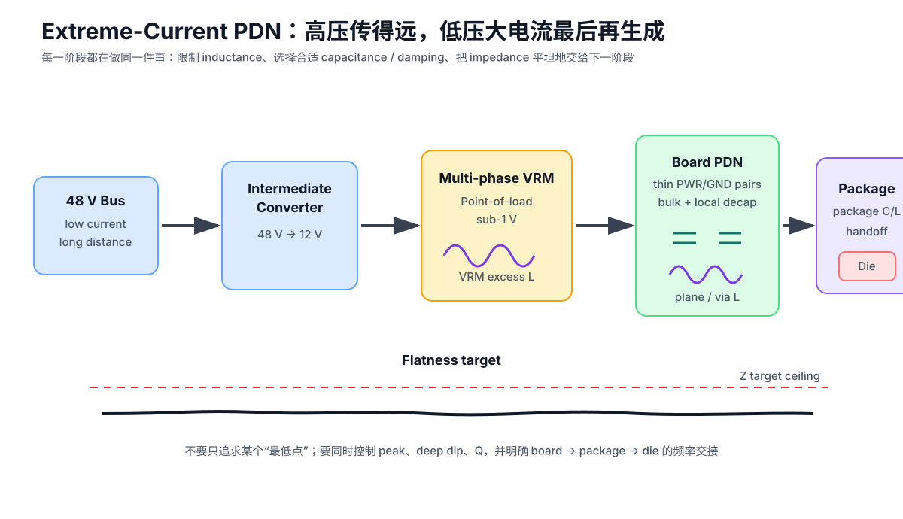

# 15｜超大电流核心供电：分级 PDN、平坦阻抗与验证

> 本章吸收 Robert Feranec 与 Steve Sandler 关于 hundreds-to-thousands-of-amps core rail 的长篇讨论。
>
> **它不是 STM32F407 的必做设计规范。**
>
> 它的作用是把 Part 3 已经学过的 Target Impedance、安装电感、plane pair、反谐振、DC IR Drop、VRM、测量与仿真，升级成一个面向高端 FPGA / GPU / ASIC 的**系统级 PI 框架**。

---

## 15.1 先把视频里的数量级放对位置

视频讨论的不是普通 5 V / 3.3 V MCU rail，而是极端低压大电流核心供电。

视频中的教学数量级包括：

- 几百安开始进入其所谓 very-high-current 范围；
- 约 **1000 A** 作为当时常见的 state-of-the-art 讨论量级；
- 某些超大 ASIC 提到 **1500–2000 A**；
- core voltage 例子约 **0.6–0.7 V**；
- 1000 A 级 rail 的 target impedance 例子进入 **100 µΩ 或更低**。

Picotest 后续公开资料也继续讨论 1–2 kA、几十 µΩ 级 PDN 测量。

这些数字在课程中的身份是：

> **高端计算芯片 / 特定项目的数量级案例，不是“现代 FPGA 都是 1000 A”的通用规格。**

真正要迁移的是设计方法。

---

## 15.2 1000 A 问题为什么不是先问“铜要多厚”

很多人第一反应是：

> 1000 A 怎么从 PCB 铜里走过去？

这当然重要，但视频把优先级放在另一个问题：

> **VRM 到 ASIC 的有效供电电感能不能足够低？**

因为 transient current 不只受 DC resistance 限制。

对动态核心负载：

[
Delta V approx Lrac{di}{dt}
]

而且 PDN 的频域阻抗会被：

- VRM excess inductance；
- bulk-cap ESL；
- plane spreading inductance；
- via inductance；
- package inductance；

连续串起来。

因此极端大电流 PI 的第一性问题变成：

~~~text
VRM 能不能更靠近 load？
→ board path 能不能更短、更宽？
→ PWR/GND pair 能不能更薄？
→ 能不能并联多个低电感供电通道？
→ package / on-die 从什么频率接管？
~~~

不是先问：

~~~text
“单层铜要不要从 2 oz 加到 10 oz？”
~~~

---

## 15.3 系统不会把 1000 A 从机箱入口一路搬到 ASIC

更现实的架构是逐级降压：

~~~text
48 V bus
   ↓
Intermediate Bus Converter
   ↓
12 V / intermediate rail
   ↓
multi-phase VRM / current multiplier / point-of-load stages
   ↓
sub-1 V core rail
   ↓
PCB plane pair
   ↓
package
   ↓
die
~~~

这样做的基本功率关系仍然是：

[
Papprox VI
]

在相同功率下，提高 upstream bus voltage 可以降低传输电流。

例如 1 kW：

~~~text
1 V   → 约 1000 A
12 V  → 约 83 A
48 V  → 约 21 A
~~~

这里只是理想功率换算，没有计入效率。

因此：

> **真正的超大电流通常只在最靠近 load 的最后一级出现。**

这也是 on-package VRM、vertical power delivery 与高密度 point-of-load 的核心驱动力之一：把低压大电流产生点尽量推近负载。

---

## 15.4 Target Impedance 的下一层：不仅低于上限，还要尽量平坦

Part 3 已经学过：

[
Delta V(f)=Z_{PDN}(f)cdotDelta I(f)
]

因此 target impedance 首先是一个允许上限。

但 Steve Sandler 的高电流方法特别强调 **flat impedance**。

为什么？

如果 PDN 是：

~~~text
25 mΩ
→ 深谷 2 mΩ
→ 又升成一个高峰
~~~

不能因为出现了 2 mΩ 就宣布设计更好。

深谷可能意味着：

- 很低 ESR 的 capacitor bank；
- 很高 Q 的 resonance；
- 下一段 package / plane inductance 要面对更低的等效匹配阻抗；
- 之后又出现新的 peak。

所以高端 PI 的优化目标更接近：

> **在要求的频段内，把 impedance 控制在允许上限下，并尽量避免不必要的峰、谷与高 Q。**

这和 Part 5 的 Anti-Resonance 完全一致。

---

## 15.5 C = L / R²：它从哪里来？

这是视频最值得保留、也最容易被滥用的一条公式。

Steve 使用一个低 Q / impedance-matching 直觉：

[
Rapproxsqrt{rac{L}{C}}
]

整理得到：

[
oxed{Capproxrac{L}{R^2}}
]

其中：

- (L)：当前供电阶段看到的有效 inductance；
- (R)：希望这一阶段匹配到的 impedance level；
- (C)：用于把该 L 段压成低 Q / 较平坦响应所需的有效 capacitance。

### 这不是万能“去耦计算器”

课程只在下面条件下使用它：

- 已把 PDN 简化成一个相邻 L / C 阶段；
- 讨论的是 flat / low-Q matching；
- (R) 的定义清楚；
- L 是这一阶段的**有效** inductance，而不是随便拿一颗 via 的 L；
- 最终仍用完整 network simulation / measurement 验证。

不能写成：

> “任何芯片的去耦电容都等于 L/R²。”

真实系统还有：

- ESR / ESL；
- multiple resonances；
- distributed plane；
- package model；
- on-die C；
- regulator loop；
- DC bias；
- tolerances。

---

## 15.6 为什么 R 进入平方项后，问题会突然爆炸

视频给了一个非常有力量的数量级例子。

假设：

[
L=20,pH
]

希望匹配到：

[
R=100,muOmega
]

则：

[
C=rac{20	imes10^{-12}}{(100	imes10^{-6})^2}
=2	imes10^{-3},F
]

也就是：

[
Capprox2000,mu F
]

这就是为什么超低 target impedance 会迅速变成“电容农场”。

同时：

[
Cproptorac{1}{R^2}
]

如果匹配阻抗降低 10 倍，所需 C 会理想化地增加 **100 倍**。

所以视频中的一句话非常值得保留，但要准确表达：

> **不是“PDN 阻抗越高越好”，而是不要把设计目标设置得比系统实际允许值更低；在满足 noise budget 的前提下，过度压低某一阶段的 impedance 会付出平方级 capacitance 代价。**

---

## 15.7 用“分级匹配”理解整条 PDN

高端 core rail 可以抽象成：

~~~text
VRM excess L
     ↓
bulk C / damping
     ↓
bulk ESL + plane L
     ↓
PCB decoupling
     ↓
mounting / via / local plane L
     ↓
package C / package impedance
     ↓
on-die PDN
~~~

每个阶段都问：

1. 当前主要 inductance 是谁？
2. 下一阶段用什么 capacitance / damping 接管？
3. 希望衔接到什么 impedance level？
4. 哪个 frequency 开始由 package/on-die 接管？

### 为什么芯片厂商的 package 信息非常宝贵

如果厂商能给：

- package characteristic impedance；
- package / on-die decoupling model；
- board 需要负责到的最高 frequency；

板级工程师就不必：

- 过度设计到 die 已经自行处理的频段；
- 或错误地在 board 端留下 package 无法接住的 impedance peak。

这也是高端 FPGA / ASIC 逐渐需要 package S-parameter / PDN model 的原因。

---

## 15.8 “低 ESR 越好”为什么会翻车

单看一颗 capacitor：

> ESR 低通常可以降低 series-resonance 附近的 minimum impedance。

但系统级 PDN 不只看最低点。

如果一组 capacitor 把某个频段拉成非常深的 impedance dip：

~~~text
VRM / plane
       \
        \____
             \__
                \____  ← very low ESR dip
                     \
                      /\  ← next resonance
~~~

后面的 package / interconnect 可能又和它形成更高 Q 的 resonance。

这就是视频里的 “whack-a-mole”：

> 这里压下去，别处弹起来。

所以：

- 低 ESR 不是坏事；
- **无限低 ESR 也不是跨系统的唯一优化方向**；
- 真实任务是控制整个 (Z_{PDN}(f)) 的 peak、flatness 与 damping。

这与 Part 5 的 intentional damping / anti-resonance 是同一物理问题。

---

## 15.9 PCB 几何里最值钱的变量：Plane Separation

对一对相邻 PWR/GND plane，缩小 dielectric thickness 通常可以：

- 降低 spreading / loop inductance；
- 增加 plane-pair capacitance；
- 改善高频 reference coupling。

视频给出一个 **Steve 的 rough rule-of-thumb**：

[
L_{plane}sim30,pH	imes D_{	ext{mil}}	imes N_{	ext{squares}}
]

其中：

[
N_{	ext{squares}}simrac{length}{width}
]

例如 4 mil dielectric 的教学估算约是：

[
120,pH/	ext{square}
]

### 课程如何使用这条数字

只用于 screening intuition：

- dielectric 更薄 → L 更低；
- path 更短 → squares 更少；
- path 更宽 → squares 更少。

**不能用于 sign-off。**

到了 µΩ / pH 级 PDN，必须使用：

- stackup-aware field solver；
- 2.5D / 3D EM extraction；
- 或 measurement correlation。

---

## 15.10 为什么会出现 PWR/GND/PWR/GND 多组交错层

极端大电流 board 往往不只一对 power/ground planes。

一个概念结构可能是：

~~~text
PWR
GND
PWR
GND
PWR
GND
~~~

在满足 net assignment 和 stackup symmetry 的前提下，多条并联供电结构可以：

- 分担 DC current；
- 降低有效 spreading inductance；
- 增加总 plane-pair capacitance；
- 让 VRM 从 ASIC 两侧或多个方向供电。

但代价也会增加：

- layer count；
- fabrication cost；
- via complexity；
- routing pressure；
- plane cavity / mode management；
- SI/PI stackup tradeoff。

所以不是：

> “多加 power plane 永远更好。”

而是：

> **当 current / target impedance / available capacitor area 已经逼近极限时，用 stackup 换 inductance。**

---

## 15.11 Bottom Decoupling：离 BGA 平面很近，不等于 loop 很短

高端 ASIC 下方常塞满 decoupling capacitors。

问题是：

~~~text
bottom capacitor
→ via pair
→ many board layers
→ top-side package
~~~

如果板很厚，via 本身就会贡献显著 mounting inductance。

因此视频强调：

- PWR/GND via pair 尽量靠近；
- capacitor connection 尽量形成紧凑 field coupling；
- 相邻 capacitor 的 orientation 可能通过 mutual coupling 帮助降低有效 inductance；
- “herringbone” 等密排方案需要结合实际 BGA escape / via geometry。

课程不把某一种 capacitor orientation 写成万能最佳方案。

最终评价指标仍是：

> **capacitor terminal → via → plane → package power/ground port 的总安装阻抗。**

Part 3 / 14 已经有更基础的去耦连接拓扑仿真，本章只把它放进 kA 级系统背景。

---

## 15.12 DC Ampacity 与 AC Inductance 是两张表

极端 rail 同时有两个问题：

### DC

关注：

[
Delta V=IR
]

和：

[
P=I^2R
]

需要：

- 足够 copper cross-section；
- 多层并联；
- 足够 via / contact；
- current sharing；
- thermal analysis。

### AC / transient

关注：

- spreading inductance；
- via inductance；
- skin / proximity effect；
- plane pair geometry；
- package handoff。

因此视频里“厚铜不是最主要问题”的正确理解是：

> **不能只靠把单层铜做得极厚来解决高频 PI。**

它不代表：

> “厚铜对 1000 A DC 没用。”

DC current 仍然使用整个可导电截面；skin effect 是频率相关现象。

---

## 15.13 Remote Sense 能补压降，但不能消灭损耗

高电流 VRM 常有 remote sense。

它可以让 regulator 根据 load 端电压调高输出，使：

~~~text
source copper drop
~~~

不直接表现为 load 端欠压。

但 remote sense **不会消除**：

[
P=I^2R
]

因此它不能替代：

- IR-drop analysis；
- current-density review；
- via / connector sizing；
- thermal verification。

课程统一说法是：

> **Remote sense 补偿 regulation-point error，不消除铜损和热。**

---

## 15.14 多相 VRM：把一颗“超级电源”拆成很多相

1000 A 级 rail 通常不会由单个 switching stage 承担。

概念上：

~~~text
controller
 ├─ phase 1
 ├─ phase 2
 ├─ phase 3
 ├─ ...
 └─ phase N
       ↓
      ASIC
~~~

相位交错可以：

- 分担 current；
- 降低每相器件应力；
- 提高 effective ripple frequency；
- 减少单相 magnetics / capacitor burden；
- 允许 VRM 围绕 ASIC 更均匀布置。

但它也带来：

- current sharing；
- phase balancing；
- compensation；
- telemetry；
- fault handling；
- multiple-loop stability。

所以：

> **多相不是“把 N 个 Buck 并起来就结束”。**

---

## 15.15 提高 Switching Frequency 是拿效率换尺寸 / Inductance 的旋钮

视频提到一个很典型的 tradeoff：

提高 switching frequency 往往可以：

- 缩小 inductor；
- 缩小部分 bulk energy-storage requirements；
- 提高控制带宽的设计空间；
- 把 power stage 做得更靠近 ASIC。

但通常也会增加：

- switching loss；
- gate-drive loss；
- EMI challenge；
- thermal density。

因此：

> **“频率越高越好”不是结论。**

它只是当物理尺寸和 VRM-to-ASIC inductance 成为瓶颈时，一个可用的架构旋钮。

---

## 15.16 48 V、Current Multiplier、On-Package VRM：本质都是“把大电流最后再生成”

视频讨论了：

- 48 V distribution；
- intermediate bus converter；
- current-multiplier / DC-transformer-like module；
- on-package VRM；
- 甚至把 voltage conversion 进一步推向 package / die。

这些方案表面不同，本质目标都一样：

> **让大电流只存在于很短的距离。**

也就是：

~~~text
高电压、低电流传得远
→ 靠近 load 再变成低电压、大电流
~~~

这是一条很重要的系统级 PI 思维。

---

## 15.17 Constant-Power Load 与“负增量输入电阻”

视频还讨论了 switching converter 输入端的一个高级问题。

如果 converter 输出功率近似恒定：

[
Papprox V_{in}I_{in}
]

当 (V_{in}) 上升时，控制系统可能让 (I_{in}) 下降。

在小信号意义上，输入端可能表现出：

> **negative incremental resistance**

如果前级 input filter 又有 L/C resonance，就可能触发稳定性问题。

这属于经典 Middlebrook input-filter / converter interaction 范畴。

课程只要求建立意识：

- 不只 output PDN 会共振；
- upstream bus + input filter + converter control loop 也会相互作用；
- 48 V distribution 降低 current 的同时，仍要做系统稳定性设计。

---

## 15.18 多个 Control Loop 同时工作：为什么电源工程最后变成控制系统工程

高端 VRM 可能同时包含：

- output-voltage loop；
- current loop；
- load-line / droop control；
- remote-sense loop；
- phase-current balancing；
- input-filter interaction；
- telemetry / protection loops。

一个 loop 的补偿调整，可能改变另一个 loop 看到的 impedance。

视频展示 Steve 的 NISM（Non-Invasive Stability Measurement）方法，并讨论使用 optimizer 同时调多个 loop。

### 课程边界

NISM 是 Steve Sandler 推广的一种 stability-assessment 方法，不是本课程要求掌握的唯一控制环工具。

课程**不**把视频里的某个 stability factor（例如 0.85）升级成跨电源拓扑的固定合格线。

本阶段只要求：

> **知道“PDN flatness”和“converter control-loop stability”是相关但不同的签核问题。**

进入真正的多相 VRM 设计，应继续学习：

- loop gain；
- Bode / Nyquist；
- Middlebrook criteria；
- vendor digital compensation；
- NISM / impedance-based stability；
- worst-case corner analysis。

---

## 15.19 热：别只盯 VRM 自己

视频里的 1 kW ASIC 场景强调一个容易忽略的事实：

即使 VRM 效率已经很高，board thermal environment 仍可能主要被 load ASIC 主导。

热可以：

- 从 ASIC 顶部进入 heatsink / liquid cold plate；
- 通过 package balls / bumps 进入 PCB；
- 从 VRM 进入 PCB；
- 在 plane / copper coin / chassis 中横向扩散。

所以大功率 PI 应逐渐从：

~~~text
electrical only
~~~

升级到：

~~~text
electromagnetic
+
DC current density
+
thermal
+
mechanical cooling
~~~

视频提到 embedded liquid channels、copper coin、water-cooled PCB/probe 等方案。

这些在课程里属于：

> **前沿热管理案例，不是普通 PCB 默认工艺。**

---

## 15.20 验证时不要拿百万级 ASIC 当“保险丝”

视频后半段最值得工程化的一点是：

> **在装真正昂贵 ASIC 前，先验证 power structure。**

可使用：

- low-impedance VNA measurement；
- impedance injection；
- dynamic load step；
- socket load emulator；
- programmable load-slammer；
- simulation ↔ measurement correlation。

逻辑是：

~~~text
EM model
→ predict ZPDN
→ board fabricated
→ measure impedance
→ dynamic load step
→ compare transient response
→ correlate / repair model
→ only then install expensive load
~~~

这比：

> “装芯片，跑 stress test，看会不会死”

成熟得多。

---

## 15.21 为什么 EM Simulation 在这里不是“高级可选项”

普通 MCU：

- datasheet decoupling；
- good layout；
- scope measurement；

往往足够。

但当目标进入：

- pH；
- µΩ；
- 数百/上千 A；
- 多层并联 plane；
- BGA 下方数百颗 capacitor；
- package/board handoff；

几何本身就是主要电气元件。

这时需要：

- EM-extracted plane inductance；
- via / anti-pad model；
- package S-parameter；
- capacitor vendor / measured model；
- DC current density；
- electrothermal simulation。

视频中的核心态度非常正确：

> **这种等级的 power plane 不能靠线宽经验表完成 sign-off。**

---

## 15.22 不同项目做到什么程度

### Level A｜普通 MCU

例如 STM32F4：

- 官方 decoupling；
- low-inductance placement；
- DC drop；
- rail-noise measurement。

不需要 1000 A 方法。

### Level B｜高性能 MCU / SDRAM

例如 STM32H7：

- rail budget；
- impedance intuition；
- layout extraction；
- transient / noise measurement；
- 关键 rail 必要时仿真。

### Level C｜中等 FPGA / SoC

开始需要：

- vendor PDN guide；
- capacitor optimizer / models；
- package-aware target；
- plane / via extraction；
- broader measurement。

### Level D｜高端 FPGA / GPU / ASIC

可能需要：

- full board-package PDN model；
- staged impedance design；
- EM + electrothermal；
- multi-phase VRM architecture；
- low-µΩ measurement；
- dynamic load emulator；
- formal worst-case / reliability sign-off。

这也是为什么本课程最终目标是：

> **能解释设计决策，而不是把所有项目都按 Level D 过度设计。**

---

## 15.23 Extreme-Current PDN Design Review

### Requirements

- [ ] rail nominal voltage 有来源
- [ ] allowed ripple / transient window 有来源
- [ ] dynamic current definition 有来源
- [ ] target impedance 带 frequency range
- [ ] package / on-die handoff information 已确认或明确缺失

### Architecture

- [ ] 高压 bus 到 point-of-load 的降压层级明确
- [ ] 大电流只在必要的短距离存在
- [ ] VRM phases / modules 到 ASIC 的几何尽量对称
- [ ] SI 与 PI 对 BGA 四周空间的资源冲突已显式解决

### AC PI

- [ ] VRM excess inductance 已建模
- [ ] bulk / decoupling / plane / package 阶段可解释
- [ ] 没有只追求 impedance minimum
- [ ] high-Q peak / deep dip 都已 review
- [ ] C=L/R² 只用于有定义的 staged-matching approximation
- [ ] plane / via inductance 来自 EM 或已验证估算

### DC / Thermal

- [ ] IR drop
- [ ] current density
- [ ] via / contact bottleneck
- [ ] I²R loss
- [ ] remote sense 不被当成 thermal fix
- [ ] thermal model 包含 ASIC + VRM + cooling boundary

### Control

- [ ] multi-phase current sharing 已验证
- [ ] input-filter / negative-incremental-resistance interaction 已检查
- [ ] control-loop stability 有专门签核
- [ ] 没把某个 NISM 数字机械复制到不同 topology

### Validation

- [ ] simulation 与 measurement 可 correlation
- [ ] impedance fixture / calibration / bandwidth 有记录
- [ ] dynamic-load method 有定义
- [ ] 昂贵 ASIC 上板前有 power-structure validation plan

---

## 15.24 本章最重要的六句话

1. **极端大电流 PI 的第一旋钮往往是 inductance，不只是 copper ampacity。**
2. **高压传得远，低压大电流尽量最后再生成。**
3. **Target Impedance 是允许上限；真实设计还要控制 flatness 与 Q。**
4. **C=L/R² 是 staged low-Q matching 近似，不是万能去耦公式。**
5. **Remote sense 能补 regulation error，不能消灭 I²R loss。**
6. **当目标进入 µΩ / pH 级，EM + measurement 已经是设计流程的一部分。**

---

## 参考资料

- 用户提供视频：Robert Feranec / Steve Sandler，高电流 power supply / PDN 讨论：https://www.youtube.com/watch?v=WdlN8bHw-w0
- Steve Sandler interview, Sierra Circuits, *Power Integrity in PDN Design and High-Speed Simulations*: https://www.protoexpress.com/blog/steve-sandlers-insights-on-power-integrity-pdn-design-and-high-speed-simulations/
- Picotest, *PDN Basics for Power Designers: Keep Impedance Flat*: https://www.picotest.com/insights/pdn-basics-for-power-designers-keep-impedance-flat-part-two-of-the-video-series/
- Picotest / Witcher & Sandler, *A New Power Integrity Requirement to Supplement Target Impedance: Quantifying PDN Impedance Flatness*
- Picotest, *Non-invasive Stability Measurement*: https://www.picotest.com/solutions/non-invasive-stability-measurement/
- AMD-Xilinx / Keysight / DesignCon material, *Simulating FPGA Power Integrity Using S-Parameter Models*

> 本章中的 0.6–0.7 V、500–2000 A、100 µΩ、20 pH、2000 µF、4 mil、120 pH/square、48 V、以及各种模块/冷却数量级，均属于视频案例、公开访谈或教学推导。除非器件厂商/项目 requirement 明确给出，否则不得直接作为项目 sign-off 数字。
