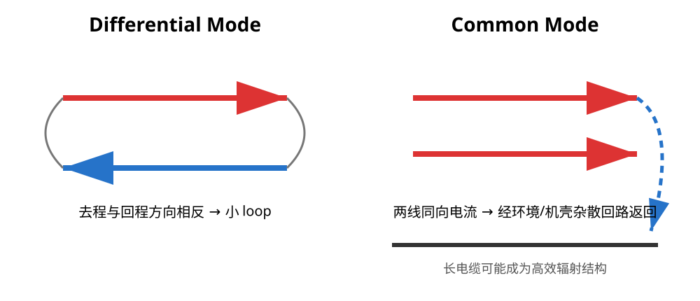

# 01｜差模、共模与辐射源：先搞清是谁在“发射”

## 这一章为什么现在学

SI 里我们关心接收端波形；PI 里关心 rail 电压；EMC 里关心的是：

> **哪些时变电流最后形成了高效的辐射结构，或者耦合进了别的系统。**

---

## 1. 差模电流（Differential-Mode Current）

差模意味着：

```text
去程电流 I
──────────────→

←──────────────
回程电流 I
```

两条路径方向相反，形成一个闭合 loop。

如果 loop 很小，两条路径的远场会部分抵消；如果 loop 被拉大，抵消变差，辐射增加。

所以：

> **差模 EMC 的第一控制量是 loop geometry。**

这就是为什么完整 reference plane、短去耦回路、Buck hot loop 都同时影响 SI/PI/EMC。



---

## 2. 共模电流（Common-Mode Current）

共模不是“地线上多了一点噪声”这么简单。

典型场景：一对本来等幅反向的信号因为不对称，产生一个小的公共电压；这个公共电压又通过连接器、屏蔽层、杂散电容或机壳耦合，驱动两根线一起相对于环境运动。

```text
wire A  ─────→ Icm
wire B  ─────→ Icm
               ↓
          environment / chassis
               ↓
          stray return path
```

这时一整根电缆可能变成有效天线。

共模电流常常很小，却可能比板内的大差模电流更容易辐射，因为“天线尺寸”大得多。

---

## 3. Common-Mode Conversion 是怎么发生的

一个理想差分结构完全对称时，共模转换较小。

现实中这些不对称都会把一部分差模能量转换成共模：

- 差分两线长度/几何不一致
- 一根线比另一根更靠近参考边界
- 一根线换层，另一根没有
- 连接器 pin field 不对称
- ESD/CMC/串联器件封装布局不对称
- return path 在某一侧被切断
- cable / connector 本身不平衡

所以“差分等长”只是其中一项；真正目标是 **electromagnetic symmetry**。

---

## 4. 不要把频率和辐射强度简单画等号

你不能只看：

> “168 MHz 主频，所以只查 168 MHz。”

真实辐射可能来自：

- clock fundamental
- clock harmonics
- data edge spectral content
- regulator switching frequency 及其谐波
- resonant structure
- common-mode conversion 后的 cable resonance

因此频谱中的某根峰，只是“线索”，不是根因。

---

## 5. 一个工程诊断框架

看到超标频点时按顺序问：

### Source
哪个网络含有这个频率或相关谐波？

### Coupling
它怎样从原网络耦合到辐射结构？

### Antenna
真正高效辐射的结构是：
- PCB loop？
- slot？
- cable？
- shield seam？
- chassis structure？

### Return
它的高频回流在哪里闭合？

---

## 6. 小实验：拔电缆能告诉你什么

如果拔掉一根 USB/CAN/电源线后某个辐射峰明显下降，这是非常强的线索：

> 外接线缆参与了辐射结构。

但它**不能单独证明**“根因就在 USB PHY”或者“只要加共模电感就行”。

可能真正原因是：

- 板内时钟噪声耦合到 shield
- return path discontinuity 把差模变成共模
- power noise 通过接口 ground reference 进入 cable

所以实验之后还要追 coupling path。

---

## 7. 本章任务

拿 V2 的 USB 和 CAN 接口，各画一张：

```text
noise source
→ possible coupling path
→ cable/chassis structure
→ return path
```

不需要先给解决方案。

先把电流故事讲完整。

---

## 本章 Review

- [ ] 能区分 DM loop 与 CM cable current
- [ ] 不把“共模”理解成“地不干净”四个字
- [ ] 能列出至少 4 种 common-mode conversion 来源
- [ ] 频谱峰值只作为线索，不直接等同于根因
- [ ] 修改前先定位 source / coupling / antenna / return