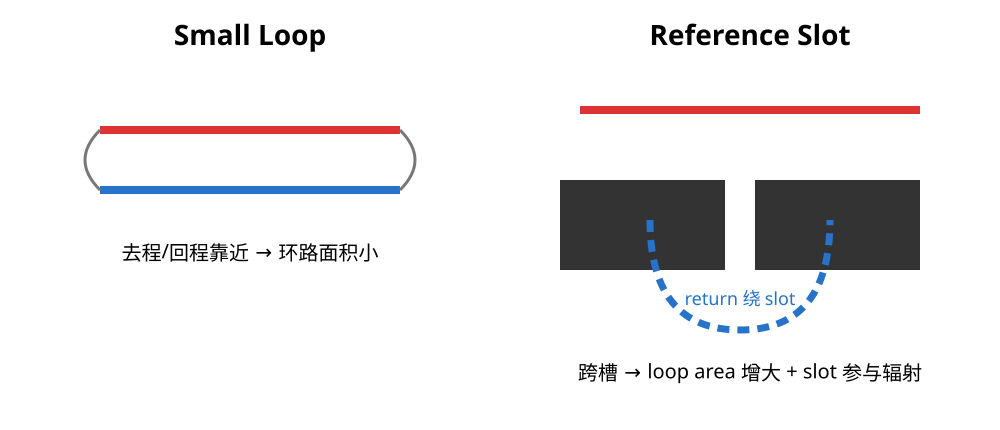
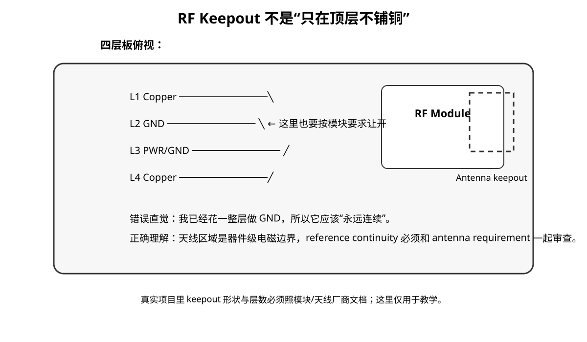

# 02｜回路、槽缝与“天线结构”：PCB 为什么会辐射

## 1. PCB 上并没有一个叫“天线”的器件才会辐射

任何随时间变化的电流都伴随电磁场。

真正的问题是：

> 这个电流路径是否形成了一个效率足够高的辐射结构？

常见结构有三类：

1. **loop**：去程和回程围成面积
2. **slot**：参考平面/屏蔽结构出现长缝隙
3. **wire / cable**：长导体相对环境承载共模电流



---

## 2. 为什么 loop area 重要

把信号线和 return path 想成一根“折叠的环形天线”。

在其他条件相同时：

- 去程和回程越靠近
- 环路面积越小
- 远处场越容易互相抵消

这就是为什么高速线紧邻完整 GND plane 通常比“顶层一根、底层随便敷铜”更容易控制 EMI。

但注意：

> **不要把某个简化的 `E ∝ IAf²` 公式当认证预测器。**

真实远场还取决于几何、电流分布、距离、介质、结构谐振和共模转换。教材用 loop area 建立设计直觉，不用它伪装精确辐射计算。

---

## 3. Reference Plane 上的 slot 为什么危险

假设 L1 有高速信号，L2 是参考地，但 L2 被开了一条 slot：

```text
L1  signal  ─────────────────→

L2  GND     ███████   ███████
                    ↑ slot
```

回流不能继续紧跟信号，必须绕 slot 的端点。

后果不是只有“阻抗有点变化”：

- loop area 变大
- local inductance 增大
- return current spreading 改变
- 更容易把能量耦合到邻近结构
- slot 本身也可能参与辐射

所以跨槽的高速线是一个 **SI + EMI 同时失败** 的结构。

---

### 3.1 Return current 变宽，不等于它自动变成远场天线

reference plane 拉远时，return-current distribution 往往会变宽，fringe electric / magnetic field 也扩展。

这首先意味着：

- near-field 范围更大；
- 对邻近网络的 crosstalk 风险上升；
- impedance / field confinement 改变。

但“回流铺得更宽”本身并不能直接推出某个确定的 far-field emission 数字。

真正更危险的情况通常是几何 discontinuity 进一步把局部场转换成：

- slot excitation；
- plane-to-plane / chassis voltage；
- common-mode current；
- cable current。

所以 EMC Review 要追踪完整链路：

~~~text
source
→ return discontinuity / fringe field
→ mode conversion
→ cable / slot / enclosure structure
→ radiation
~~~

这比“看到回流变宽 = 一定辐射超标”更准确。


## 4. 板边是不是天然危险区？

不是因为“离板边 10 mm 内有魔法”。

板边危险通常来自：

- reference plane 到边界突然终止
- 外层铜与内层平面形成 fringing field
- connector/cable 就在这里接出系统
- shield/chassis transition 常发生在这里

因此“高速线远离板边”是一个经常合理的经验，但具体距离应该来自：

- reference height
- signal geometry
- enclosure / connector geometry
- EMI 风险等级

而不是所有板统一写死一个毫米值。

---

## 4.1 两种“20H”不要混淆

有些资料会同时出现：

1. **区域隔离 20H**：analog / digital functional region 之间，用多个 reference-height H 作为保守 field-separation heuristic；
2. **plane edge 20H**：把 power plane 相对 GND plane 从 board edge 缩回 20H。

它们不是同一件事。

本课程对前者的态度是：

> 可作为超敏感 mixed-signal layout 的初始 screening heuristic，但最终仍要由 coupling / noise budget 决定。

对后者：

> 不把它当成抑制 board-edge radiation 的通用规则；真正有效性要看 edge field、stackup、via fence、enclosure 与测量。


## 5. Stitching Via 到底在做什么

地过孔不是“打得越密越高级”。

它可能承担：

- 连接不同层的同一 GND reference
- 给换层信号提供 return transition
- 减小板边/屏蔽结构的高频接缝阻抗
- 把局部 copper region 连接成更连续的高频结构

对于板边 via fence，孔距应该围绕：

- 最高关心频率对应的结构电尺寸
- 实际 enclosure / shield seam
- PCB 厚度和层间结构
- 制造成本

来定。

`λ/20` 可以作为建立数量级的起点，但不是“10 mm 永远正确”的答案。

---

## 6. Stitching 也可能被误用

例如在 antenna keepout 边缘乱打一圈地孔，可能改变天线匹配；在隔离区/高压区随意跨越 barrier 更是错误。

所以每颗 via 都应该回答：

> “我要给哪股高频电流提供什么路径？”

---

## 7. V2 的结构审查

打开 V2，做三张 overlay：

### Layer 1：高速信号
标出 USB、SDIO、HSE、CAN Tx/Rx 等。

### Reference layer
看这些信号正下方参考铜是否连续。

### Board boundary / connectors
看它们离板边、连接器、shield 区有多近。

然后对每个风险点写：

```text
signal
reference
return interruption
possible antenna structure
fix
```

---

## 7.1 RF 模块案例：为什么“完整 Ground Plane”也会故意开洞？

Reddit 的一个 4-layer nRF52840 wearable review 给了一个很好的真实反例：

> 板子使用 `Top / GND / 3V3 / Bottom`，但 RF 模块天线区域要求 **所有层都禁止 copper / pour / via**。



初学者容易觉得矛盾：

> “不是一直说 GND plane 要完整吗？为什么这里反而把 L2 GND 挖掉？”

因为“reference continuity”不是压过所有器件要求的最高原则。

### 两种空洞完全不同

| Plane void | 为什么存在 | 能不能让高速线跨过去 |
|---|---|---|
| 随手切出来的 GND slot | 没有明确电磁目的 | 通常不应该 |
| antenna keepout | 模块/天线调谐、场分布要求 | 按 RF vendor 文档执行，通常避开其他 routing |

所以真正的规则不是“Ground 永远不能有洞”，而是：

> **任何洞都必须有明确原因，并且周围 routing 要按这个边界重新设计。**

### 工程现场来源

- Reddit r/PCB, *4-layer nRF52840 wearable — no USB, pogo charging + SWD/OTA*  
  https://www.reddit.com/r/PCB/comments/1v4j0gg/review_request4layer_nrf52840_wearable_no_usb/

> Reddit 只提供真实工程语境；实际 keepout 尺寸必须回到 Raytac / Nordic 对应模块的官方 layout requirement。


## 本章 Review

- [ ] 不把“PCB 天线”理解成只有 RF antenna
- [ ] 能找出 loop / slot / cable 三类辐射结构
- [ ] 跨 reference slot 的问题能同时从 SI/EMI 解释
- [ ] 不使用固定 10 mm / 20 mm 板边规则代替几何分析
- [ ] via fence 有明确高频电流用途