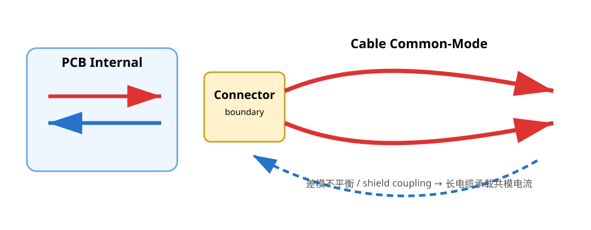

# 03｜连接器、电缆与共模转换：为什么“插上线以后才超标”

## 1. 电缆不是被动旁观者

USB、CAN、UART、电源线一旦离开 PCB，就把系统的电磁结构扩大了几个数量级。

板上 5 cm 走线的问题，可能最终驱动 1 m 电缆上的共模电流。

所以连接器区域不是“把线接出去”的地方，而是：

> **板内 electromagnetic reference 与外部世界发生转换的边界。**



---

## 2. 为什么理想差分对也会在连接器处变差

板内差分几何可能很对称，但经过：

- connector pin field
- ESD array
- common-mode choke
- test pads
- cable launch

之后，两线受到的寄生 C/L 可能不同。

差模能量于是转换成共模。

所以连接器区域要检查的不只是“pair length matched”，而是：

- 两线器件数量是否相同
- 两线 pad / via 环境是否相似
- reference plane 是否连续
- shield / chassis transition 是否合理
- ESD return 是否穿过数字区

---

## 3. Shield 不等于 Signal Ground

对于带屏蔽的 USB/以太网等接口，shield 的主要任务是处理外部电磁环境和屏蔽电流。

它和数字系统 GND 的连接方式取决于：

- enclosure 是否导电
- connector shield 是否接机壳
- 产品接地类型
- ESD 路径
- safety / isolation requirement
- EMC 实测结果

因此不能把：

> “USB 外壳永远直接接数字地”

或

> “USB 外壳永远通过 RC 接地”

写成统一答案。

真正目标是让 shield current 在进入板内敏感区域之前拥有低阻抗路径。

---

## 3.1 “Shield 已接地”还不够：要看 RF Bond Geometry

对于屏蔽线缆，以下两种连接在万用表上可能都显示导通：

~~~text
A. connector shell → 360° chassis bond

B. connector shield → drain wire
                    → thin PCB trace
                    → remote chassis screw
~~~

但在数百 MHz，B 的连接 inductance 可能让 shield boundary 出现明显 RF impedance。

所以 shield review 要记录：

- connector shell contact；
- bond width / length；
- seam / aperture；
- chassis contact；
- 是否存在 pigtail。

不要用“0 Ω at DC”替代 EMC 判断。

完整示意见：
[05｜Shield / Chassis](05_Shield_Chassis与系统地.md) 与
[09｜混合信号接地](09_混合信号接地_分区与屏蔽边界.md)。


## 4. 共模电感（CMC）不是万能药

CMC 对理想差分电流呈低阻抗，对共模电流呈较高阻抗，因此可用于抑制 cable common-mode。

但它也带来：

- differential insertion loss
- parasitic capacitance
- imbalance
- package discontinuity
- cost / area

因此高速接口不能因为“EMC 可能有问题”就盲目加一颗。

工程上常见策略是：

> **预留兼容 footprint / 0Ω bypass 方案，等原型测量后决定是否装。**

前提是 footprint 本身不会把通道做坏。

---

## 5. 电缆实验怎么做才有意义

预兼容阶段可以尝试：

- unplug cable
- 更换短/长 cable
- 改变 cable orientation
- 加 clamp ferrite 做诊断
- 暂时断开 shield / 改变 shield bonding（仅在安全允许的实验条件下）

如果某个峰随这些动作显著变化，说明 cable/chassis 路径参与了辐射。

注意：

> clamp ferrite 是诊断工具时，改善不等于最终产品就应该“套一个磁环”。

它只是告诉你共模路径很可能重要。

---

## 6. Connector Zone 的布局顺序

建议建立区域概念：

```text
outside world
   ↓
connector
   ↓
protection / mode-control components
   ↓
reference transition
   ↓
internal functional circuitry
```

重点不是器件必须排成漂亮直线，而是高能瞬态/共模电流**先被处理，再进入板内**。

---

## 7. USB V2 检查

检查：

- D+/D- 从 MCU 到 receptacle 是否保持对称
- ESD array 是否形成短而低感的泄放路径
- shield current 是否被迫经过 MCU 地回路
- VBUS 与 data pair 是否有不必要的长距离耦合
- connector 下方/周围 reference 是否符合接口结构需要

ST AN4879 是这里的一手参考；器件 datasheet 和 USB 规范继续决定具体约束。

---

## 8. CAN V2 检查

检查：

- CANH/CANL 的 TVS 和可选 CMC 位置
- 终端电阻布局
- connector-side transient path
- transceiver reference / ground return
- 是否给调试保留 bypass / DNP 选项

CAN 的目标不是把 USB 规则照搬过来：它是另一种电气接口、另一种电缆和抗扰环境。

---

## 本章 Review

- [ ] connector 被当作 electromagnetic boundary 而不是普通 footprint
- [ ] differential pair 在 connector zone 仍保持对称
- [ ] shield connection 有系统级理由
- [ ] CMC 是否使用由通道与实测决定
- [ ] cable experiment 用于识别 coupling path，不直接当最终修复