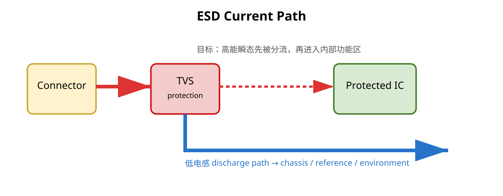

# 04｜ESD 与 TVS：器件选对了，布局仍然可能失败

## 1. ESD 为什么特别考验布局

IEC 61000-4-2 类型的系统级 ESD 事件具有非常快的上升沿和很高的瞬态电流。

这意味着：

> **哪怕极小的寄生电感，也会在 `L·di/dt` 下产生很高的额外电压。**

TI 的 ESD layout guide 用同样的物理关系解释：TVS 的钳位能力不仅由器件本体决定，还受到 PCB 路径电感显著影响。



---

## 2. “TVS 靠近连接器”真正想解决什么

不是为了满足一个固定 `<5 mm` 数字。

真正目标：

1. 让 ESD 电流尽早进入保护器件
2. 让保护器件到泄放参考的路径低电感
3. 减少瞬态电流沿受保护线继续深入板内的共享路径

因此判断 TVS 布局应该看完整电流：

```text
ESD source
→ connector pin
→ TVS
→ discharge reference / chassis / ground structure
→ return to environment
```

如果 TVS 离 connector 只有 2 mm，但 TVS 地端再绕 20 mm 才落到合适参考，整体仍然很差。

---

## 3. 先经过 TVS，再进入芯片区域

布局常见错误：

```text
connector ───────────── MCU
            │
            └── TVS 支路
```

ESD 电流在到达 TVS 分支之前已经和内部走线共享了较长路径。

更好的 topology 是让 connector-side current 优先遇到 protection node，再进入受保护区域。

PCB placement 的拓扑顺序往往比“绝对距离”更重要。

---

## 4. TVS 地端不是普通信号地

TVS discharge current 可能是非常大的瞬态电流。

如果它和 MCU sensitive ground 共用一段狭窄 copper neck / 单颗细 via：

- shared inductance 上出现瞬态压降
- 局部“地”被抬高
- ESD 能量通过 shared impedance 注入系统

所以需要审查：

- discharge vias 数量/尺寸/位置
- 是否直接进入合适的大面积 reference
- 是否优先流向 chassis / connector ground structure（若系统架构如此设计）
- 是否穿过 MCU、晶振、reset 等敏感区

不能简单写“TVS 必须双地孔”；孔数只是降低某个结构电感的一种手段。

---

## 5. TVS 选型也会影响 SI

对于高速接口，TVS 还要看：

- VRWM / working voltage
- clamping behavior
- dynamic resistance
- IEC system-level rating
- I/O capacitance
- package parasitic
- channel symmetry

高电容 protection device 可能直接破坏高速通道。

所以：

> **ESD immunity 和 SI 是同一个 connector launch 的两面。**

---

## 6. ESD 与 Chassis 的关系

如果设备有金属机壳或专门 chassis ground，理想情况通常是让外界 ESD 电流优先沿机壳/屏蔽路径返回环境，而不是穿过数字 GND 核心区域。

但 chassis 与 system GND 怎么连接，必须根据整机结构、安全、屏蔽和认证方案决定。

下一章专门展开。

---

## 7. USB V2 实战

对 USB receptacle：

1. 标出用户可接触导体
2. 标出 D+/D-/VBUS/shield
3. 画每个可能 ESD path
4. 检查 protection footprint 对 pair 的寄生与对称性
5. 检查 TVS discharge path 是否短、宽、低感
6. 检查 shield 是否在 connector boundary 就有明确处理

ST AN4879 明确把 USB ESD protection 放在 connector 附近作为重要 PCB 指南；但新版教材不会把它简化成一个固定毫米数字。

---

## 8. CAN V2 实战

CAN 常面对比 USB 更恶劣的工业瞬态环境。

检查：

- CANH/CANL protection device 的工作电压与 capacitance
- ESD/EFT/surge 的目标测试等级
- TVS placement topology
- optional CMC / termination 的顺序
- transient current 是否穿过 transceiver logic ground

TI 的 IEC ESD/EFT/Surge CAN reference design可作为系统级验证案例，而不是只看单颗 TVS 数据表。

---

## 9. Fault Lab

故意做四个版本：

A. 没 TVS
B. 有 TVS，但放 MCU 旁
C. TVS 靠 connector，但泄放 via 很差
D. protection topology + discharge path 都正确

要求你逐版画 ESD current path，而不是只比较 BOM。

---

## 本章 Review

- [ ] 能用 `L·di/dt` 解释为什么布局影响钳位
- [ ] 不把 `<5 mm` 当 ESD 通用铁律
- [ ] 先审 protection topology，再审距离
- [ ] TVS discharge path 不与敏感回路共享高阻抗路径
- [ ] 高速 TVS 的 capacitance / symmetry 已评估