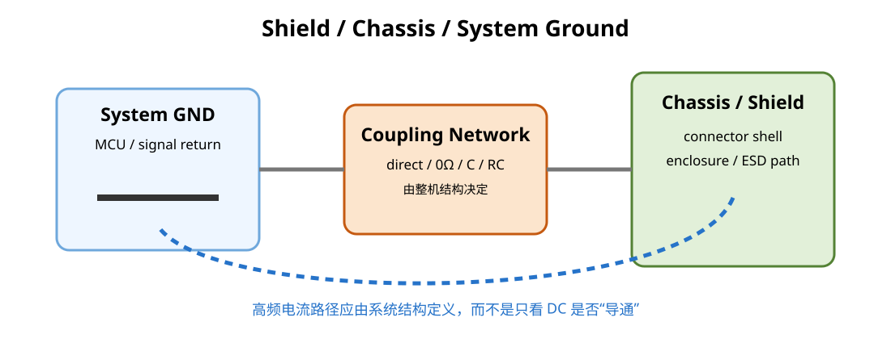

# 05｜Shield、Chassis Ground 与 System GND：别把所有“地”画成同一个符号就结束

## 1. “地”是功能角色，不是天然等电位

原理图里的 GND 符号容易让人产生错觉：

> 所有 GND 在所有频率下都等电位。

现实 PCB 上并不是。

每段铜、via、连接、机壳接触点都有阻抗。

所以要区分角色：

- **Signal / System GND**：功能电路的参考与回流结构
- **Chassis Ground**：机壳、屏蔽、电磁/ESD 电流的结构参考
- **Earth / PE**：与安全接地相关的保护导体（若产品有）
- **Cable Shield**：外部屏蔽层，通常属于屏蔽/机壳电流系统

具体产品不一定同时存在所有角色。



---

## 2. 为什么 shield current 不希望穿过数字核心

如果 USB shield 上的 ESD/共模电流必须先流过 MCU 区域的 system GND 才能找到返回路径：

- shared impedance coupling 增加
- reset / clock / analog reference 更容易受到冲击
- cable noise 与板内 digital noise 更容易互相转换

因此在有 chassis/enclosure 条件时，常希望 connector shield 在物理入口附近就与 chassis structure 建立低阻抗高频关系。

---

## 3. “直接连接、RC、Y-cap、0Ω、磁珠”为什么都有案例

因为它们解决的不是同一个系统。

连接策略取决于：

- 是否有金属机壳
- safety isolation
- DC ground-loop 风险
- ESD return path
- cable shield termination
- EMC frequency range
- product standard

所以教材不会给：

> “chassis 必须单点接 system GND”

或

> “必须多点接地”

这种脱离频率与结构的答案。

在 RF/EMC 问题里，“单点/多点”如果不说明频率和电流路径，几乎没有工程意义。

---

## 4. Chassis Ring / Guard Copper 怎么理解

某些板会在边缘做 chassis copper region，配合金属外壳、螺钉、弹片或 connector shield。

它可能：

- 给 ESD 电流提供外围泄放路径
- 降低 shield seam impedance
- 减少外部噪声进入数字核心

但它不是所有 PCB 都应该复制的装饰。

如果设备根本没有可定义的 chassis reference，画一圈叫 `CHASSIS_GND` 的铜也不会自动获得屏蔽能力。

---

## 5. Shield seam 为什么重要

真正的屏蔽效果取决于：

- enclosure conductivity
- seam / aperture 尺寸
- contact impedance
- bonding spacing
- cable penetration
- connector termination

“扣一个铁盒”但只靠一条长细线把 shield 接回 PCB，RF 上可能几乎没有意义。

高频屏蔽更关注 **低电感、分布式接触**，而不是 DC 万用表量到“通了”。

---

## 6. 以以太网经验理解 chassis boundary

TI Ethernet EMI guidance 强调 RJ45 shield、chassis plane、transformer/common-mode 结构的协同，说明 connector 区域实际上就是 chassis/system boundary 的典型案例。

我们现在不做 Ethernet，但这个思路会在后面的 STM32H7 六层板重新出现。

---

## 7. V2 现在怎么做

当前 STM32F407 V2 是教学控制板，先把 footprint / net architecture 设计成可调整：

- USB shield 有独立明确的连接策略
- 预留 chassis/system coupling option 时标注 DNP/0Ω/RC 用途
- 不让 shield current 必然穿过 HSE / MCU / analog 区
- connector 机械固定焊盘是否属于 shield，要在 symbol/footprint/net naming 中明确

不要使用一堆同名 GND 符号把结构信息抹掉。

---

## 8. KiCad 命名建议

必要时区分：

```text
GND
CHASSIS
USB_SHIELD
PE   (仅有真实保护地时)
```

但不要为了“专业感”创造没有物理意义的 net。

每个 net 名必须对应真实可解释的结构与连接策略。

---

## 本章 Review

- [ ] 能说明 system GND / chassis / shield 的不同角色
- [ ] 不用 DC 等电位思维替代 RF current path
- [ ] shield current 尽量不穿过敏感数字区
- [ ] chassis-system coupling 策略有产品结构依据
- [ ] KiCad net naming 能表达真实边界，而不是制造概念