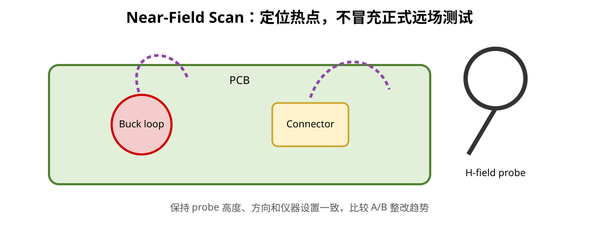

# 07｜近场探头与预兼容测试：不要等到实验室才第一次看 EMI

## 1. 预兼容测试的目标

不是在办公室“复制一套正式暗室”。

目标是：

- 提前发现明显热点
- 建立频谱与网络/时钟之间的对应关系
- 比较整改前后趋势
- 判断 cable / connector / shield 是否参与
- 为正式测试准备可验证的假设

---

## 2. 最低成本工具链

可以从这些开始：

- 示波器 + FFT（能力有限但可做趋势）
- 频谱仪 / SDR（视频段和动态范围）
- H-field near-field probe
- E-field probe
- current clamp / RF current probe（条件允许）
- 不同长度的 USB/CAN/电源线
- clamp ferrite 作为诊断工具

真正的 certification result 仍然只能来自规定场地和测试方法。

---

## 3. H-field Probe 在找什么

H-field probe 更容易感受到局部磁场，因此适合找：

- Buck hot loop
- clock / bus return loop
- connector common-mode current concentration
- plane slot / via transition 附近的异常场

扫描时要保持：

- probe orientation 一致
- distance 尽量一致
- RBW/VBW/attenuation 等设置一致

否则两个截图不能直接比较。



---

## 4. 先建 Clock / Switching Inventory

不要看到频谱峰再猜。

先列：

| Source | Fundamental / Event | Possible harmonics / coupling |
|---|---|---|
| HSE | 8 MHz（若采用） | MCU clock tree / harmonics |
| SYSCLK | up to 168 MHz | GPIO edges / internal current |
| SDIO | project setting | clock + data edges |
| USB FS | 12 Mbit/s signaling | edge-related spectrum |
| Buck Lab | switching frequency | SW edge harmonics |

再对比频谱。

---

## 5. Cable Experiment

如果某峰怀疑是 cable common-mode：

1. 插着标准线记录 baseline
2. unplug cable
3. 换长度
4. 改 orientation
5. 临时加 clamp ferrite

记录变化。

如果峰值随 cable configuration 明显变化：

> cable/chassis path 很可能参与辐射。

但仍要回板上找 common-mode conversion source。

---

## 6. “近场很强”不等于“远场一定超标”

Near-field scan 是局部诊断，不是正式 radiated emissions 的直接替代。

一个板上局部场很强的 loop，如果物理尺寸很小，远场未必是主导；反过来，极小的共模电流流入长电缆，局部 near-field 未必看起来最夸张，却可能主导远场。

所以要结合：

- near-field
- cable current
- frequency
- structure size
- formal test

---

## 7. A/B 整改纪律

每次只改一个主要变量：

```text
Baseline
→ add source resistor
→ measure
→ restore
→ modify return path
→ measure
→ restore
→ add CMC
→ measure
```

不要一次加 8 个磁珠、20 个地孔、3 个电容，然后说“EMC 好了”。

那样你没有获得可复用知识。

---

## 8. 频谱归因示例

假设看到 84 MHz、168 MHz、252 MHz 一组峰：

不要直接说“168 MHz MCU 主频导致”。

要检查：

- 哪个 clock 设置为 84 MHz
- 84 MHz 是否通过 IO/SDIO 形成板级电流
- 168 MHz 是否是二次 harmonic / independent source
- cable unplug 是否改变峰值
- near-field hotspot 在 MCU、SDIO 还是 connector

最终形成：

```text
Source → Coupling → Antenna → Evidence
```

---

## 9. 测量记录模板

每次实验记录：

```text
Board revision:
Firmware revision:
Cable:
Power source:
Instrument:
RBW/VBW:
Probe position/orientation:
Baseline peak:
Modification:
New peak:
Delta:
Interpretation:
Next experiment:
```

---

## 本章任务

对 V2 设计一个不需要正式暗室的预兼容计划：

- 3 个重点频点来源
- 4 个 near-field scan 区域
- USB cable A/B 实验
- CAN cable A/B 实验
- 一个 source resistor 实验
- 一个 return-path 修改实验

---

## 本章 Review

- [ ] near-field scan 用于定位，不冒充正式 RE 测试
- [ ] 已建立 clock/switching inventory
- [ ] cable experiment 有 baseline 和变量控制
- [ ] 每次整改尽量只改一个主要变量
- [ ] 结论写成 Source → Coupling → Antenna → Evidence