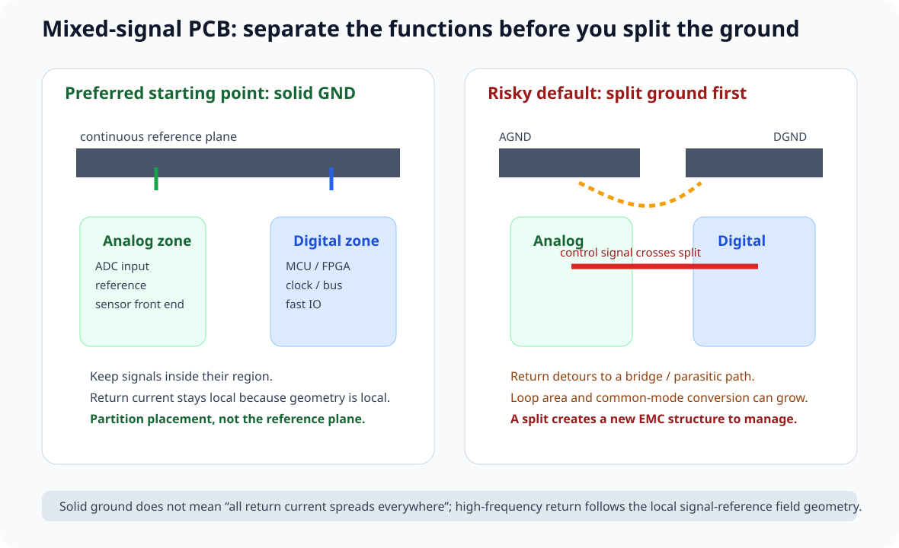
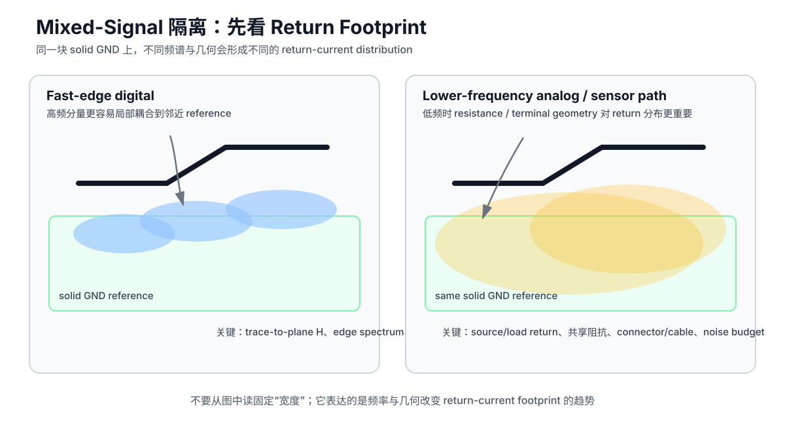
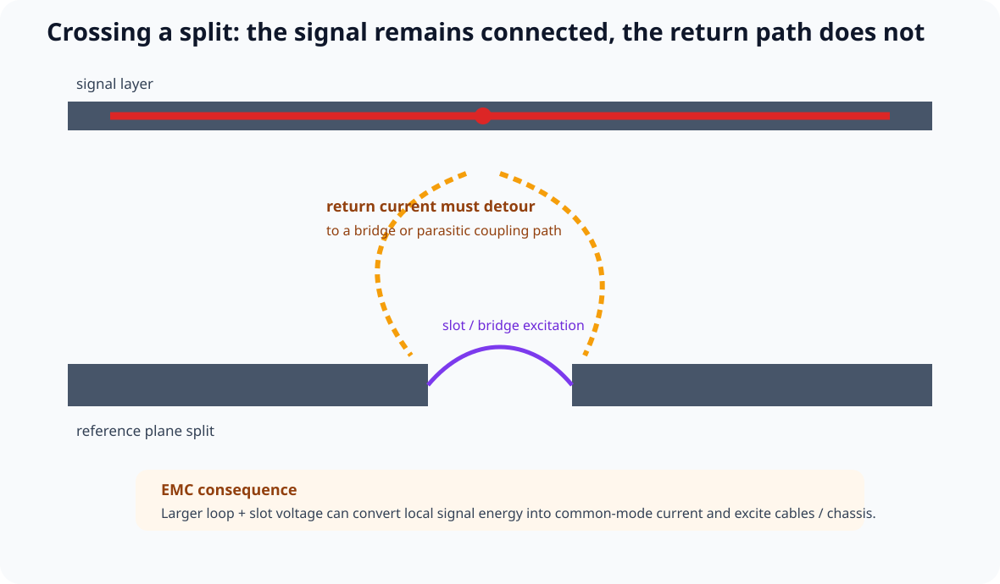
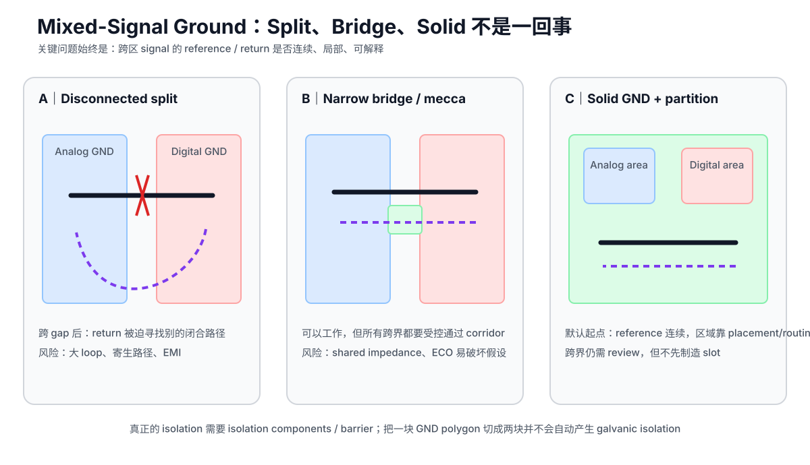
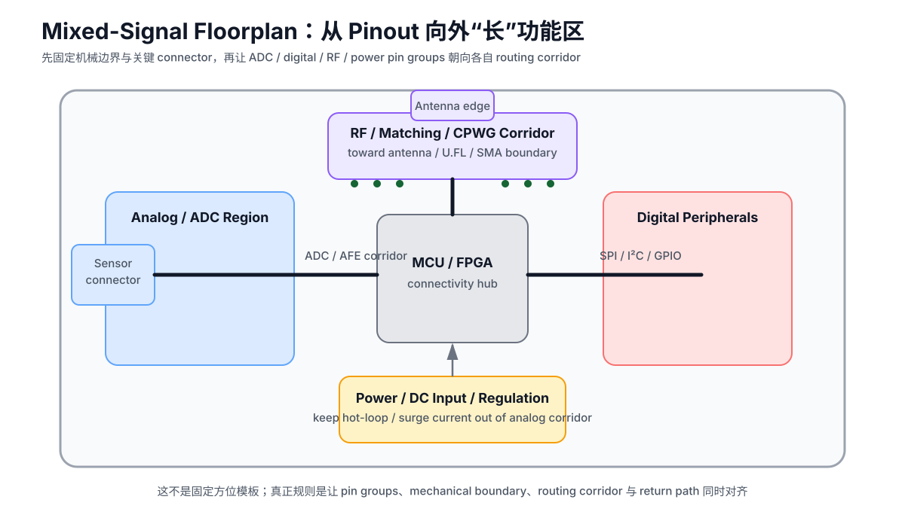
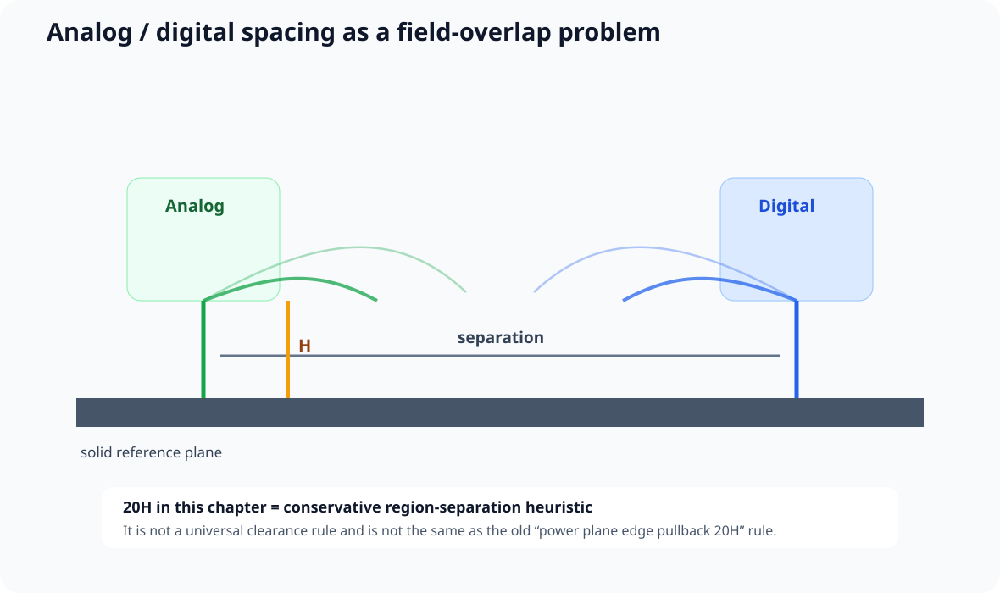
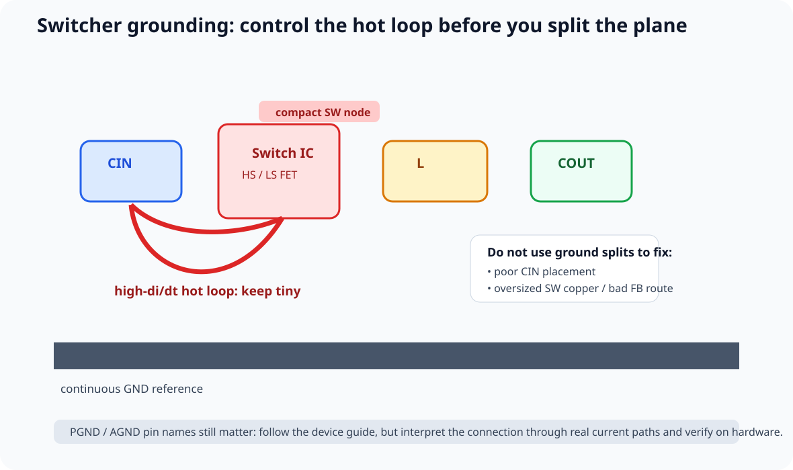
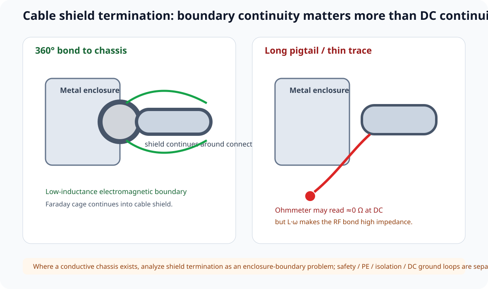

# 09｜混合信号接地：不分地、功能分区与 Shield / Chassis 边界

> 本章吸收 Robert Feranec 与 Rick Hartley 的 *Ground in PCB Layout - Separate or Not Separate?*，回答三个经常被混在一起的问题：
>
> 1. 模拟地和数字地要不要分开？
> 2. 开关电源的 PGND / AGND 应该怎样理解？
> 3. Cable shield、chassis、system GND 到底是什么关系？
>
> 本章的核心不是“所有地都必须连”或“所有地都必须分”，而是：
>
> **先画真实电流与电磁场，再决定是否需要物理隔离、参考平面分割或机壳边界。**

---

## 9.1 默认起点：完整 Ground Plane + 功能区域隔离

视频中 Rick Hartley 给出的强烈经验结论是：

> 对绝大多数 mixed-signal PCB，他优先使用连续 GND plane，而不是 analog / digital split ground。

这个方向也能在现代 mixed-signal 厂商资料中看到：很多 ADC/DAC 设计会要求或推荐一块 solid GND plane，同时把 analog signal chain 与 dynamic digital routing 做物理分区。

课程把默认策略写成：

~~~text
Solid GND plane
+
Analog / digital placement partition
+
Route each signal inside its own region
+
Keep return paths local
+
Do not cross reference slots
~~~

### 为什么“完整地”并不会自动让 digital current 跑进 analog 区

对快速边沿而言，return current 的高频分量倾向在 signal 附近的 reference conductor 上集中。

因此一个 layout 如果做到：

- digital signals 只在 digital 区走；
- analog signals 只在 analog 区走；
- 两区之间有足够物理距离；
- reference plane 连续；

那么 digital return current 往往也主要留在 digital signal 下方附近。

也就是说：

> **Ground plane 连成一整块，不等于每一股高频回流都会平均铺满整块板。**

### 9.1.1 Mixed-Signal 隔离先画“Return Footprint”，不要先画 AGND / DGND

Zach Peterson 在 Altium Academy 的 *Return Paths | Mixed Signal PCB Design: Part One* 里，用一个很适合初学者的视角重新描述了 mixed-signal layout：

> **不要只看 trace 走到哪里；要同时想象它和 reference plane 之间的场，以及 return-current density 在 reference 上占据多大的区域。**

对同一块完整 GND plane，可以把 routing corridor 理解成三个同时存在的东西：

~~~text
forward conductor
+
signal-reference electromagnetic field
+
return-current footprint on reference
~~~

如果 digital 与 analog 的这些 footprint 明显重叠，那么即使原理图上两组网络完全不同，也仍然可能通过：

- mutual capacitance；
- mutual inductance；
- shared return impedance；
- local reference modulation；

发生耦合。

所以 mixed-signal 分区真正要隔离的是：

> **电磁结构和电流分布，不是丝印上写着“ANALOG / DIGITAL”的两块矩形。**

#### 快速 Digital：频谱由 edge 决定，不要只看 clock rate

视频用 ns 级 digital edge 解释：快速变化的场会让高频 return 分量更强地集中在相邻 reference 的 trace 投影附近。

这与课程 Part 2 的口径一致：

> 数字网络是不是“高速”，首先看 edge spectrum / rise time，而不是只看时钟频率。

因此一个 1 MHz GPIO，如果 buffer edge 很快，仍然可能需要按高速互连处理；而一个被有意放慢的控制线，其高频 footprint 可以明显不同。

#### 低频 Analog：不要把“Gaussian-looking”误读成固定宽度

视频把高频 return 画成近似 Gaussian-looking distribution，又强调低频 analog return 可能铺得更宽。

课程保留这个**趋势直觉**，但不把它写成：

> “digital 一定窄、analog 一定宽。”

真实分布还取决于：

- source / load 的 return terminals；
- trace length / route shape；
- plane geometry；
- trace-to-plane height H；
- copper resistance；
- frequency spectrum；
- connector / cable path。

Bruce Archambeault 2008 年的 U-shaped microstrip 示例正好说明了这个连续过渡：在其**特定几何**中，1 kHz return 主要走较短的 resistive path，50 kHz 已明显混合，1 MHz 时大部分 return 跟随 trace 下方。这个示例是频率趋势的教学证据，不是跨所有 PCB 的固定 crossover frequency。

#### 高于 crossover 后，H 比“频率再升一点”更值得看

Analog Devices 对 Archambeault 图的整理还给出一个很重要的高频直觉：当频率已经高到 inductive behavior 主导后，return-current 横向分布主要由 trace width 和 **trace-to-plane height H** 决定；其示例中约 50% return 位于 ±H，约 80% 位于 ±3H。

这里必须保持来源边界：

- 这些比例来自特定解析模型；
- 不是“所有高速线的 3H clearance rule”；
- 更不能直接推导成 analog / digital 区必须固定隔开 6H。

真正应该迁移到 layout 的动作是：

> **先把 reference 拉近、再规划区域与 routing corridor；不要先靠 split plane 制造“隔离感”。**

#### Mixed-Signal Region Map 新增一层：Return Footprint Overlay

做 floorplan 时，不只画器件功能区，再额外画一张简化 overlay：

~~~text
[ precision analog ]
   └─ low-frequency / low-level return footprint

[ ADC / DAC boundary ]

[ MCU / FPGA / clocks ]
   └─ fast-edge local return footprint
~~~

重点检查：

1. 哪些 fast digital corridors 靠近 analog input / reference；
2. 哪些低频 sensor / audio return 可能与 power / digital current 共享低阻抗路径；
3. 哪些跨区控制线实际上携带很快 edge；
4. 哪些 connector current 会让 PCB 内部的“理想分区”失效。

这比简单写“模拟区离数字区 10 mm”更可迁移。

**来源纪律：**

- Zach Peterson / Altium Academy, *Return Paths | Mixed Signal PCB Design: Part One*: https://www.youtube.com/watch?v=8iz57vDKdh4
- Bruce Archambeault, *Resistive vs. Inductive Return Current Paths*, 2008。
- Analog Devices, *Successful PCB Grounding with Mixed-Signal Chips — Follow the Path of Least Impedance*。
- 视频中的“digital 紧、analog 更宽”属于教学简化；课程用 Archambeault 的频率连续变化模型补足边界条件。

---

## 9.2 为什么 Split Ground 很容易把 SI 问题升级成 EMI 问题

假设把一块 plane 割成：

~~~text
Analog GND     gap      Digital GND
██████████              ███████████
~~~

然后一根 digital control line 必须去 analog side：

~~~text
digital source ───────────── analog switch
                ↑ crosses gap
~~~

signal trace 没断，但 return path 被切断。

回流必须：

- 绕到 split 的桥接点；
- 通过 parasitic capacitance 跨越；
- 或通过其他系统路径闭合。

可能造成：

- loop area 增大；
- local inductance 增大；
- common-mode conversion；
- split / slot 被激励；
- cable / chassis 被进一步驱动。

视频引用的一个 EMC 案例里，去掉 analog/digital split 后辐射问题消失。这个案例的可迁移结论不是：

> “所有 split ground 都必然失败。”

而是：

> **一旦切 ground，就必须证明没有重要信号/回流跨槽、没有把 split 变成被激励的 slot / dipole-like structure。**

### 9.2.1 三种“分地”图不要混为一谈：Split、Bridge、Solid

Zach Peterson 在 *Defining Ground | Mixed Signal PCB Design: Part Two* 里用三个草图把一个经常被一句“模拟地和数字地要不要分”掩盖的问题拆开了：

#### 情况 A：两个完全断开的 Ground Region

~~~text
ANALOG GND      gap       DIGITAL GND
█████████                 ███████████
~~~

如果 analog 与 digital **真的没有任何信号、供电、控制或回流关系**，那么它们从电路行为上更像：

> 两个独立系统恰好做在同一块 laminate 上。

这不是通常所说的 mixed-signal interaction。

一旦 ADC、DAC、analog switch、MCU control、clock、SPI 等任何网络要跨区，问题立刻变成：

> **跨界信号的 return path 到底在哪里？**

如果 reference 被 gap 切断，return 可能通过：

- split 边缘绕行；
- 某个远处连接点；
- stray capacitance；
- cable / enclosure；
- 其他意外 conductor；

闭合。

课程不使用“return literally anywhere”作为定量描述，但保留其工程警告：

> **如果设计者没有显式提供 reference continuity，真实高频闭合路径就可能由你没有规划的寄生结构决定。**

这正是 EMI 风险。

#### 情况 B：两块 Ground 只通过一条窄 Bridge / Mecca 连接

~~~text
ANALOG GND ===== narrow bridge ===== DIGITAL GND
~~~

视频指出这种结构**并非物理上绝对不能工作**。

如果同时满足：

1. 所有 analog↔digital crossing 都集中在 bridge corridor；
2. signal trace 与它的 return transition 在几何上靠近；
3. bridge 不成为高阻抗 narrow neck；
4. ESD / cable / power current 不把 bridge 当共享瓶颈；
5. 没有其他网络偷偷跨 slot；

那么它可以形成一个可解释的局部跨界结构。

但它的工程问题是**脆弱**：

- 后续加一根控制线就可能跨错位置；
- layout 修改很容易破坏原假设；
- 多个 return 共享窄桥会产生 common impedance；
- bridge / slot geometry 可能形成可被激励的结构；
- Review burden 比 solid plane 大很多。

所以课程把它定位为：

> **需要证明的特殊拓扑，不是 mixed-signal 默认模板。**

也就是说，“单点连接 / mecca point”不是因为名字好听就自动解决 EMI。

#### 情况 C：Solid Ground + Functional Partition

~~~text
one continuous GND plane
+
analog placement region
+
digital placement region
+
controlled boundary crossings
~~~

这是本课程的默认起点。

它的优势不是“数字噪声消失了”，而是：

- signal 下方 reference 不被人为切断；
- fast digital return 更容易保持局部；
- analog / digital 隔离可以靠 placement、routing corridor、edge control 和 noise budget 来管理；
- 后续 ECO 不容易因为多一根跨区网络立即制造 slot crossing。

#### “板框挖掉一块”为什么不是电磁魔法

视频还用了一个很好的反例：

如果两块 GND 通过同样的窄 corridor 相连，那么 corridor 旁边有没有多余 FR-4 laminate，本身不是决定 return path 的核心。

真正决定高频行为的是：

- conductor geometry；
- dielectric / reference geometry；
- current loop；
- field boundary；
- nearby metal / enclosure。

所以不要用：

> “这里把 PCB outline 挖个槽，看起来 analog / digital 更分开了”

代替 return-path analysis。

机械开槽当然可能因为 creepage、isolation、antenna keepout、optical/mechanical requirement 有意义；但那是另一类需求。

#### Split Ground 不是 Galvanic Isolation

如果真正需求是：

- 安全隔离；
- 高共模电压；
- ground-potential difference；
- medical / industrial isolation；

那么需要的是：

- isolator / transformer / optocoupler；
- isolated power；
- creepage / clearance；
- insulation system；

而不是在同一 PCB 上把 GND polygon 切成两块就称为“隔离”。

#### EMC Debug：看到 mixed-signal fail，优先看什么

这期视频提到 Zach 团队在整改无法通过 EMC 的 mixed-signal board 时，会优先检查 ground plane 是否被 split，以及是否有 inter-domain trace 跨 gap。

课程把它转成可执行 debug 顺序：

1. 高亮所有 analog↔digital crossing nets；
2. 显示它们的 reference plane；
3. 查 slot / split / plane edge；
4. 查 return transition 是否靠近 signal crossing；
5. 查 narrow bridge 是否承载多个共享 return；
6. 再看 cable / enclosure 是否成为替代闭合路径；
7. 修改后做 near-field / conducted / radiated A/B。

这里的“先查 split”是**debug heuristic**，不是“所有 EMC fail 都由 split ground 导致”。

**来源纪律：**

- Zach Peterson / Altium Academy, *Defining Ground | Mixed Signal PCB Design: Part Two*: https://www.youtube.com/watch?v=S6PNYKxJsdk
- Zach Peterson, *Should You Split Ground Planes in Mixed-Signal PCB Design?*
- Analog Devices, *What Are the Basic Guidelines for Layout Design of Mixed-Signal PCBs?*
- 本节只新增 topology / review 视角；跨 slot 的 SI/EMI 物理仍以 Part 2 与本章 9.2 为主，不重复展开。

---

## 9.3 Mixed-Signal 的真正第一武器是 Placement Partition

与其用铜缝“强迫电流别过来”，更稳健的顺序通常是：

1. 按功能把 noisy digital、high-frequency analog、low-frequency precision analog 分区；
2. mixed-signal IC 放在两个功能区的边界；
3. analog pins 朝 analog side；
4. digital pins 朝 digital side；
5. analog routes 不进入 digital corridor；
6. digital routes 不穿过 analog input / reference 区；
7. 整个区域下方保持连续参考。

这也是为什么“placement 决定 routing，routing 决定 return path”。

### 一个区域图比两个 GND net 名更有价值

建议在 PCB 上先画：

~~~text
[ low-level analog ]
          |
[ ADC / DAC boundary ]
          |
[ processor / FPGA / digital IO ]
~~~

而不是先画：

~~~text
AGND polygon
DGND polygon
~~~

然后再想器件放哪里。

### 9.3.1 从 MCU Pinout 反推 Floorplan：Mixed-Signal 不是“摆完再隔离”

Zach Peterson 在 Altium Academy 的 *Mixed Signal PCB Layout | Mixed Signal PCB Design: Part Three* 里，把 mixed-signal placement 从“模拟区放左边、数字区放右边”进一步推进成一个更可执行的方法：

> **先看主处理器的 pinout 和接口方向，再决定每个功能区应该落在哪一侧。**

视频里的典型思路是：

~~~text
                 [ RF / antenna edge ]
                         |
[ analog sensor ] -- [ MCU ] -- [ digital peripherals ]
                         |
                 [ power / DC input ]
~~~

这张图不是固定模板，但它非常适合教学，因为它把三个本来分散的问题统一起来：

1. **器件摆放距离**；
2. **routing corridor**；
3. **return-current footprint**。

#### MCU 放“中间”不是规则，而是因为它通常是 Connectivity Hub

视频建议主 MCU / processor 先作为 floorplan 锚点，原因不是“所有 MCU 必须居中”，而是：

- 常见 MCU / FPGA 四周都有大量 I/O；
- ADC / DAC / GPIO / bus / RF / clock 往往从不同 pin bank 向外展开；
- 先确定 MCU 的位置和旋转方向，能减少后续跨区长线。

所以更准确的课程规则是：

> **优先把 connectivity hub 放在能让关键接口自然朝向对应功能区的位置；“居中”只是常见结果，不是目标本身。**

对 BGA / FPGA，甚至可能为了 bank assignment、DDR、SERDES、connector escape 明显偏置位置。

#### Analog 区不是从“板左边”开始，而是从 ADC / AFE Pin 开始

如果 MCU 的 ADC pins 集中在某一侧，那么 analog signal chain 最自然的方向通常就是那一侧。

例如：

~~~text
off-board sensor connector
        |
filter / protection / AFE
        |
ADC pin group on MCU
~~~

这样做同时获得：

- analog route 短；
- 不必穿过 digital core；
- return footprint 更容易留在 analog corridor；
- sensor connector 不需要为了“板边好看”绕到另一侧；
- protection / RC / op-amp 等器件也能形成连续的 signal-flow placement。

这比：

> 先把 connector 放到机械上最顺手的位置，再跨半块板拉 ADC 线

更容易控制噪声。

#### Digital 外设沿对应 Bus Pin Group 展开

GPIO、I²C、SPI、UART、memory bus 等数字接口也遵循同样原则：

> **从 pin group 向外长出功能区，而不是把 peripheral 随机塞在剩余空间。**

如果数字外设区已经明确，就要避免：

- bus 从 analog corridor 中穿过去；
- clock / SPI SCK 沿 analog input 平行长距离运行；
- digital connector 的回流穿过 precision analog return region。

这把前两期讲的 Return Footprint 真正落实到了 placement。

#### Power 区也要有“进入方向”，不要把 DC 当作无害背景

视频示例把 DC input / regulation 放在与 RF、analog 分开的区域。

课程吸收这个 floorplan 直觉，但不把“Power 永远放板底边”写成规则。

真正要问：

- power 从哪个 connector / battery 进入；
- switcher hot loop 在哪里；
- high-di/dt current 会不会贴着 analog front end；
- regulator 到 MCU / RF rail 的路径是否短；
- power polygon / plane 是否迫使敏感信号跨 split；
- connector / ESD surge current 从哪里回去。

因此 Power Region 不是一块“剩余区域”，而是和 analog / RF 一样必须先规划的电磁功能区。

#### RF 区优先靠近 Board Edge / Antenna Boundary

视频的 Wi‑Fi / Bluetooth 例子把 RF feed 引到板边的 U.FL / SMA / printed antenna，并强调不要让这条高频路径穿过 digital core。

如果 RF pin / module output 在 MCU 某一侧，优先考虑让这一侧朝向 antenna boundary。

典型链路：

~~~text
RF pin
→ matching / filter
→ controlled-impedance feed
→ U.FL / SMA / printed antenna
~~~

而不是：

~~~text
RF pin
→ 穿过 MCU digital fanout
→ 绕板一圈
→ antenna
~~~

真正收益包括：

- 更短的 RF path；
- 更少的不连续和损耗；
- 更容易保持 reference continuity；
- 更容易做 CPWG / ground-via boundary；
- 更少与 digital / analog routing corridor 交叉。

CPWG、via fence 与 RF 线本身的设计细节仍然放在 [RF 射频板设计入门](../07_进阶专题/03_RF射频板设计入门.md)，这里不重复。

#### 一个更可执行的 Floorplan 顺序

以后做 mixed-signal 主板，先完成：

~~~text
Step 1  标出 board-fixed items
        connectors / antenna / mounting / keepout

Step 2  标出 MCU/FPGA pin groups
        ADC / DAC / buses / clocks / RF / power

Step 3  旋转并放置 connectivity hub
        让关键 pin groups 朝向对应边界

Step 4  从 pin groups 向外长功能区
        analog / digital / RF / power

Step 5  画 routing corridors
        不只是画 component boxes

Step 6  叠加 return-footprint review
        fast digital / low-level analog / RF / power current

Step 7  最后才填“剩余空间”
~~~

这比“先摆大件 → 自动摆小件 → 最后看哪里能走线”更适合 mixed-signal 系统。

#### Via Fence 是边界工具，不是“隔离万能墙”

视频展示了 2.4 GHz CPWG 两侧大量 GND vias，并用它作为 RF feed 与其他板上电路之间的隔离措施。

课程只保留正确边界：

- via fence 必须和 **continuous GND reference / coplanar ground** 一起工作；
- 它不是在任意模拟线旁边打一排孔就自动“屏蔽”；
- spacing、anti-pad、via inductance、board stackup 和 frequency 都会影响效果；
- 对 precision low-frequency analog，第一优先级通常仍是 placement / routing / shared-impedance control，而不是围一圈 via。

#### 视频中的真实板案例应该学什么

视频展示了一块约 2.4 GHz ISM-band 的 in-progress board：

- RF feed 沿板边走；
- RF 使用 coplanar ground + stitching vias；
- DC / regulation 放在另一块区域；
- digital core 与 RF corridor 分离；
- L2 为连续 GND plane；
- 底层仍可承担其他 routing / grounded pour。

课程只吸收其**floorplan 与 region-separation 方法**。

不能把这个案例推导成：

- “2.4 GHz 在 FR-4 上走任意长度都没问题”；
- “三英寸板一定低损耗”；
- “所有 2.4 GHz RF 都必须这样绕板边”；
- “via 越多 isolation 越好”。

视频自己也明确指出：到了例如 24 GHz radar 这样的更高频段，长 RF path 的 **loss** 会迅速变成更重要的问题。

**来源纪律：**

- Zach Peterson / Altium Academy, *Mixed Signal PCB Layout | Mixed Signal PCB Design: Part Three*: https://www.youtube.com/watch?v=YWDxLHfsx-U
- 本节吸收视频中的 MCU-centric floorplan、ADC-side analog region、digital-peripheral region、RF-to-edge routing、2.4 GHz CPWG/via-fence 实例。
- RF 几何与 via spacing 的定量规则不从本视频泛化；继续以具体 stackup、field solver、器件/天线厂商 guide 为准。

---

## 9.4 20H：这里有两个完全不同的“20H”

视频里出现了两个经常被混淆的 20H。

### A. 模拟区与数字区之间的 20H separation

Rick 给出的经验是：

> analog / digital circuit separation 可以从约 **20 × H** 作为极保守的隔离起点。

其中 H 是外层信号/器件到最近 reference plane 的距离。

物理直觉：

- H 越小，field 越受 reference 约束；
- 两个区域相距多个 H 后，direct fringe-field coupling 会快速减弱。

但课程必须明确：

> **20H 是经验 screening heuristic，不是通用 layout rule。**

真实需要的 separation 取决于：

- analog noise budget；
- digital edge rate；
- parallel geometry；
- layer；
- shielding/reference；
- coupling mechanism；
- ADC resolution / front-end gain。

对 24-bit ADC 的微伏级 budget 与普通 10-bit sensor input，显然不能共用同一个固定距离。

### B. Power Plane 相对 GND Plane 的“板边缩 20H”

这是另一条传统 20H rule。

视频中 Rick 明确表示，他不认为“把 power plane 从 GND edge 缩回 20H”能可靠解决 board-edge radiation，并引用 Missouri S&T 的研究观点：这种做法往往不会明显帮助。

所以教材禁止把两个 20H 混成一句：

> “PCB 只要所有地方满足 20H 就不会 EMI。”

---

## 9.5 频率不是 20 kHz 处突然换一种物理规律

视频使用“高于约 10–20 kHz 时 return 会主要集中到最近的 reference”来建立直觉。

课程保留它作为讲者的经验描述，但不采用硬阈值。

真实情况更连续：

~~~text
DC / very low f
→ resistance distribution more important
→ current can spread broadly

frequency rises
→ inductive / capacitive effects become more important
→ field couples more strongly to nearby reference
→ return distribution becomes more localized
~~~

没有一条自然定律规定：

~~~text
19.9 kHz = 全板扩散
20.1 kHz = 只走 L2
~~~

所以工程判断继续使用：

- signal / return geometry；
- edge spectrum；
- plane spacing；
- source/load；
- actual noise budget。

### Audio 为什么要单独小心

低频 audio / precision analog 的 return 可能比 fast digital return 更广泛地分布在低阻抗导体结构中。

因此：

> 不要因为 digital high-frequency current 很局部，就推导“audio 也一定只在最近 plane 的窄条区域回流”。

对 audio / low-level analog，更重要的是：

- region placement；
- source / load return；
- supply filtering；
- shield / connector current；
- avoid shared low-frequency impedance。

---

## 9.6 如果一根 Digital Control 必须跨到 Analog 区怎么办？

视频给了一个很实用的策略：

> 如果控制动作本身很慢，不要把一个 0.5 ns edge 原样送进 analog region。

例如 FPGA 控制 analog switch：

~~~text
FPGA
 |
 | fast edge
 |
Rseries / damping
 |
 | slower edge
 |
analog switch
~~~

视频举出 1 kΩ / 2 kΩ 这种高值 resistor 作为教学例子。

课程不会把它升级成固定阻值，因为真实边沿由：

\[
\tau approx R_{series} C_{load}
\]

共同决定。

正确流程：

1. 确定 control signal 最大允许 delay；
2. 确定 receiver VIH/VIL；
3. 估计 load capacitance；
4. 选择足够慢、但仍满足 timing 的 edge；
5. resistor 放在 digital → analog boundary 附近；
6. 实测确认没有产生过慢 threshold crossing / susceptibility。

原则是：

> **使用“系统所需的最慢边沿”，而不是默认把最快 buffer edge 送进敏感区。**

---

## 9.6.1 工程师争论现场：AGND / DGND 为什么总能吵起来？

论坛里的高质量 mixed-signal 讨论几乎反复出现同一个结论：

> **先用 placement 和 current-path partition 把系统分区，再决定铜要不要切。**

真正的争议通常不是“要不要模拟地”，而是：

- 低频 DC / 精密 return 会不会通过敏感区域；
- 快速 digital return 会不会因为 slot 被迫绕路；
- ADC/DAC 是否有一个还是多个；
- 电源入口、负载出口与传感前端是否共享阻抗；
- 是否存在 safety / isolation / industrial I/O 这类特殊边界。

### 🧠 一个非常实用的设计技巧：先“假装分地”，最后删掉 split

论坛中有工程师提出过一个很好的 placement 训练法：

~~~text
Step 1  在脑中/草图上先画 Analog Zone 与 Digital Zone
Step 2  所有器件和走线都按“不能跨界”来布局
Step 3  检查 ADC / DAC / control crossing
Step 4  最后把实际 GND copper 保持连续
~~~

这样既利用了“split 思维”强迫你做好 partition，又避免真的在 reference plane 上制造 slot。

### 📋 三类案例不要混在一起

| 场景 | 默认策略 | Split 何时可能有价值 |
|---|---|---|
| MCU + ADC + 数字接口 | solid GND + placement partition | 通常不需要 |
| 高精度 DC / audio，存在明确大电流低频回路 | solid GND，先优化 current entry/exit | 为控制 shared resistance/IR drop，可能讨论窄 neck / 分区，但需验证 |
| safety isolation / 外部工业噪声域 | 先按隔离架构处理 | 这不是普通“AGND/DGND split”，而是系统级隔离边界 |

### ❌ 最危险的补丁：把两个 GND 只在 ADC 下方连起来

如果板上其他电流也必须通过这条“唯一桥”流动：

~~~text
Digital return ───────┐
Power return ─────────┼── narrow bridge under ADC
Analog return ────────┘
~~~

那么 ADC 下方反而成了共享阻抗最集中的位置。

因此“datasheet 画了 AGND/DGND 两个 pin”不等于：

> PCB 必须画两块地，然后只在 ADC 底下单点短接。

### 🎮 Fault Lab：删掉 split 后，什么还应该保留？

给学生一张已经切好 AGND/DGND 的板，让他执行：

1. 删除 ground split；
2. 保留 analog / digital placement partition；
3. 保留 power-domain boundary；
4. 标出所有跨区 control lines；
5. 画出大电流 DC return；
6. 检查快速线下方 reference 是否连续。

如果删除 split 后整个设计立即“失去秩序”，说明原设计主要靠铜缝维持纪律，而不是靠 placement / routing。

### 工程实践来源（论坛讨论，不是规范）

- Electronics StackExchange, *Should I really divide the ground plane into analog and digital parts?*  
  https://electronics.stackexchange.com/questions/306862/should-i-really-divide-the-ground-plane-into-analog-and-digital-parts
- Electronics StackExchange, *Why exactly is it discouraged to gap the ground plane?*  
  https://electronics.stackexchange.com/questions/329608/why-exactly-is-it-discouraged-to-gap-the-ground-plane
- EEVblog, *Split Ground plane — to do or not to do?*  
  https://www.eevblog.com/forum/beginners/split-ground-plane-to-do-or-not-to-do/
- Electronics StackExchange, *Single ground plane vs split planes?*  
  https://electronics.stackexchange.com/questions/389168/single-ground-plane-vs-split-planes

## 9.7 什么时候 Split Ground 才进入候选方案？

本课程不会写“永远不能 split”。

视频给出的极端例子是：

- 超高分辨率 ADC；
- analog input 的 noise budget 只有数 µV；
- board area 极度受限；
- analog / digital 无法拉开足够距离；
- direct field coupling 已经成为可证明的 error source。

这时 split ground 可以成为候选，但它必须承担额外验证责任。

### Split Ground Design Review

如果决定 split，至少回答：

- 两块 ground 在哪里连接？
- 为什么连接点选在这里？
- 哪些信号跨 analog ↔ digital boundary？
- 每根跨界信号的 return path 在哪里？
- 是否形成 slot antenna？
- mixed-signal IC 是否跨在 bridge / boundary 上？
- cable / chassis 是否会绕开你设计的 single-point connection？
- ESD current 是否可能穿过敏感 ground bridge？
- prototype 有没有 EMI + noise 双重验证？

如果这些问题答不出来：

> **先回到 solid plane + placement partition。**

---

## 9.8 开关电源：不要为了“引导回流”先把 GND 切碎

视频里 Rick 对 switching regulator 的观点也很明确：

> 他更倾向于通过 placement 与局部 high-di/dt loop 控制 current，而不是用 split ground 强迫 current 走某个区域。

这与 Part 3 的 Hot Loop 模型一致。

### 最重要的是 switch node / hot loop 几何

典型优先级：

- FET / switch；
- diode / synchronous FET；
- inductor；
- CIN；
- COUT；

围绕真正的 energy-transfer loop 做紧凑 placement。

尤其：

> **SW node 不是“大电流，所以铜越大越好”。**

SW node 同时是高 dv/dt structure。

所以：

- 面积做到能承载 current / thermal 即可；
- 不要无意义铺成大铜岛；
- 远离 FB / analog / connector；
- hot-loop components 尽量保持同 side。

### PGND / AGND 怎么办？

如果 IC 有多个 ground pins：

- 先读 datasheet / reference layout；
- 再用 current-path / field model解释厂商为什么这样接；
- 不因为 pin 名叫 AGND / PGND 就自动切整块 plane。

同时要保持一条工程纪律：

> **Application note 是重要证据，不是免分析通行证。**

当 reference layout 与物理模型明显冲突时，应：

- 查 errata / updated guide；
- 比较 evaluation board；
- 做 simulation / prototype；
- 直接向 vendor FAE 求证。

---

## 9.9 Shield 不是一根“接地线”：它是 Faraday Cage 的延续

视频后半段从 PCB GND 转向 cable shield / enclosure。

核心模型：

~~~text
metal enclosure
   ||
360° connector bond
   ||
cable shield
~~~

shield 的目标不是“在 DC 上和 GND 通”。

它是：

> **让电磁边界从 enclosure 连续延伸到 cable。**

所以高频下应关心：

- 360° circumferential bond；
- connector shell；
- seam / aperture；
- pigtail inductance；
- chassis contact impedance。

---

## 9.10 为什么一根 DC 0 Ω 的 Pigtail 在 RF 上可能很差

假设 shield 通过：

~~~text
drain wire
→ connector pin
→ 50 mm thin trace
→ chassis screw
~~~

连接到 enclosure。

万用表可能测：

~~~text
≈ 0 Ω
~~~

但高频时：

\[
Z_L = j2\pi fL
\]

哪怕只有几 nH / cm，到了数百 MHz，连接阻抗也可能已经不可忽略。

视频举了一个约 300–400 MHz 下、长连接等效到十几欧姆量级的案例。

课程只保留“数量级警告”：

> **不要拿 DC continuity 证明 RF shield bond 很好。**

真正目标是：

- 短；
- 宽；
- 多点/环周；
- 直接 bond 到 chassis boundary。

---

## 9.11 Cable Shield 到底接 Signal GND、Earth 还是 Chassis？

视频里 Rick 的理想场景答案是：

> **shield 在入口处 360° bond 到 chassis，而不是先拉一根线去 signal GND 或 PE。**

课程把这句话限定为：

> **对于存在导电 enclosure / chassis boundary 的屏蔽系统，这是优先分析模型。**

为什么？

因为 shield 是 enclosure 的 electromagnetic continuation。

但具体产品还必须考虑：

- safety / PE；
- isolation barrier；
- DC ground loops；
- touch current；
- cable standard；
- ESD；
- connector construction；
- compliance requirement。

所以不能从本视频推导：

> “任何产品的 cable shield 都永远不得连接 signal GND。”

---

## 9.12 Plastic Enclosure：没有 Chassis 时怎么办？

如果产品只有 plastic enclosure：

- 没有理想 conductive chassis 可供 360° bond；
- shield termination 必须重新定义系统边界；
- 有时会连接到 PCB shield/chassis copper；
- 有时只能连接 system GND；
- 有时干脆使用 true differential unshielded interface。

视频特别强调：

> 如果系统本身能使用真正的 differential signaling，并且 cable geometry 适合，它可能减少对 shield 的依赖。

Ethernet twisted pair 是典型思维入口，但具体 Ethernet PHY / magnetics / shield 仍要服从接口标准与器件指南。

---

## 9.13 两端接 Shield、单端接 Shield、通过电容接：为什么都有案例？

因为 low-frequency ground-loop 与 high-frequency shielding 的目标可能冲突。

### 高频

通常希望 shield 在两端都具有低 impedance enclosure bond，使 Faraday cage 连续。

### 低频 / DC

两端直接相连可能形成：

- mains-related ground loop；
- low-frequency hum；
- unwanted DC current。

一种工程方案是在某一端做：

> **capacitive / AC coupling**

使：

- DC / low-frequency 被阻断；
- high-frequency shield current 仍有路径。

但这不是万能 RC recipe。

要根据：

- cable frequency spectrum；
- safety isolation；
- capacitor voltage / safety class；
- EMC target；
- common-mode current；

选择。

视频里的 USB 两设备接不同电源插座导致 buzz，就是这种 system-level ground-loop 问题的例子之一；隔离 transformer / isolated adapter 可以通过打断 galvanic loop 解决，但成本与接口能力要重新评估。

---

## 9.14 “外部 Cable 一般只在 200–300 MHz 以下主导辐射”怎么理解

视频里 Rick 给出一个经验：

> 长外部 cable 往往在较低频段更容易成为高效 radiator，数百 MHz 以上可能由其他结构主导。

这可以用于 debug intuition，但不能作为 universal cutoff。

Cable radiation 取决于：

- cable length；
- common-mode current distribution；
- termination；
- shield；
- routing；
- enclosure；
- resonant modes；
- test geometry。

所以课程把它写成：

> **频率归因经验，不是“300 MHz 以上绝不看 cable”的排除规则。**

---

## 9.15 Board Edge 的 Via Fence：什么时候有意义

视频建议在板边做 grounded via picket fence，作为：

- 降低 board-edge field leakage；
- 连接多层 GND；
- 改善 shield boundary；
- 辅助 ESD current management；

的一种手段。

课程延续 Part 4 的原则：

> Via fence spacing 必须和 wavelength / boundary / enclosure 几何关联，而不是固定“每 5 mm 一颗”。

另外：

- antenna keepout；
- isolation barrier；
- creepage / clearance；

这些区域不能机械套 via fence。

---

## 9.16 互动实验：Mixed Ground & Shield Lab

打开：

**interactive/mixed-ground-shield-lab.html**

可以调：

- Solid / split ground；
- analog-digital separation / H；
- cross-boundary digital edge；
- cross-split route；
- shield termination：360° / short strap / long pigtail；
- cable / chassis presence。

页面分别给出：

- analog coupling risk；
- return discontinuity / EMI risk；
- shield-boundary risk。

它是趋势模型，不是 EMC solver。

---

## 9.17 一张总决策图

~~~text
Mixed analog + digital board
          |
          v
Can regions be physically partitioned?
          |
       yes
          |
          v
Solid GND + regional routing
          |
          v
Any cross-region control signals?
          |
       yes
          |
          v
Slow edge / damping if timing allows
          |
          v
Noise budget still not met?
          |
       yes
          |
          v
Quantify coupling / simulate / measure
          |
          v
Only then consider split ground
          |
          v
Prove every boundary crossing + return path

Cable leaves enclosure?
          |
          v
Define shield / chassis boundary
          |
          v
Prefer low-inductance 360° bond where chassis exists
          |
          v
Check DC ground loop / safety / isolation separately
~~~

---

## 9.18 Design Review Checklist

### Mixed Signal

- [ ] 默认方案从 solid GND 开始，而不是先分 AGND / DGND
- [ ] analog / digital / power stage 有明确 physical partition
- [ ] mixed-signal IC 的 analog / digital pin 朝各自区域
- [ ] digital routing 不穿 low-level analog corridor
- [ ] analog routing 不进入 clock / FPGA / switcher corridor
- [ ] 没把“20H”写成 universal clearance rule
- [ ] 低频回流没有被错误地当成高频窄带 return
- [ ] cross-region control 使用满足 timing 的最慢合理 edge
- [ ] split ground 若存在，有明确 noise-budget 证据与 EMI 验证

### Switcher

- [ ] 不靠 split GND 替代 hot-loop placement
- [ ] SW node compact
- [ ] high-di/dt components 尽量同 side
- [ ] FB / sensing 不穿 noisy return region
- [ ] PGND / AGND connection 有 datasheet + current-path 双重依据

### Shield / Chassis

- [ ] shield / chassis / system GND / PE 角色明确
- [ ] 有金属 enclosure 时优先评估 360° shield bond
- [ ] 没用长 pigtail 的 DC 0 Ω 证明 RF bonding
- [ ] shield strategy 同时检查 high-frequency EMC 与 low-frequency ground loop
- [ ] plastic enclosure 没有伪造一个“chassis”概念
- [ ] cable / connector boundary 纳入 ESD / common-mode review

---

## 9.19 本章任务

1. 给 V2 画一张 **Mixed-Signal Region Map**：
   - MCU/digital；
   - analog；
   - Buck；
   - USB/CAN connector；
   - shield/chassis region。
2. 找出所有 digital → analog 控制线，判断是否需要 edge damping。
3. 检查是否存在任何 signal 跨 ground slot / split。
4. 对 Buck 标出：
   - hot loop；
   - SW node；
   - FB return；
   - PGND / AGND connection。
5. 对 USB connector 画：
   - cable shield；
   - connector shell；
   - chassis / PCB shield copper；
   - system GND；
   - ESD current path。
6. 打开 **Mixed Ground & Shield Lab** 做至少四组 A/B：
   - solid vs split；
   - 5H vs 20H separation；
   - fast vs slowed boundary-control edge；
   - 360° shield vs long pigtail。

---

## 参考资料

- Robert Feranec / Rick Hartley, *Ground in PCB Layout - Separate or Not Separate?*: https://www.youtube.com/watch?v=vALt6Sd9vlY
- Analog Devices, *What Are the Basic Guidelines for Layout Design of Mixed-Signal PCBs?*
- Analog Devices, AD4080 / high-performance ADC layout guidance
- 本课程 Part 0：Return Path
- 本课程 Part 3：Buck Hot Loop
- 本课程 Part 4：Shield / Chassis Ground

> 视频中的 20H、10–20 kHz、1 kΩ / 2 kΩ、200–300 MHz、十几欧姆 shield-connection impedance 等都属于讲者经验或特定案例。课程保留其工程直觉，但不会把它们升级成跨产品固定规范。
