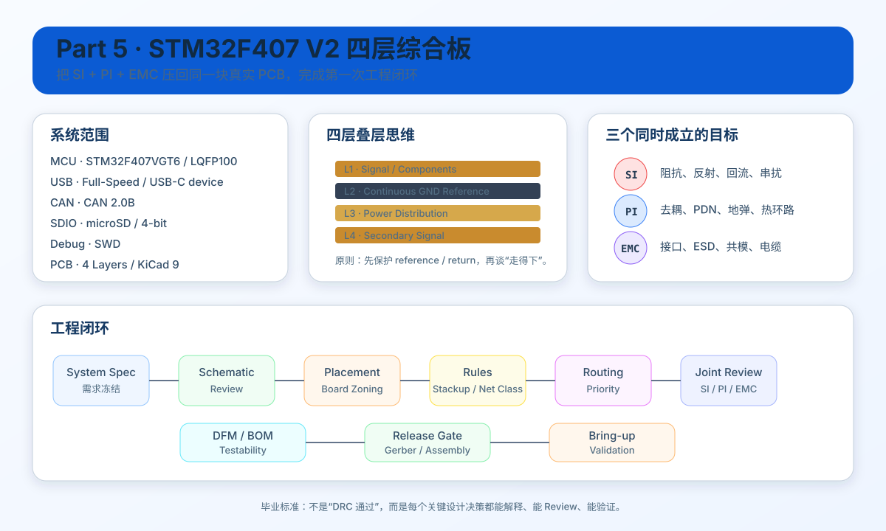

# Part 5｜STM32F407 V2 四层综合板：把 SI / PI / EMC 压回同一块 PCB

> 🎮 **真正动手请进入 [V2 START HERE](../projects/stm32f407-mainline/v2/START_HERE.md)**。正文讲方法，START_HERE 规定每一关的产出、通过标准和下一步。

> 到这里，课程第一次不再新增一套“独立理论”。你已经分别学过 SI、PI、EMI/EMC；Part 5 的任务是把它们放到同一张原理图、同一个四层 stackup、同一块有限板框里做取舍。

<p align="center">
  
</p>

> 上图是本 Part 的**教学总览图**：它用一张页面把系统目标、四层叠层、USB/CAN/SDIO、SI/PI/EMC 挑战和工程交付闭环放在一起。具体参数仍以本 Part 正文、器件一手资料和实际板厂工艺为准。

---

## 你现在要做的，不是“画更多线”

真实 PCB 最难的地方不是某一条规则，而是**多个目标同时成立**：

- USB 希望差分几何连续、ESD 靠近接口、参考平面连续；
- CAN 希望总线保护完整、端接只在正确拓扑下装、连接器区域 EMC 可控；
- SDIO 希望 CLK/CMD/D0~D3 路径短、成组、参考稳定；
- MCU 希望去耦回路低电感、VCAP 按器件要求实现；
- 晶振希望靠近 MCU、局部安静；
- SWD 希望真的能插探头和下载器；
- 制造希望线宽线距、孔径、阻焊、装配方向都合理；
- 调试希望每条关键电源和关键接口都有可测点。

这些目标会互相争夺空间。

**Part 5 的核心能力，就是学会做工程优先级。**

---

## V2 系统范围

本项目使用：

- MCU：`STM32F407VGT6 / LQFP100`
- PCB：4 层
- USB：USB 2.0 Full-Speed，USB-C receptacle，device-only
- CAN：经典 CAN 2.0B，3.3 V CAN transceiver
- Storage：microSD，4-bit SDIO
- Debug：SWD
- Power：USB 5 V 输入 → 3.3 V 主电源
- Clock：HSE + 必要 RTC/低速时钟按项目需求决定

> STM32F407 本身提供 USB OTG FS、2× CAN 和 SDIO；V2 只使用其中一部分，避免“因为芯片有就全部接出来”。

---

## 为什么这三个接口很适合做第一次综合板

### USB FS

会同时用到：

- differential pair；
- connector boundary；
- ESD；
- VBUS；
- shield/chassis 思维；
- KiCad differential routing。

但它又不像 USB HS / PCIe / SerDes 那样一下把难度拉到很高。

### CAN

会同时用到：

- MCU logic domain 与 bus physical layer；
- transceiver；
- termination；
- ESD/EFT/surge protection；
- cable common-mode；
- connector EMC。

### microSD / SDIO

会同时用到：

- 一组相关高速数字信号；
- CLK aggressor；
- pin planning；
- group routing；
- pull-up / card-detect / connector；
- MCU silicon errata 与 firmware 验证。

它很适合作为“以后 DDR/FMC 之前的并行总线预备课”。

---

# 本 Part 的完整工程闭环

```text
01 系统规格冻结
→ 02 Pin / Clock / Peripheral 规划
→ 03 原理图综合 Review
→ 04 Placement / Board Zoning
→ 05 Stackup / Net Class / Rule Matrix
→ 06 Routing Priority / 实施顺序
→ 07 SI + PI + EMC 联合 Review
→ 08 DFM / BOM / Testability
→ 09 Gerber / Assembly Release
→ 10 Bring-up / Validation
→ 11 Final Design Review
```

章节：

1. [V2 系统规格与接口决策](01_V2系统规格与接口决策.md)
2. [Pin 规划、时钟与资源冲突](02_Pin规划时钟与资源冲突.md)
3. [原理图综合与 Design Review](03_原理图综合与DesignReview.md)
4. [布局分区与器件优先级](04_布局分区与器件优先级.md)
5. [Stackup、Net Class 与规则矩阵](05_Stackup_NetClass与规则矩阵.md)
6. [布线优先级与实施顺序](06_布线优先级与实施顺序.md)
7. [SI / PI / EMC 联合 Review](07_SI_PI_EMC联合Review.md)
8. [DFM、BOM 与可测试性](08_DFM_BOM与可测试性.md)
9. [Gerber、装配包与 Release Gate](09_Gerber装配包与ReleaseGate.md)
10. [Bring-up 与验证计划](10_Bringup与验证计划.md)
11. [Final Design Review 与四层毕业门槛](11_FinalDesignReview与四层毕业门槛.md)
12. [参考资料与版本冻结](12_参考资料与版本冻结.md)

互动实验：

- [V2 Layout Tradeoff Lab](../interactive/v2-layout-tradeoff-lab.html)
- [V2 Release Gate Lab](../interactive/v2-release-gate-lab.html)

---

## 本 Part 不是“抄一张参考设计”

参考设计很重要，但你必须能回答：

- 这颗器件为什么在这里？
- 这个信号为什么放 Top？
- 这个 via 为什么可以存在？
- 这个接口为什么先经过 TVS 再进板内？
- 这个 120 Ω 为什么默认不一定焊？
- 为什么 SDIO_CLK 比 D0 更需要优先处理？
- 为什么某个 Net Class 不是“所有高速线统一 0.2 mm”？
- 为什么 DRC 通过以后仍然要做人工 Review？

如果回答不了，就还不能算完成。

---

# 本 Part 的交付物

最终你应该得到：

1. 一份冻结的 V2 System Specification；
2. 一份 Pin / Peripheral Conflict Map；
3. 一份原理图 Design Review；
4. 一份 Board Zoning / Placement Plan；
5. 一份 Routing & Constraint Matrix；
6. SI / PI / EMC 联合 Review 结果；
7. DFM / BOM / Testability Checklist；
8. Gerber Release Checklist；
9. Bring-up Test Plan；
10. Final Design Review Report。

配套项目资产：[`projects/stm32f407-mainline/v2/`](../projects/stm32f407-mainline/v2/)

Fault Lab：[`part5-integration-faults.md`](../projects/stm32f407-mainline/fault-lab/part5-integration-faults.md)

---

# 一手资料基线

本 Part 使用/核对：

- STM32F407VG product page / datasheet；
- RM0090 Reference Manual；
- ES0182 Device Errata；
- ST AN4488 Hardware Development；
- ST AN4879 USB Hardware and PCB Guidelines；
- USB-IF USB Type-C Cable and Connector Specification；
- CAN transceiver datasheet / protection reference design；
- KiCad 10 PCB Editor documentation；
- 本课程 Part 1~4 已建立的 SI / PI / EMC 方法。

**标准、器件 datasheet、silicon errata 和板厂工艺都可能更新。设计冻结前重新核对。**

---

## 本 Part 的通过标准

给你 V2 的任意局部截图，你应该能：

1. 找出功能 block；
2. 指出关键 current loop；
3. 指出 signal reference；
4. 判断该网络需要什么 constraint；
5. 判断连接器区域 ESD/EMC 电流怎么走；
6. 判断哪些问题 DRC 能发现、哪些必须人工 Review；
7. 解释为什么这样设计；
8. 给出测量与 Bring-up 方法。

这才是第一次真正意义上的**四层板毕业项目**。