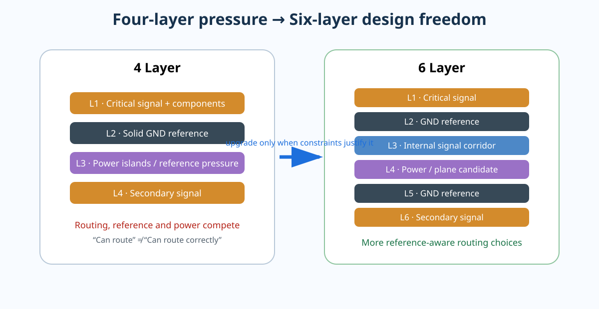

# Part 6｜从四层板升级到六层板：不是多两层，而是重新组织电磁结构

> Part 5 已经把 STM32F407 V2 的 SI / PI / EMC 压回同一块四层板。Part 6 不会为了“更高级”而强行加层，而是回答一个工程问题：**什么时候四层已经开始妨碍你做正确设计，六层又怎样真正解决这些矛盾？**

<p align="center"></p>

---

## 先给结论

六层板的价值通常来自四件事：

1. **更多可用 routing channel**，让关键网络不必为了“能布完”破坏 reference continuity；
2. **更多 plane / reference 组合**，让更多信号层可以拥有清晰、邻近、连续的参考；
3. **更好的功能分区自由度**，电源域、接口、高速总线和调试网络不必抢同一层；
4. **更容易控制换层后的 return-current transition**，因为你可以提前规划 signal layer 与 reference layer 的组合。

但六层并不是自动更好。

一个层数更多、却把两个高速 signal layer 紧贴在一起、让关键信号跨 split、把 reference 从 GND 换到孤立 power island 的六层板，**完全可能比一个设计清晰的四层板更差**。

---

# 本 Part 从哪里开始

STM32F407 V2 的四层结构已经可以完成 USB FS、CAN、SDIO 和常规 MCU 电源。但当主线升级到 STM32H7 V3 时，系统压力明显增加：

- STM32H743 可运行到 480 MHz；
- 外设和 IO 数量显著增加；
- FMC 可以连接 SDRAM 等外部存储器；
- Ethernet MAC、更多高速时钟和更复杂 power domains 同时出现；
- routing density 与 return-path review 的工作量明显上升。

因此课程不会说“STM32H7 = 必须六层”，而是做一次**Layer-Count Design Review**：如果四层能够在满足 stackup、reference、routing、power、manufacturing 和验证要求的前提下完成，四层仍然有效；如果为了四层被迫破坏关键约束，就应该升级层数。

---

# 本 Part 学习路径

```text
01 四层板什么时候真的开始不够
→ 02 六层 stackup 怎样从物理结构选出来
→ 03 Signal Layer 与 Reference Plane 配对
→ 04 换层时 Return Current 怎样跨参考层
→ 05 Power Domain / Plane Split 怎样规划
→ 06 Routing Density、Escape 与层数关系
→ 07 KiCad 9 中建立真实六层 stackup
→ 08 板厂阻抗、制造参数与 Stackup Freeze
→ 09 STM32H7 V3 Transition Review
→ 10 参考资料与数据纪律
```

---

# 本 Part 的核心问题

学完以后你必须能回答：

- 为什么“SIG/GND/SIG/PWR/GND/SIG”不一定对所有板都是最优？
- 一个 signal layer 到底参考上面的 plane，还是下面的 plane？
- 为什么 dielectric spacing 会影响 reference coupling？
- 信号从 L1 换到 L3，如果两层都参考同一 GND，回流发生什么？
- 信号从参考 GND 的层换到参考 PWR 的层，return current 怎样完成 reference transition？
- 为什么“在信号 via 旁打一颗 GND via”只有在 reference topology 合适时才真正解决问题？
- 为什么把电源 plane 分成很多漂亮岛屿可能破坏高速 signal reference？
- 什么情况下 6 层仍不够，应直接考虑 8 层？
- 为什么 stackup 必须在 routing 之前和板厂参数一起冻结？

---

# Part 6 的工程产出

你会建立 STM32H7 V3 的第一批工程资产：

- `projects/stm32h7-mainline/v3/layer-count-decision.md`
- `projects/stm32h7-mainline/v3/stackup-decision-record.md`
- `projects/stm32h7-mainline/v3/layer-role-map.md`
- `projects/stm32h7-mainline/v3/reference-transition-map.md`
- `projects/stm32h7-mainline/v3/part6-transition-review.md`
- `projects/stm32h7-mainline/fault-lab/part6-stackup-faults.md`

同时有两个互动实验：

- [Six-Layer Stackup Lab](../interactive/six-layer-stackup-lab.html)
- [Reference Transition Lab](../interactive/reference-transition-lab.html)

---

# 一手资料基线

本 Part 当前以以下资料为基线，真正设计冻结时仍需重新核对：

- ST STM32H743ZI Product / Datasheet / RM0433 / ES0392；
- ST AN4938：STM32H74x/H75x hardware development；
- JLCPCB 当前 6-layer controlled-impedance stackup 页面；
- JLCPCB Impedance Calculator 使用说明；
- KiCad 9 PCB Editor 官方文档。

查询日期：**2026-08-26**。

---

## 本 Part 的通过标准

给你任意一个六层 stackup，你应该可以：

1. 标出每个 signal layer 的主要 reference；
2. 找出相邻 signal layer 可能的 broadside coupling 风险；
3. 判断 power split 是否会破坏关键回流；
4. 画出一次 layer transition 对应的 return-current transition；
5. 判断制造商给出的 dielectric thickness 如何影响阻抗与线宽；
6. 解释为什么选 6 层而不是 4 层或 8 层；
7. 把这些决策写进可审阅的工程记录，而不是留在脑子里。

这才算真正理解“六层板”。