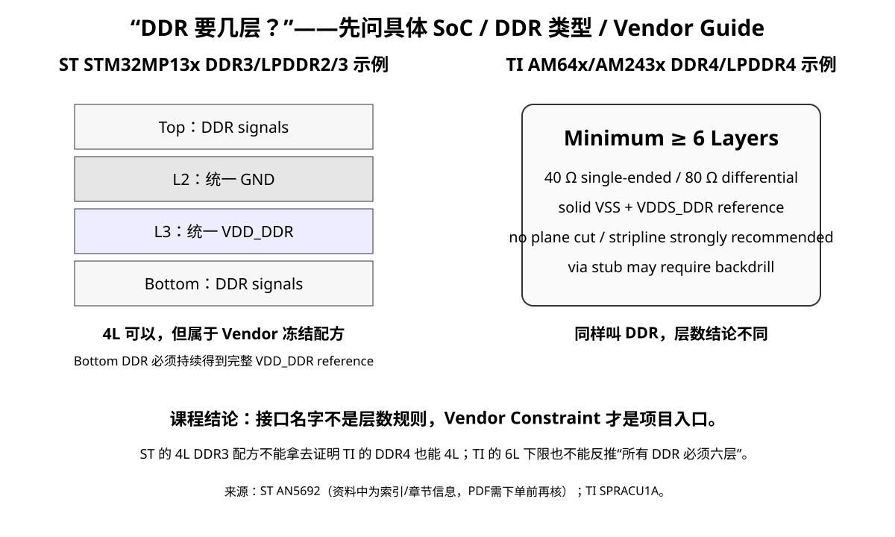

# 01｜四层板什么时候真的不够：不要用接口名字决定层数

> “有 DDR 就六层”“超过 100 MHz 就四层”“BGA 就至少六层”都只能算经验提示，不能当设计结论。层数应该由**布线密度 + reference 需求 + power distribution + escape + 制造能力 + 验证风险**共同决定。

---

# 1. 从 STM32F407 V2 的四层板看压力来自哪里

V2 的四层结构已经可以很好地完成：

- Top：器件 + 关键短线；
- L2：连续 GND；
- L3：power distribution；
- Bottom：次要信号。

真正的问题不是“线多”，而是**越来越多网络都希望占用最好的电磁环境**。

例如：

- USB 希望连续参考和稳定差分几何；
- SDIO_CLK 希望短、干净、少过孔；
- HSE 希望局部安静；
- CAN connector 区域希望把外部瞬态和板内逻辑隔开；
- 多路电源希望有足够铜面积；
- Bottom 上的快速网络如果主要参考 L3 power plane，就必须确认 power plane 连续且 reference transition 可解释。

当这些需求同时出现时，四层板的每一层开始承担多个互相冲突的职责。

---

# 2. Layer-count review 的六个问题

## 2.1 Routing Density

不是问“能不能连完”，而是问：

> **能不能在不牺牲关键约束的情况下连完？**

危险信号：

- 为了避让，被迫让高速网络跨 reference split；
- 为了少打 via，让关键线绕很远；
- 大量 parallel run 被迫贴在一起；
- power copper 被 routing 切成 narrow neck；
- connector / ESD 区和核心逻辑区没有空间做结构隔离。

## 2.2 Reference Pressure

列出每个快速网络：

| Net group | Preferred routing layer | Intended reference | 连续吗？ |
|---|---|---|---|
| USB D+/D- | Top | L2 GND | ? |
| SDIO CLK/CMD/Dx | Top / Bottom | L2 GND / L3? | ? |
| HSE | Top | L2 GND | ? |

当你发现大量网络只能放到底层，而底层参考的 L3 又被分割成多个 power island，层数压力就出现了。

## 2.3 Power-Domain Pressure

STM32H7 的电源结构比 F407 更复杂。即使不在 Part 6 立刻设计所有 rail，也必须预见：

- VDD / VDDA / VREF；
- core regulator / VCAP 相关要求；
- USB 相关供电；
- SDRAM / PHY / transceiver 的额外 rail；
- 未来 Ethernet PHY 可能出现 1.0/1.2/1.8/2.5/3.3 V 等不同 rail，具体取决于器件。

如果一个 L3 power plane 被切成大量岛屿，而 Bottom 仍把它当高速 reference，风险会快速上升。

## 2.4 Escape Pressure

对于 LQFP，escape 通常不是层数主因；对于 fine-pitch BGA，fanout 和 escape channel 会迅速消耗 signal layer。

因此：

- **封装影响层数，但不是“BGA = 固定 X 层”的公式。**
- pitch、ball map、via technology、制造最小线宽/间距、via-in-pad 能力都会改变答案。

本课程的 STM32H7 V3 过渡阶段优先使用可解释、易审阅的封装方案，把 BGA 深度训练保留给 FPGA 专项；但仍会在本章理解 BGA 为什么会推动层数增加。

## 2.5 EMC / Connector Pressure

连接器越多，外部世界与 PCB 的耦合路径越多。你需要空间组织：

- ESD discharge path；
- chassis/shield relationship；
- common-mode filtering（如果依据充分）；
- stitching / boundary structure；
- 敏感区与 noisy zone 的空间隔离。

如果为了挤布线把这些区域完全压扁，增加层数往往比后期整改便宜。

## 2.6 Manufacturing / Cost Pressure

层数不是只看电气：

- 6 层成本高于 4 层；
- stackup 选择会影响可用阻抗几何；
- via aspect ratio、minimum drill、铜厚、成品板厚都受制造能力约束；
- 如果 6 层仍要使用极限线宽/极限过孔，可能直接上 8 层反而更稳。

---

# 2.7 Vendor Constraint Pressure：厂商什么时候已经在暗示“别再硬塞四层”

课程一直强调：**不要用接口名字决定层数。**

但 vendor app note 仍然是 Layer-Count Review 的重要证据。

例如 TI 的 High-Speed Interface Layout Guidelines 对 USB3 / PCIe / HDMI / SATA / CSI 等接口给出从 6 层起步的建议 stackup，同时要求：

- 高速 pair 始终参考 solid GND；
- via transition 有局部 return support；
- stub、pair-to-pair spacing、package breakout、ESD placement 都进入 channel budget。

这不是说：

~~~text
有 USB3 = 必须六层
~~~

而是说：

> **如果四层方案为了满足这些约束已经同时牺牲 routing density、reference continuity、via stub 和 power distribution，那么 vendor guide 正在给你一个“升级层数”的强证据。**

### 🧭 四层还能不能继续？看“同时满足”而不是“单项能不能”

一块 4L 板可能分别做到：

- 90/100 Ω；
- solid GND；
- 少量高速 via；
- power pour；

但关键问题是：

> **它能不能在同一个真实布局里同时做到这些？**

如果答案变成：

~~~text
为了 reference → power 没地方
为了 power → bottom reference 被切碎
为了 escape → 高速必须多次换层
为了换层 → via stub / return support 失控
为了密度 → pair spacing 不够
~~~

那么增加层数是在购买“设计自由度”和 margin。

### 高速 Vendor 证据

- TI SPRAAR7J, *High-Speed Interface Layout Guidelines*  
  https://www.ti.com/lit/an/spraar7j/spraar7j.pdf
- Intel/Altera, *P-Tile PCB Design Guidelines*  
  https://www.intel.com/content/www/us/en/docs/programmable/683864/current/p-tile-pcb-design-guidelines.html

# 2.8 DDR 是最好的反例：同样叫 DDR，4L / 6L 结论可以完全不同

如果你想验证“不能用接口名字决定层数”，DDR 是最好的训练题。

### ST：某些 STM32MP13x DDR3 / LPDDR2/3 有严格的 4L 配方

资料中的 ST AN5692 给出了明确 4-layer assignment：

~~~text
Top     DDR signals
L2      unified GND
L3      unified VDD_DDR
Bottom  remaining DDR
~~~

关键不是“ST 证明 DDR 可以四层”，而是：

> **它把四层能工作的前提冻结得非常严格。**

例如 bottom DDR 必须持续得到完整 VDD_DDR reference；换层还要按其方法提供局部高频回流。

### TI：AM64x / AM243x DDR4 / LPDDR4 则明确从 6L 起

TI SPRACU1A 的约束包括：

- layer count ≥ 6；
- 至少一个 solid VSS、一个 solid VDDS_DDR；
- DDR reference plane 不允许 cut；
- 40 Ω single-ended / 80 Ω differential；
- strongly recommend stripline；
- 某些 via stub 需要进入 backdrill 判断。

### 所以课程不能写“DDR = 6层”

正确写法应该是：

~~~text
具体 SoC + DDR generation
→ vendor routing guide
→ stackup / impedance / topology / timing constraint
→ layer-count gate
~~~

### 现场判断题

有人说：

> “STM32MP13 都有 4L DDR 参考，所以我的 AM64x DDR4 也能四层。”

判定：**错误。** 这是把一个 vendor/device/memory-type 的冻结配方，跨项目升级成通用规律。

### 来源

- TI SPRACU1A, *AM64x/AM243x DDR Board Design and Layout Guidelines*  
  https://www.ti.com/lit/an/spracu1a/spracu1a.pdf
- ST AN5692, *DDR memory routing guidelines for STM32MP13x*  
  https://www.st.com/resource/en/application_note/an5692-ddr-memory-routing-guidelines-for-stm32mp13x-product-lines--stmicroelectronics.pdf
- Micron TN-41-13, *DDR3 Point-to-Point Design Support*  
  https://perso.esiee.fr/~poulichp/CEM/Signal_Integrity/tn4113_ddr3_point_to_point_design.pdf

> 注：本批资料标记 ST PDF 直取失败，具体章节/数值来自 ST 资源页索引整理；真正冻结产品设计时必须重新取得原始 app note 核对。

# 3. 一个更可靠的 Layer-Count Gate

满足以下任一情况时，不是“立即六层”，而是进入正式 layer-count review：

1. 四层 routing 需要跨越关键 reference discontinuity；
2. 关键高速网络无法获得明确 reference；
3. power plane 被切得无法同时承担供电与 reference；
4. fanout / escape 已逼近制造极限；
5. connector / ESD / power switching 区无法保持合理空间结构；
6. 为了四层需要大量高风险例外规则；
7. 预期下一版接口扩展会立刻推翻当前布局。

如果 6 层可以用明显更宽松的制造规则、更连续的 reference 和更少的例外完成设计，那么 6 层的价值就不只是“多空间”，而是**降低系统风险**。

---

# 4. 为什么 STM32H743 是合适的 V3 入口

ST 当前资料显示 STM32H743 系列具备：

- Cortex-M7，最高 480 MHz；
- 最多 2 MB Flash、约 1 MB RAM；
- FMC 外部存储器接口，可连接 SDRAM 等；
- Ethernet MAC；
- SDMMC、USB、CAN FD 等丰富外设；
- 更多 IO 与更复杂的电源/时钟系统。

这并不证明“它必须六层”，但它提供了足够真实的压力，让我们学习：

> **层数不是按芯片名字选，而是由系统结构推导出来。**

官方入口：

- https://www.st.com/en/microcontrollers-microprocessors/stm32h743zi.html
- https://www.st.com/en/microcontrollers-microprocessors/stm32h743-753/documentation.html

---

# 5. 本章 KiCad / 工程任务

打开 V2 的 rule matrix 和 placement plan，新增一列：

`If moved to H7 V3, what becomes the first bottleneck?`

至少标记：

- routing density；
- reference plane；
- power domain；
- connector boundary；
- memory interface；
- debug/test access。

把结论写入：

`projects/stm32h7-mainline/v3/layer-count-decision.md`

---

# 6. Design Review 问题

- [ ] 我是否因为接口名字而机械决定层数？
- [ ] 我是否能指出四层真正的物理瓶颈？
- [ ] 我是否把“能布完”误当成“设计完成”？
- [ ] 增加层数后，是否真的减少了 reference / power / routing 冲突？
- [ ] 六层是否仍逼近制造极限？若是，是否应该比较八层？

---

## 本章一句话

> **层数是系统架构决策，不是高速接口标签。**