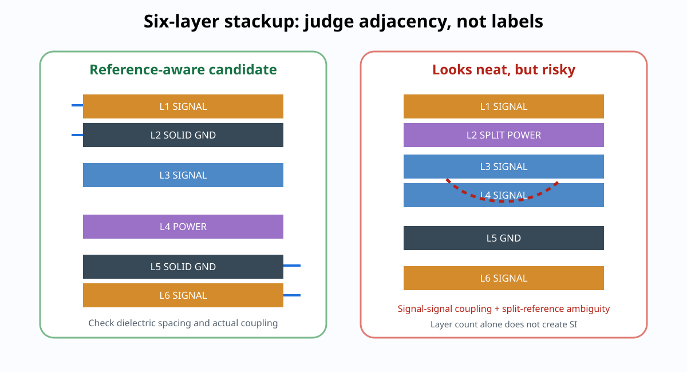

# 02｜六层 Stackup 工程设计：先看邻接关系，再看“层名”

> 六层 stackup 的核心不是背一条 `SIG-GND-SIG-PWR-GND-SIG`，而是理解**谁挨着谁、信号主要参考谁、平面是否连续、相邻信号层是否容易耦合、制造商能否稳定做出来**。

---

# 1. 看 stackup 的第一原则：Adjacent Relationship

拿到任何 stackup，先不看层名，依次问：

1. 每个 signal layer 最近的 solid plane 是谁？
2. signal-to-reference dielectric 有多厚？
3. 有没有两个 signal layer 彼此很近、却离 reference 很远？
4. power plane 是否连续，还是会被分割？
5. GND/PWR plane pair 是否足够靠近到能形成有意义的 plane-pair capacitance？
6. 整体结构是否满足制造对称性与厂商标准 stackup？

---

# 2. 三种常见六层角色分配

下面不是“唯一正确答案”，而是教学比较。

## A｜L1 SIG / L2 GND / L3 SIG / L4 PWR / L5 GND / L6 SIG

优点：

- L1 明确参考 L2 GND；
- L6 明确参考 L5 GND；
- 有两个 GND plane；
- 有独立 power plane；
- 三层可路由。

需要 Review 的地方：

- L3 到底主要参考 L2 还是 L4，取决于 dielectric spacing 与结构；
- 如果 L4 PWR 被切成很多岛，不能默认它是可靠高速 reference；
- L3 若同时与 L2/L4 强耦合，换层时要明确 reference transition；
- 不应仅因为“L3 是内层”就宣称它自动是最佳高速层。

## B｜L1 SIG / L2 GND / L3 SIG / L4 GND / L5 PWR / L6 SIG

优点：

- L3 可以位于两个 GND plane 之间，reference 环境更清晰；
- L1/L3 都容易获得 GND reference。

风险：

- L6 最近可能是 L5 PWR；
- 如果 L5 被大量分割，Bottom 快速网络需要谨慎；
- PWR/GND adjacency 是否足够紧密，需要看真实 stackup thickness。

## C｜L1 SIG / L2 GND / L3 PWR / L4 SIG / L5 GND / L6 SIG

这是一些制造商“典型六层功能图”会展示的类型。

它并不因为厂商写了 typical 就自动适合你的项目。你仍然需要确认：

- L4 的主要 reference；
- L3 power split 对 L4 的影响；
- L3/L4 的 dielectric spacing；
- L4 是否承载关键高速总线。

---

# 3. 真实板厂案例：JLC06161H-1080

查询日期：**2026-08-26**。

JLCPCB 当前 controlled-impedance stackup 页面列出了多种 1.6 mm 六层结构。课程选 `JLC06161H-1080` 作为**真实制造结构案例**，不是把它宣称为唯一推荐层功能。

公开结构包括：

| 结构位置 | 材料/铜 | 厚度（公开值） |
|---|---|---:|
| L1 | Cu | 0.035 mm |
| L1-L2 | 1080 PP | 0.0764 mm |
| L2 | inner Cu | 0.0152 mm |
| L2-L3 | Core | 0.55 mm |
| L3 | inner Cu | 0.0152 mm |
| L3-L4 | 7628 PP | 0.2104 mm |
| L4 | inner Cu | 0.0152 mm |
| L4-L5 | Core | 0.55 mm |
| L5 | inner Cu | 0.0152 mm |
| L5-L6 | 1080 PP | 0.0764 mm |
| L6 | Cu | 0.035 mm |

这组数字最重要的教学意义不是“背厚度”，而是看出：

> **L1-L2 / L5-L6 很近，而 L2-L3 / L4-L5 相对远。**

因此同样写成 `SIG / GND / SIG / ...`，实际 coupling 强度可能完全不同。

来源：
https://jlcpcb.com/impedance

制造商参数会变化，下单前重新确认。

---

# 3.1 教科书六层 Stackup 的陷阱：板厂可能根本不是那个几何

很多资料会直接画：

~~~text
L1 SIG
L2 GND
L3 SIG
L4 SIG/PWR
L5 GND
L6 SIG
~~~

然后口头说：

> “L1、L3 都紧贴 L2，所以这是一组很好用的三层结构。”

真正下单时，这句话可能完全不成立。

### 论坛里的典型冲突

一组 2023 年工程讨论指出，常见低成本 1.6 mm 六层工艺经常呈现更像**成对耦合**的结构，而不是“L1/L2/L3 三层都很紧”。

论坛当时举过类似：

~~~text
L1
  ~4 mil
L2
  ~22 mil
L3
  ~4 mil
L4
  ~22 mil
L5
  ~4 mil
L6
~~~

的例子。

这些数字不是本课程当前制造常数；它们真正想说明的是：

> **不要把杂志/视频里的 layer-role 图直接贴到板厂 order form 上。**

本章当前使用的 JLC06161H-1080 已经给出了另一组真实结构：

- L1↔L2：0.0764 mm；
- L2↔L3：0.55 mm；
- L3↔L4：0.2104 mm；
- L4↔L5：0.55 mm；
- L5↔L6：0.0764 mm。

因此你必须重新判断：

- L3 到底主要参考 L2，还是更受 L4 影响？
- L4 的角色如果改成 signal，它更适合参考谁？
- 哪些层间 transition 可以保持 same-reference？
- 哪些层只是“编号相邻”，电磁上却并不近？

### 🧭 Stackup 翻译练习：从“层名”翻译成“pair map”

不要只写：

~~~text
SIG / GND / SIG / PWR / GND / SIG
~~~

再加一张：

| Signal layer | Candidate reference | H | Reference continuous? | Primary use |
|---|---|---:|---|---|
| L1 | L2 | 0.0764 mm | | |
| L3 | L2 / L4 | 0.55 / 0.2104 mm | | |
| L4 | L3 / L5 | 0.2104 / 0.55 mm | | |
| L6 | L5 | 0.0764 mm | | |

这张表比层序字符串更接近真正的 SI 设计。

### 🐜 一个好用的工程直觉

如果一条内层线紧贴上方参考面，而离另一侧铜层很远，那么它首先“看到”的是附近结构。  
论坛里有工程师用过类似“天花板上的蚂蚁不会先关心地板上的洞”的比喻来解释这一点。

教材把它改写成可执行规则：

> **先比较距离与场耦合，再判断另一侧 power polygon / signal layer 是否真的主导当前传输结构。**

### 工程实践来源（论坛讨论，不是规范）

- Electronics StackExchange, *6-layer stack up: Optimal core/prepreg thickness and coupling to GND*  
  https://electronics.stackexchange.com/questions/676466/6-layer-stack-up-optimal-core-prepreg-thinkness-and-coupling-to-gnd
- Electronics StackExchange, *6-Layer Stackup - Where to put the Power Planes?*  
  https://electronics.stackexchange.com/questions/576750/6-layer-stackup-where-to-put-the-power-planes
- Electronics StackExchange, *Best layer stack strategy for a 6 layer PCB with mostly SMD components*  
  https://electronics.stackexchange.com/questions/427747/best-layer-stack-strategy-for-a-6-layer-pcb-with-mostly-smd-components

# 3.2 厂商高速接口指南 vs EMC Stackup 专家：冲突时听谁的？

资料集中有一个非常适合训练工程判断的“表面冲突”：

- TI 的 High-Speed Interface Layout Guidelines 给出可执行的 6L routing stackup 和 via/spacing 规则；
- Ott / Hartley 则会从 field containment、PWR–GND coupling、reference continuity 的角度批评某些常见六层结构。

不要把它理解成“TI 错了”或“Hartley 错了”。它们解决的问题不同。

| 来源 | 首要目标 | 你应该拿走什么 |
|---|---|---|
| SoC / Interface Vendor | 确保该芯片/接口能在规定 channel budget 内工作 | via 数、pair spacing、reference、length/skew、stub、ESD、package breakout |
| Ott / Hartley | 降低全板 field spread、common-mode、EMI、reference discontinuity | 每个 signal-reference pair 的邻接、plane continuity、plane pair 与层间转换 |
| Fabricator | 确保结构能稳定生产且阻抗可控 | 真实 H / Dk / copper / process window |
| 项目系统工程 | 在成本、密度、EMC、PI、DFM 中做最终折中 | freeze 的 layer-role map |

### 一个实际例子：TI 为什么可以推荐“相邻 Signal Layers”？

TI 的 6L 建议中可能出现两个 signal layers 相邻。这并不自动违反“相邻 signal layer 不好”。

你要继续检查：两层之间 dielectric 多厚、分别离 reference 多近、主 routing 是否正交、co-parallel overlap 多长、这些 net 的 crosstalk budget 是什么。

如果 signal-reference coupling 很强，同时 signal-signal coupling 可控，并且 routing direction / spacing 有纪律，那么相邻 signal layers 可以是合理工程折中。

### 反过来也一样：名字叫 GND 不代表 reference 就“好”

如果某 signal layer 到 GND 隔着 0.55 mm，而到另一侧 copper 只有 0.10 mm，就不能因为“GND 是我想要的 reference”而假装 field 只认 GND。

因此本课程规定：

~~~text
Vendor suggested stackup
→ 映射到真实 fab geometry
→ 重建 signal-reference pair map
→ 再决定是否照用
~~~

### 🎮 设计评审题

假设 vendor app note 推荐 L1 SIG / L2 GND / L3 SIG / L4 SIG / L5 PWR-GND / L6 SIG，而你的板厂实际 L2-L3 = 0.55 mm、L3-L4 = 0.10 mm。

你不能只回答“TI 推荐，所以 L3 没问题”。至少要给出：

1. L3 的主 reference 判断；
2. L3-L4 broadside coupling 风险；
3. 关键 net 是否应该换层；
4. 是否需要改变 layer-role assignment；
5. 是否仍满足 vendor 的 channel requirement。

### 来源

- TI SPRAAR7J, *High-Speed Interface Layout Guidelines*  
  https://www.ti.com/lit/an/spraar7j/spraar7j.pdf
- Henry Ott, *PCB Stack-Up*  
  https://www.frontdoor.biz/HowToPCB/HowToPCB-extra/PCBStackups(Ott).pdf
- Rick Hartley, *PCB Stack-up Design Best Practices*  
  https://resources.altium.com/p/pc-board-stack-up-best-practices-with-rick-hartley

# 4. 为什么 dielectric thickness 如此重要

传输线的 field distribution 与以下几何相关：

- trace width `w`；
- copper thickness `t`；
- trace-to-reference distance `h`；
- dielectric constant `εr`；
- differential spacing `s`；
- solder mask / coplanar copper 等。

当 `h` 变小时：

- signal 与 reference coupling 通常增强；
- 同目标阻抗下所需 trace width 会改变；
- return current 更集中在 trace 投影附近；
- 与远处结构的场耦合趋势通常下降。

但具体阻抗数字不要手算后直接下单，应使用制造商 stackup + field solver / impedance calculator 再冻结。

JLCPCB 2026 年更新的 calculator guide 也明确要求输入：layer count、finished thickness、inner/outer copper、routing layer、target impedance 和 differential spacing 等参数。

---

# 5. “两个信号层不要相邻”也不是绝对句

真正的风险是：

> **两个 signal layer 彼此很近，而各自 reference plane 很远。**

这种结构更容易产生 broadside coupling。

如果两个 signal layer 之间距离大、各自又紧邻 reference plane，风险可能完全不同。

因此 Review 应写：

`signal-signal spacing / signal-reference spacing ratio`

而不是只写：

`相邻信号层 = 错`。

---

# 5.1 Adjacent signal layers 还要检查 Broadside Coupling

如果两个 signal layer 彼此很近，而各自 reference plane 较远，那么上下层 co-parallel routing 可能形成明显 broadside coupling。

这时风险不只来自“线与线”的 capacitance，还包括：

- mutual inductance；
- overlapping return geometry；
- BGA escape 区域的短距离高密度重叠。

一个常见 risk-reduction strategy 是让相邻 signal layers 的主 routing direction 尽量正交，但它不是跨场景铁律。真正要比较：

> **signal-signal spacing vs signal-reference spacing，以及 co-parallel length。**

## Stackup symmetry 也要进入 Review

严重不对称的 dielectric / copper distribution 可能增加 warpage 风险，尤其在大尺寸板、薄板、高温 lamination / reflow 或上下铜分布差异很大时。

所以 stackup freeze 不只做 SI/PI 计算，也要让 fab 确认机械对称性、copper balance 与标准工艺可制造性。

# 6. Plane Pair 也不要神化

把 PWR 与 GND 放得很近可以增加 plane-pair capacitance、改善高频电流路径的一部分，但：

- 它不能替代芯片附近的去耦；
- 如果中间 dielectric 很厚，单位面积电容可能很小；
- split power island 会改变局部结构；
- plane resonance 仍需要 PI 思维。

所以 stackup 不能只靠“PWR 紧贴 GND”一个指标评分。

---

# 7. 本章工程任务

对三个候选 stackup 建立表格：

| Candidate | L1 ref | L3 ref | L4 ref | L6 ref | PWR split risk | routing layers | manufacturing |
|---|---|---|---|---|---|---|---|
| A | | | | | | | |
| B | | | | | | | |
| C | | | | | | | |

然后写入：

`projects/stm32h7-mainline/v3/stackup-decision-record.md`

---

## 本章一句话

> **Stackup 设计的最小单位不是“层”，而是“信号层—介质—参考层”的邻接关系。**