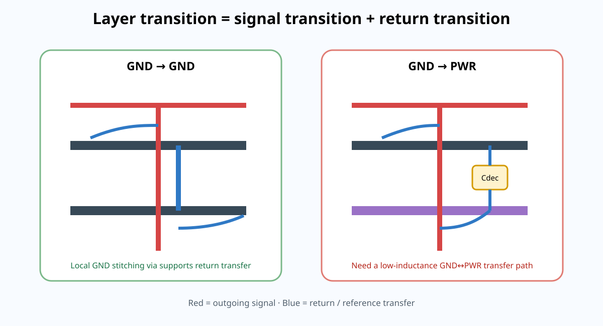

# 04｜换层与 Reference Transition：信号 Via 旁边真正缺的是什么

> 信号从一层穿到另一层时，铜线 via 很显眼；更容易被忽略的是：**return current 也可能必须换参考结构。**真正的换层 Review 是 signal transition + reference transition 两件事一起看。

<p align="center"></p>

---

# 1. 最简单的情况：GND → GND

例如：

```text
L1 SIG   ──via──> L6 SIG
L2 GND            L5 GND
```

如果 L1 主要参考 L2 GND，L6 主要参考 L5 GND，那么 signal via 换层时，return current 需要从 L2 GND 转到 L5 GND。

因为两者同属 GND net，最直接的结构通常是：

- 在 signal via 附近提供 GND stitching via；
- 让两个 GND plane 有低电感垂直连接；
- 避免 return current 绕到远处 via 才完成转移。

这里“信号 via 旁打一颗 GND via”有明确物理意义。

但教材不规定一个通用 `≤1 mm` 数字。真正关心的是：

> **reference transition loop 的寄生电感与几何长度是否足够低。**

---

# 2. 更难的情况：GND → PWR

假设：

- 原信号层主要参考 GND；
- 新信号层主要参考 3V3 plane。

那么 return current 不能通过一颗 GND via 直接跳到 3V3，因为它们不是同一个 net。

需要的是：

```text
old GND reference
       ↓
local GND ↔ PWR high-frequency coupling path
       ↓
new PWR reference
```

通常这意味着附近需要合适的 **power-to-ground decoupling path**。

注意：

- “旁边放一颗 100 nF”也不是万能句；
- 要看该器件在相关频率的 ESL / mounting inductance；
- capacitor 与两个 plane 的 via connection geometry 决定 transfer path；
- 如果 power plane 是孤立小岛或被窄 neck 连接，局部行为会更复杂。

---

# 3. 为什么 Reference Transition 会造成 EMI 风险

如果 return current 没有就近转移路径，它会：

1. 在旧 reference plane 上寻找较远的耦合点；
2. 形成更大的电流回路；
3. 增加 common-mode conversion；
4. 让 connector/cable 更容易被激励；
5. 同时增加局部 impedance discontinuity。

所以一个“波形还能跑”的 layer transition，也可能在 EMC 上付出代价。

---

# 4. Via 本身也不是理想短路

一个 through via 会带来：

- via barrel inductance；
- pad / antipad capacitance；
- 未使用 barrel 形成 stub；
- reference-plane antipad 改变局部场；
- 多个 via 聚集形成 plane perforation。

对于 USB FS / MCU 级接口，这些效应很多时候不是主导；到了更高 edge rate、SDRAM、Ethernet PHY 时，它们逐渐变成必须 Review 的对象。

本 Part 不会一上来做复杂 3D EM，但会建立一个习惯：

> **每打一颗高速 via，都问一次 signal path、return path、stub 和 antipad。**

---

# 5. Layer Transition 的四类模式

## A. Same-reference transition

新旧 signal layer 都参考同一个 solid GND plane（或同一电气 GND system），return path 容易管理。

## B. GND-plane to another GND-plane

需要 stitching via 提供局部垂直连接。

## C. GND ↔ PWR

需要局部低阻抗 GND-PWR transfer path，常由 decoupling network 提供。

## D. Reference crosses split / isolated island

这是最危险的一类。即使 signal via 本身布局漂亮，如果新 reference plane 在当前位置不连续，return current 仍会被迫绕路。

---

# 6. 不要把“换层次数”当唯一指标

“高速线尽量不换层”是合理默认偏好，但真正指标是：

- 每次换层是否有清楚的 reference transition；
- via stub 是否显著；
- impedance discontinuity 是否可接受；
- 为了少 via 是否反而让走线变长、靠近 aggressor 或跨 split。

因此：

> 两次结构正确的换层，可能比一次跨 reference void 的“少 via 走线”更好。

---

# 7. Reference Transition Map

为 V3 建一张图：

| Net group | From layer/ref | To layer/ref | Transition support | Risk | Evidence |
|---|---|---|---|---|---|
| SDRAM CLK | | | | | |
| SDRAM DQ | | | | | |
| RMII/RGMII group | | | | | |
| USB | | | | | |
| SWD | | | | | |

如果某一行写不出 `Transition support`，说明这次换层还没设计完成。

---

# 8. 互动实验

打开：

[Reference Transition Lab](../interactive/reference-transition-lab.html)

实验会比较：

- GND→GND + local stitching；
- GND→GND + remote stitching；
- GND→PWR + local decoupling；
- GND→PWR + remote coupling path。

它只展示**趋势和回路直觉**，不是 field solver。

---

## 本章一句话

> **信号 via 只是“去程换层”；真正的高速换层设计必须同时给回流安排换层路径。**