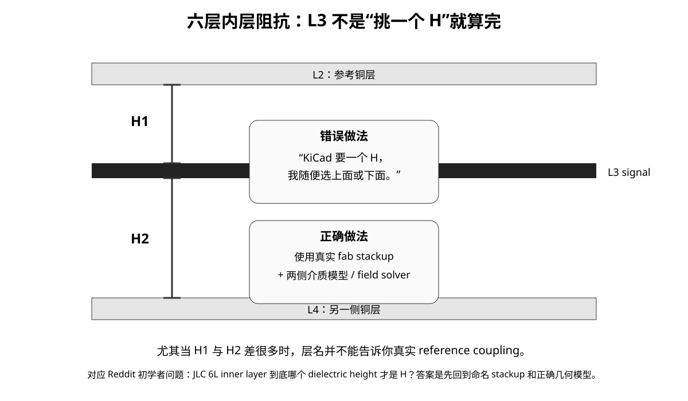

# 08｜板厂阻抗与 Stackup Freeze：不冻结介质，就没有真正冻结线宽

> Controlled impedance 不是“在 KiCad 里写 50 Ω”就结束。阻抗来自制造出来的几何，所以 stackup、铜厚、介质、线宽、线距、阻焊和板厂补偿必须作为一个版本冻结。

---

# 1. 阻抗是一组制造参数的结果

关键变量：

- target impedance；
- routing layer；
- reference plane；
- dielectric thickness；
- dielectric constant；
- copper thickness；
- trace width；
- differential spacing；
- solder mask；
- coplanar ground gap（如果使用）；
- etch compensation / finished copper。

所以“50 Ω = 0.2 mm 线宽”没有跨 stackup 的意义。

---

# 2. 使用板厂标准 Stackup 的好处

标准 stackup 通常意味着：

- 材料和厚度组合成熟；
- 阻抗 calculator 有对应模型；
- 制造容差更明确；
- 价格和交期更稳定；
- CAM 工程师更容易核对。

自定义 stackup 不是不能做，但应有明确收益，而不是为了“看起来对称”。

---


## 2.1 标准 Stackup 太多时：先 Shortlist，再 Solver

板厂页面经常同时给出很多标准结构。

不要这样选：

~~~text
看名字
→ 觉得某个 prepreg 更“高级”
→ 直接下单
~~~

更稳健的流程是：

~~~text
Project constraints
→ shortlist standard stackups
→ compare adjacency / H
→ assign layer roles
→ calculate impedance geometry
→ check density / crosstalk / PI
→ confirm fab
→ freeze
~~~

### 第一轮：不碰阻抗数字，先淘汰结构

先按这些条件删候选：

- finished thickness；
- copper weight；
- required layer count；
- HDI / via process；
- mechanical thickness；
- cost / lead time；
- material / reliability requirement。

### 第二轮：看关键 Signal–Reference Pair

对每个高速/敏感 routing layer，记录：

| Layer | Reference | H | Continuous? | Transition risk |
|---|---|---:|---|---|
| L1 | L2 | | | |
| L3 | L2/L4 | | | |
| L6 | L5 | | | |

不要只看：

> “这是六层板。”

要看：

> **关键 signal 到 reference 的实际距离是多少。**

### 第三轮：Target Impedance → Width / Gap → Density

当 H 确定后，再用制造商 calculator / solver 计算：

- single-ended width；
- differential width/gap；
- coplanar gap（若使用）。

此时才评估：

- BGA escape 能不能塞下；
- parallel bus spacing 是否够；
- neck-down 区是否需要单独建模；
- fabrication tolerance 是否现实。

JLCPCB 当前 2026-06-15 更新的 calculator guide 也把 layer count、finished thickness、铜厚、routing layer、target impedance 与 differential spacing 作为输入，并说明材料/几何参考值可能未来调整。

来源：
https://jlcpcb.com/help/article/user-guide-to-the-jlcpcb-impedance-calculator

### 第四轮：材料不是用固定 GHz 门槛决定

“普通 FR-4 到某个 GHz 都不用管材料”只能作为很粗的入门直觉。

真正是否要升级材料，至少比较：

~~~text
channel length
× frequency-dependent loss
× required insertion-loss margin
× temperature / process variation
~~~

然后再决定是否需要：

- tighter Dk control；
- lower Df；
- lower roughness copper；
- specialty laminate；
- weave mitigation。

所以 stackup selection 的成熟问题不是：

> “频率有没有超过 2.5 GHz？”

而是：

> **当前 channel 在目标 Nyquist / harmonic range 下还有多少 loss / timing / eye margin？**


# 3. 当前 JLCPCB 六层能力作为教学案例

截至 2026-08-26，JLCPCB 的 6-layer 页面公开说明：

- 常见板厚包括 0.8/1.0/1.2/1.6/2.0 mm；
- 支持 controlled impedance；
- 公开 capability 包括约 3.5 mil 最小线宽/线距、0.15 mm drill / 0.25 mm via 等等级的能力范围。

但课程不会把“最小能力”当默认设计值。

制造规则有三个层次：

1. **factory absolute capability**；
2. **low-cost / standard process capability**；
3. **project design rule**。

项目设计规则应尽量留 margin，而不是永远踩最小值。

来源：
https://jlcpcb.com/6-layer-pcb

---

# 4. JLC06161H-1080 的教学意义

当前 impedance 页面显示 `JLC06161H-1080` 采用近外层的薄 1080 prepreg、较厚的 L2-L3 / L4-L5 core，以及中间 7628 prepreg。

这意味着：

- L1 ↔ L2 coupling 很强；
- L6 ↔ L5 coupling 很强；
- L2 ↔ L3 与 L4 ↔ L5 的距离明显不同；
- 你不能只从层序字符串推导 reference coupling。

因此选 stackup 后，下一步不是“开始画”，而是：

> 用制造商 calculator / field solver 把每个 controlled-impedance layer 的几何计算出来。

JLCPCB 2026-06-15 更新的 Impedance Calculator Guide 也明确要求输入 layer count、finished thickness、inner/outer copper、routing layer、target impedance 和 differential spacing 等。

---

## 4.1 Stackup 尚未 Freeze 时的 Routing Policy

实际项目经常出现：

~~~text
placement 已经开始
但 final fab / stackup / impedance width 还没完全确认
~~~

此时不必完全停工，但必须把“可先做什么”和“不能假装已经冻结什么”分开。

### 可以先做

- placement；
- layer assignment；
- topology；
- reference continuity；
- via-transition strategy；
- routing corridor；
- provisional routing envelope；
- connector / escape planning。

### 不能提前伪造为最终值

- controlled-impedance width；
- differential width/gap；
- propagation delay；
- skew budget 中依赖真实 velocity 的部分；
- fab tolerance；
- coupon acceptance。

### Provisional Geometry 的核心不是临时线宽，而是 Reserved Pitch

例如一个候选结构预估最终单端线宽可能从：

~~~text
0.15 mm → 0.20 mm
~~~

变化。

如果早期只是画一根 0.25 mm 临时 trace，却把邻线贴得很近，那么后面把 trace 变窄并不会自动得到足够 crosstalk margin。

因此真正应该预留的是：

~~~text
routing pitch
= trace width
+ required clearance / coupling budget
+ manufacturing margin
~~~

而不是只盯住 trace width。

### 外部 Calculator 的定位

Saturn PCB Toolkit 当前提供：

- microstrip；
- stripline；
- differential pair；
- conductor current / temperature-rise；
- via；
- crosstalk

等计算器。

它适合作为：

> **前期 estimate / sanity check。**

但 production controlled impedance 仍应优先使用：

- fabricator current stackup；
- fabricator impedance calculator / field solver；
- CAM feedback；
- coupon / TDR evidence（按项目需要）。

原因是 fab process 还包含：

- pressed dielectric thickness；
- resin content；
- finished copper；
- etch compensation；
- soldermask；
- process tolerance。

所以：

> **通用 calculator 可以让你开始设计，但不能替 fabricator 定义制造出来的 cross-section。**

# 4.2 JLCPCB 制造案例：Calculator 假设、订单材料和实际铜厚必须对上

这批文章/板厂资料里有一个非常容易被忽略的制造陷阱：

> **“我用了 JLC 的 impedance calculator”不等于“我下单的材料一定和 calculator 的模型一致”。**

资料集记录的 JLCPCB calculator guide 对 4–8 层阻抗模型给出了明确的材料/几何假设，例如：

- 4–8L 使用 Nan Ya NP-155F 体系；
- calculator 的 soldermask 介电常数模型约为 3.8；
- outer 1 oz finished copper、inner 0.5 oz / 1 oz 的最终厚度按其工艺模型取值；
- trace 截面按 etch 后梯形而不是理想矩形处理；
- prepreg 7628 / 3313 / 1080 / 2116 使用不同 Dk 与 pressed thickness。

这些数字属于**该板厂 calculator 的生产模型**，不是 FR-4 的通用常数。

### ⚠️ 材料身份检查

资料集同时指出一个值得每次订单都复查的点：报价页的默认 FR-4 Tg 选项，可能与 impedance calculator 假设的材料体系不同。

因此 Stackup Freeze 新增一项：

~~~text
Calculator material model
        ↓ compare
Order material / Tg option
        ↓ compare
Stackup template ID
        ↓ compare
CAM confirmation
~~~

只要其中一项对不上，就不能说“阻抗已冻结”。

### Microstrip、Coplanar、Soldermask 要写清楚

制造交接不能只写：

~~~text
USB = 90 ohm
~~~

至少应明确：

| Item | Example field |
|---|---|
| Layer | L1 |
| Reference | L2 GND |
| Structure | coated microstrip / coated coplanar |
| Target | 90 Ω differential |
| Width / Gap | project value |
| Coplanar gap | if used |
| Soldermask included? | yes/no per solver model |
| Tolerance | project requirement |

因为同一对 trace 只要同层 GND pour 靠近，结构就可能从普通 microstrip 变成 coplanar；如果 calculator tab 选错，结果没有制造意义。

### 🎮 下单前 60 秒 Sanity Check

1. 我用的 stackup template 名字，订单里能逐字找到吗？
2. calculator 假设的 material/Tg，订单是否匹配？
3. inner/outer copper 是 base copper 还是 finished copper？
4. soldermask 是否进入模型？
5. Gerber trace width 是我希望制造出来的 finished width，还是希望 CAM 自动改？
6. fab 是否允许调整 width / dielectric？是否需要回传确认？
7. 最终怎么验收：免费测试、precision test、coupon、TDR 还是只靠 CAM report？

### Controlled Dielectric vs Controlled Impedance：别把两个交付模式混在一起

文章资料把两种制造协作方式分得很清楚：

| 模式 | Designer 做什么 | Fab 做什么 | 风险 |
|---|---|---|---|
| Controlled dielectric | designer 用已知 Dk/H 算 width | 按指定材料/厚度制造 | Dk/H 偏差直接进入 Z |
| Controlled impedance | designer 给 target + starting geometry | fab 用其真实工艺调整并用 coupon/TDR 验证 | 必须明确谁有权改 width/H |

项目里必须选定一种协作模型，而不是一边要求“Gerber width 不准改”，一边又假设 fab 会帮你自动调到目标阻抗。

### 资料来源

- JLCPCB, *User Guide to the JLCPCB Impedance Calculator*  
  https://jlcpcb.com/help/article/user-guide-to-the-jlcpcb-impedance-calculator
- JLCPCB, *Controlled Impedance PCB Layer Stackup*  
  https://jlcpcb.com/impedance
- Zachariah Peterson, *Impedance Management Through PCB Stackup Design With Reference Planes*  
  https://resources.altium.com/p/impedance-management-through-pcb-stackup-design-reference-planes
- Zachariah Peterson, *Impedance Control: How to Specify Your Requirements for PCB Manufacturers*  
  https://resources.altium.com/p/pcb-manufacturing-and-impedance-control-how-specify-your-requirements

> 这里引用的是本批资料中记录的板厂模型；真正下单前重新核对板厂页面、订单选项和 CAM 回复。


# 4.3 Beginner Trap：六层内层的 H 到底是哪一个？

这批 Reddit 实际抓到的讨论里，有一个非常典型的初学者问题：

> “JLC 6 层推荐 stackup 我已经选了，但 KiCad 阻抗计算器让我填 dielectric height。L3 上下两边介质厚度差很多，我到底填哪一个？”



答案不是“挑更近的那个 H”。

### 外层和内层不是同一个模型

| 情况 | 需要的几何 |
|---|---|
| outer microstrip | trace 到最近 reference plane 的 H，加上 copper / mask / width 等 |
| inner stripline / asymmetric stripline | trace 上下两侧的 dielectric、铜层、Dk 都要进入模型 |

如果一个工具只有一个 H 输入，而你的真实 L3 上下介质明显不对称，那这个模型本身就可能不适合。

### Reddit 的工程价值

帖子里的回答没有给一个神奇公式，而是把 OP 推回：

~~~text
named fab stackup
→ fab drawing
→ correct inner-layer model / Polar-class solver
→ fab impedance calculation
~~~

这正是课程希望学生形成的习惯：**遇到模型对不上真实结构时，不要硬塞一个数字。**

### PCBWay 给出的第二个现实提醒：Pressed Thickness 不是固定常数

PCBWay 的 4L/6L 层压表还展示了 residual copper ratio 对 prepreg 压后厚度的影响：铜越稀疏，树脂流动越明显，pressed dielectric 会略变薄。

所以：

> `H = datasheet prepreg thickness` 不是严谨的制造定义；真正受控的是板厂最终压合模型。

### 嘉立创中文下单规则：±20% 不是“阻抗管控”

资料中的嘉立创中文帮助页明确把订单模式分开：

- `±10%`：进入其阻抗控制 / TDR 流程；
- `±20%` 或“无要求”：不能等同于 controlled impedance；
- 需要随 Gerber 交付网络、目标阻抗、层、reference 等说明。

这比背“USB 90 Ω”重要，因为它决定工厂到底有没有按阻抗结果验收。

### 来源

- 嘉立创：阻抗设计说明  
  https://www.jlc.com/portal/server_guide_38565.html
- 嘉立创阻抗计算神器使用说明  
  https://www.jlc.com/portal/server_guide_37381.html
- PCBWay Multi-layer laminated structure  
  https://www.pcbway.com/multi-layer-laminated-structure.html
- Reddit: *How would I find the dielectric height value for impedance calculators?*  
  https://www.reddit.com/r/PCB/comments/1v5p1at/how_would_i_find_the_dielectric_height_value_for/


# 5. Stackup Freeze Record

至少记录：

```text
Manufacturer:
Stackup ID:
Query date:
Finished thickness:
Outer copper:
Inner copper:
Material / Tg:
Layer role assignment:
Controlled-impedance nets:
Target impedance / tolerance:
Calculated trace width/gap:
Source URL / PDF:
CAM confirmation required?:
```

任何一项改变，都可能要求重新计算：

- impedance；
- timing delay；
- via geometry；
- plane coupling。

---

# 6. “板厂会帮我调阻抗”不代表可以不设计

如果订单选择阻抗控制，板厂可能根据其工艺调整线宽，但你仍要提供：

- 正确 net / layer；
- 正确目标阻抗；
- 正确 stackup；
- 合理原始 geometry；
- 正确 reference structure。

板厂不能替你修复：

- 差分对跨 split；
- reference transition 错误；
- ESD layout；
- pair uncoupling；
- layer role 设计错误。

---

# 7. 下单前必须重新核对

课程中记录的 JLCPCB 参数只用于 2026-08-26 的教学案例。

真正生产前重新访问：

- https://jlcpcb.com/impedance
- https://jlcpcb.com/help/article/user-guide-to-the-jlcpcb-impedance-calculator

因为：

- stackup ID 可能更新；
- 材料/厚度可能调整；
- capability / pricing 会变化。

---

# 8. 本章工程任务

完成：

`projects/stm32h7-mainline/v3/stackup-decision-record.md`

必须有：

- 至少两个候选 stackup；
- layer-reference map；
- 制造 margin；
- impedance layer plan；
- freeze / reopen 条件。

---

## 本章一句话

> **只要 stackup 还会变，受控阻抗的线宽就还没有真正确定。**

# 增补｜阻抗验收不是“板厂说会控”

## A. Fabrication Tolerance Budget

冻结 controlled impedance 时同时记录：

- target impedance；
- allowed tolerance；
- trace width / spacing；
- copper thickness；
- finished copper assumption；
- dielectric thickness；
- Dk / material family；
- soldermask inclusion；
- etch compensation responsibility；
- coupon requirement。

如果板厂允许调整线宽，必须明确：

> **允许板厂在哪个范围内调整、调整后是否需要回传确认。**

## B. Coupon / TDR

对需要阻抗验收的项目，release note 至少说明：

- 是否要求 impedance coupon；
- coupon 对应哪些 layer / structure；
- TDR 报告是否作为 lot evidence；
- acceptance 是按目标值、容差还是厂内标准流程。

课程不假设“有阻抗单就是整板所有走线都被逐条 TDR 测过”。

## C. Stackup Change Control

下面任何变化都触发 reopen：

```text
fab
stackup ID
material family
dielectric thickness
copper weight
controlled-impedance layer
trace geometry
soldermask assumption
```

必须重新：

```text
solver
→ KiCad rule
→ fab note
→ review
→ release
```
