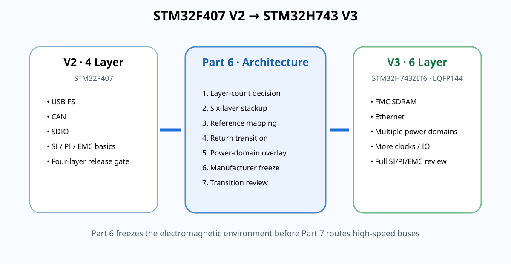

# 09｜STM32H7 V3 过渡设计：从“六层课程”进入真正的高速项目

> Part 6 的终点不是画完 STM32H7，而是冻结一套**足够进入 Part 7 详细设计**的板级架构：MCU/package、层数、stackup 方向、layer roles、接口范围、power-domain 风险和验证门槛。

<p align="center"></p>

---

# 1. V3 MCU 候选冻结

课程主线进入：

**STM32H743ZIT6 / LQFP144**

截至 2026-08-26，ST 产品页显示：

- Active / volume production；
- LQFP144，20×20×1.4 mm；
- Cortex-M7，最高 480 MHz；
- 最多 2 MB Flash、1 MB RAM；
- FMC 外部存储接口；
- Ethernet MAC；
- SDMMC、USB、CAN FD 等。

选择 LQFP144 的教学原因：

- 保留较好的可视化与可返修性；
- 让 Part 7 重点集中在六层、SDRAM、Ethernet、SI/PI/EMC；
- BGA fanout 的更深层压力放到 FPGA 专项系统讲。

这不是说 LQFP 比 BGA“更工程”，而是课程难度分层。

官方入口：
https://www.st.com/en/microcontrollers-microprocessors/stm32h743zi.html

---

# 2. V3 第一阶段接口范围

Part 7 目标系统暂定：

- STM32H743ZIT6；
- 6-layer PCB；
- external SDRAM（FMC）；
- Ethernet（先围绕 MAC ↔ PHY digital interface 与 connector/magnetics 分层学习）；
- USB；
- SWD/JTAG；
- system clock；
- 多路 power rails；
- 必要 UART / I2C / SPI 扩展。

具体 PHY、SDRAM 料号必须在 Part 7 通过 datasheet / availability / layout requirement 再冻结。

---

# 3. 为什么 SDRAM 是理想的下一步

FMC SDRAM 会引入：

- clock；
- address / command；
- data bus；
- byte masks；
- routing group；
- propagation-delay / skew budget；
- simultaneous switching；
- termination / drive-strength 的器件相关选择。

它比 V2 的 SDIO 更复杂，但又没有直接跳到 DDR3/DDR4 的全部训练负担。

重要：

> **不要把 DDR 的 DQS / fly-by / write leveling 规则复制到普通 SDR SDRAM。**

所有 timing/routing rule 按 STM32 FMC + 具体 SDRAM datasheet 推导。

---

# 4. Ethernet 为什么同时考 SI 和 EMC

Ethernet 项目同时出现：

- MCU MAC digital interface；
- PHY clock；
- PHY power / analog-sensitive rails；
- magnetics；
- RJ45 / cable common-mode；
- chassis/shield；
- ESD；
- differential MDI pair（PHY ↔ magnetics / connector）。

因此它是 Part 2~4 的综合复习，也是六层板 connector boundary 的高级案例。

---

# 5. V3 的 Layer Role 暂定，不立即锁死

Part 6 只冻结“设计原则”，不虚构最终 stackup：

```text
L1  critical signal + components
L2  continuous GND reference
L3  internal signal / memory candidate
L4  power / plane candidate
L5  continuous GND reference
L6  secondary signal
```

真正 layer roles 需要结合：

- SDRAM pin escape；
- Ethernet PHY placement；
- manufacturer stackup；
- impedance geometry；
- power-region map；

在 Part 7 schematic/floorplan 后最终冻结。

---

# 6. V3 Transition Gate

进入 Part 7 前必须回答：

### Device / Source
- [ ] MCU exact PN frozen
- [ ] Datasheet version recorded
- [ ] RM0433 recorded
- [ ] ES0392 errata reviewed
- [ ] AN4938 hardware guide reviewed

### Layer / Stackup
- [ ] Why 6 layers documented
- [ ] Candidate manufacturer stackup recorded
- [ ] L2/L5 GND continuity policy documented
- [ ] Critical signal-reference pairs mapped
- [ ] Reference transition strategy documented

### System
- [ ] SDRAM role defined
- [ ] Ethernet architecture defined
- [ ] power-domain inventory started
- [ ] connector/chassis boundary identified
- [ ] test/debug access reserved

### Verification
- [ ] SI review plan
- [ ] PI review plan
- [ ] EMC/pre-compliance plan
- [ ] Bring-up sequence placeholder

---

# 7. AN4938 与 H7 Power Architecture

ST 当前文档目录列出 AN4938 Rev 7（2024-11-04）作为 STM32H74x/H75x hardware development 资料。

V3 原理图阶段要特别从该资料核对：

- power scheme；
- VCAP/core regulator 配置；
- VDDA/VREF；
- clock；
- reset/boot；
- package-specific supply pins。

Part 6 不提前把某张开发板电源图当成 universal schematic。

---

# 8. 本章产出

完成：

`projects/stm32h7-mainline/v3/part6-transition-review.md`

Review 结论只能是：

- `PASS → enter Part 7`；
- `CONDITIONAL → close named risks first`；
- `REOPEN layer-count / stackup decision`。

不能写“差不多可以开始”。

---

## 本章一句话

> **Part 6 不是为了拥有六层板，而是为了让 Part 7 的每一根高速线在画之前就知道自己将生活在什么电磁环境里。**