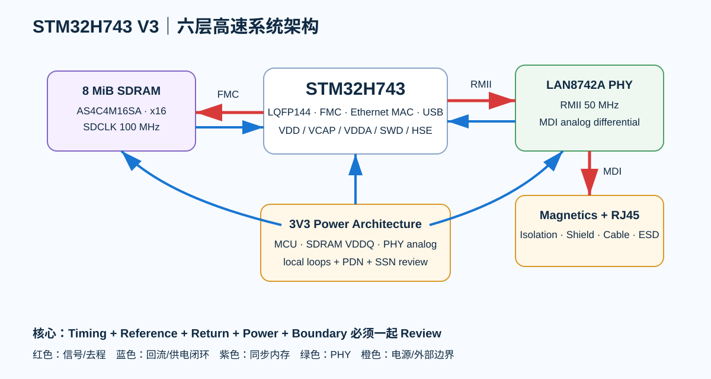

# Part 7｜STM32H743 V3 六层高速综合板

> Part 6 解决的是“为什么六层、怎样定义层角色”；Part 7 开始真正把 **STM32H743 + SDRAM + Ethernet + USB + 多电源域** 压到同一块六层板上。

  

---

## 这一 Part 和前面最大的不同

四层 V2 的主要高速对象是 USB FS、SDIO、时钟与连接器边界。到了 V3：

- MCU 从 F407 升到 H743；
- CPU 最高 480 MHz；
- 外部 SDRAM 通过 FMC 并行总线连接；
- Ethernet MAC 通过 RMII 接外部 PHY；
- 3.3 V 上同时挂 MCU I/O、SDRAM、PHY；
- 板上出现更明显的 **并行总线 skew、同步时序、I/O simultaneous switching、power-domain coupling、connector common-mode** 问题。

所以这一 Part 的核心不再是“会不会画差分对”，而是：

> **能不能把器件时序、PCB 传播延迟、层叠、布局、供电和验证组织成同一个工程约束系统。**

---

# V3 教学硬件基线

## MCU

**STM32H743ZIT6 / LQFP144**

选择 LQFP144 是故意的：

- 继续让所有关键信号肉眼可追踪；
- 不在这一 Part 同时引入 BGA escape；
- 但 pin 数量已经足够承载 x16 SDRAM + RMII + USB + SWD。

## SDRAM

教学候选：**Alliance AS4C4M16SA-6TIN**

- 64 Mbit = 8 MiB；
- 4M × 16；
- 3.3 V；
- 54-pin TSOP II；
- Industrial；
- 器件等级支持 166 MHz，但 **V3 项目先运行在 100 MHz**。

这不是因为 SDRAM “只能 100 MHz”，而是因为 STM32H743 FMC 的可保证 SDRAM 时钟受 MCU revision、VDD、负载和 datasheet 条件限制。V3 以 100 MHz 作为跨 revision、好验证的教学基线。

## Ethernet PHY

**LAN8742A / LAN8742Ai**

- 10/100BASE-TX；
- RMII；
- 3.3 V analog supply；
- 可用 25 MHz crystal 产生 50 MHz REFCLKO；
- 外部 magnetics + RJ45。

---

# 本 Part 完整工程链

~~~text
System Specification
→ H743 Power / Clock Architecture
→ Pin / Peripheral Conflict Review
→ SDRAM Part Selection
→ FMC Timing Budget
→ SDRAM PCB Timing / Skew Budget
→ Ethernet PHY / RMII Architecture
→ Magnetics / RJ45 / ESD Boundary
→ Six-layer Floorplan
→ Routing Constraint Matrix
→ SI + PI + EMC Joint Review
→ KiCad Rule Implementation
→ Bring-up / Stress / Measurement
→ Final Design Review
~~~

---

# 互动实验

- [FMC Timing Lab](../interactive/fmc-timing-lab.html)
- [SDRAM Skew Lab](../interactive/sdram-skew-lab.html)
- [Ethernet Boundary Lab](../interactive/ethernet-boundary-lab.html)

这些是教学模型，不替代 IBIS / SPICE / field solver / 示波器验证。

---

# 通过标准

学完以后，你应该能回答：

1. SDRAM 为什么跑这个时钟，而不是更高？
2. FMC timing 参数从哪份 datasheet 的哪个 ns 数字推出来？
3. 为什么 DQ / Address / Control 不是所有线“一刀切等长”？
4. SDCLK 为什么比普通 GPIO 更慎重？
5. RMII 50 MHz 为什么仍然要看 edge rate 和 reference？
6. PHY 的 MDI 侧和 RMII 侧为什么不是同一种布线问题？
7. Magnetics / RJ45 / shield / chassis 的电流怎么闭合？
8. 哪些约束 KiCad 能自动检查，哪些必须人工 Review？
9. 上电后如何判断问题是 timing、SI、PI、cache/MPU 还是 firmware？
10. 什么证据足以让这块板通过 Release Gate？

---

## 一手资料基线

- STM32H743/753 documentation: https://www.st.com/en/microcontrollers-microprocessors/stm32h743-753/documentation.html
- Alliance AS4C4M16SA: https://www.alliancememory.com/as4c4m16sa/
- LAN8742A: https://www.microchip.com/en-us/product/lan8742a
- NUCLEO-H743ZI2 schematic: https://www.st.com/resource/en/schematic_pack/mb1364-h743zi-c01_schematic.pdf
- KiCad 9 PCB Editor: https://docs.kicad.org/9.0/en/pcbnew/pcbnew.html

**实际生产冻结前重新核对所有 revision、PCN、errata 和板厂 stackup。**
