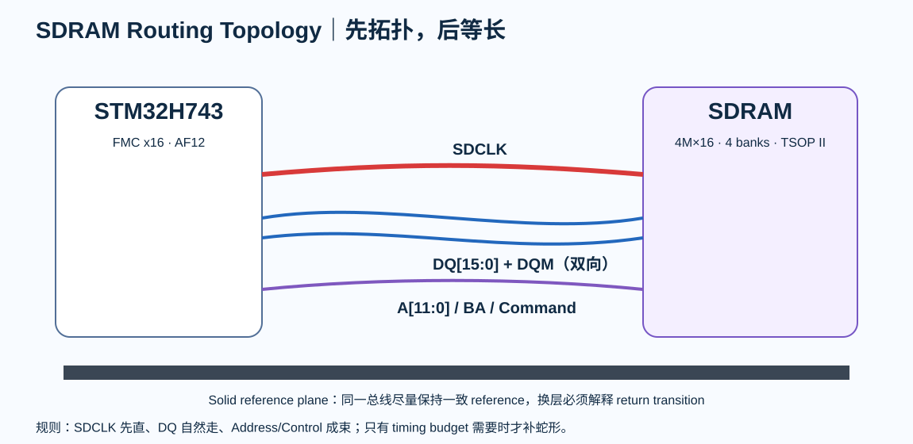

# 03｜SDRAM 选型与 FMC 架构

> 第一次做并行外部内存，不要从“线怎么等长”开始。先确认 memory organization、bus width、bank、row/column、timing、package 和 pin architecture。

<p align="center">
  
</p>

---

# 1. 为什么 V3 选 SDR SDRAM，不直接 DDR

目标是把 synchronous bus、clock/data relationship、setup/hold、parallel skew、command/address/data grouping、refresh 和 controller timing register 学透。

DDR 的 DQS、dual-edge、fly-by、leveling、ODT 留到后续进阶。

---

# 2. 教学器件：AS4C4M16SA-6TIN

| 项目 | 值 |
|---|---|
| Density | 64 Mbit |
| Organization | 4M × 16 |
| Internal banks | 4 |
| Supply | 3.3 V |
| Package | 54-pin TSOP II |
| Temperature | Industrial |
| Speed grade | 166 MHz class |
| V3 operating SDCLK | 100 MHz |

64 Mbit = 8 MiB。

---

# 3. 为什么选 x16

x32 会增加 DQ、byte mask、pin pressure 和 simultaneous switching；x8 又不够有代表性。x16 是“足够复杂，但仍能在 LQFP144 上肉眼理解”的平衡点。

---

# 4. Memory Organization

~~~text
4 banks
× 1M words per bank
× 16 bits
= 64 Mbit
~~~

器件资料给出 A0-A11 row、A0-A7 column、BA0/BA1 bank select。

---

# 5. 信号分组

- DQ group：DQ0…DQ15 + LDQM/UDQM，双向。
- Address：A0…A11 + BA0/BA1。
- Command：RAS#、CAS#、WE#、CS#、CKE。
- Clock：CLK / FMC_SDCLK。

---

# 6. FMC bank/pin architecture

V3 优先使用 Bank 2 control：

- PH5 → SDNWE
- PH6 → SDNE1
- PH7 → SDCKE1

典型 x16 data/address：

- PD14/15 → D0/D1
- PD0/1 → D2/D3
- PE7…15 → D4…D12
- PD8…10 → D13…D15
- PF0…5 → A0…A5
- PF12…15 → A6…A9
- PG0/1 → A10/A11
- PG4/5 → BA0/BA1
- PF11 → SDNRAS
- PG15 → SDNCAS
- PG8 → SDCLK
- PE0/1 → NBL0/NBL1

最终仍需以 exact MCU order code 最新 datasheet AF table 为准。

---

# 7. Placement 第一条规则

SDRAM 不应该等其他器件放完以后“找空位”。先放 MCU ↔ SDRAM，再放其他 block。

目标：

- address/control 成束离开；
- DQ 减少交叉；
- SDCLK 直接；
- 不让 Ethernet connector 逼迫 SDRAM bus 横穿全板。

---

# 8. 本章任务

填写 **sdram-part-selection.md**，记录 exact part、organization、package、temperature、speed grade、row/column、banks、voltage、lifecycle、IBIS 与 source link。

Fault Check：

- SDRAM 离 MCU 比 PHY 还远；
- SDCLK 穿 power split；
- 地址线先绕大圈再等长；
- DQ 分裂到多个不连续 reference；
- VDDQ 去耦只集中放一端。


# 增补｜把 SDRAM 组织结构真正映射到 FMC

## A. Geometry → Address Mapping

对 exact memory 建立：

```text
row bits
column bits
bank bits
data width
capacity
```

然后映射到 FMC configuration。必须用总容量反算一次，确保 row/column/bank/data-width 没有少一位或多一位。

## B. Mode Register / Initialization

Bring-up 文档必须记录完整初始化链，而不是“调用 HAL 初始化”：

```text
power stable
→ clock enable
→ required delay
→ precharge all
→ auto refresh sequence
→ mode register
→ refresh rate
```

具体次数和时序来自 memory datasheet + MCU controller documentation。

## C. Refresh Budget

Refresh 不能只记一个 magic register。

保存：

- memory refresh requirement；
- temperature condition；
- row count；
- controller clock；
- calculation；
- controller encoding；
- margin；
- final programmed value。

## D. Part Selection 还要看供应链

除 speed grade 外增加：

- exact suffix；
- temperature grade；
- package；
- lifecycle；
- alternates；
- second source pin compatibility；
- procurement risk。

选到“电气能用但买不到”的 SDRAM，不算完成选型。
