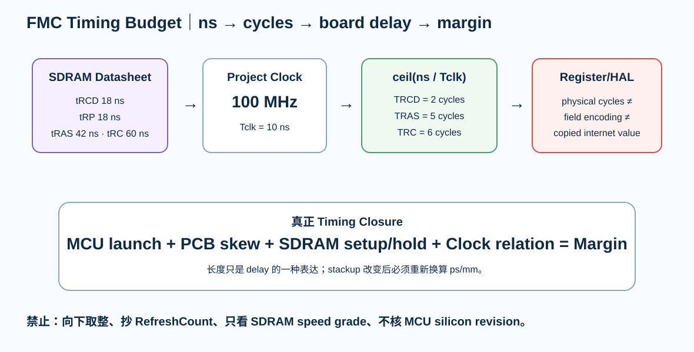

# 04｜FMC 时序：从 SDRAM datasheet 的 ns 推到寄存器

> 这一章是 Part 7 的核心。以后看到 memory timing，不先问“CubeMX 填几”，而是先问：**这个数字来自哪条器件时序约束？**

  

---

# 1. V3 时钟基线

冻结：

~~~text
FMC_SDCLK = 100 MHz
Tclk = 10 ns
~~~

使用 SDRAM：**AS4C4M16SA-6TIN**。

-6 speed grade 的主要 A.C. 条件：

| 参数 | -6 requirement |
|---|---:|
| tRCD | ≥ 18 ns |
| tRP | ≥ 18 ns |
| tRAS | ≥ 42 ns |
| tRC | ≥ 60 ns |
| tRRD | ≥ 12 ns |
| tWR | ≥ 2 tCK |
| tMRD | ≥ 2 tCK |
| tREFI | ≤ 15.6 µs average interval |

这些是 **memory requirement**，不是 STM32 register value。

---

# 2. ns → cycle 的基本换算

对于“至少 N ns”的参数：

~~~text
required_cycles = ceil(t_required / Tclk)
~~~

100 MHz 时 Tclk = 10 ns。

### tRCD

~~~text
ceil(18 / 10) = 2 cycles
~~~

### tRP

~~~text
ceil(18 / 10) = 2 cycles
~~~

### tRAS

~~~text
ceil(42 / 10) = 5 cycles
~~~

### tRC

~~~text
ceil(60 / 10) = 6 cycles
~~~

最常见的低级错误就是把 1.8 cycle 向下取整成 1。

**Timing minimum 一般必须向上取整。**

---

# 3. FMC timing fields 到底对应什么

FMC SDRAM timing 常见字段：

- TMRD
- TXSR
- TRAS
- TRC
- TWR
- TRP
- TRCD

对应关系的思考方式：

| FMC field | Memory concept |
|---|---|
| TRCD | Activate → Read/Write |
| TRP | Precharge time |
| TRAS | Active row minimum time |
| TRC | Row cycle time |
| TWR | Write recovery |
| TMRD | Mode register command delay |
| TXSR | Exit self-refresh delay |

最终填写前必须同时读：

1. SDRAM datasheet
2. RM0433 的 FMC register definition

---

# 4. TXSR 示例

AS4C4M16SA 的表中给出：

~~~text
tXSR >= tRC + tIS
~~~

-6 器件：

- tRC = 60 ns
- tIS = 1.5 ns

所以：

~~~text
tXSR >= 61.5 ns
ceil(61.5 / 10) = 7 cycles
~~~

注意：最终寄存器 field 是否按“真实周期数”还是“周期数减一编码”，要以 **当前 RM0433 field definition / HAL abstraction** 为准。

这就是为什么工程表里必须同时保存：

- physical cycles
- register encoding
- HAL parameter

不要混成一个数字。

---

# 5. Refresh 不是抄 0x603

器件要求：

~~~text
4096 refresh cycles / 64 ms
~~~

平均 refresh interval：

~~~text
64 ms / 4096
≈ 15.625 µs
~~~

100 MHz 时：

~~~text
15.625 µs / 10 ns
≈ 1562.5 SDCLK cycles
~~~

但 FMC refresh counter 的最终值还要按：

- RM0433 COUNT 字段定义；
- 实际 SDCLK；
- ST 推荐 margin；
- 温度条件；
- 器件 refresh spec

计算。

所以教材里不写：

> “H743 SDRAM refresh 永远填 1539。”

而写：

> **记录公式、输入参数、最终值和来源。**

---

# 6. CAS Latency

该 SDRAM 支持 CL2 / CL3。

V3 100 MHz first-spin baseline：

> **CAS Latency = 3**

这是项目选择，不是通用规则。

原因：

- bring-up margin 更好；
- 器件 speed grade 充足；
- 后续可以把 CL / read pipe 当作性能优化实验。

---

# 7. MCU datasheet 也有 timing

SDRAM datasheet 只描述 memory 自己。

STM32H743 DS12110 还会给 FMC：

- read data setup/hold；
- write data valid/hold；
- address/control valid；
- SDCLK electrical limit。

完整 timing closure：

~~~text
MCU launch timing
+ PCB delay/skew
+ SDRAM setup/hold
+ clock path
= timing margin
~~~

---

# 8. Revision-aware 设计

STM32H743 不同 silicon revision 的 FMC_SDCLK 条件并不完全相同。

V3 不追 110 MHz。

项目统一先冻结 100 MHz，原因：

- Rev Y 条件也能覆盖；
- Rev V 仍有余量；
- 负载和板级实现更容易验证；
- first-spin 更适合定位问题。

若未来改成 110 MHz：

> 必须重新打开 datasheet、errata、timing budget 和验证计划。

---

# 9. GPIO speed 不是“越高越好”

FMC I/O 的 output speed 会影响：

- edge rate；
- overshoot；
- ringing；
- EMI；
- timing。

低 speed 可能不够快，高 speed 又可能过激。

正确流程：

~~~text
timing requirement
→ datasheet electrical condition
→ board topology
→ chosen OSPEEDR
→ scope validation
~~~

---

# 10. FMC Timing Lab

打开：

[FMC Timing Lab](../interactive/fmc-timing-lab.html)

调整：

- SDCLK
- tRCD
- tRP
- tRAS
- tRC
- tXSR

观察 ns → cycles 和 rounding-up。

---

# 11. 本章工程表

填写 **sdram-timing-budget.md**：

| Field | Source | Physical requirement | Tclk | Cycles | Encoding | Final |
|---|---|---:|---:|---:|---:|---:|
| TRCD | SDRAM | 18 ns | 10 ns | 2 | verify RM0433 | TBD |
| TRP | SDRAM | 18 ns | 10 ns | 2 | verify | TBD |
| TRAS | SDRAM | 42 ns | 10 ns | 5 | verify | TBD |
| TRC | SDRAM | 60 ns | 10 ns | 6 | verify | TBD |
| TWR | SDRAM | 2 tCK | 10 ns | 2 | verify | TBD |
| TMRD | SDRAM | 2 tCK | 10 ns | 2 | verify | TBD |
| TXSR | SDRAM | 61.5 ns | 10 ns | 7 | verify | TBD |

---

# 12. Fault Lab

## Fault A：向下取整

18 ns / 10 ns = 1.8，填 1。

**错误。**

## Fault B：器件 166 MHz，所以 FMC 也 166 MHz

Memory speed grade 和 MCU controller electrical limit 是两层约束。

## Fault C：100 MHz 周期 10 ns，所以 PCB 走线随便差很多

错误。Setup/hold、clock skew、edge quality 和 board skew 才决定余量。

---

## 资料

- Alliance AS4C4M16SA datasheet
- STM32H743 DS12110 FMC characteristics
- RM0433 FMC SDRAM controller/registers
