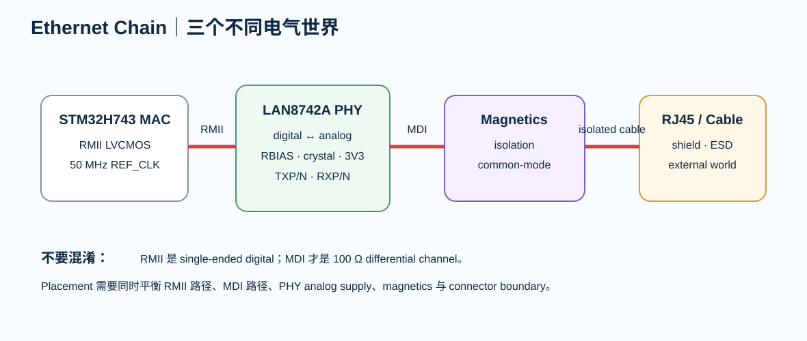

# 06｜Ethernet：从 MAC 到 PHY，再到电缆

> Ethernet 板级设计最常见的误解，是把它缩成“两对 100 Ω 差分”。真正的系统有至少三个电气世界。

<p align="center">
  
</p>

---

# 1. 三个世界

~~~text
STM32 MAC
   │
   │ RMII digital
   ▼
Ethernet PHY
   │
   │ MDI analog differential
   ▼
Magnetics
   │
   │ isolated cable side
   ▼
RJ45 / Cable
~~~

RMII 和 MDI 不是同一种信号。

---

# 2. PHY：LAN8742A / LAN8742Ai

当前 Microchip 产品页仍列为 In Production。

关键：

- 10/100BASE-TX；
- RMII；
- 24-pin 4×4 mm QFN；
- analog 3.3 V；
- variable VDDIO；
- internal 1.2 V regulator；
- 25 MHz crystal；
- 50 MHz reference output option；
- RBIAS = 12.1 kΩ 1%。

---

# 3. RMII nets

典型：

- REF_CLK 50 MHz
- TXD0
- TXD1
- TX_EN
- RXD0
- RXD1
- CRS_DV
- MDC
- MDIO
- nRST
- optional INT

NUCLEO-H743ZI2 官方实现使用：

- PA1 REF_CLK
- PA2 MDIO
- PA7 CRS_DV
- PB13 TXD1
- PC1 MDC
- PC4 RXD0
- PC5 RXD1
- PG11 TX_EN
- PG13 TXD0

这是已验证参考，不是 universal pinout。

---

# 4. REF_CLK architecture

LAN8742A 可以从 25 MHz crystal 产生 50 MHz REFCLKO。

~~~text
25 MHz crystal
→ PHY PLL
→ 50 MHz REFCLKO
→ STM32 RMII_REF_CLK
~~~

必须 Review：

- strap configuration；
- REFCLKO mode；
- clock direction；
- reset timing；
- MCU AF。

---

# 5. RMII 不是“50 MHz 所以慢”

50 MHz period 是 20 ns。

但 edge 可以快得多。

因此仍要：

- 连续 reference；
- 避免 stub；
- 控制 via；
- direction 清楚；
- 必要时预留 source damping。

---

# 6. PHY placement 的平衡

PHY 同时连接：

- MCU RMII
- analog MDI
- magnetics
- 25 MHz crystal
- analog power
- RJ45 boundary

所以 placement 目标不是“单纯离 MCU 最近”或“单纯离 RJ45 最近”。

更好的问题：

> 能不能让 RMII 不绕板，同时让 MDI→magnetics→connector 紧凑、对称、安静？

---

# 7. MDI 侧

LAN8742A 的 TXP/TXN、RXP/RXN 是 analog differential interface。

器件 datasheet 的 single-supply interface diagram明确给出：

- 49.9 Ω network；
- magnetics；
- cable side termination；
- high-voltage capacitor；
- 3.3 V magnetics supply。

这些不是凭经验随意改的。

---

# 8. RBIAS

RBIAS：

- 12.1 kΩ
- 1%
- to GND

这是厂家要求。

PCB 上：

- 靠近 PHY；
- return clean；
- 避免 noisy SW node；
- 不要换成“差不多的 10 kΩ”。

---

# 9. Exposed Pad

datasheet 要求 exposed pad 连接 ground plane，并使用 via array。

作用：

- thermal；
- analog reference；
- signal return。

---

# 10. 本章任务

填写 **ethernet-phy-decision.md**：

- exact PHY variant
- RMII
- REF_CLK direction
- crystal
- straps
- RBIAS
- supply mode
- magnetics
- RJ45
- reset
- MDIO address
- source links

---

# 11. 错误案例

- REF_CLK direction 没冻结；
- 把 RMII 也设成 100 Ω differential pair；
- RBIAS 远离 PHY；
- PHY 靠 RJ45，但 magnetics 放板子另一端；
- RMII 穿过 SDRAM bus tuning zone。

---

## 资料

- LAN8742A datasheet/product page
- RM0433 Ethernet chapter
- NUCLEO-H743ZI2 schematic


# 增补｜RMII 架构冻结清单

## A. REF_CLK 必须先选架构

RMII 的关键不是“50 MHz 走短点”，而是先明确谁产生 REF_CLK。

记录：

| Item | Decision |
|---|---|
| REF_CLK source | TBD |
| PHY clock mode / strap | TBD |
| MCU clock input/output relation | TBD |
| oscillator/crystal | TBD |
| startup dependency | TBD |
| measurement point | TBD |

任何通过 strap / register 改变 clock mode 的 PHY，都必须在原理图、BOM、firmware 和 bring-up 文档同步。

## B. Strap Pins

为 PHY 每个 strap 建表：

```text
pin
reset-time sampled function
pull resistor
LED/shared function
expected boot state
register readback
```

不要只相信原理图拉高/拉低，bring-up 后用寄存器读回实际 mode。

## C. Reset Timing

保存：

```text
power-good
REF_CLK valid
RESET_N assertion/deassertion
strap sample
MDIO access
link start
```

失败时分清：

- power；
- clock；
- reset；
- strap；
- MDIO；
- MDI/link。

## D. RBIAS / Analog Pins

类似 RBIAS、reference/bias、exposed pad 等 pin 必须按 exact PHY datasheet 布局，不使用“所有 PHY 都一样”的模板。

## E. PHY Power Review

把 PHY 拆成实际 rail / analog domain：

- source；
- decoupling；
- ferrite / filter（如器件建议）；
- local loop；
- measurement point；
- interaction with MDI / magnetics。
